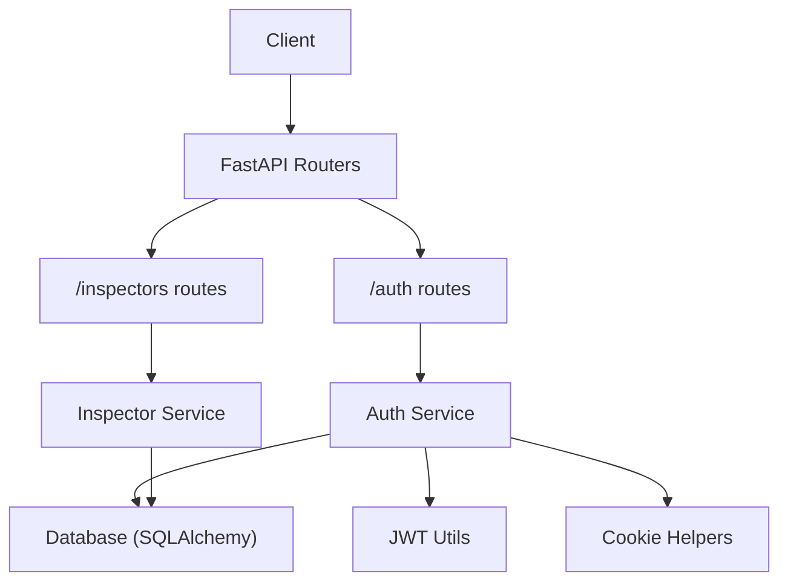
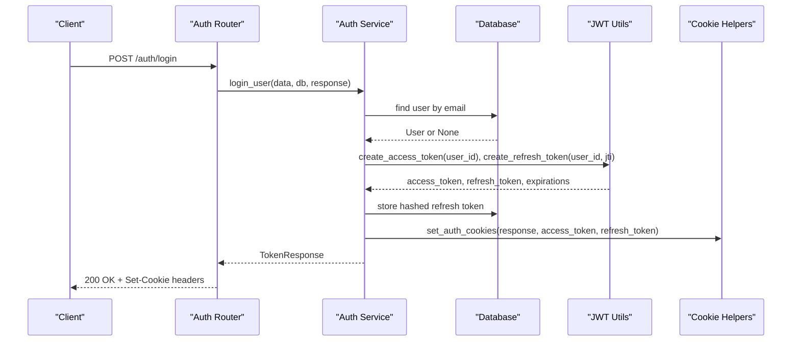
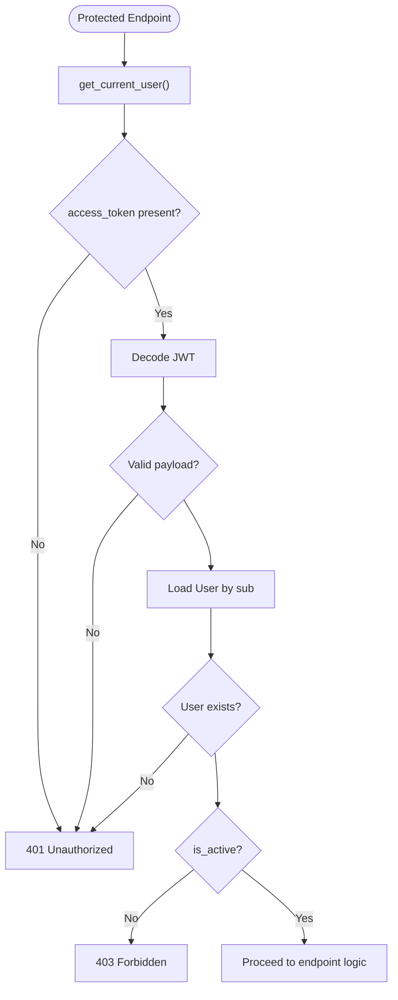
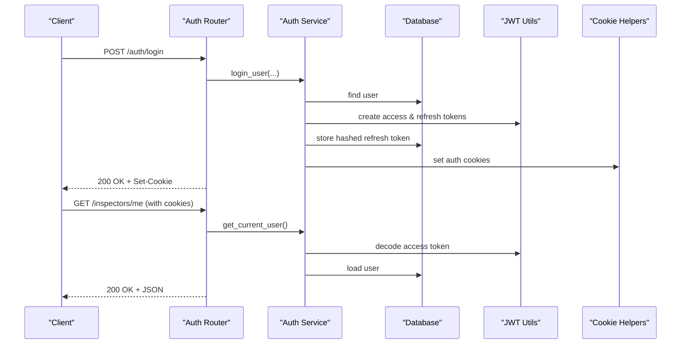

# API Reference

<cite>
**Referenced Files in This Document**
- [main.py](file://app/main.py)
- [auth_routes.py](file://app/api/routes/auth_routes.py)
- [inspector_routes.py](file://app/api/routes/inspector_routes.py)
- [auth_dtos.py](file://app/api/dtos/auth_dtos.py)
- [inspector_dtos.py](file://app/api/dtos/inspector_dtos.py)
- [auth_service.py](file://app/services/auth_service.py)
- [jwt_utils.py](file://app/utils/jwt_utils.py)
- [cookie_helpers.py](file://app/utils/cookie_helpers.py)
- [db_config.py](file://app/config/db_config.py)
- [config_loader.py](file://app/utils/config_loader.py)
- [README.md](file://README.md)
</cite>

## Table of Contents
1. [Introduction](#introduction)
2. [Project Structure](#project-structure)
3. [Core Components](#core-components)
4. [Architecture Overview](#architecture-overview)
5. [Detailed Component Analysis](#detailed-component-analysis)
6. [Dependency Analysis](#dependency-analysis)
7. [Performance Considerations](#performance-considerations)
8. [Troubleshooting Guide](#troubleshooting-guide)
9. [Conclusion](#conclusion)
10. [Appendices](#appendices)

## Introduction
This document provides a comprehensive API reference for the DefectLoupe backend, focusing on all public endpoints exposed by the FastAPI application. It covers HTTP methods, URL patterns, request/response schemas, authentication requirements, validation rules, error responses, and practical usage examples. It also documents the authentication flow using JWT tokens stored in secure cookies, session management via refresh token rotation, and operational notes such as environment configuration.

The API is organized into two primary groups:
- Authentication endpoints under /auth
- Inspector and company management endpoints under /inspectors

All protected endpoints require an active authenticated session established via cookie-based JWTs.

## Project Structure
The application is built with FastAPI and uses a layered architecture:
- Routes define HTTP endpoints and delegate to services
- Services implement business logic and interact with repositories
- DTOs define request and response schemas used for validation and serialization
- Utilities handle JWT creation/verification and cookie management
- Configuration manages database connections and token settings

**Diagram sources**
- [main.py:18-21](file://app/main.py#L18-L21)
- [auth_routes.py:22-64](file://app/api/routes/auth_routes.py#L22-L64)
- [inspector_routes.py:23-143](file://app/api/routes/inspector_routes.py#L23-L143)
- [auth_service.py:37-274](file://app/services/auth_service.py#L37-L274)
- [jwt_utils.py:14-50](file://app/utils/jwt_utils.py#L14-L50)
- [cookie_helpers.py:12-41](file://app/utils/cookie_helpers.py#L12-L41)

**Section sources**
- [main.py:1-30](file://app/main.py#L1-L30)
- [README.md:182-214](file://README.md#L182-L214)

## Core Components
- Authentication service: user registration, login, logout, token refresh, current user resolution
- Inspector service: company creation, inspector addition, listing inspectors
- JWT utilities: create/decode access and refresh tokens
- Cookie helpers: set/clear secure HTTP-only cookies for tokens
- DTOs: Pydantic models for request validation and response serialization
- Database config: SQLAlchemy engine and session provider

Key responsibilities:
- Enforce authentication via cookie-based JWTs
- Validate inputs using Pydantic models
- Manage sessions with refresh token rotation and revocation
- Provide structured responses conforming to defined schemas

**Section sources**
- [auth_service.py:37-274](file://app/services/auth_service.py#L37-L274)
- [inspector_service.py:17-134](file://app/services/inspector_service.py#L17-L134)
- [jwt_utils.py:14-50](file://app/utils/jwt_utils.py#L14-L50)
- [cookie_helpers.py:12-41](file://app/utils/cookie_helpers.py#L12-L41)
- [auth_dtos.py:7-39](file://app/api/dtos/auth_dtos.py#L7-L39)
- [inspector_dtos.py:5-63](file://app/api/dtos/inspector_dtos.py#L5-L63)
- [db_config.py:16-26](file://app/config/db_config.py#L16-L26)

## Architecture Overview
The API follows a standard FastAPI pattern:
- Routers expose endpoints grouped by feature
- Dependencies enforce authentication and provide database sessions
- Services encapsulate business logic
- Repositories model data and perform queries
- Utilities manage security primitives like JWT and cookies

**Diagram sources**
- [auth_routes.py:31-34](file://app/api/routes/auth_routes.py#L31-L34)
- [auth_service.py:61-103](file://app/services/auth_service.py#L61-L103)
- [jwt_utils.py:14-40](file://app/utils/jwt_utils.py#L14-L40)
- [cookie_helpers.py:12-35](file://app/utils/cookie_helpers.py#L12-L35)

## Detailed Component Analysis

### Authentication Endpoints

#### Register
- Method: POST
- Path: /auth/register
- Authentication: Not required
- Request body schema: RegisterRequest
  - email: EmailStr
  - password: string with min_length 8, max_length 128
- Response schema: UserResponse
  - id: UUID
  - email: string
  - is_active: boolean
  - created_at: datetime
- Status codes:
  - 201 Created on success
  - 409 Conflict if email already registered
- Notes:
  - Password is hashed before storage
  - No tokens issued; client must call login afterward

Example (curl):
- curl -X POST http://localhost:8000/auth/register -H "Content-Type: application/json" -d '{"email":"user@example.com","password":"securepass123"}'

**Section sources**
- [auth_routes.py:25-28](file://app/api/routes/auth_routes.py#L25-L28)
- [auth_dtos.py:7-10](file://app/api/dtos/auth_dtos.py#L7-L10)
- [auth_dtos.py:22-28](file://app/api/dtos/auth_dtos.py#L22-L28)
- [auth_service.py:37-56](file://app/services/auth_service.py#L37-L56)

#### Login
- Method: POST
- Path: /auth/login
- Authentication: Not required
- Request body schema: LoginRequest
  - email: EmailStr
  - password: string with min_length 1
- Response schema: TokenResponse
  - message: string
  - access_token_expires_at: datetime
  - refresh_token_expires_at: datetime
- Status codes:
  - 200 OK on success
  - 401 Unauthorized if invalid credentials
  - 403 Forbidden if account is deactivated
- Behavior:
  - Issues access and refresh tokens
  - Sets secure, HTTP-only cookies named access_token and refresh_token
  - Stores hashed refresh token in the database for rotation and revocation

Example (curl):
- curl -X POST http://localhost:8000/auth/login -H "Content-Type: application/json" -d '{"email":"user@example.com","password":"securepass123"}' -c cookies.txt

Notes:
- Subsequent requests should include cookies automatically if using a browser or a client that persists cookies.
- For programmatic clients, ensure cookies are sent with each request.

**Section sources**
- [auth_routes.py:31-34](file://app/api/routes/auth_routes.py#L31-L34)
- [auth_dtos.py:12-15](file://app/api/dtos/auth_dtos.py#L12-L15)
- [auth_dtos.py:31-35](file://app/api/dtos/auth_dtos.py#L31-L35)
- [auth_service.py:61-103](file://app/services/auth_service.py#L61-L103)
- [cookie_helpers.py:12-35](file://app/utils/cookie_helpers.py#L12-L35)

#### Logout
- Method: POST
- Path: /auth/logout
- Authentication: Required (current user)
- Request body: None
- Response schema: LogoutResponse
  - message: string
- Status codes:
  - 200 OK on success
  - 401 Unauthorized if not authenticated
- Behavior:
  - Clears the stored refresh token in the database
  - Deletes both access_token and refresh_token cookies

Example (curl):
- curl -X POST http://localhost:8000/auth/logout -b cookies.txt

**Section sources**
- [auth_routes.py:37-44](file://app/api/routes/auth_routes.py#L37-L44)
- [auth_service.py:108-117](file://app/services/auth_service.py#L108-L117)
- [cookie_helpers.py:38-41](file://app/utils/cookie_helpers.py#L38-L41)

#### Refresh Tokens
- Method: POST
- Path: /auth/refresh
- Authentication: Not required (uses refresh token from cookie or body)
- Request body schema: RefreshTokenRequest (optional)
  - refresh_token: string | None
- Response schema: TokenResponse
  - message: string
  - access_token_expires_at: datetime
  - refresh_token_expires_at: datetime
- Status codes:
  - 200 OK on success
  - 401 Unauthorized if refresh token missing, invalid, expired, or reused
  - 403 Forbidden if account is deactivated
- Behavior:
  - Reads refresh token from cookie first; falls back to body if provided
  - Validates refresh token and checks against stored hash
  - On reuse detection, revokes all sessions by clearing stored refresh token
  - Issues new access and refresh tokens and sets new cookies

Example (curl):
- curl -X POST http://localhost:8000/auth/refresh -b cookies.txt
- Or without cookies: curl -X POST http://localhost:8000/auth/refresh -H "Content-Type: application/json" -d '{"refresh_token":"..."}'

**Section sources**
- [auth_routes.py:47-58](file://app/api/routes/auth_routes.py#L47-L58)
- [auth_dtos.py:17-19](file://app/api/dtos/auth_dtos.py#L17-L19)
- [auth_service.py:122-194](file://app/services/auth_service.py#L122-L194)
- [jwt_utils.py:28-50](file://app/utils/jwt_utils.py#L28-L50)
- [cookie_helpers.py:12-35](file://app/utils/cookie_helpers.py#L12-L35)

#### Get Current User
- Method: GET
- Path: /auth/me
- Authentication: Required (current user)
- Request body: None
- Response schema: UserResponse
  - id: UUID
  - email: string
  - is_active: boolean
  - created_at: datetime
- Status codes:
  - 200 OK on success
  - 401 Unauthorized if not authenticated or invalid/expired access token
  - 403 Forbidden if account is deactivated

Example (curl):
- curl http://localhost:8000/auth/me -b cookies.txt

**Section sources**
- [auth_routes.py:61-64](file://app/api/routes/auth_routes.py#L61-L64)
- [auth_service.py:199-230](file://app/services/auth_service.py#L199-L230)

### Inspector and Company Endpoints

#### Get My Profile
- Method: GET
- Path: /inspectors/me
- Authentication: Required (current user)
- Request body: None
- Response schema: ProfileResponse
  - user_id: UUID
  - email: string
  - inspector: InspectorResponse | null
  - is_company_owner: boolean
- Status codes:
  - 200 OK on success
  - 401 Unauthorized if not authenticated
- Behavior:
  - Resolves inspector profile linked to the current user
  - Determines ownership status by checking company owner relationship

Example (curl):
- curl http://localhost:8000/inspectors/me -b cookies.txt

**Section sources**
- [inspector_routes.py:28-48](file://app/api/routes/inspector_routes.py#L28-L48)
- [inspector_dtos.py:58-63](file://app/api/dtos/inspector_dtos.py#L58-L63)

#### Create Company
- Method: POST
- Path: /inspectors/company
- Authentication: Required (current user)
- Request body schema: CreateCompanyRequest
  - name: string (min_length 1, max_length 255)
  - email: EmailStr
  - phone_number: string | null
  - website: string | null
  - address: string (min_length 1)
  - city: string (min_length 1, max_length 100)
  - state: string (min_length 1, max_length 100)
  - zip_code: string (min_length 1, max_length 20)
  - country: string (min_length 1, max_length 100, default "US")
- Response schema: CompanyResponse
  - id: UUID
  - name: string
  - email: string
  - phone_number: string | null
  - website: string | null
  - address: string
  - city: string
  - state: string
  - zip_code: string
  - country: string
  - owner_id: UUID | null
  - created_at: datetime
- Status codes:
  - 201 Created on success
  - 409 Conflict if user already associated with a company
  - 401 Unauthorized if not authenticated
- Behavior:
  - Creates or reuses inspector profile for the current user
  - Creates company with the current inspector as owner
  - Links inspector to company and updates type

Example (curl):
- curl -X POST http://localhost:8000/inspectors/company -H "Content-Type: application/json" -b cookies.txt -d '{"name":"Acme Corp","email":"acme@example.com","address":"123 Main St","city":"Springfield","state":"IL","zip_code":"62704","country":"US"}'

**Section sources**
- [inspector_routes.py:53-63](file://app/api/routes/inspector_routes.py#L53-L63)
- [inspector_dtos.py:5-30](file://app/api/dtos/inspector_dtos.py#L5-L30)
- [inspector_service.py:17-72](file://app/services/inspector_service.py#L17-L72)

#### Get My Company
- Method: GET
- Path: /inspectors/company
- Authentication: Required (current user)
- Request body: None
- Response schema: CompanyResponse
- Status codes:
  - 200 OK on success
  - 404 Not Found if not associated with any company
  - 401 Unauthorized if not authenticated
- Behavior:
  - Resolves inspector profile for the current user
  - Returns company details if associated

Example (curl):
- curl http://localhost:8000/inspectors/company -b cookies.txt

**Section sources**
- [inspector_routes.py:66-84](file://app/api/routes/inspector_routes.py#L66-L84)

#### Add Inspector to Company
- Method: POST
- Path: /inspectors/company/inspectors
- Authentication: Required (company owner only)
- Request body schema: AddInspectorRequest
  - email: EmailStr
  - password: string (min_length 8, max_length 128)
  - first_name: string (min_length 1)
  - last_name: string (min_length 1)
  - phone_number: string | null
  - license_number: string | null
- Response schema: InspectorResponse
  - id: UUID
  - user_id: UUID
  - company_id: UUID | null
  - first_name: string
  - last_name: string
  - phone_number: string | null
  - license_number: string | null
  - inspector_type: string
  - is_active: boolean
  - created_at: datetime
- Status codes:
  - 201 Created on success
  - 403 Forbidden if not a company member or not the owner
  - 409 Conflict if an inspector with this email already exists
  - 401 Unauthorized if not authenticated
- Behavior:
  - Verifies caller is the company owner
  - Creates a new user account and inspector profile linked to the company

Example (curl):
- curl -X POST http://localhost:8000/inspectors/company/inspectors -H "Content-Type: application/json" -b cookies.txt -d '{"email":"newinspector@example.com","password":"securepass123","first_name":"Jane","last_name":"Doe"}'

**Section sources**
- [inspector_routes.py:89-121](file://app/api/routes/inspector_routes.py#L89-L121)
- [inspector_dtos.py:34-55](file://app/api/dtos/inspector_dtos.py#L34-L55)
- [inspector_service.py:75-122](file://app/services/inspector_service.py#L75-L122)

#### List Company Inspectors
- Method: GET
- Path: /inspectors/company/inspectors
- Authentication: Required (current user)
- Request body: None
- Response schema: list[InspectorResponse]
- Status codes:
  - 200 OK on success
  - 404 Not Found if not associated with any company
  - 401 Unauthorized if not authenticated
- Behavior:
  - Resolves inspector profile for the current user
  - Lists all inspectors belonging to the same company

Example (curl):
- curl http://localhost:8000/inspectors/company/inspectors -b cookies.txt

**Section sources**
- [inspector_routes.py:124-143](file://app/api/routes/inspector_routes.py#L124-L143)
- [inspector_service.py:125-134](file://app/services/inspector_service.py#L125-L134)

### Root Endpoint
- Method: GET
- Path: /
- Authentication: Not required
- Response: Simple message indicating the server is running

Example (curl):
- curl http://localhost:8000/

**Section sources**
- [main.py:24-26](file://app/main.py#L24-L26)

## Dependency Analysis
Authentication dependency chain:
- get_current_user extracts access token from cookies, decodes it, validates user existence and activity
- get_current_inspector resolves inspector profile for the current user
- require_company_owner ensures the current user is the owner of a company

**Diagram sources**
- [auth_service.py:199-230](file://app/services/auth_service.py#L199-L230)

**Section sources**
- [auth_service.py:199-274](file://app/services/auth_service.py#L199-L274)

## Performance Considerations
- Token operations are lightweight and use fast cryptographic signing (HS256).
- Database interactions are minimal per request; ensure indexes on frequently queried fields (e.g., user.email, inspector.user_id, inspector.company_id) to optimize lookups.
- Avoid unnecessary joins; the code often performs single-entity fetches by ID or simple where clauses.
- Consider caching frequently accessed read-only data at the application layer if needed.

[No sources needed since this section provides general guidance]

## Troubleshooting Guide
Common errors and their causes:
- 401 Unauthorized:
  - Missing or invalid access token in cookies
  - Expired access token
  - Invalid or expired refresh token
  - Refresh token reuse detected (all sessions revoked)
- 403 Forbidden:
  - Account is deactivated
  - Not a company member or not the owner when performing owner-only actions
- 404 Not Found:
  - Not associated with any company when accessing company-scoped endpoints
- 409 Conflict:
  - Email already registered during user creation
  - User already associated with a company when creating a new one
  - An inspector with this email already exists when adding an inspector

Debugging tips:
- Verify cookies are being sent with requests (especially for non-browser clients).
- Use the interactive API docs at /docs to inspect endpoints and test calls.
- Check environment variables for token secrets and expiry settings.
- Review logs for exceptions raised by services and dependencies.

**Section sources**
- [auth_service.py:61-194](file://app/services/auth_service.py#L61-L194)
- [inspector_routes.py:66-143](file://app/api/routes/inspector_routes.py#L66-L143)
- [inspector_service.py:17-122](file://app/services/inspector_service.py#L17-L122)

## Conclusion
The DefectLoupe API provides secure, cookie-based authentication with robust token rotation and clear separation of concerns across routes, services, and utilities. Protected endpoints enforce authentication and role-based access for company operations. Clients should persist cookies and handle token refresh proactively to maintain sessions. The API’s structured DTOs ensure consistent request validation and response formats.

[No sources needed since this section summarizes without analyzing specific files]

## Appendices

### Authentication Flow Summary
- Register creates a user account without issuing tokens.
- Login authenticates the user, issues access and refresh tokens, and sets secure cookies.
- Protected endpoints rely on the access token cookie validated by get_current_user.
- Refresh rotates tokens, invalidating the previous refresh token and setting new cookies.
- Logout clears the stored refresh token and deletes cookies.

**Diagram sources**
- [auth_routes.py:31-64](file://app/api/routes/auth_routes.py#L31-L64)
- [auth_service.py:61-230](file://app/services/auth_service.py#L61-L230)
- [jwt_utils.py:14-50](file://app/utils/jwt_utils.py#L14-L50)
- [cookie_helpers.py:12-41](file://app/utils/cookie_helpers.py#L12-L41)

### Environment Variables
- DATABASE_URL: PostgreSQL connection string
- ACCESS_TOKEN_SECRET: Secret key for signing access tokens
- ACCESS_TOKEN_EXPIRY: Access token lifespan (e.g., "15m")
- REFRESH_TOKEN_SECRET: Secret key for signing refresh tokens
- REFRESH_TOKEN_EXPIRY: Refresh token lifespan (e.g., "10d")

These values are loaded from the .env file located in the app directory and used by configuration loaders and JWT utilities.

**Section sources**
- [README.md:170-179](file://README.md#L170-L179)
- [config_loader.py:24-43](file://app/utils/config_loader.py#L24-L43)
- [db_config.py:11-16](file://app/config/db_config.py#L11-L16)

### Rate Limiting, Versioning, and Deprecation Policies
- Rate limiting: Not implemented in the current codebase. If needed, consider integrating middleware such as slowapi or implementing custom rate limiting based on IP or user identity.
- Versioning: Not explicitly versioned in URLs or headers. To introduce versioning, prefix routes (e.g., /v1/) or use header-based versioning consistently across routers.
- Deprecation: No deprecation mechanisms are currently in place. When introducing changes, consider using response headers or documentation to mark deprecated endpoints and provide migration paths.

[No sources needed since this section provides general guidance]