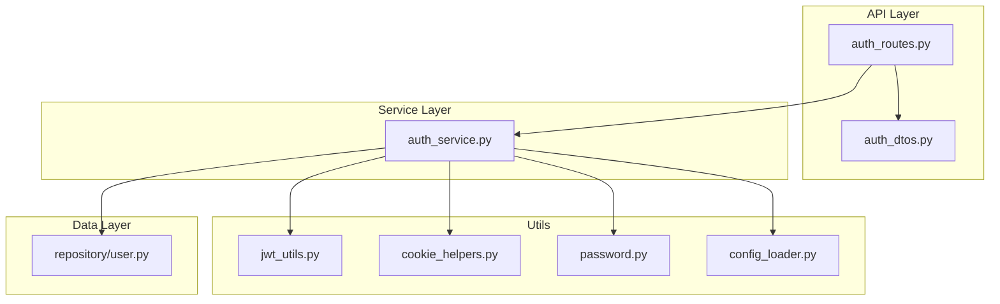
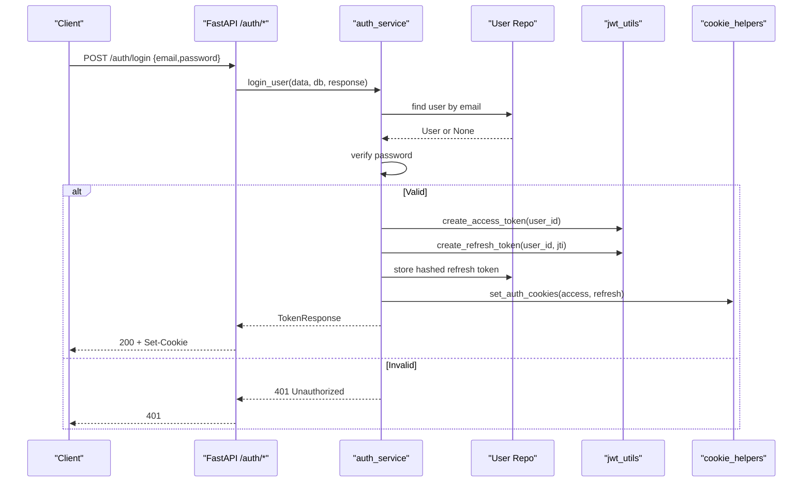
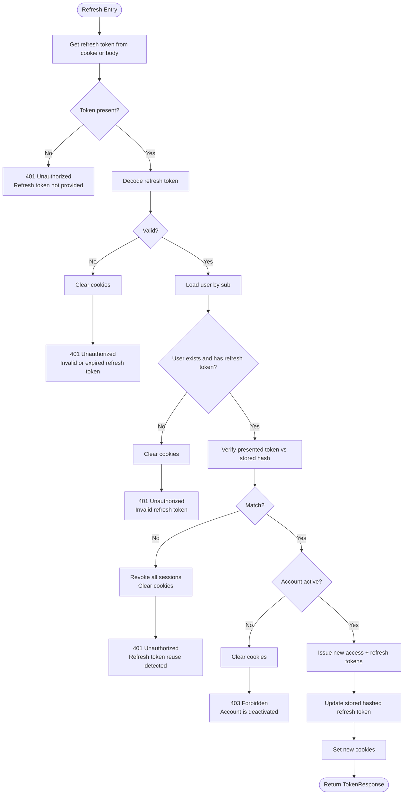
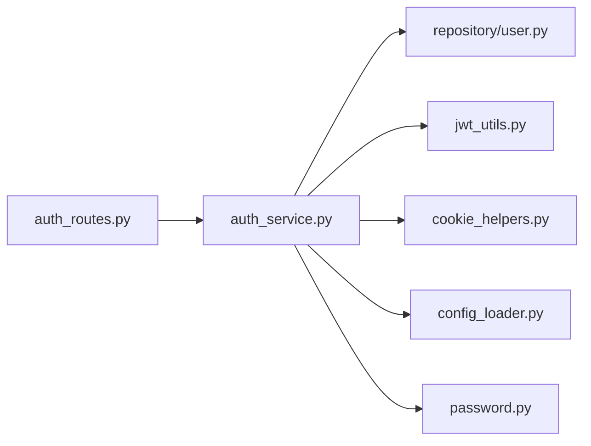

# Authentication Endpoints

<cite>
**Referenced Files in This Document**
- [auth_routes.py](file://app/api/routes/auth_routes.py)
- [auth_dtos.py](file://app/api/dtos/auth_dtos.py)
- [auth_service.py](file://app/services/auth_service.py)
- [jwt_utils.py](file://app/utils/jwt_utils.py)
- [cookie_helpers.py](file://app/utils/cookie_helpers.py)
- [password.py](file://app/utils/password.py)
- [config_loader.py](file://app/utils/config_loader.py)
- [user.py](file://app/repository/user.py)
</cite>

## Table of Contents
1. [Introduction](#introduction)
2. [Project Structure](#project-structure)
3. [Core Components](#core-components)
4. [Architecture Overview](#architecture-overview)
5. [Detailed Component Analysis](#detailed-component-analysis)
6. [Dependency Analysis](#dependency-analysis)
7. [Performance Considerations](#performance-considerations)
8. [Troubleshooting Guide](#troubleshooting-guide)
9. [Conclusion](#conclusion)

## Introduction
This document provides detailed API documentation for the authentication endpoints, including request/response schemas, validation rules, error codes, and the full JWT token lifecycle with secure cookie handling. It covers user registration, login, logout, token refresh (with rotation), and retrieving the current user profile.

## Project Structure
The authentication feature is organized into:
- Routes: FastAPI endpoints under /auth
- DTOs: Pydantic models for requests and responses
- Services: Business logic for auth flows
- Utils: JWT creation/decoding, secure cookie helpers, password hashing, configuration loading
- Repository: User model and persistence

**Diagram sources**
- [auth_routes.py:1-65](file://app/api/routes/auth_routes.py#L1-L65)
- [auth_service.py:1-272](file://app/services/auth_service.py#L1-L272)
- [auth_dtos.py:1-39](file://app/api/dtos/auth_dtos.py#L1-L39)
- [jwt_utils.py:1-51](file://app/utils/jwt_utils.py#L1-L51)
- [cookie_helpers.py:1-42](file://app/utils/cookie_helpers.py#L1-L42)
- [password.py:1-12](file://app/utils/password.py#L1-L12)
- [config_loader.py:1-44](file://app/utils/config_loader.py#L1-L44)
- [user.py:1-54](file://app/repository/user.py#L1-L54)

**Section sources**
- [auth_routes.py:1-65](file://app/api/routes/auth_routes.py#L1-L65)
- [auth_service.py:1-272](file://app/services/auth_service.py#L1-L272)

## Core Components
- Endpoints: POST /auth/register, POST /auth/login, POST /auth/logout, POST /auth/refresh, GET /auth/me
- Request/Response Models: RegisterRequest, LoginRequest, RefreshTokenRequest, UserResponse, TokenResponse, LogoutResponse
- Security: JWT access and refresh tokens, secure HTTP-only cookies, password hashing, token rotation on refresh
- Persistence: User entity with hashed password and stored hashed refresh token for revocation/rotation

**Section sources**
- [auth_routes.py:25-64](file://app/api/routes/auth_routes.py#L25-L64)
- [auth_dtos.py:7-39](file://app/api/dtos/auth_dtos.py#L7-L39)
- [auth_service.py:36-228](file://app/services/auth_service.py#L36-L228)
- [jwt_utils.py:14-50](file://app/utils/jwt_utils.py#L14-L50)
- [cookie_helpers.py:12-41](file://app/utils/cookie_helpers.py#L12-L41)
- [password.py:6-11](file://app/utils/password.py#L6-L11)
- [user.py:10-54](file://app/repository/user.py#L10-L54)

## Architecture Overview
Authentication uses a stateless access token (JWT) and a stateful refresh token mechanism:
- Access token: short-lived, used to authorize requests; stored in an HTTP-only secure cookie
- Refresh token: longer-lived, rotated on each use; stored as a hashed value in the database and also set in an HTTP-only secure cookie
- On refresh: old refresh token is validated against the stored hash; if valid, new access and refresh tokens are issued and the stored hash is updated (rotation)
- On logout: stored refresh token is cleared and cookies are deleted

**Diagram sources**
- [auth_routes.py:31-34](file://app/api/routes/auth_routes.py#L31-L34)
- [auth_service.py:59-101](file://app/services/auth_service.py#L59-L101)
- [jwt_utils.py:14-40](file://app/utils/jwt_utils.py#L14-L40)
- [cookie_helpers.py:12-35](file://app/utils/cookie_helpers.py#L12-L35)
- [user.py:10-54](file://app/repository/user.py#L10-L54)

## Detailed Component Analysis

### POST /auth/register
- Purpose: Create a new user account
- Request body: RegisterRequest
  - email: EmailStr
  - password: string, min_length=8, max_length=128
- Response: UserResponse
  - id: UUID
  - email: string
  - is_active: boolean
  - created_at: datetime
- Behavior:
  - Checks for existing email; returns conflict if found
  - Hashes password before storing
  - Persists user and returns profile
- Error codes:
  - 409 Conflict: Email already registered
  - 422 Unprocessable Entity: Validation errors (e.g., invalid email, password length)

**Section sources**
- [auth_routes.py:25-28](file://app/api/routes/auth_routes.py#L25-L28)
- [auth_dtos.py:7-10](file://app/api/dtos/auth_dtos.py#L7-L10)
- [auth_service.py:36-55](file://app/services/auth_service.py#L36-L55)
- [password.py:6-7](file://app/utils/password.py#L6-L7)
- [user.py:19-33](file://app/repository/user.py#L19-L33)

### POST /auth/login
- Purpose: Authenticate user and issue tokens via secure cookies
- Request body: LoginRequest
  - email: EmailStr
  - password: string, min_length=1
- Response: TokenResponse
  - message: string
  - access_token_expires_at: datetime
  - refresh_token_expires_at: datetime
- Behavior:
  - Validates credentials
  - Ensures account is active
  - Creates access and refresh tokens
  - Stores hashed refresh token in DB
  - Sets both tokens as HTTP-only secure cookies
- Error codes:
  - 401 Unauthorized: Invalid credentials
  - 403 Forbidden: Account deactivated
  - 422 Unprocessable Entity: Validation errors

**Section sources**
- [auth_routes.py:31-34](file://app/api/routes/auth_routes.py#L31-L34)
- [auth_dtos.py:12-15](file://app/api/dtos/auth_dtos.py#L12-L15)
- [auth_service.py:59-101](file://app/services/auth_service.py#L59-L101)
- [jwt_utils.py:14-40](file://app/utils/jwt_utils.py#L14-L40)
- [cookie_helpers.py:12-35](file://app/utils/cookie_helpers.py#L12-L35)
- [user.py:30-33](file://app/repository/user.py#L30-L33)

### POST /auth/logout
- Purpose: Revoke refresh token and clear cookies
- Request: Protected by current user dependency
- Response: LogoutResponse
  - message: string
- Behavior:
  - Clears stored refresh token from DB
  - Deletes access and refresh cookies
- Error codes:
  - 401 Unauthorized: Not authenticated (missing/invalid access token)
  - 403 Forbidden: Account deactivated

**Section sources**
- [auth_routes.py:37-44](file://app/api/routes/auth_routes.py#L37-L44)
- [auth_service.py:106-115](file://app/services/auth_service.py#L106-L115)
- [cookie_helpers.py:38-41](file://app/utils/cookie_helpers.py#L38-L41)

### POST /auth/refresh
- Purpose: Rotate refresh token and obtain new access + refresh tokens
- Request: RefreshTokenRequest
  - refresh_token: optional string (fallback if cookie not present)
- Response: TokenResponse
- Behavior:
  - Reads refresh token from cookie or request body
  - Decodes and validates refresh token
  - Verifies stored hashed refresh token matches presented token
  - If mismatch, revokes all sessions and clears cookies
  - Issues new access and refresh tokens and updates stored hash
  - Sets new cookies
- Error codes:
  - 401 Unauthorized: Missing, invalid, expired, or reused refresh token
  - 403 Forbidden: Account deactivated

**Diagram sources**
- [auth_routes.py:47-58](file://app/api/routes/auth_routes.py#L47-L58)
- [auth_service.py:120-192](file://app/services/auth_service.py#L120-L192)
- [jwt_utils.py:28-50](file://app/utils/jwt_utils.py#L28-L50)
- [cookie_helpers.py:12-41](file://app/utils/cookie_helpers.py#L12-L41)

**Section sources**
- [auth_routes.py:47-58](file://app/api/routes/auth_routes.py#L47-L58)
- [auth_service.py:120-192](file://app/services/auth_service.py#L120-L192)
- [auth_dtos.py:17-19](file://app/api/dtos/auth_dtos.py#L17-L19)

### GET /auth/me
- Purpose: Retrieve currently logged-in user information
- Request: Protected by current user dependency (access token in cookie)
- Response: UserResponse
- Behavior:
  - Extracts access token from cookie
  - Decodes and validates token
  - Loads user and ensures account is active
- Error codes:
  - 401 Unauthorized: Not authenticated or invalid/expired access token
  - 403 Forbidden: Account deactivated

**Section sources**
- [auth_routes.py:61-64](file://app/api/routes/auth_routes.py#L61-L64)
- [auth_service.py:197-228](file://app/services/auth_service.py#L197-L228)
- [auth_dtos.py:22-28](file://app/api/dtos/auth_dtos.py#L22-L28)

## Dependency Analysis
- Routes depend on services for business logic and on DTOs for validation
- Services depend on repository for data access, utils for JWT and cookies, and config for secrets/expiry
- JWT utilities rely on configuration for secrets and expiry durations
- Cookie helpers manage secure, HTTP-only cookies with appropriate attributes

**Diagram sources**
- [auth_routes.py:1-21](file://app/api/routes/auth_routes.py#L1-L21)
- [auth_service.py:1-33](file://app/services/auth_service.py#L1-L33)
- [jwt_utils.py:1-11](file://app/utils/jwt_utils.py#L1-L11)
- [cookie_helpers.py:1-7](file://app/utils/cookie_helpers.py#L1-L7)
- [config_loader.py:1-44](file://app/utils/config_loader.py#L1-L44)
- [password.py:1-12](file://app/utils/password.py#L1-L12)
- [user.py:1-54](file://app/repository/user.py#L1-L54)

**Section sources**
- [auth_routes.py:1-21](file://app/api/routes/auth_routes.py#L1-L21)
- [auth_service.py:1-33](file://app/services/auth_service.py#L1-L33)

## Performance Considerations
- Token operations are lightweight; ensure secrets and expiry settings are configured efficiently
- Database queries are minimal per endpoint; consider indexing user.email for faster lookups
- Cookie-based auth avoids header parsing overhead but requires proper browser cookie handling
- Refresh rotation adds one write per refresh; acceptable for typical usage patterns

[No sources needed since this section provides general guidance]

## Troubleshooting Guide
Common issues and resolutions:
- Registration conflicts: Ensure unique email addresses; handle 409 responses
- Login failures: Validate email and password; check account activation status for 403
- Refresh token errors:
  - Missing token: Provide refresh token in cookie or body
  - Invalid/expired: Re-login to obtain fresh tokens
  - Reuse detected: Indicates possible theft; server revokes all sessions; re-login required
- Logout problems: Ensure cookies are properly cleared; verify server-side token revocation
- Configuration errors: Ensure ACCESS_TOKEN_SECRET, REFRESH_TOKEN_SECRET, and expiry values are set

**Section sources**
- [auth_service.py:41-55](file://app/services/auth_service.py#L41-L55)
- [auth_service.py:59-101](file://app/services/auth_service.py#L59-L101)
- [auth_service.py:120-192](file://app/services/auth_service.py#L120-L192)
- [config_loader.py:24-43](file://app/utils/config_loader.py#L24-L43)

## Conclusion
The authentication system implements secure, modern practices:
- Short-lived access tokens for authorization
- Long-lived refresh tokens with rotation and server-side revocation
- Secure, HTTP-only cookies for token storage
- Robust error handling and validation across all endpoints

This design balances security and usability while providing clear APIs for client integration.