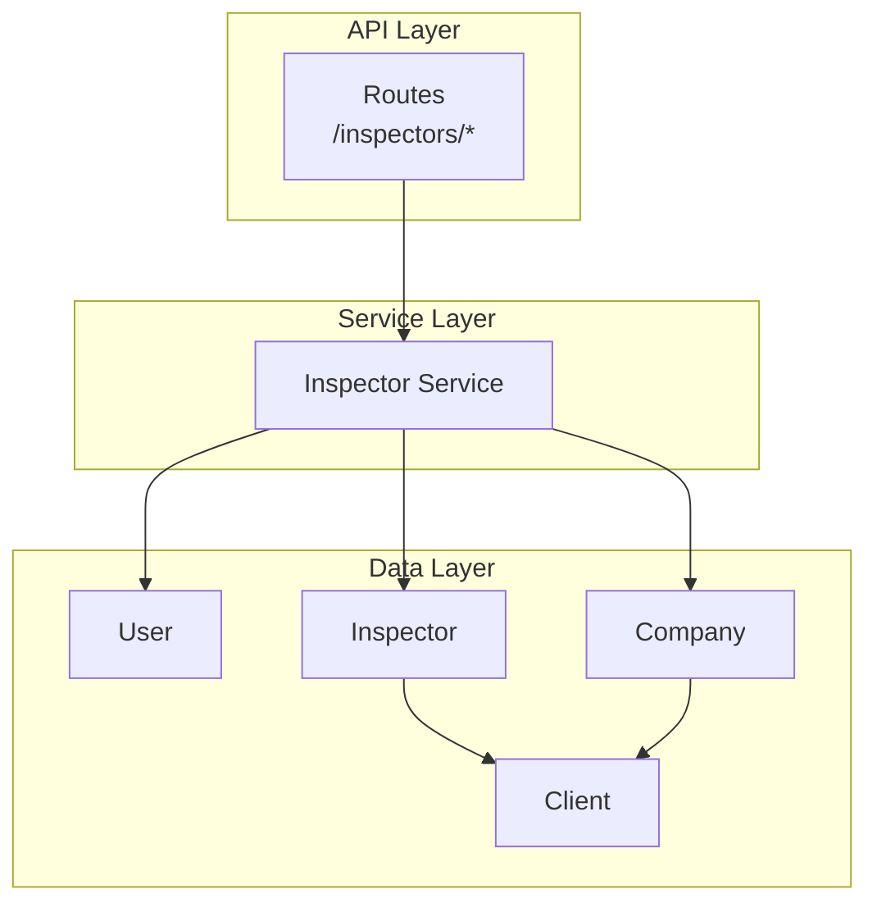
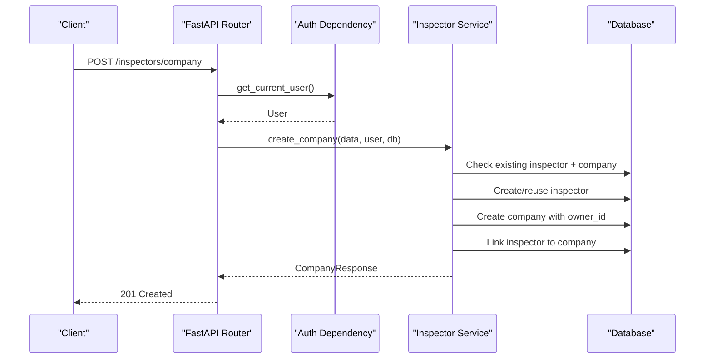
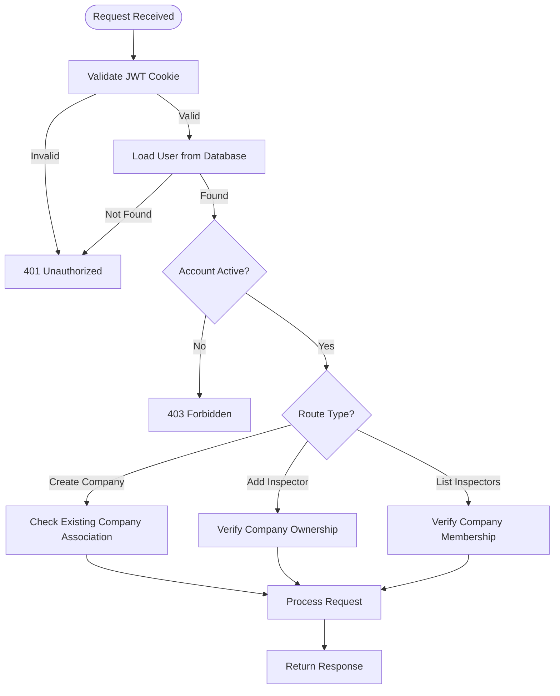
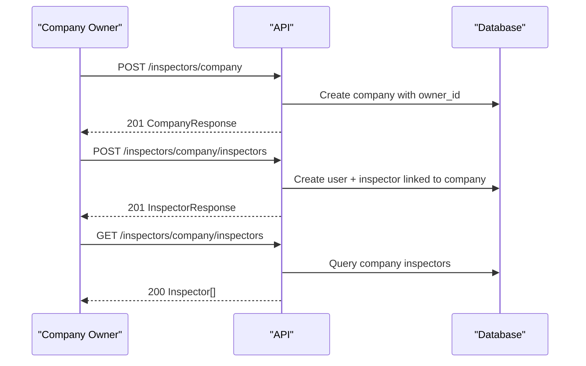
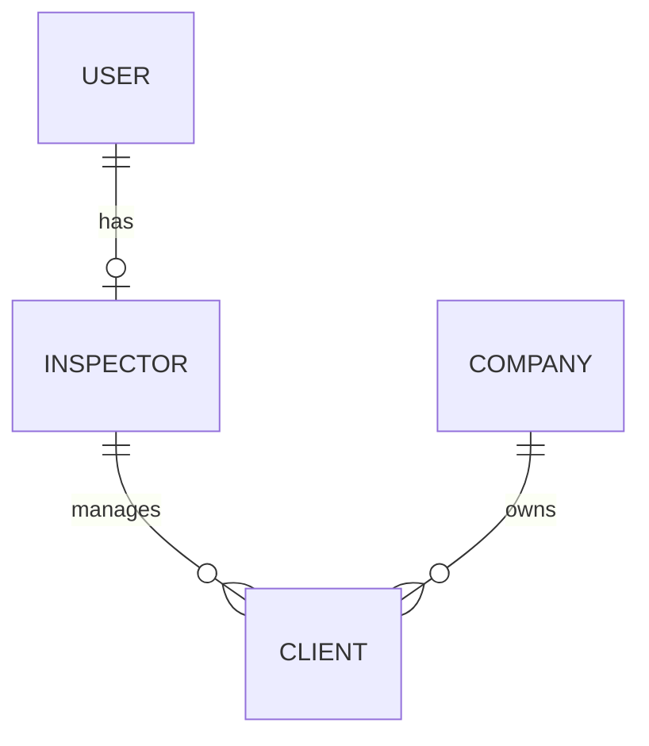
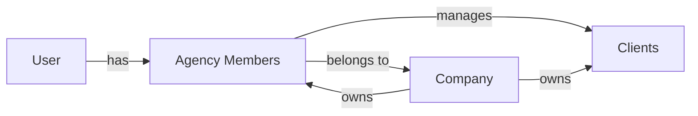

# Inspector Management Endpoints

<cite>
**Referenced Files in This Document**
- [inspector_routes.py](file://app/api/routes/inspector_routes.py)
- [inspector_service.py](file://app/services/inspector_service.py)
- [inspector_dtos.py](file://app/api/dtos/inspector_dtos.py)
- [inspector.py](file://app/repository/inspector.py)
- [company.py](file://app/repository/company.py)
- [client.py](file://app/repository/client.py)
- [user.py](file://app/repository/user.py)
- [auth_service.py](file://app/services/auth_service.py)
- [jwt_utils.py](file://app/utils/jwt_utils.py)
- [README.md](file://README.md)
</cite>

## Table of Contents
1. [Introduction](#introduction)
2. [Project Structure](#project-structure)
3. [Core Components](#core-components)
4. [Architecture Overview](#architecture-overview)
5. [Detailed Component Analysis](#detailed-component-analysis)
6. [Dependency Analysis](#dependency-analysis)
7. [Performance Considerations](#performance-considerations)
8. [Troubleshooting Guide](#troubleshooting-guide)
9. [Conclusion](#conclusion)
10. [Appendices](#appendices)

## Introduction
This document provides comprehensive API documentation for inspector management endpoints, including company creation and management, inspector onboarding within a company, and client relationships. It covers HTTP methods, URL patterns, request/response schemas, multi-tenant access control, role-based permissions, error handling, and integration patterns for agency versus solo inspector workflows.

The system supports:
- Solo inspectors (individuals without a company)
- Agency members (inspectors belonging to a company)
- Company ownership model where the creator becomes the owner and can add other inspectors
- Client records associated with either an inspector or a company

## Project Structure
Inspector management is implemented across routes, services, DTOs, and repositories:
- Routes define HTTP endpoints under /inspectors
- Services implement business logic for company creation, inspector addition, and listing
- DTOs define validation rules for requests and responses
- Repositories define database models and relationships

**Diagram sources**
- [inspector_routes.py:23-143](file://app/api/routes/inspector_routes.py#L23-L143)
- [inspector_service.py:17-134](file://app/services/inspector_service.py#L17-L134)
- [user.py:10-54](file://app/repository/user.py#L10-L54)
- [inspector.py:18-82](file://app/repository/inspector.py#L18-L82)
- [company.py:12-61](file://app/repository/company.py#L12-L61)
- [client.py:12-78](file://app/repository/client.py#L12-L78)

**Section sources**
- [inspector_routes.py:23-143](file://app/api/routes/inspector_routes.py#L23-L143)
- [inspector_service.py:17-134](file://app/services/inspector_service.py#L17-L134)
- [inspector_dtos.py:5-63](file://app/api/dtos/inspector_dtos.py#L5-L63)
- [README.md:21-63](file://README.md#L21-L63)

## Core Components
- Authentication and authorization via JWT cookies and FastAPI dependencies
- Multi-tenant isolation by company association
- Role-based permissions enforced at route level (owner-only actions)
- Data validation using Pydantic DTOs

Key responsibilities:
- get_my_profile: returns current user’s inspector profile and ownership status
- create_company: creates a company and links the current user as owner
- add_inspector: adds a new inspector to the company (owner-only)
- list_company_inspectors: lists all inspectors in the logged-in user’s company

**Section sources**
- [inspector_routes.py:28-143](file://app/api/routes/inspector_routes.py#L28-L143)
- [auth_service.py:195-270](file://app/services/auth_service.py#L195-L270)
- [inspector_service.py:17-134](file://app/services/inspector_service.py#L17-L134)

## Architecture Overview
The inspector management flow uses a layered architecture:
- Routes validate inputs and enforce authentication/authorization
- Services perform business operations and data consistency checks
- Repositories manage persistence and relationships

**Diagram sources**
- [inspector_routes.py:53-64](file://app/api/routes/inspector_routes.py#L53-L64)
- [inspector_service.py:17-73](file://app/services/inspector_service.py#L17-L73)
- [auth_service.py:195-227](file://app/services/auth_service.py#L195-L227)

## Detailed Component Analysis

### HTTP Endpoints

#### GET /inspectors/me
- Purpose: Retrieve the current user’s inspector profile and determine if they are a company owner
- Authentication: Required (JWT cookie)
- Response: ProfileResponse with inspector details and ownership flag

Request:
- Headers: Cookie containing access token
- Body: None

Response:
- 200 OK: ProfileResponse
- 401 Unauthorized: Missing or invalid token
- 403 Forbidden: Account deactivated

**Section sources**
- [inspector_routes.py:28-48](file://app/api/routes/inspector_routes.py#L28-L48)
- [auth_service.py:195-227](file://app/services/auth_service.py#L195-L227)

#### POST /inspectors/company
- Purpose: Create a company; the current user becomes the owner
- Authentication: Required (JWT cookie)
- Request: CreateCompanyRequest
- Response: CompanyResponse

Validation Rules:
- name: string, min length 1, max length 255
- email: valid email format
- phone_number: optional string
- website: optional string
- address: string, min length 1
- city: string, min length 1, max length 100
- state: string, min length 1, max length 100
- zip_code: string, min length 1, max length 20
- country: string, min length 1, max length 100, default "US"

Status Codes:
- 201 Created: Company successfully created
- 401 Unauthorized: Not authenticated
- 403 Forbidden: Account deactivated
- 409 Conflict: User already associated with a company

**Section sources**
- [inspector_routes.py:53-64](file://app/api/routes/inspector_routes.py#L53-L64)
- [inspector_service.py:17-73](file://app/services/inspector_service.py#L17-L73)
- [inspector_dtos.py:5-31](file://app/api/dtos/inspector_dtos.py#L5-L31)

#### GET /inspectors/company
- Purpose: Retrieve the company associated with the current user
- Authentication: Required (JWT cookie)
- Response: CompanyResponse

Status Codes:
- 200 OK: Company found
- 401 Unauthorized: Not authenticated
- 403 Forbidden: Account deactivated
- 404 Not Found: Not associated with any company

**Section sources**
- [inspector_routes.py:66-85](file://app/api/routes/inspector_routes.py#L66-L85)

#### POST /inspectors/company/inspectors
- Purpose: Add a new inspector to the company (owner-only)
- Authentication: Required (JWT cookie)
- Authorization: Only company owner can perform this action
- Request: AddInspectorRequest
- Response: InspectorResponse

Validation Rules:
- email: valid email format
- password: string, min length 8, max length 128
- first_name: string, min length 1
- last_name: string, min length 1
- phone_number: optional string
- license_number: optional string

Status Codes:
- 201 Created: Inspector successfully added
- 401 Unauthorized: Not authenticated
- 403 Forbidden: Not a company member or not the owner
- 409 Conflict: Email already exists as an inspector

**Section sources**
- [inspector_routes.py:89-122](file://app/api/routes/inspector_routes.py#L89-L122)
- [inspector_service.py:75-123](file://app/services/inspector_service.py#L75-L123)
- [inspector_dtos.py:34-56](file://app/api/dtos/inspector_dtos.py#L34-L56)

#### GET /inspectors/company/inspectors
- Purpose: List all inspectors in the current user’s company
- Authentication: Required (JWT cookie)
- Response: Array of InspectorResponse

Status Codes:
- 200 OK: List retrieved
- 401 Unauthorized: Not authenticated
- 403 Forbidden: Account deactivated
- 404 Not Found: Not associated with any company

**Section sources**
- [inspector_routes.py:124-143](file://app/api/routes/inspector_routes.py#L124-L143)
- [inspector_service.py:125-134](file://app/services/inspector_service.py#L125-L134)

### Request/Response Schemas

#### CreateCompanyRequest
Fields:
- name: string, required, min length 1, max length 255
- email: email format, required
- phone_number: string, optional
- website: string, optional
- address: string, required, min length 1
- city: string, required, min length 1, max length 100
- state: string, required, min length 1, max length 100
- zip_code: string, required, min length 1, max length 20
- country: string, required, min length 1, max length 100, default "US"

**Section sources**
- [inspector_dtos.py:5-15](file://app/api/dtos/inspector_dtos.py#L5-L15)

#### CompanyResponse
Fields:
- id: UUID
- name: string
- email: string
- phone_number: string, nullable
- website: string, nullable
- address: string
- city: string
- state: string
- zip_code: string
- country: string
- owner_id: UUID, nullable
- created_at: datetime

**Section sources**
- [inspector_dtos.py:17-31](file://app/api/dtos/inspector_dtos.py#L17-L31)

#### AddInspectorRequest
Fields:
- email: email format, required
- password: string, required, min length 8, max length 128
- first_name: string, required, min length 1
- last_name: string, required, min length 1
- phone_number: string, optional
- license_number: string, optional

**Section sources**
- [inspector_dtos.py:34-41](file://app/api/dtos/inspector_dtos.py#L34-L41)

#### InspectorResponse
Fields:
- id: UUID
- user_id: UUID
- company_id: UUID, nullable
- first_name: string
- last_name: string
- phone_number: string, nullable
- license_number: string, nullable
- inspector_type: string (enum: individual, agency_member)
- is_active: boolean
- created_at: datetime

**Section sources**
- [inspector_dtos.py:43-56](file://app/api/dtos/inspector_dtos.py#L43-L56)

#### ProfileResponse
Fields:
- user_id: UUID
- email: string
- inspector: InspectorResponse, nullable
- is_company_owner: boolean

**Section sources**
- [inspector_dtos.py:58-63](file://app/api/dtos/inspector_dtos.py#L58-L63)

### Multi-Tenant Access Control and Role-Based Permissions

Access control is enforced through:
- JWT authentication via cookie-based tokens
- Current user resolution from access token
- Company membership verification
- Owner-only permission checks

Permission Matrix:
- All endpoints require authentication (JWT cookie)
- Company creation requires active account
- Adding inspectors requires company ownership
- Listing inspectors requires company membership

**Diagram sources**
- [auth_service.py:195-270](file://app/services/auth_service.py#L195-L270)
- [inspector_routes.py:53-143](file://app/api/routes/inspector_routes.py#L53-L143)

**Section sources**
- [auth_service.py:195-270](file://app/services/auth_service.py#L195-L270)
- [inspector_routes.py:53-143](file://app/api/routes/inspector_routes.py#L53-L143)

### Inspector Onboarding Workflows

#### Solo Inspector Workflow
1. Register user account
2. Login to receive JWT tokens
3. Access profile endpoint to verify inspector status
4. Operate independently without company association

#### Agency Inspector Workflow
1. Company owner creates company
2. Owner adds inspectors to the company
3. New inspectors login with provided credentials
4. Inspectors operate within company context

**Diagram sources**
- [inspector_routes.py:53-143](file://app/api/routes/inspector_routes.py#L53-L143)
- [inspector_service.py:17-134](file://app/services/inspector_service.py#L17-L134)

**Section sources**
- [inspector_service.py:17-134](file://app/services/inspector_service.py#L17-L134)

### Client Relationship Management

Clients can be associated with either:
- A specific inspector (direct relationship)
- A company (agency-level relationship)

This supports both solo inspector and agency workflows:
- Solo inspectors manage clients directly
- Agencies manage clients at the organization level

**Diagram sources**
- [client.py:12-78](file://app/repository/client.py#L12-L78)
- [inspector.py:18-82](file://app/repository/inspector.py#L18-L82)
- [company.py:12-61](file://app/repository/company.py#L12-L61)
- [user.py:10-54](file://app/repository/user.py#L10-L54)

**Section sources**
- [client.py:12-78](file://app/repository/client.py#L12-L78)
- [inspector.py:18-82](file://app/repository/inspector.py#L18-L82)
- [company.py:12-61](file://app/repository/company.py#L12-L61)

## Dependency Analysis

### Component Dependencies
- Routes depend on services for business logic
- Services depend on repositories for data access
- Authentication service provides shared authorization logic
- DTOs provide input validation and output serialization

### Data Relationships
- User ↔ Inspector: One-to-one relationship
- Inspector → Company: Many-to-one (optional for solo inspectors)
- Company → Inspector: One-to-many (agency members)
- Inspector → Client: One-to-many (managed clients)
- Company → Client: One-to-many (owned clients)

**Diagram sources**
- [user.py:10-54](file://app/repository/user.py#L10-L54)
- [inspector.py:18-82](file://app/repository/inspector.py#L18-L82)
- [company.py:12-61](file://app/repository/company.py#L12-L61)
- [client.py:12-78](file://app/repository/client.py#L12-L78)

**Section sources**
- [inspector_routes.py:23-143](file://app/api/routes/inspector_routes.py#L23-L143)
- [inspector_service.py:17-134](file://app/services/inspector_service.py#L17-L134)
- [auth_service.py:195-270](file://app/services/auth_service.py#L195-L270)

## Performance Considerations
- Database queries use efficient SQLAlchemy select statements
- Relationships are configured with appropriate lazy loading strategies
- Session management ensures proper resource cleanup
- JWT token validation is optimized for performance

Optimization opportunities:
- Implement caching for frequently accessed company data
- Add pagination for large inspector lists
- Use database indexing on frequently queried fields
- Consider batch operations for bulk inspector additions

[No sources needed since this section provides general guidance]

## Troubleshooting Guide

### Common Error Scenarios

Authentication Errors:
- 401 Unauthorized: Missing or invalid JWT cookie
- 403 Forbidden: Account deactivated or insufficient permissions

Business Logic Errors:
- 404 Not Found: No company association when expected
- 409 Conflict: Duplicate email or existing company association

Permission Errors:
- 403 Forbidden: Attempting owner-only actions without ownership

### Debugging Steps
1. Verify JWT cookie presence and validity
2. Check user account status (active/inactive)
3. Confirm company membership and ownership
4. Validate request payload against schema requirements

### Error Response Format
All errors follow consistent FastAPI HTTPException format with:
- status_code: HTTP status code
- detail: Human-readable error message

**Section sources**
- [auth_service.py:195-270](file://app/services/auth_service.py#L195-L270)
- [inspector_routes.py:77-81](file://app/api/routes/inspector_routes.py#L77-L81)
- [inspector_routes.py:105-117](file://app/api/routes/inspector_routes.py#L105-L117)

## Conclusion
The inspector management system provides a robust foundation for managing both solo inspectors and agency workflows. The implementation follows clean architecture principles with clear separation of concerns between routes, services, and repositories. Multi-tenant access control ensures data isolation while supporting flexible organizational structures.

Key strengths:
- Comprehensive authentication and authorization
- Flexible support for solo and agency models
- Strong data validation and error handling
- Clear separation of concerns in code structure

Recommendations for future enhancements:
- Add comprehensive testing coverage
- Implement rate limiting for security
- Add audit logging for compliance
- Enhance error messages with actionable guidance

[No sources needed since this section summarizes without analyzing specific files]

## Appendices

### Integration Patterns

#### Agency vs Solo Inspector Workflows

Agency Workflow:
1. Company owner registers and creates company
2. Owner invites team members as inspectors
3. Team members operate within company context
4. Clients can be managed at company level

Solo Inspector Workflow:
1. Individual registers and operates independently
2. No company association required
3. Direct client-inspector relationships
4. Full autonomy over inspection activities

#### Data Relationship Management
- Inspector type determines workflow capabilities
- Company association enables team collaboration
- Client relationships support both direct and organizational management
- Audit trails maintained through timestamps and status flags

**Section sources**
- [inspector.py:13-16](file://app/repository/inspector.py#L13-L16)
- [client.py:36-49](file://app/repository/client.py#L36-L49)
- [README.md:21-63](file://README.md#L21-L63)