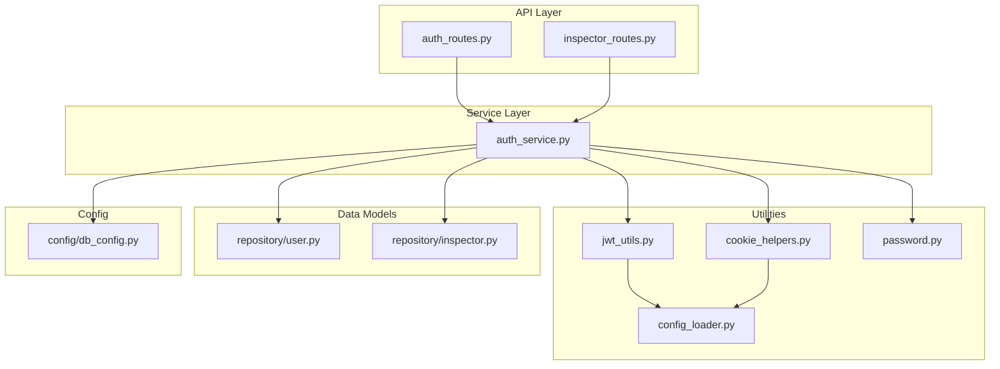
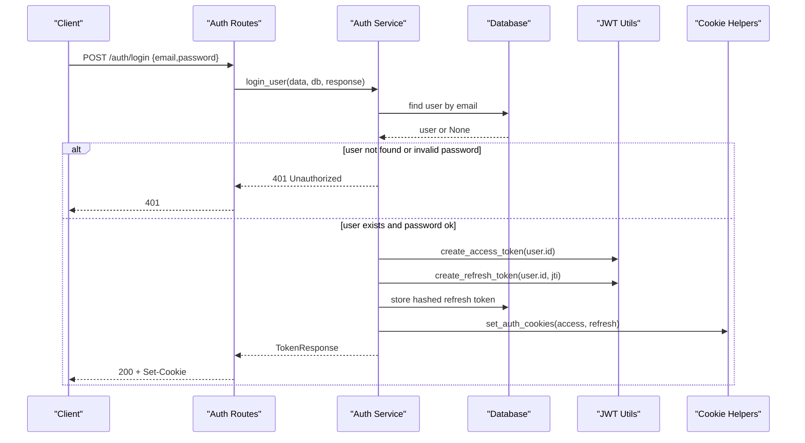
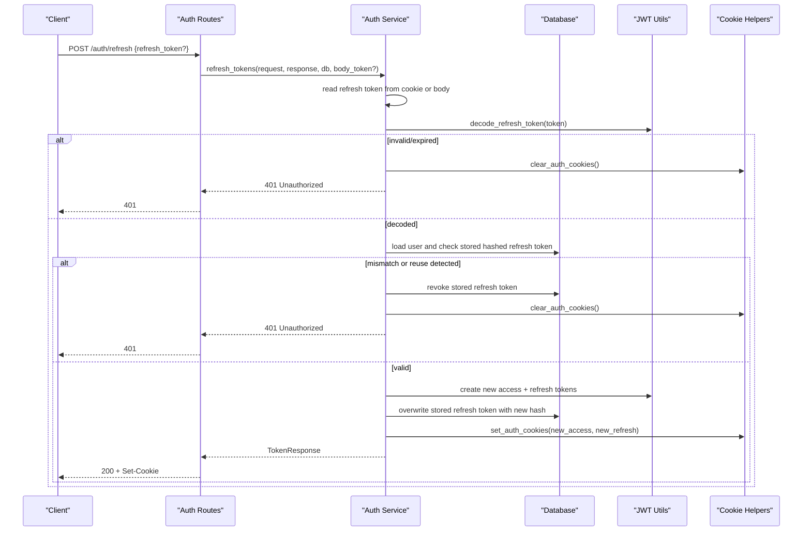
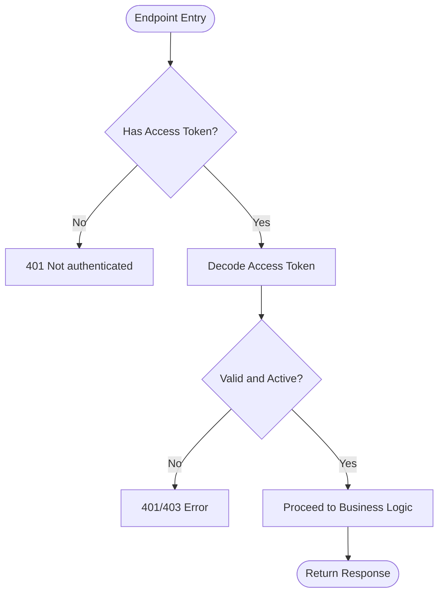
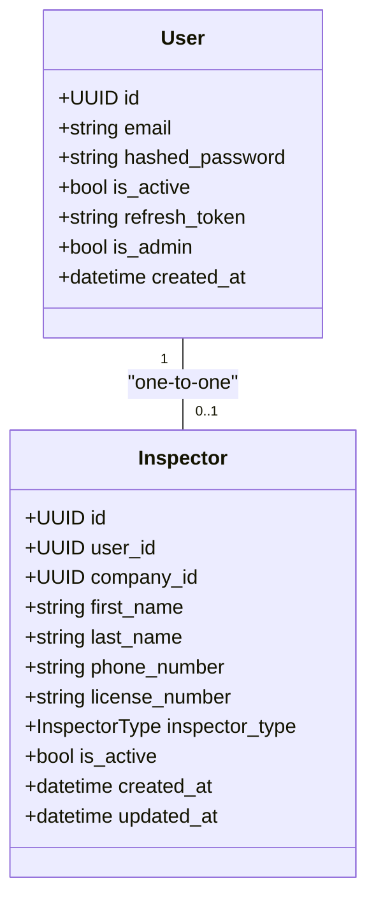
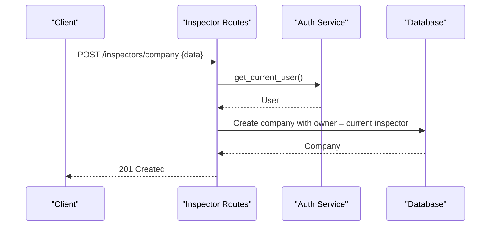
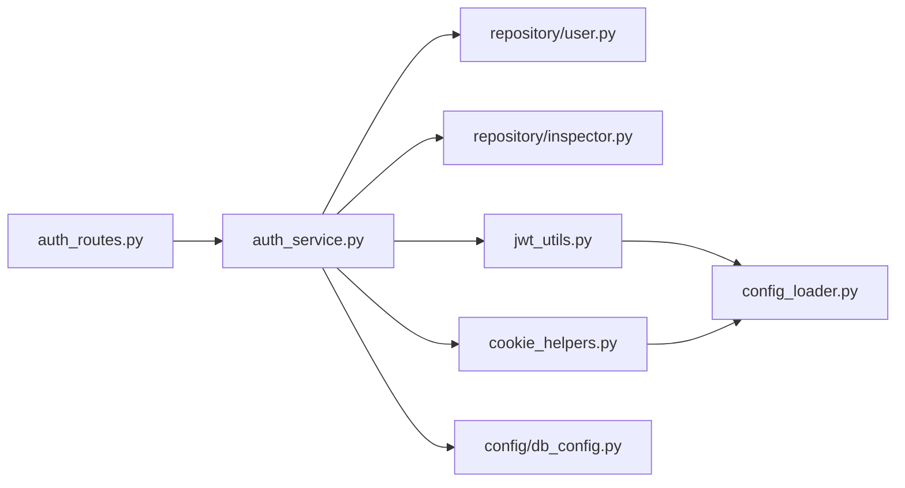

# Authentication & Authorization

<cite>
**Referenced Files in This Document**
- [auth_routes.py](file://app/api/routes/auth_routes.py)
- [auth_service.py](file://app/services/auth_service.py)
- [jwt_utils.py](file://app/utils/jwt_utils.py)
- [cookie_helpers.py](file://app/utils/cookie_helpers.py)
- [password.py](file://app/utils/password.py)
- [user.py](file://app/repository/user.py)
- [inspector.py](file://app/repository/inspector.py)
- [auth_dtos.py](file://app/api/dtos/auth_dtos.py)
- [db_config.py](file://app/config/db_config.py)
- [config_loader.py](file://app/utils/config_loader.py)
- [inspector_routes.py](file://app/api/routes/inspector_routes.py)
- [README.md](file://README.md)
</cite>

## Table of Contents
1. [Introduction](#introduction)
2. [Project Structure](#project-structure)
3. [Core Components](#core-components)
4. [Architecture Overview](#architecture-overview)
5. [Detailed Component Analysis](#detailed-component-analysis)
6. [Dependency Analysis](#dependency-analysis)
7. [Performance Considerations](#performance-considerations)
8. [Troubleshooting Guide](#troubleshooting-guide)
9. [Conclusion](#conclusion)
10. [Appendices](#appendices)

## Introduction
This document explains the authentication and authorization system implemented in the application. It covers JWT-based authentication, secure cookie handling, token generation and rotation, user model structure, password hashing with Argon2 via pwdlib, account status management, role-based access control patterns for inspectors and company ownership, practical API examples, request/response schemas, error handling, and security best practices.

## Project Structure
The authentication subsystem is organized into:
- API routes that expose endpoints for registration, login, logout, refresh, and current user retrieval
- A service layer implementing business logic for authentication flows
- Utilities for JWT creation/decoding and secure cookie handling
- Data models for users and inspectors
- Configuration for database sessions and environment-driven secrets/expirations

**Diagram sources**
- [auth_routes.py:1-65](file://app/api/routes/auth_routes.py#L1-L65)
- [auth_service.py:1-274](file://app/services/auth_service.py#L1-L274)
- [jwt_utils.py:1-51](file://app/utils/jwt_utils.py#L1-L51)
- [cookie_helpers.py:1-42](file://app/utils/cookie_helpers.py#L1-L42)
- [password.py:1-12](file://app/utils/password.py#L1-L12)
- [user.py:1-54](file://app/repository/user.py#L1-L54)
- [inspector.py:1-82](file://app/repository/inspector.py#L1-L82)
- [db_config.py:1-26](file://app/config/db_config.py#L1-L26)
- [config_loader.py:1-44](file://app/utils/config_loader.py#L1-L44)

**Section sources**
- [README.md:182-214](file://README.md#L182-L214)

## Core Components
- Authentication routes define endpoints for register, login, logout, refresh, and get current user
- Service functions implement registration, login, logout, refresh with rotation, and dependency injection for current user and inspector context
- JWT utilities create and decode access and refresh tokens using HS256 with separate secrets and expirations
- Cookie helpers set HTTP-only, secure cookies with SameSite=Lax and appropriate max ages
- Password utilities use pwdlib to hash and verify passwords with recommended algorithms (Argon2)
- User and Inspector models represent identity and roles, including active status and relationships

Key responsibilities:
- RegisterRequest/LoginRequest/TokenResponse schemas validate inputs and outputs
- get_current_user extracts and validates the access token from cookies and returns an active user
- get_current_inspector resolves the inspector profile for the authenticated user
- require_company_owner enforces ownership constraints on company-scoped operations

**Section sources**
- [auth_routes.py:25-65](file://app/api/routes/auth_routes.py#L25-L65)
- [auth_service.py:35-274](file://app/services/auth_service.py#L35-L274)
- [jwt_utils.py:14-51](file://app/utils/jwt_utils.py#L14-L51)
- [cookie_helpers.py:12-42](file://app/utils/cookie_helpers.py#L12-L42)
- [password.py:1-12](file://app/utils/password.py#L1-L12)
- [user.py:10-54](file://app/repository/user.py#L10-L54)
- [inspector.py:13-82](file://app/repository/inspector.py#L13-L82)
- [auth_dtos.py:7-39](file://app/api/dtos/auth_dtos.py#L7-L39)

## Architecture Overview
The authentication flow uses short-lived access tokens stored in secure cookies and long-lived refresh tokens also stored in secure cookies. On login, a hashed refresh token is persisted in the user record to support rotation and revocation. On refresh, the old refresh token is validated against the stored hash; if valid, a new pair is issued and the old one is invalidated by overwriting the stored hash.

**Diagram sources**
- [auth_routes.py:31-34](file://app/api/routes/auth_routes.py#L31-L34)
- [auth_service.py:61-103](file://app/services/auth_service.py#L61-L103)
- [jwt_utils.py:14-40](file://app/utils/jwt_utils.py#L14-L40)
- [cookie_helpers.py:12-35](file://app/utils/cookie_helpers.py#L12-L35)

**Diagram sources**
- [auth_routes.py:47-58](file://app/api/routes/auth_routes.py#L47-L58)
- [auth_service.py:122-194](file://app/services/auth_service.py#L122-L194)
- [jwt_utils.py:28-51](file://app/utils/jwt_utils.py#L28-L51)
- [cookie_helpers.py:12-42](file://app/utils/cookie_helpers.py#L12-L42)

## Detailed Component Analysis

### Authentication Endpoints and Flows
- Register: Creates a user with a hashed password and returns user info
- Login: Authenticates credentials, issues access and refresh tokens, sets secure cookies, persists hashed refresh token
- Logout: Revokes refresh token and clears cookies
- Refresh: Rotates refresh token, validates against stored hash, issues new tokens, updates cookies
- Get Current User: Validates access token from cookie and returns user info

**Diagram sources**
- [auth_service.py:199-230](file://app/services/auth_service.py#L199-L230)

**Section sources**
- [auth_routes.py:25-65](file://app/api/routes/auth_routes.py#L25-L65)
- [auth_service.py:35-230](file://app/services/auth_service.py#L35-L230)

### Secure Cookie Handling
- Both access and refresh tokens are stored in HTTP-only, secure cookies with SameSite=Lax
- Cookies are set with max_age matching token expiry configured via environment variables
- Logout and error paths clear cookies to prevent stale session data

Security measures:
- httponly=True prevents client-side script access
- secure=True ensures cookies are sent only over HTTPS
- samesite="lax" mitigates CSRF risks while allowing top-level navigations

**Section sources**
- [cookie_helpers.py:12-42](file://app/utils/cookie_helpers.py#L12-L42)
- [config_loader.py:38-44](file://app/utils/config_loader.py#L38-L44)

### JWT Token Generation and Validation
- Access tokens: short-lived, signed with ACCESS_TOKEN_SECRET, include sub and exp
- Refresh tokens: longer-lived, signed with REFRESH_TOKEN_SECRET, include sub, exp, and jti for rotation tracking
- Decoders validate signatures and expiration using respective secrets

Best practices:
- Separate secrets for access and refresh tokens reduce blast radius
- HS256 algorithm used consistently
- Expirations configurable via environment variables

**Section sources**
- [jwt_utils.py:14-51](file://app/utils/jwt_utils.py#L14-L51)
- [config_loader.py:24-44](file://app/utils/config_loader.py#L24-L44)

### Password Hashing with Argon2 via pwdlib
- Passwords are hashed using pwdlib’s recommended hasher, which selects strong algorithms including Argon2
- Verification compares plain text input against stored hashes securely

Security considerations:
- Never store plaintext passwords
- Use consistent hashing across registration and login
- Leverage library defaults for optimal security parameters

**Section sources**
- [password.py:1-12](file://app/utils/password.py#L1-L12)

### User Model and Account Status Management
- User stores email, hashed_password, is_active, refresh_token (hashed), is_admin, created_at
- Relationships: optional one-to-one link to Inspector
- Account deactivation blocks login and protected endpoints

Role indicators:
- is_admin flag present for potential admin features
- Company ownership enforced via Inspector and Company relationships

**Section sources**
- [user.py:10-54](file://app/repository/user.py#L10-L54)
- [auth_service.py:82-86](file://app/services/auth_service.py#L82-L86)
- [auth_service.py:225-229](file://app/services/auth_service.py#L225-L229)

### Relationship Between Users and Inspectors
- One-to-one relationship between User and Inspector
- Inspector includes type (individual or agency_member), optional company association, and activity status
- Protected endpoints resolve Inspector from User to enforce domain-specific permissions

**Diagram sources**
- [user.py:10-54](file://app/repository/user.py#L10-L54)
- [inspector.py:18-82](file://app/repository/inspector.py#L18-L82)

**Section sources**
- [inspector.py:18-82](file://app/repository/inspector.py#L18-L82)
- [auth_service.py:233-246](file://app/services/auth_service.py#L233-L246)

### Role-Based Access Control Patterns
- get_current_user: authenticates requests via access token cookie
- get_current_inspector: ensures the authenticated user has an inspector profile
- require_company_owner: restricts actions to the owner of a company associated with the inspector

Usage in routes:
- Company creation requires an authenticated user who becomes the owner
- Adding inspectors to a company requires ownership verification
- Listing company inspectors requires membership

**Diagram sources**
- [inspector_routes.py:53-63](file://app/api/routes/inspector_routes.py#L53-L63)
- [auth_service.py:199-230](file://app/services/auth_service.py#L199-L230)

**Section sources**
- [inspector_routes.py:28-143](file://app/api/routes/inspector_routes.py#L28-L143)
- [auth_service.py:233-274](file://app/services/auth_service.py#L233-L274)

### Practical API Examples and Schemas
Endpoints:
- POST /auth/register
  - Request: RegisterRequest {email, password}
  - Response: UserResponse {id, email, is_active, created_at}
  - Errors: 409 Conflict if email already registered
- POST /auth/login
  - Request: LoginRequest {email, password}
  - Response: TokenResponse {message, access_token_expires_at, refresh_token_expires_at}
  - Side effects: Sets access_token and refresh_token cookies
  - Errors: 401 Invalid credentials, 403 Account deactivated
- POST /auth/logout
  - Requires authentication
  - Response: LogoutResponse {message}
  - Side effects: Clears auth cookies, revokes refresh token
- POST /auth/refresh
  - Request: Optional RefreshTokenRequest {refresh_token}
  - Behavior: Reads refresh token from cookie or body; rotates token; sets new cookies
  - Response: TokenResponse
  - Errors: 401 Invalid/expired/reused refresh token, 403 Account deactivated
- GET /auth/me
  - Requires authentication
  - Response: UserResponse

Notes:
- All responses conform to Pydantic models defined in auth_dtos
- Environment variables configure token secrets and expirations

**Section sources**
- [auth_routes.py:25-65](file://app/api/routes/auth_routes.py#L25-L65)
- [auth_dtos.py:7-39](file://app/api/dtos/auth_dtos.py#L7-L39)
- [config_loader.py:24-44](file://app/utils/config_loader.py#L24-L44)

### Security Best Practices Implemented
- Short-lived access tokens reduce exposure window
- Long-lived refresh tokens rotated per use to limit reuse risk
- Stored refresh tokens are hashed to prevent direct comparison attacks
- Secure, HTTP-only cookies mitigate XSS and CSRF risks
- Separate secrets for access and refresh tokens isolate compromise impact
- Account status checks block inactive accounts at multiple points

**Section sources**
- [jwt_utils.py:14-51](file://app/utils/jwt_utils.py#L14-L51)
- [auth_service.py:88-95](file://app/services/auth_service.py#L88-L95)
- [auth_service.py:161-170](file://app/services/auth_service.py#L161-L170)
- [cookie_helpers.py:12-42](file://app/utils/cookie_helpers.py#L12-L42)

## Dependency Analysis
The authentication system exhibits clear separation of concerns:
- Routes depend on services for business logic
- Services depend on repositories for persistence and utilities for security
- Utilities depend on configuration for secrets and expirations
- Database configuration provides session management

Potential coupling points:
- Cookie keys and behaviors are centralized in cookie_helpers
- JWT algorithms and secrets are centralized in jwt_utils and config_loader
- Authentication state is tied to User.is_active and Inspector associations

**Diagram sources**
- [auth_routes.py:1-65](file://app/api/routes/auth_routes.py#L1-L65)
- [auth_service.py:1-274](file://app/services/auth_service.py#L1-L274)
- [jwt_utils.py:1-51](file://app/utils/jwt_utils.py#L1-L51)
- [cookie_helpers.py:1-42](file://app/utils/cookie_helpers.py#L1-L42)
- [db_config.py:1-26](file://app/config/db_config.py#L1-L26)
- [config_loader.py:1-44](file://app/utils/config_loader.py#L1-L44)

**Section sources**
- [auth_service.py:1-274](file://app/services/auth_service.py#L1-L274)
- [jwt_utils.py:1-51](file://app/utils/jwt_utils.py#L1-L51)
- [cookie_helpers.py:1-42](file://app/utils/cookie_helpers.py#L1-L42)
- [db_config.py:1-26](file://app/config/db_config.py#L1-L26)
- [config_loader.py:1-44](file://app/utils/config_loader.py#L1-L44)

## Performance Considerations
- Token decoding is lightweight and performed per request; ensure secrets and expirations are optimized for your deployment
- Database queries for user lookup and inspector resolution should be indexed on email and user_id for fast lookups
- Avoid unnecessary joins; fetch only required fields when possible
- Consider caching frequently accessed user profiles if needed, balancing consistency requirements

[No sources needed since this section provides general guidance]

## Troubleshooting Guide
Common scenarios and resolutions:
- Invalid credentials on login: Verify email exists and password matches; check for typos and case sensitivity
- Account deactivated: Ensure user.is_active is true before attempting login or accessing protected endpoints
- Refresh token reuse detected: Indicates possible token theft; all sessions revoked; re-authenticate
- Missing or expired cookies: Re-login to obtain fresh tokens; ensure HTTPS and correct domain/path settings
- Not authenticated: Confirm access token cookie is present and valid; check browser privacy settings blocking cookies
- Not a company member or not owner: Verify inspector profile and company association; confirm ownership for restricted actions

Error codes:
- 401 Unauthorized: Invalid credentials, missing/invalid tokens, reused refresh token
- 403 Forbidden: Account deactivated, insufficient permissions (not a member or not owner)
- 404 Not Found: Inspector profile not found, not associated with any company
- 409 Conflict: Email already registered

**Section sources**
- [auth_service.py:67-86](file://app/services/auth_service.py#L67-L86)
- [auth_service.py:134-177](file://app/services/auth_service.py#L134-L177)
- [auth_service.py:199-230](file://app/services/auth_service.py#L199-L230)
- [inspector_routes.py:76-84](file://app/api/routes/inspector_routes.py#L76-L84)
- [inspector_routes.py:104-117](file://app/api/routes/inspector_routes.py#L104-L117)

## Conclusion
The authentication and authorization system implements robust JWT-based flows with secure cookie handling, token rotation, and role-based access controls. Passwords are hashed using Argon2 via pwdlib, and account status is enforced throughout the lifecycle. The design separates concerns cleanly between routes, services, utilities, and data models, enabling maintainability and scalability. Following the documented best practices and troubleshooting steps will help ensure secure and reliable operation.

[No sources needed since this section summarizes without analyzing specific files]

## Appendices

### Environment Variables Reference
- DATABASE_URL: PostgreSQL connection string
- ACCESS_TOKEN_SECRET: Secret key for signing access tokens
- ACCESS_TOKEN_EXPIRY: Access token lifespan (e.g., "15m")
- REFRESH_TOKEN_SECRET: Secret key for signing refresh tokens
- REFRESH_TOKEN_EXPIRY: Refresh token lifespan (e.g., "10d")

**Section sources**
- [README.md:170-179](file://README.md#L170-L179)
- [config_loader.py:24-44](file://app/utils/config_loader.py#L24-L44)