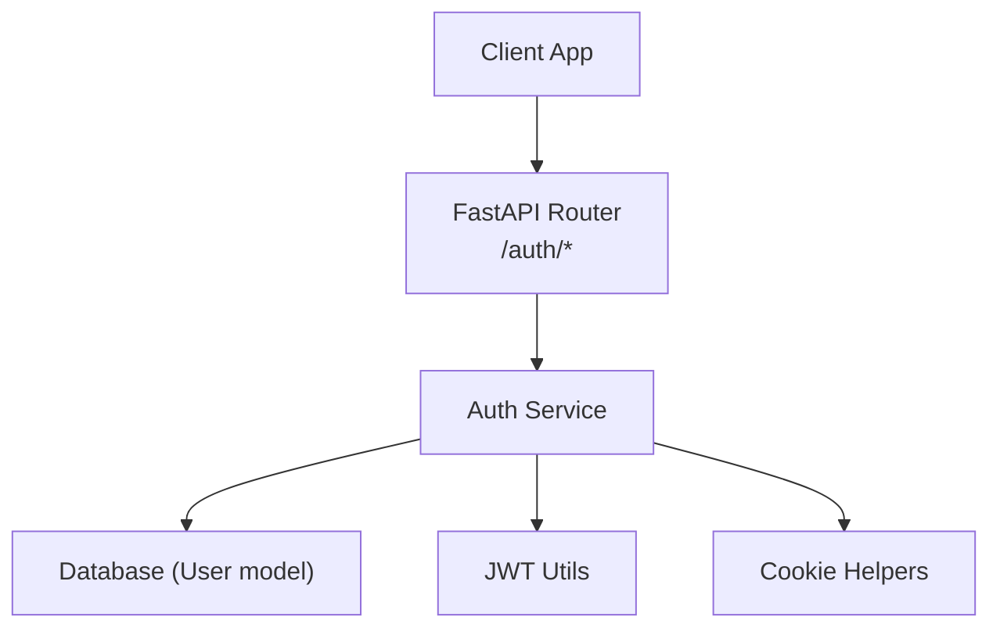
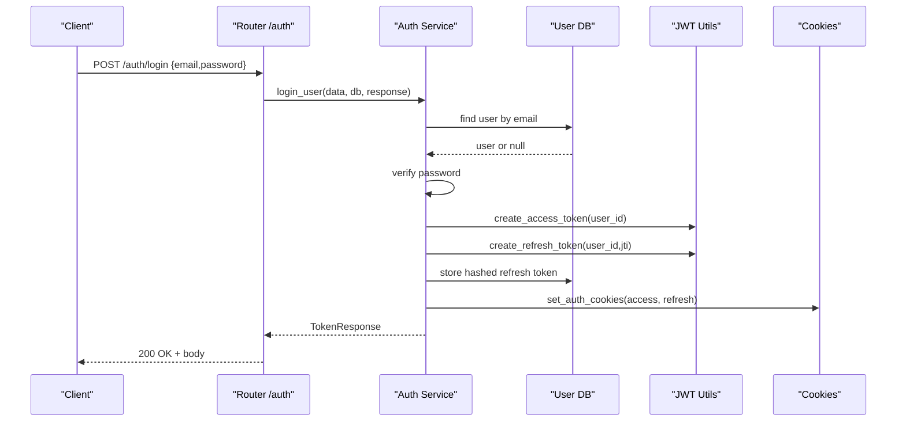
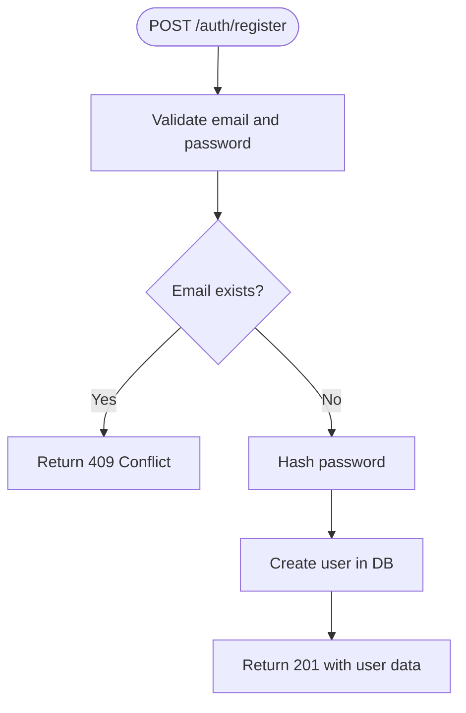
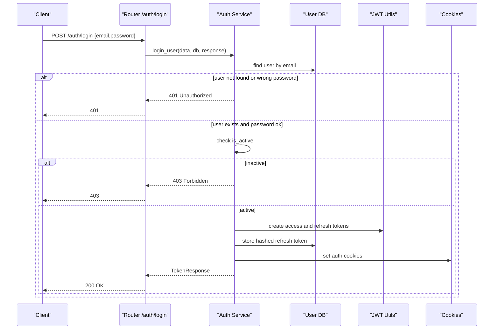
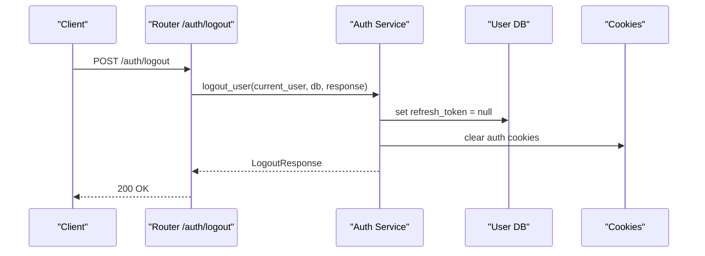
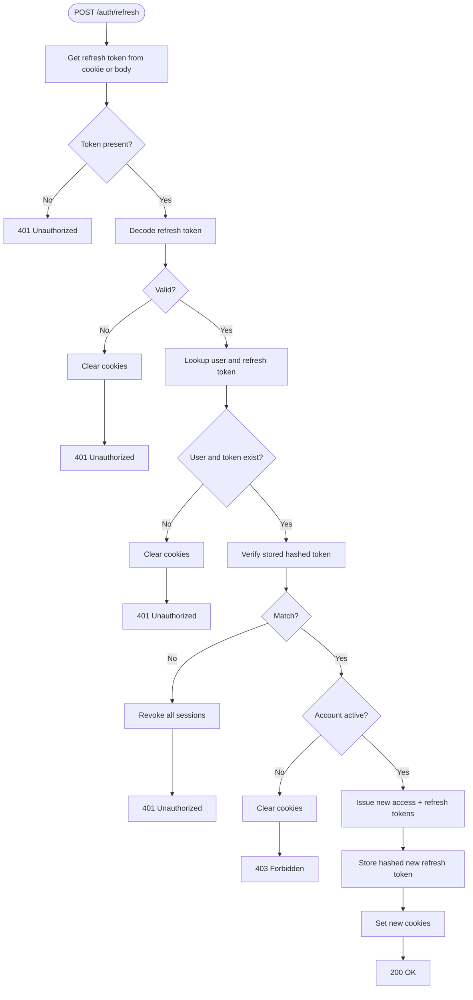
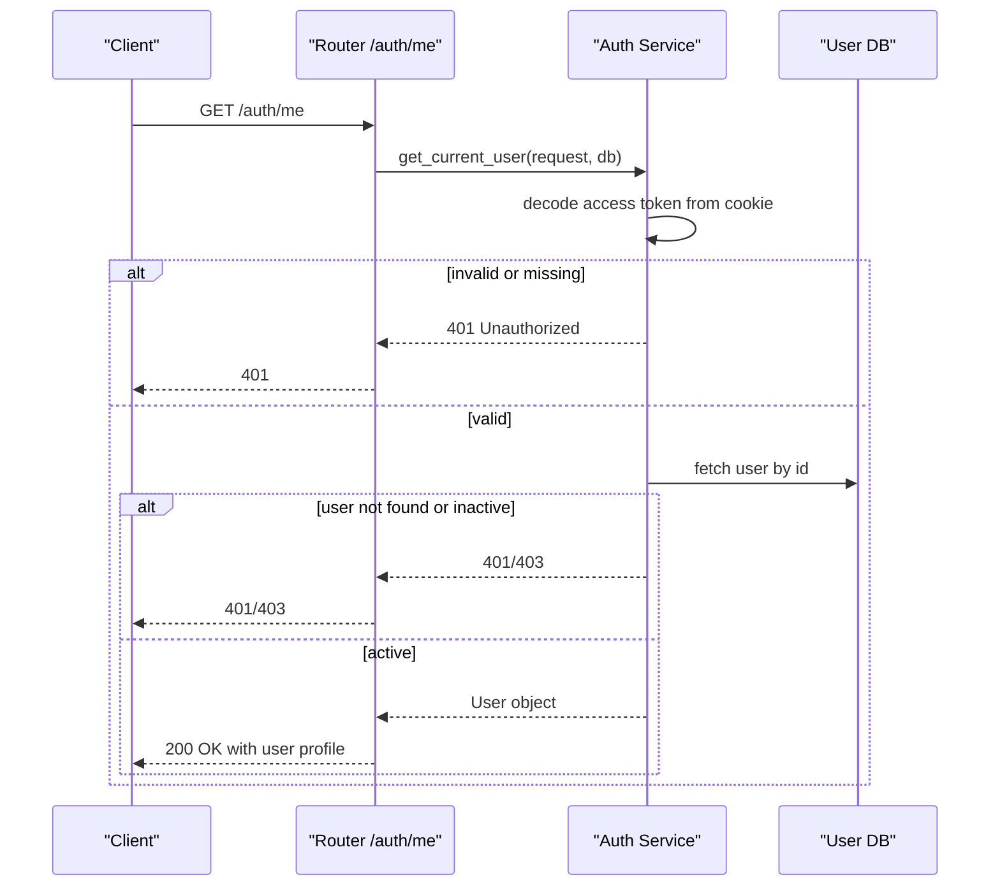
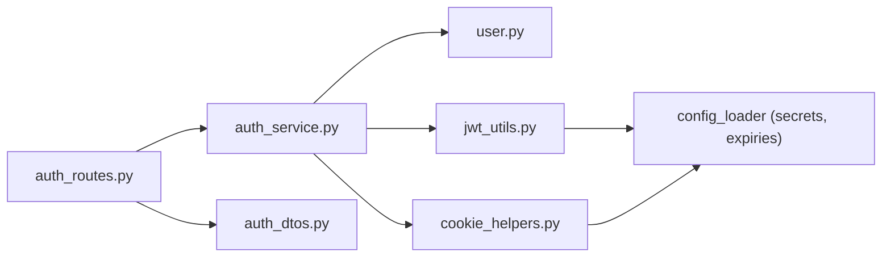

# Authentication Endpoints

<cite>
**Referenced Files in This Document**
- [auth_routes.py](file://app/api/routes/auth_routes.py)
- [auth_dtos.py](file://app/api/dtos/auth_dtos.py)
- [auth_service.py](file://app/services/auth_service.py)
- [jwt_utils.py](file://app/utils/jwt_utils.py)
- [cookie_helpers.py](file://app/utils/cookie_helpers.py)
- [user.py](file://app/repository/user.py)
- [password.py](file://app/utils/password.py)
</cite>

## Table of Contents
1. [Introduction](#introduction)
2. [Project Structure](#project-structure)
3. [Core Components](#core-components)
4. [Architecture Overview](#architecture-overview)
5. [Detailed Component Analysis](#detailed-component-analysis)
6. [Dependency Analysis](#dependency-analysis)
7. [Performance Considerations](#performance-considerations)
8. [Troubleshooting Guide](#troubleshooting-guide)
9. [Conclusion](#conclusion)

## Introduction
This document specifies the authentication API endpoints for user registration, login, logout, token refresh, and profile retrieval. It covers HTTP methods, URL patterns, request/response schemas, authentication requirements, status codes, validation rules, business constraints, and integration guidelines for client applications.

## Project Structure
The authentication feature is implemented as a FastAPI router with service-layer logic, Pydantic DTOs for input/output validation, JWT utilities for token handling, and cookie helpers for secure storage of tokens.

**Diagram sources**
- [auth_routes.py:22-64](file://app/api/routes/auth_routes.py#L22-L64)
- [auth_service.py:36-218](file://app/services/auth_service.py#L36-L218)
- [jwt_utils.py:14-50](file://app/utils/jwt_utils.py#L14-L50)
- [cookie_helpers.py:12-41](file://app/utils/cookie_helpers.py#L12-L41)

**Section sources**
- [auth_routes.py:22-64](file://app/api/routes/auth_routes.py#L22-L64)

## Core Components
- Routes: Define endpoints under /auth with request/response models and dependencies.
- Services: Implement business logic for registration, login, logout, token refresh, and current user resolution.
- DTOs: Validate inputs and define response shapes.
- JWT Utilities: Create and decode access and refresh tokens.
- Cookie Helpers: Set and clear secure, HTTP-only cookies for tokens.
- User Model: Stores user identity, password hash, active status, and hashed refresh token.

**Section sources**
- [auth_routes.py:22-64](file://app/api/routes/auth_routes.py#L22-L64)
- [auth_service.py:36-218](file://app/services/auth_service.py#L36-L218)
- [auth_dtos.py:7-39](file://app/api/dtos/auth_dtos.py#L7-L39)
- [jwt_utils.py:14-50](file://app/utils/jwt_utils.py#L14-L50)
- [cookie_helpers.py:12-41](file://app/utils/cookie_helpers.py#L12-L41)
- [user.py:10-48](file://app/repository/user.py#L10-L48)

## Architecture Overview
Authentication uses short-lived access tokens and longer-lived refresh tokens stored in secure, HTTP-only cookies. The refresh token is also persisted in hashed form to support rotation and revocation. Protected endpoints rely on a dependency that validates the access token from cookies and returns the current user.

**Diagram sources**
- [auth_routes.py:31-34](file://app/api/routes/auth_routes.py#L31-L34)
- [auth_service.py:59-99](file://app/services/auth_service.py#L59-L99)
- [jwt_utils.py:14-40](file://app/utils/jwt_utils.py#L14-L40)
- [cookie_helpers.py:12-35](file://app/utils/cookie_helpers.py#L12-L35)

## Detailed Component Analysis

### POST /auth/register
- Purpose: Create a new user account.
- Method and Path: POST /auth/register
- Request Body Schema:
  - email: string, valid email format
  - password: string, minimum length 8, maximum length 128
- Response Schema:
  - id: UUID
  - email: string
  - is_active: boolean
  - created_at: datetime
- Authentication: None required
- Status Codes:
  - 201 Created: Registration successful
  - 409 Conflict: Email already registered
- Validation Rules:
  - Email must be a valid email address
  - Password length between 8 and 128 characters
- Business Logic:
  - Prevent duplicate emails
  - Hash password before storing
  - Default user is active upon creation
- Integration Guidelines:
  - Send JSON payload with email and password
  - Handle 409 if the email exists
  - Store returned user data; no tokens are issued here

**Diagram sources**
- [auth_routes.py:25-28](file://app/api/routes/auth_routes.py#L25-L28)
- [auth_service.py:36-55](file://app/services/auth_service.py#L36-L55)
- [auth_dtos.py:7-14](file://app/api/dtos/auth_dtos.py#L7-L14)
- [password.py:6-11](file://app/utils/password.py#L6-L11)
- [user.py:19-33](file://app/repository/user.py#L19-L33)

**Section sources**
- [auth_routes.py:25-28](file://app/api/routes/auth_routes.py#L25-L28)
- [auth_service.py:36-55](file://app/services/auth_service.py#L36-L55)
- [auth_dtos.py:7-14](file://app/api/dtos/auth_dtos.py#L7-L14)
- [password.py:6-11](file://app/utils/password.py#L6-L11)
- [user.py:19-33](file://app/repository/user.py#L19-L33)

### POST /auth/login
- Purpose: Authenticate a user and issue access and refresh tokens via secure cookies.
- Method and Path: POST /auth/login
- Request Body Schema:
  - email: string, valid email format
  - password: string, minimum length 1
- Response Schema:
  - message: string
  - access_token_expires_at: datetime
  - refresh_token_expires_at: datetime
- Authentication: None required
- Status Codes:
  - 200 OK: Login successful; cookies set
  - 401 Unauthorized: Invalid credentials
  - 403 Forbidden: Account is deactivated
- Validation Rules:
  - Email must be a valid email address
  - Password must not be empty
- Business Logic:
  - Verify user exists and password matches
  - Ensure account is active
  - Generate access and refresh tokens
  - Persist hashed refresh token for rotation
  - Set secure, HTTP-only cookies for both tokens
- Integration Guidelines:
  - Send JSON payload with email and password
  - On success, cookies will be automatically sent on subsequent requests
  - Use the provided expiration times to manage UI state

**Diagram sources**
- [auth_routes.py:31-34](file://app/api/routes/auth_routes.py#L31-L34)
- [auth_service.py:59-99](file://app/services/auth_service.py#L59-L99)
- [jwt_utils.py:14-40](file://app/utils/jwt_utils.py#L14-L40)
- [cookie_helpers.py:12-35](file://app/utils/cookie_helpers.py#L12-L35)
- [user.py:19-33](file://app/repository/user.py#L19-L33)

**Section sources**
- [auth_routes.py:31-34](file://app/api/routes/auth_routes.py#L31-L34)
- [auth_service.py:59-99](file://app/services/auth_service.py#L59-L99)
- [auth_dtos.py:12-14](file://app/api/dtos/auth_dtos.py#L12-L14)
- [auth_dtos.py:31-34](file://app/api/dtos/auth_dtos.py#L31-L34)
- [jwt_utils.py:14-40](file://app/utils/jwt_utils.py#L14-L40)
- [cookie_helpers.py:12-35](file://app/utils/cookie_helpers.py#L12-L35)
- [user.py:19-33](file://app/repository/user.py#L19-L33)

### POST /auth/logout
- Purpose: Revoke the current session by clearing the refresh token and removing cookies.
- Method and Path: POST /auth/logout
- Request Body: None
- Response Schema:
  - message: string
- Authentication: Required (valid access token in cookies)
- Status Codes:
  - 200 OK: Logout successful; cookies cleared
  - 401 Unauthorized: Not authenticated (missing or invalid access token)
- Business Logic:
  - Clear the stored refresh token for the user
  - Delete both access and refresh cookies
- Integration Guidelines:
  - Call after user-initiated logout to ensure server-side revocation
  - After receiving 200, consider redirecting to login page

**Diagram sources**
- [auth_routes.py:37-44](file://app/api/routes/auth_routes.py#L37-L44)
- [auth_service.py:103-112](file://app/services/auth_service.py#L103-L112)
- [cookie_helpers.py:38-41](file://app/utils/cookie_helpers.py#L38-L41)
- [user.py:35-38](file://app/repository/user.py#L35-L38)

**Section sources**
- [auth_routes.py:37-44](file://app/api/routes/auth_routes.py#L37-L44)
- [auth_service.py:103-112](file://app/services/auth_service.py#L103-L112)
- [cookie_helpers.py:38-41](file://app/utils/cookie_helpers.py#L38-L41)
- [user.py:35-38](file://app/repository/user.py#L35-L38)

### POST /auth/refresh
- Purpose: Rotate refresh token and obtain a new access and refresh token pair.
- Method and Path: POST /auth/refresh
- Request Body Schema:
  - refresh_token: string (optional; if not provided, the cookie value is used)
- Response Schema:
  - message: string
  - access_token_expires_at: datetime
  - refresh_token_expires_at: datetime
- Authentication: Requires a valid refresh token (from cookie or body)
- Status Codes:
  - 200 OK: Tokens refreshed; new cookies set
  - 401 Unauthorized: Missing, invalid, expired, or reused refresh token
  - 403 Forbidden: Account is deactivated
- Validation Rules:
  - If provided, refresh_token must be a non-empty string
- Business Logic:
  - Prefer refresh token from cookie; fall back to body
  - Decode and validate refresh token
  - Ensure user exists and has an active refresh token
  - Detect reuse and revoke all sessions when detected
  - Issue new access and refresh tokens and update stored hashed refresh token
  - Set new secure cookies
- Integration Guidelines:
  - Can be called without a body if cookies are present
  - On 401, clear local state and prompt re-login
  - Treat 403 as a signal to force re-authentication

**Diagram sources**
- [auth_routes.py:47-58](file://app/api/routes/auth_routes.py#L47-L58)
- [auth_service.py:116-183](file://app/services/auth_service.py#L116-L183)
- [jwt_utils.py:28-50](file://app/utils/jwt_utils.py#L28-L50)
- [cookie_helpers.py:12-41](file://app/utils/cookie_helpers.py#L12-L41)
- [user.py:35-38](file://app/repository/user.py#L35-L38)

**Section sources**
- [auth_routes.py:47-58](file://app/api/routes/auth_routes.py#L47-L58)
- [auth_service.py:116-183](file://app/services/auth_service.py#L116-L183)
- [auth_dtos.py:17-18](file://app/api/dtos/auth_dtos.py#L17-L18)
- [auth_dtos.py:31-34](file://app/api/dtos/auth_dtos.py#L31-L34)
- [jwt_utils.py:28-50](file://app/utils/jwt_utils.py#L28-L50)
- [cookie_helpers.py:12-41](file://app/utils/cookie_helpers.py#L12-L41)
- [user.py:35-38](file://app/repository/user.py#L35-L38)

### GET /auth/me
- Purpose: Retrieve the currently authenticated user’s profile.
- Method and Path: GET /auth/me
- Request Body: None
- Response Schema:
  - id: UUID
  - email: string
  - is_active: boolean
  - created_at: datetime
- Authentication: Required (valid access token in cookies)
- Status Codes:
  - 200 OK: Returns user profile
  - 401 Unauthorized: Not authenticated or invalid/expired access token
  - 403 Forbidden: Account is deactivated
- Business Logic:
  - Extract access token from cookies
  - Decode and validate token
  - Fetch user and ensure it is active
- Integration Guidelines:
  - Include cookies automatically; do not send Authorization header unless your setup requires it
  - On 401 or 403, redirect to login

**Diagram sources**
- [auth_routes.py:61-64](file://app/api/routes/auth_routes.py#L61-L64)
- [auth_service.py:187-218](file://app/services/auth_service.py#L187-L218)
- [jwt_utils.py:43-45](file://app/utils/jwt_utils.py#L43-L45)
- [user.py:19-33](file://app/repository/user.py#L19-L33)

**Section sources**
- [auth_routes.py:61-64](file://app/api/routes/auth_routes.py#L61-L64)
- [auth_service.py:187-218](file://app/services/auth_service.py#L187-L218)
- [auth_dtos.py:22-28](file://app/api/dtos/auth_dtos.py#L22-L28)
- [jwt_utils.py:43-45](file://app/utils/jwt_utils.py#L43-L45)
- [user.py:19-33](file://app/repository/user.py#L19-L33)

## Dependency Analysis
- Routes depend on services for business logic and on DTOs for validation.
- Services depend on repositories for persistence, JWT utilities for token operations, and cookie helpers for setting/clearing cookies.
- JWT utilities depend on configuration for secrets and expiry durations.
- Cookie helpers depend on configuration for cookie lifetimes and security flags.

**Diagram sources**
- [auth_routes.py:1-21](file://app/api/routes/auth_routes.py#L1-L21)
- [auth_service.py:1-32](file://app/services/auth_service.py#L1-L32)
- [jwt_utils.py:1-11](file://app/utils/jwt_utils.py#L1-L11)
- [cookie_helpers.py:1-6](file://app/utils/cookie_helpers.py#L1-L6)

**Section sources**
- [auth_routes.py:1-21](file://app/api/routes/auth_routes.py#L1-L21)
- [auth_service.py:1-32](file://app/services/auth_service.py#L1-L32)
- [jwt_utils.py:1-11](file://app/utils/jwt_utils.py#L1-L11)
- [cookie_helpers.py:1-6](file://app/utils/cookie_helpers.py#L1-L6)

## Performance Considerations
- Token operations are lightweight; ensure database queries for user lookup are indexed on email and id.
- Avoid unnecessary re-hashing of refresh tokens; only store once per rotation.
- Keep cookie sizes minimal; tokens are compact JWTs.
- Consider rate limiting on login and refresh endpoints to mitigate brute-force attempts.

## Troubleshooting Guide
Common errors and their causes:
- 401 Unauthorized:
  - Missing or invalid access token on protected endpoints
  - Missing, invalid, expired, or reused refresh token on /auth/refresh
  - Invalid credentials on /auth/login
- 403 Forbidden:
  - Deactivated account during login or refresh
  - Deactivated account when accessing /auth/me
- 409 Conflict:
  - Duplicate email during registration

Operational tips:
- Ensure cookies are enabled and not blocked by browser settings.
- Confirm secure, HTTP-only cookies are set on HTTPS environments.
- When debugging refresh issues, verify that the stored hashed refresh token matches the incoming token and that reuse detection is working as expected.

**Section sources**
- [auth_service.py:41-46](file://app/services/auth_service.py#L41-L46)
- [auth_service.py:65-84](file://app/services/auth_service.py#L65-L84)
- [auth_service.py:126-168](file://app/services/auth_service.py#L126-L168)
- [auth_service.py:187-218](file://app/services/auth_service.py#L187-L218)

## Conclusion
The authentication API provides secure user registration, login, logout, token refresh, and profile retrieval using short-lived access tokens and rotated refresh tokens stored in secure cookies. Clients should handle cookie-based authentication flows, manage token expiration, and respond appropriately to error states such as unauthorized or deactivated accounts.