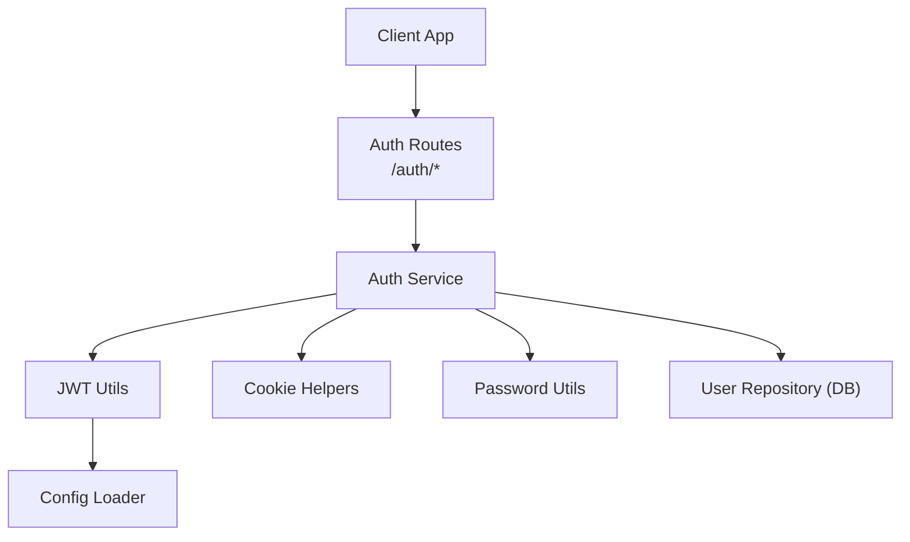
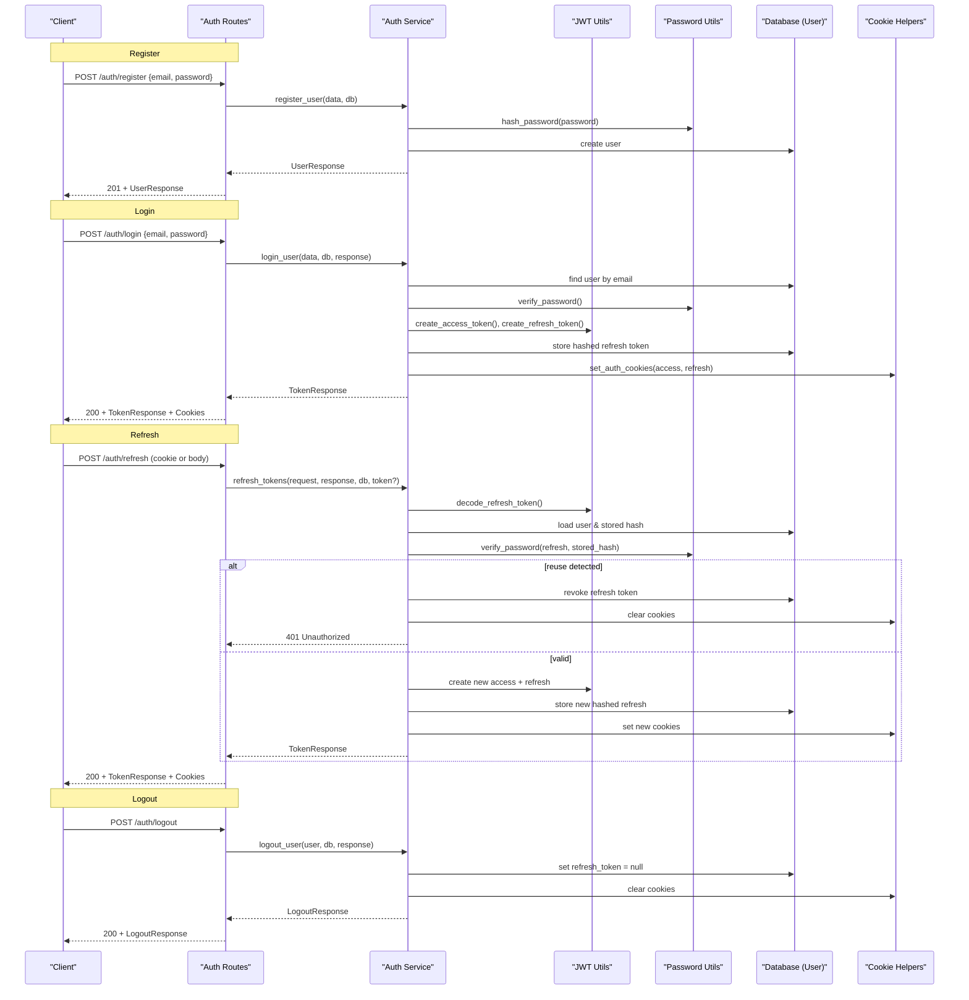
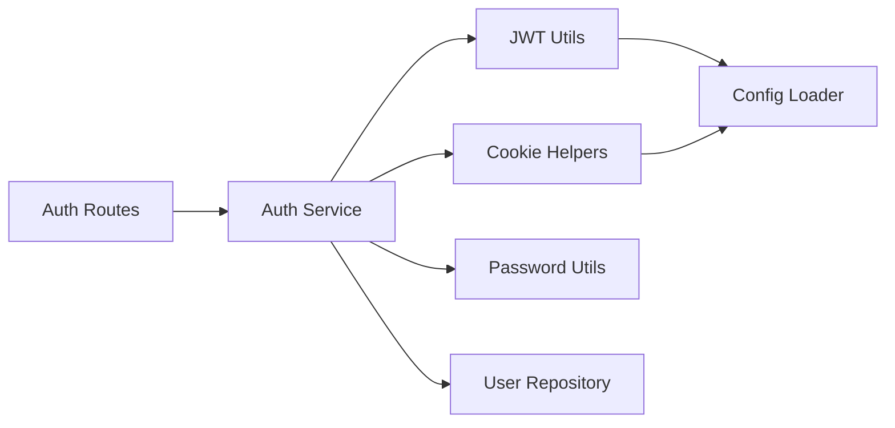

# JWT Authentication Flow

<cite>
**Referenced Files in This Document**
- [auth_routes.py](file://app/api/routes/auth_routes.py)
- [auth_service.py](file://app/services/auth_service.py)
- [jwt_utils.py](file://app/utils/jwt_utils.py)
- [cookie_helpers.py](file://app/utils/cookie_helpers.py)
- [password.py](file://app/utils/password.py)
- [config_loader.py](file://app/utils/config_loader.py)
- [auth_dtos.py](file://app/api/dtos/auth_dtos.py)
- [user.py](file://app/repository/user.py)
</cite>

## Table of Contents
1. [Introduction](#introduction)
2. [Project Structure](#project-structure)
3. [Core Components](#core-components)
4. [Architecture Overview](#architecture-overview)
5. [Detailed Component Analysis](#detailed-component-analysis)
6. [Dependency Analysis](#dependency-analysis)
7. [Performance Considerations](#performance-considerations)
8. [Troubleshooting Guide](#troubleshooting-guide)
9. [Conclusion](#conclusion)

## Introduction
This document explains the complete JWT-based authentication lifecycle implemented in the application. It covers user registration, login, access and refresh token issuance, secure cookie handling, token refresh with rotation to mitigate theft, logout, and protected resource access. It also details the JWT structure, expiration handling, security measures, error scenarios, and client integration patterns.

## Project Structure
The authentication feature is organized across routes, services, utilities, DTOs, and repository models:
- Routes expose HTTP endpoints for auth operations.
- Services implement business logic for registration, login, logout, and token refresh.
- Utilities handle JWT creation/decoding, password hashing, and secure cookie management.
- DTOs define request/response schemas.
- Repository defines the User model used during authentication.

**Diagram sources**
- [auth_routes.py:22-65](file://app/api/routes/auth_routes.py#L22-L65)
- [auth_service.py:36-228](file://app/services/auth_service.py#L36-L228)
- [jwt_utils.py:14-50](file://app/utils/jwt_utils.py#L14-L50)
- [cookie_helpers.py:12-41](file://app/utils/cookie_helpers.py#L12-L41)
- [password.py:6-11](file://app/utils/password.py#L6-L11)
- [config_loader.py:24-43](file://app/utils/config_loader.py#L24-L43)

**Section sources**
- [auth_routes.py:22-65](file://app/api/routes/auth_routes.py#L22-L65)
- [auth_service.py:36-228](file://app/services/auth_service.py#L36-L228)
- [jwt_utils.py:14-50](file://app/utils/jwt_utils.py#L14-L50)
- [cookie_helpers.py:12-41](file://app/utils/cookie_helpers.py#L12-L41)
- [password.py:6-11](file://app/utils/password.py#L6-L11)
- [config_loader.py:24-43](file://app/utils/config_loader.py#L24-L43)
- [user.py:10-54](file://app/repository/user.py#L10-L54)

## Core Components
- Auth Routes: Define endpoints for register, login, logout, refresh, and current user retrieval.
- Auth Service: Implements registration, login, logout, refresh with rotation, and current user extraction.
- JWT Utils: Create and decode access and refresh tokens with configurable secrets and expirations.
- Cookie Helpers: Set and clear HTTP-only, secure cookies for tokens.
- Password Utils: Hash and verify passwords securely.
- Config Loader: Load secrets and token expiry settings from environment variables.
- DTOs: Validate requests and responses for auth endpoints.
- User Model: Stores user identity, hashed password, active status, and a hashed refresh token reference.

Key responsibilities:
- Registration creates a user with a hashed password and returns user info.
- Login authenticates credentials, issues short-lived access tokens and longer-lived refresh tokens, stores a hashed refresh token in the database, and sets secure cookies.
- Refresh validates the presented refresh token, detects reuse or theft, rotates tokens, and updates stored hash.
- Logout revokes the refresh token and clears cookies.
- Protected endpoints extract the current user from the access token cookie.

**Section sources**
- [auth_routes.py:25-65](file://app/api/routes/auth_routes.py#L25-L65)
- [auth_service.py:36-228](file://app/services/auth_service.py#L36-L228)
- [jwt_utils.py:14-50](file://app/utils/jwt_utils.py#L14-L50)
- [cookie_helpers.py:12-41](file://app/utils/cookie_helpers.py#L12-L41)
- [password.py:6-11](file://app/utils/password.py#L6-L11)
- [config_loader.py:24-43](file://app/utils/config_loader.py#L24-L43)
- [auth_dtos.py:7-39](file://app/api/dtos/auth_dtos.py#L7-L39)
- [user.py:10-54](file://app/repository/user.py#L10-L54)

## Architecture Overview
The authentication flow uses stateless access tokens and stateful refresh tokens:
- Access tokens are short-lived and carry minimal claims; they are validated server-side by decoding with the access secret.
- Refresh tokens are longer-lived, include a unique jti, and are hashed and stored per user to enable rotation and revocation.
- Tokens are delivered via secure, HTTP-only cookies to reduce XSS exposure.
- Rotation invalidates previous refresh tokens on each use, preventing replay attacks.

**Diagram sources**
- [auth_routes.py:25-65](file://app/api/routes/auth_routes.py#L25-L65)
- [auth_service.py:36-228](file://app/services/auth_service.py#L36-L228)
- [jwt_utils.py:14-50](file://app/utils/jwt_utils.py#L14-L50)
- [cookie_helpers.py:12-41](file://app/utils/cookie_helpers.py#L12-L41)
- [password.py:6-11](file://app/utils/password.py#L6-L11)

## Detailed Component Analysis

### User Registration
- Endpoint: POST /auth/register
- Request schema: email and password with validation constraints.
- Process:
  - Check for existing email.
  - Hash password and persist user.
  - Return user profile without sensitive fields.
- Security:
  - Passwords are never stored in plaintext; hashed using recommended algorithm.
  - Email uniqueness enforced at DB level.

Error scenarios:
- Conflict if email already exists.

**Section sources**
- [auth_routes.py:25-28](file://app/api/routes/auth_routes.py#L25-L28)
- [auth_service.py:36-55](file://app/services/auth_service.py#L36-L55)
- [auth_dtos.py:7-10](file://app/api/dtos/auth_dtos.py#L7-L10)
- [password.py:6-7](file://app/utils/password.py#L6-L7)
- [user.py:19-23](file://app/repository/user.py#L19-L23)

### Login and Token Issuance
- Endpoint: POST /auth/login
- Request schema: email and password.
- Process:
  - Find user by email.
  - Verify password.
  - Ensure account is active.
  - Generate short-lived access token and longer-lived refresh token with unique jti.
  - Store hashed refresh token in DB for rotation and revocation.
  - Set both tokens as secure, HTTP-only cookies.
  - Return token expiration timestamps.
- Security:
  - Tokens are not exposed to JavaScript (HTTP-only).
  - Secure flag ensures HTTPS-only transmission.
  - SameSite lax mitigates CSRF risks.

Error scenarios:
- Invalid credentials (user not found or wrong password).
- Account deactivated.

**Section sources**
- [auth_routes.py:31-34](file://app/api/routes/auth_routes.py#L31-L34)
- [auth_service.py:59-101](file://app/services/auth_service.py#L59-L101)
- [jwt_utils.py:14-40](file://app/utils/jwt_utils.py#L14-L40)
- [cookie_helpers.py:12-35](file://app/utils/cookie_helpers.py#L12-L35)
- [password.py:10-11](file://app/utils/password.py#L10-L11)
- [auth_dtos.py:12-15](file://app/api/dtos/auth_dtos.py#L12-L15)

### Refresh Token Rotation
- Endpoint: POST /auth/refresh
- Input: refresh token from cookie or optional body field.
- Process:
  - Decode refresh token and validate signature/expiry.
  - Retrieve user and ensure a refresh token is stored.
  - Compare presented token against stored hash; mismatch indicates reuse/theft.
  - On reuse detection: revoke all sessions by clearing stored refresh token and cookies; return unauthorized.
  - On success: issue new access and refresh tokens, update stored hash, set new cookies.
- Security:
  - Rotation prevents stolen refresh tokens from being reused.
  - Reuse detection triggers immediate revocation.

Error scenarios:
- Missing refresh token.
- Invalid or expired refresh token.
- Reuse detected (all sessions revoked).
- Account deactivated.

**Section sources**
- [auth_routes.py:47-58](file://app/api/routes/auth_routes.py#L47-L58)
- [auth_service.py:120-192](file://app/services/auth_service.py#L120-L192)
- [jwt_utils.py:28-50](file://app/utils/jwt_utils.py#L28-L50)
- [cookie_helpers.py:12-41](file://app/utils/cookie_helpers.py#L12-L41)
- [password.py:10-11](file://app/utils/password.py#L10-L11)

### Logout
- Endpoint: POST /auth/logout
- Requires authenticated user via access token dependency.
- Process:
  - Clear stored refresh token to invalidate future refresh attempts.
  - Clear auth cookies.
  - Return success message.
- Security:
  - Ensures no lingering refresh capability after logout.

Error scenarios:
- Not authenticated (missing or invalid access token).

**Section sources**
- [auth_routes.py:37-44](file://app/api/routes/auth_routes.py#L37-L44)
- [auth_service.py:106-115](file://app/services/auth_service.py#L106-L115)
- [cookie_helpers.py:38-41](file://app/utils/cookie_helpers.py#L38-L41)

### Protected Resource Access
- Endpoint: GET /auth/me
- Dependency: get_current_user extracts and validates access token from cookie.
- Process:
  - Decode access token and retrieve user id.
  - Fetch user from DB and ensure active.
  - Return user profile.
- Security:
  - Access token must be present and valid.
  - Deactivated accounts are rejected.

Error scenarios:
- Not authenticated.
- Invalid or expired access token.
- User not found.
- Account deactivated.

**Section sources**
- [auth_routes.py:61-65](file://app/api/routes/auth_routes.py#L61-L65)
- [auth_service.py:197-228](file://app/services/auth_service.py#L197-L228)

### JWT Token Structure
- Access token payload includes:
  - sub: user id
  - exp: expiration timestamp
  - type: "access"
- Refresh token payload includes:
  - sub: user id
  - exp: expiration timestamp
  - type: "refresh"
  - jti: unique token id for rotation tracking
- Secrets:
  - Separate secrets for access and refresh tokens loaded from environment.
- Expiration:
  - Access token default short lifetime (e.g., minutes).
  - Refresh token default longer lifetime (e.g., days).
  - Values parsed from environment configuration.

Security notes:
- HS256 algorithm for signing.
- Tokens are signed with distinct secrets to limit impact of compromise.
- Refresh token jti enables precise rotation and revocation.

**Section sources**
- [jwt_utils.py:14-50](file://app/utils/jwt_utils.py#L14-L50)
- [config_loader.py:24-43](file://app/utils/config_loader.py#L24-L43)

### Cookie Handling and Security
- Both access and refresh tokens are set as HTTP-only, secure cookies with SameSite lax and root path.
- Expiration matches token lifetimes configured via environment.
- Logout and error paths clear cookies to prevent stale state.

**Section sources**
- [cookie_helpers.py:12-41](file://app/utils/cookie_helpers.py#L12-L41)
- [config_loader.py:38-43](file://app/utils/config_loader.py#L38-L43)

### Data Models and Storage
- User model fields relevant to auth:
  - id (UUID primary key)
  - email (unique)
  - hashed_password
  - is_active
  - refresh_token (stores hashed refresh token for rotation)
  - created_at
- Relationships:
  - Optional inspector profile linked to user.

**Section sources**
- [user.py:10-54](file://app/repository/user.py#L10-L54)

## Dependency Analysis
High-level dependencies between components:

**Diagram sources**
- [auth_routes.py:22-65](file://app/api/routes/auth_routes.py#L22-L65)
- [auth_service.py:36-228](file://app/services/auth_service.py#L36-L228)
- [jwt_utils.py:14-50](file://app/utils/jwt_utils.py#L14-L50)
- [cookie_helpers.py:12-41](file://app/utils/cookie_helpers.py#L12-L41)
- [config_loader.py:24-43](file://app/utils/config_loader.py#L24-L43)

**Section sources**
- [auth_routes.py:22-65](file://app/api/routes/auth_routes.py#L22-L65)
- [auth_service.py:36-228](file://app/services/auth_service.py#L36-L228)
- [jwt_utils.py:14-50](file://app/utils/jwt_utils.py#L14-L50)
- [cookie_helpers.py:12-41](file://app/utils/cookie_helpers.py#L12-L41)
- [config_loader.py:24-43](file://app/utils/config_loader.py#L24-L43)

## Performance Considerations
- Access tokens are stateless and fast to validate; keep payloads minimal.
- Refresh token verification involves a single DB lookup and password comparison; ensure indexes on user id and email exist.
- Rotation writes to DB only on successful refresh; batch operations are not applicable here but consider connection pooling and transaction boundaries.
- Cookie size is small; negligible overhead.
- Avoid unnecessary logging of tokens or sensitive data.

[No sources needed since this section provides general guidance]

## Troubleshooting Guide
Common errors and their causes:
- Invalid credentials: Wrong email or password; check input and password hashing.
- Account deactivated: User is_active is false; re-enable or investigate admin actions.
- Not authenticated: Missing or invalid access token cookie; ensure client sends cookies and backend is reachable over HTTPS.
- Invalid or expired refresh token: Token expired or tampered; force re-login.
- Refresh token reuse detected: Possible theft; all sessions revoked; require re-login.
- Inspector profile not found: When accessing inspector-specific endpoints; ensure inspector profile exists for user.

Operational checks:
- Confirm environment variables ACCESS_TOKEN_SECRET and REFRESH_TOKEN_SECRET are set.
- Verify ACCESS_TOKEN_EXPIRY and REFRESH_TOKEN_EXPIRY values parse correctly.
- Ensure cookies are sent with requests (same origin, HTTPS, correct domain/path).

**Section sources**
- [auth_service.py:66-84](file://app/services/auth_service.py#L66-L84)
- [auth_service.py:132-175](file://app/services/auth_service.py#L132-L175)
- [auth_service.py:197-228](file://app/services/auth_service.py#L197-L228)
- [config_loader.py:24-43](file://app/utils/config_loader.py#L24-L43)

## Conclusion
The authentication system implements a robust JWT flow with secure cookie delivery, short-lived access tokens, and long-lived refresh tokens with rotation and reuse detection. Registration, login, refresh, logout, and protected access are clearly separated into routes and services, with strong separation of concerns and defensive error handling. Clients should rely on cookies for token transport and handle refresh flows transparently when access tokens expire.

[No sources needed since this section summarizes without analyzing specific files]