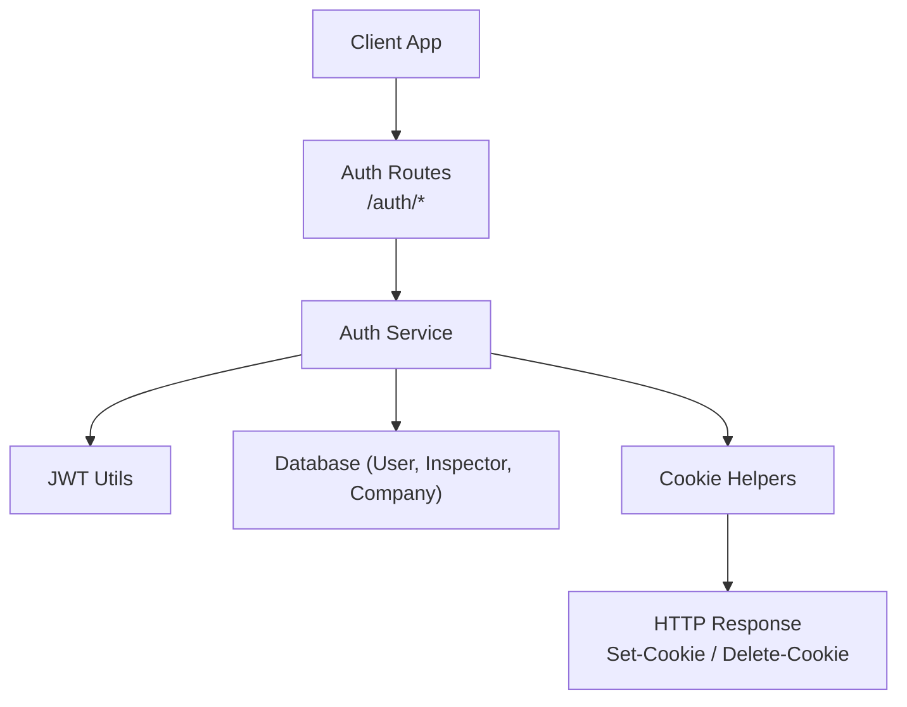
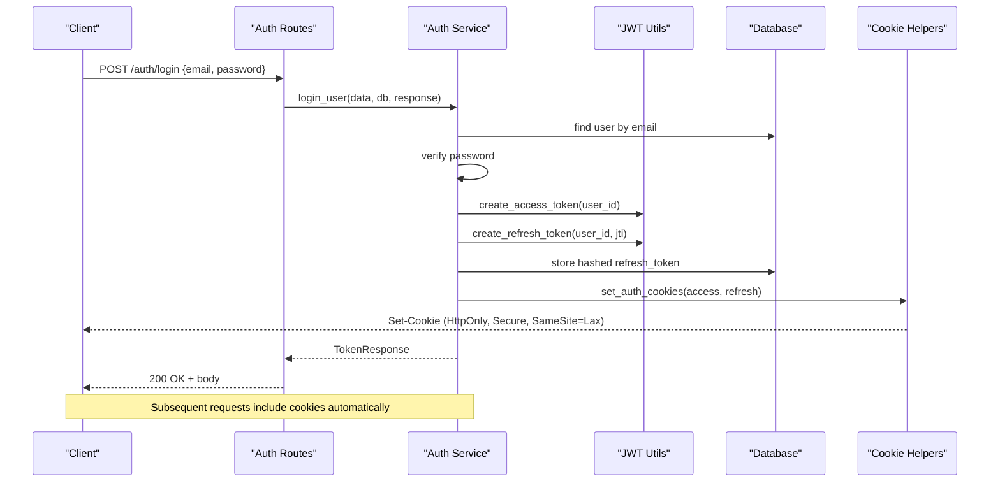
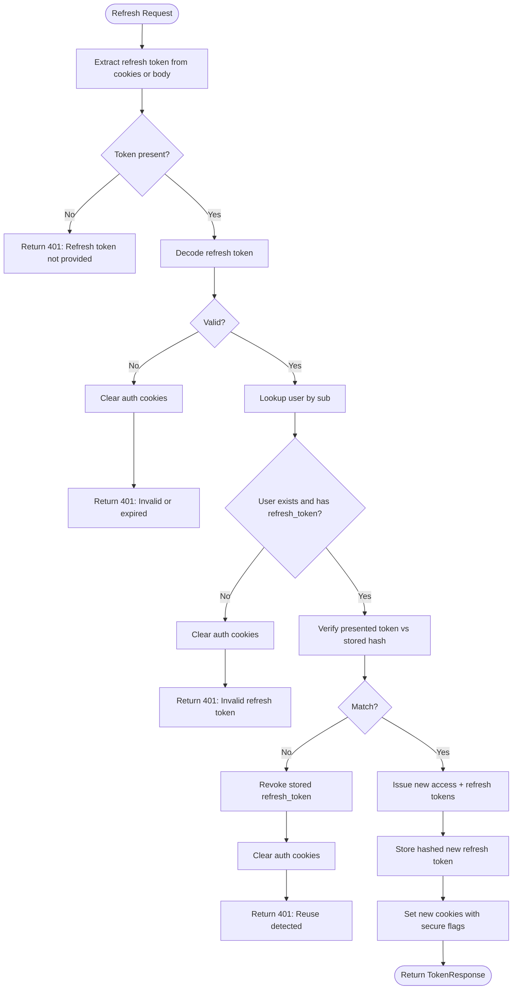
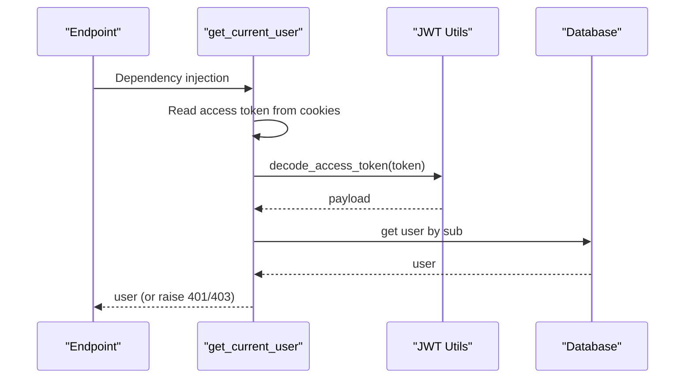
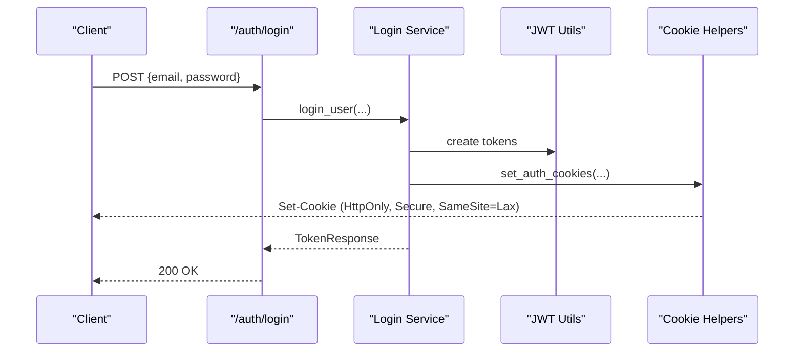
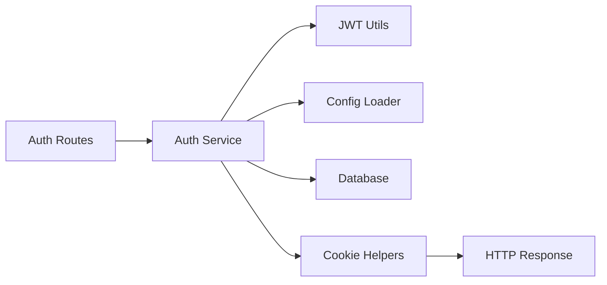

# Secure Cookie Management

<cite>
**Referenced Files in This Document**
- [cookie_helpers.py](file://app/utils/cookie_helpers.py)
- [auth_service.py](file://app/services/auth_service.py)
- [auth_routes.py](file://app/api/routes/auth_routes.py)
- [jwt_utils.py](file://app/utils/jwt_utils.py)
- [config_loader.py](file://app/utils/config_loader.py)
- [auth_dtos.py](file://app/api/dtos/auth_dtos.py)
</cite>

## Table of Contents
1. [Introduction](#introduction)
2. [Project Structure](#project-structure)
3. [Core Components](#core-components)
4. [Architecture Overview](#architecture-overview)
5. [Detailed Component Analysis](#detailed-component-analysis)
6. [Dependency Analysis](#dependency-analysis)
7. [Performance Considerations](#performance-considerations)
8. [Troubleshooting Guide](#troubleshooting-guide)
9. [Conclusion](#conclusion)
10. [Appendices](#appendices)

## Introduction
This document explains the secure cookie management implementation used to store and manage authentication tokens. It focuses on how refresh tokens are handled securely using HTTP-only, Secure, and SameSite flags; how cookies are created, validated, and deleted; and what security measures protect against XSS and CSRF attacks. It also covers configuration options for token lifetimes and outlines best practices for handling sensitive data in cookies.

## Project Structure
The cookie-based authentication flow spans several modules:
- API routes expose endpoints for login, logout, refresh, and protected resource access.
- Services implement business logic for user registration, authentication, token rotation, and session management.
- Utilities provide JWT creation/validation and centralized cookie helpers that enforce secure flags.
- Configuration loader provides secrets and expiry settings from environment variables.

**Diagram sources**
- [auth_routes.py:22-65](file://app/api/routes/auth_routes.py#L22-L65)
- [auth_service.py:59-226](file://app/services/auth_service.py#L59-L226)
- [jwt_utils.py:14-50](file://app/utils/jwt_utils.py#L14-L50)
- [cookie_helpers.py:12-41](file://app/utils/cookie_helpers.py#L12-L41)

**Section sources**
- [auth_routes.py:22-65](file://app/api/routes/auth_routes.py#L22-L65)
- [auth_service.py:59-226](file://app/services/auth_service.py#L59-L226)
- [jwt_utils.py:14-50](file://app/utils/jwt_utils.py#L14-L50)
- [cookie_helpers.py:12-41](file://app/utils/cookie_helpers.py#L12-L41)

## Core Components
- Cookie helpers: Centralized functions to set and delete auth cookies with secure flags and consistent scoping.
- Auth service: Implements login, logout, refresh token rotation, and current user extraction from cookies.
- JWT utilities: Create and decode access and refresh tokens with HS256 and configurable expirations.
- Configuration loader: Provides secrets and expiration durations from environment variables.
- DTOs: Define request/response schemas for authentication endpoints.

Key responsibilities:
- Enforce HttpOnly, Secure, and SameSite attributes on all cookies containing tokens.
- Store only hashed refresh tokens server-side; never persist raw tokens.
- Rotate refresh tokens on each use to limit exposure and detect reuse.
- Validate access tokens from cookies for protected routes via a dependency.

**Section sources**
- [cookie_helpers.py:12-41](file://app/utils/cookie_helpers.py#L12-L41)
- [auth_service.py:59-226](file://app/services/auth_service.py#L59-L226)
- [jwt_utils.py:14-50](file://app/utils/jwt_utils.py#L14-L50)
- [config_loader.py:24-43](file://app/utils/config_loader.py#L24-L43)
- [auth_dtos.py:7-39](file://app/api/dtos/auth_dtos.py#L7-L39)

## Architecture Overview
The authentication architecture uses short-lived access tokens and longer-lived refresh tokens. Access tokens are stored in HttpOnly cookies and validated per request. Refresh tokens are rotated on each use and their hashes are persisted server-side to enable revocation and detection of reuse.

**Diagram sources**
- [auth_routes.py:31-34](file://app/api/routes/auth_routes.py#L31-L34)
- [auth_service.py:59-99](file://app/services/auth_service.py#L59-L99)
- [jwt_utils.py:14-40](file://app/utils/jwt_utils.py#L14-L40)
- [cookie_helpers.py:12-35](file://app/utils/cookie_helpers.py#L12-L35)

## Detailed Component Analysis

### Cookie Creation, Validation, and Deletion
- Creation: On successful login, both access and refresh tokens are set as cookies with:
  - HttpOnly=True to prevent JavaScript access (XSS mitigation).
  - Secure=True to ensure transmission only over HTTPS.
  - SameSite="lax" to mitigate CSRF risks while allowing top-level navigations.
  - Path="/" to scope cookies across the application domain.
  - max_age derived from configured expirations for access and refresh tokens.
- Validation: Protected endpoints extract the access token from cookies and validate it via JWT decoding. If invalid or expired, an unauthorized error is returned.
- Deletion: Logout clears both cookies with matching flags to ensure proper removal across browsers.

Security implications:
- Storing only hashed refresh tokens prevents direct theft of long-lived credentials from the database.
- Rotation ensures each refresh token can be used once; reuse triggers revocation of all sessions.
- Using HttpOnly mitigates XSS-based token theft.
- Using Secure enforces HTTPS-only transport.
- SameSite="lax" reduces CSRF risk while preserving usability for top-level navigations.

**Section sources**
- [cookie_helpers.py:12-41](file://app/utils/cookie_helpers.py#L12-L41)
- [auth_service.py:59-113](file://app/services/auth_service.py#L59-L113)
- [auth_service.py:118-190](file://app/services/auth_service.py#L118-L190)
- [auth_service.py:195-226](file://app/services/auth_service.py#L195-L226)

### Refresh Token Rotation Flow
Refresh token rotation strengthens security by issuing new tokens on each refresh and invalidating the previous one. The flow includes:
- Extracting refresh token from cookies (with fallback to body for flexibility).
- Decoding and validating the refresh token.
- Verifying the presented token matches the stored hash; mismatches indicate potential theft and trigger full revocation.
- Issuing a new access and refresh token pair and updating the stored hash.
- Setting new cookies with secure flags.

**Diagram sources**
- [auth_service.py:118-190](file://app/services/auth_service.py#L118-L190)

**Section sources**
- [auth_service.py:118-190](file://app/services/auth_service.py#L118-L190)

### Current User Extraction from Cookies
Protected endpoints rely on a dependency that:
- Reads the access token from cookies.
- Decodes and validates the token.
- Retrieves the user from the database and checks account status.
- Returns the authenticated user or raises appropriate errors.

**Diagram sources**
- [auth_service.py:195-226](file://app/services/auth_service.py#L195-L226)
- [jwt_utils.py:43-45](file://app/utils/jwt_utils.py#L43-L45)

**Section sources**
- [auth_service.py:195-226](file://app/services/auth_service.py#L195-L226)

### Security Measures Against XSS and CSRF
- XSS Mitigation:
  - HttpOnly cookies prevent client-side scripts from reading tokens.
  - Tokens are not exposed in responses beyond Set-Cookie headers.
- CSRF Mitigation:
  - SameSite="lax" restricts cross-site requests while allowing safe top-level navigations.
  - For stricter protection, consider upgrading to SameSite="strict" or implementing additional CSRF defenses for state-changing operations if needed.
- Transport Security:
  - Secure flag ensures cookies are sent only over HTTPS.
- Token Storage:
  - Only hashed refresh tokens are stored server-side; raw tokens are never persisted.
- Rotation and Revocation:
  - Each refresh token is single-use; reuse triggers revocation of all sessions.

**Section sources**
- [cookie_helpers.py:12-41](file://app/utils/cookie_helpers.py#L12-L41)
- [auth_service.py:118-190](file://app/services/auth_service.py#L118-L190)

### Configuration Options for Cookie Settings
- Expiration:
  - ACCESS_TOKEN_EXPIRY: Controls access token lifetime (parsed into seconds).
  - REFRESH_TOKEN_EXPIRY: Controls refresh token lifetime (parsed into seconds).
- Secrets:
  - ACCESS_TOKEN_SECRET: Secret used to sign access tokens.
  - REFRESH_TOKEN_SECRET: Secret used to sign refresh tokens.
- Cookie Flags:
  - HttpOnly, Secure, SameSite, and path are enforced centrally in cookie helpers.
- Domain Restrictions:
  - No explicit domain restriction is set in cookie helpers; cookies default to the current host. To restrict to a specific domain, configure the framework’s cookie domain setting at the application level.
- Path Scoping:
  - Cookies are scoped to "/" to be available across the entire application.

To adjust behavior:
- Modify environment variables for token lifetimes and secrets.
- Update cookie helper functions to add domain restrictions or change SameSite policy if required.

**Section sources**
- [config_loader.py:24-43](file://app/utils/config_loader.py#L24-L43)
- [cookie_helpers.py:12-41](file://app/utils/cookie_helpers.py#L12-L41)

### Examples of Cookie-Based Authentication Flows
- Login:
  - Client sends credentials to /auth/login.
  - Server authenticates, issues tokens, stores hashed refresh token, sets secure cookies, and returns expiration times.
- Protected Resource Access:
  - Client calls protected endpoints; server extracts access token from cookies, validates it, and authorizes the request.
- Refresh:
  - Client calls /auth/refresh; server rotates refresh token, updates stored hash, sets new cookies, and returns new expiration times.
- Logout:
  - Client calls /auth/logout; server revokes refresh token and clears cookies.

**Diagram sources**
- [auth_routes.py:31-34](file://app/api/routes/auth_routes.py#L31-L34)
- [auth_service.py:59-99](file://app/services/auth_service.py#L59-L99)
- [jwt_utils.py:14-40](file://app/utils/jwt_utils.py#L14-L40)
- [cookie_helpers.py:12-35](file://app/utils/cookie_helpers.py#L12-L35)

**Section sources**
- [auth_routes.py:25-65](file://app/api/routes/auth_routes.py#L25-L65)
- [auth_service.py:59-113](file://app/services/auth_service.py#L59-L113)

## Dependency Analysis
The following diagram shows key dependencies among components involved in secure cookie management:

**Diagram sources**
- [auth_routes.py:22-65](file://app/api/routes/auth_routes.py#L22-L65)
- [auth_service.py:59-226](file://app/services/auth_service.py#L59-L226)
- [jwt_utils.py:14-50](file://app/utils/jwt_utils.py#L14-L50)
- [config_loader.py:24-43](file://app/utils/config_loader.py#L24-L43)
- [cookie_helpers.py:12-41](file://app/utils/cookie_helpers.py#L12-L41)

**Section sources**
- [auth_routes.py:22-65](file://app/api/routes/auth_routes.py#L22-L65)
- [auth_service.py:59-226](file://app/services/auth_service.py#L59-L226)
- [jwt_utils.py:14-50](file://app/utils/jwt_utils.py#L14-L50)
- [config_loader.py:24-43](file://app/utils/config_loader.py#L24-L43)
- [cookie_helpers.py:12-41](file://app/utils/cookie_helpers.py#L12-L41)

## Performance Considerations
- Short-lived access tokens reduce the window of exposure and minimize validation overhead on the server.
- Refresh token rotation adds minimal overhead but significantly improves security by limiting token reuse.
- Database lookups occur during login and refresh flows; ensure indexes on user identifiers and efficient queries.
- Avoid unnecessary logging of tokens or sensitive payloads to prevent accidental exposure.

[No sources needed since this section provides general guidance]

## Troubleshooting Guide
Common issues and resolutions:
- Missing cookies:
  - Ensure the client sends requests over HTTPS when Secure cookies are enabled.
  - Verify browser settings allow cookies and that SameSite policy does not block cross-site requests.
- Invalid or expired tokens:
  - Check ACCESS_TOKEN_EXPIRY and REFRESH_TOKEN_EXPIRY configurations.
  - Confirm that refresh token rotation is functioning and that clients handle new cookies after refresh.
- Account deactivated:
  - Review user status checks in authentication flows; inactive accounts will be rejected.
- Token reuse detected:
  - Indicates possible token theft; sessions are revoked. Clients should re-authenticate.

Operational tips:
- Monitor error responses for 401/403 statuses and correlate with logs for failed validations.
- Use clear error messages without leaking sensitive details.

**Section sources**
- [auth_service.py:59-113](file://app/services/auth_service.py#L59-L113)
- [auth_service.py:118-190](file://app/services/auth_service.py#L118-L190)
- [auth_service.py:195-226](file://app/services/auth_service.py#L195-L226)

## Conclusion
The implementation provides a robust, secure approach to cookie-based authentication:
- Tokens are stored in HttpOnly, Secure cookies with SameSite controls to mitigate XSS and CSRF risks.
- Refresh tokens are rotated and hashed server-side to prevent reuse and enable revocation.
- Configuration-driven expirations and secrets centralize security policies.
- Clear separation of concerns between routes, services, utilities, and configuration supports maintainability and testing.

Best practices reinforced:
- Always use HTTPS with Secure cookies.
- Keep access tokens short-lived and rotate refresh tokens frequently.
- Never log or store raw tokens; store hashes server-side.
- Apply strict SameSite policies where appropriate and review domain/path scoping based on deployment needs.

[No sources needed since this section summarizes without analyzing specific files]

## Appendices

### API Endpoints Summary
- POST /auth/register: Create a new user account.
- POST /auth/login: Authenticate and receive tokens via secure cookies.
- POST /auth/refresh: Rotate refresh token and receive new tokens via secure cookies.
- POST /auth/logout: Revoke refresh token and clear cookies.
- GET /auth/me: Access protected user info using access token from cookies.

**Section sources**
- [auth_routes.py:25-65](file://app/api/routes/auth_routes.py#L25-L65)
- [auth_dtos.py:7-39](file://app/api/dtos/auth_dtos.py#L7-L39)

### Configuration Variables
- ACCESS_TOKEN_SECRET: Secret for signing access tokens.
- REFRESH_TOKEN_SECRET: Secret for signing refresh tokens.
- ACCESS_TOKEN_EXPIRY: Duration string (e.g., "15m") parsed into seconds.
- REFRESH_TOKEN_EXPIRY: Duration string (e.g., "10d") parsed into seconds.

**Section sources**
- [config_loader.py:24-43](file://app/utils/config_loader.py#L24-L43)