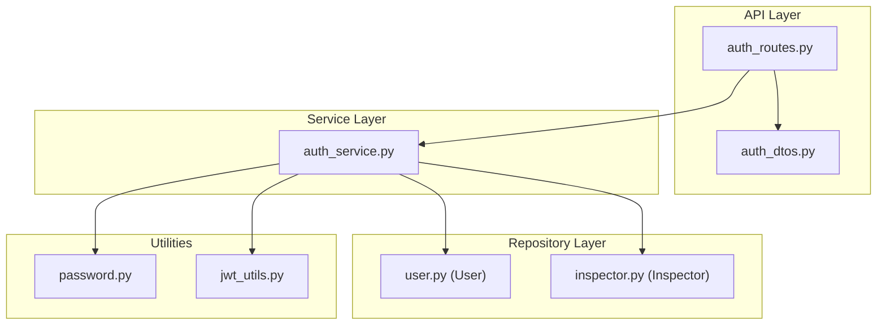
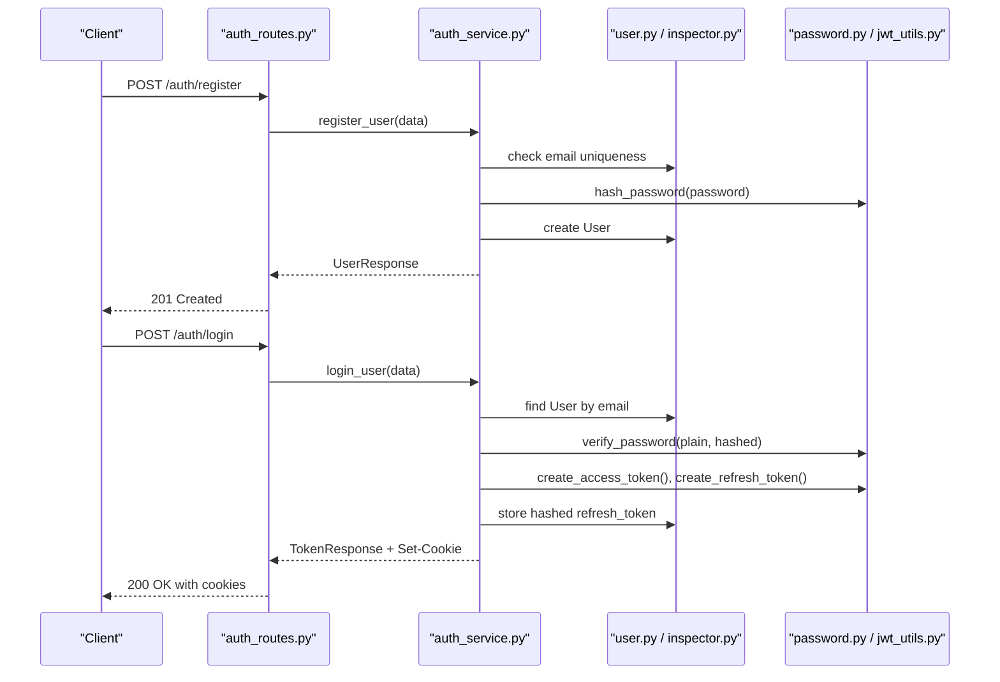
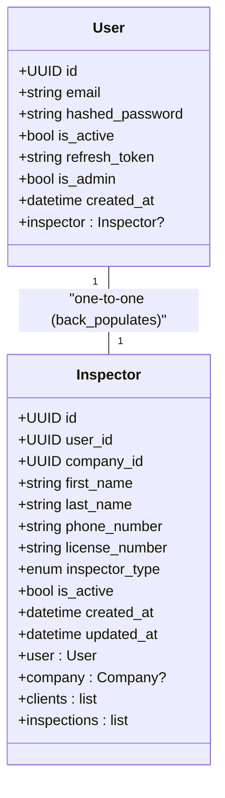
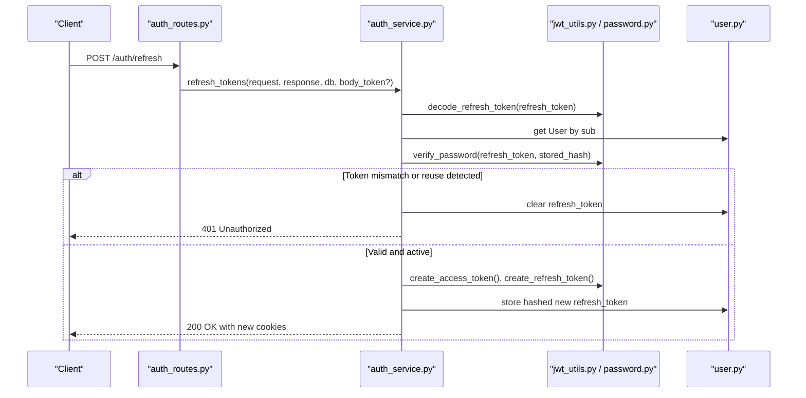
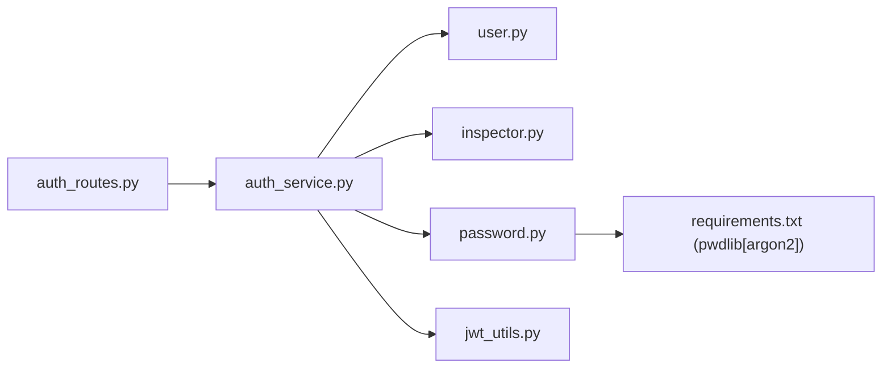

# User Model & Password Security

<cite>
**Referenced Files in This Document**
- [user.py](file://app/repository/user.py)
- [inspector.py](file://app/repository/inspector.py)
- [password.py](file://app/utils/password.py)
- [auth_service.py](file://app/services/auth_service.py)
- [auth_routes.py](file://app/api/routes/auth_routes.py)
- [auth_dtos.py](file://app/api/dtos/auth_dtos.py)
- [jwt_utils.py](file://app/utils/jwt_utils.py)
- [requirements.txt](file://requirements.txt)
</cite>

## Table of Contents
1. Introduction
2. Project Structure
3. Core Components
4. Architecture Overview
5. Detailed Component Analysis
6. Dependency Analysis
7. Performance Considerations
8. Troubleshooting Guide
9. Conclusion

## Introduction
This document explains the user model and password security implementation in the application. It covers the User entity structure, its relationship with inspectors, account status management, and the password hashing workflow using Argon2 via the pwdlib library. It also documents user registration validation, password strength requirements, account lifecycle management, and provides examples of user CRUD operations, password update workflows, and security considerations for protecting user data.

## Project Structure
The user and authentication features are implemented across repository models, services, API routes, DTOs, and utilities:
- Repository layer defines the User and Inspector entities and their relationships.
- Services implement business logic for registration, login, logout, token refresh, and current user resolution.
- API routes expose endpoints for authentication flows.
- DTOs define request/response schemas and validation rules.
- Utilities provide password hashing and JWT handling.

**Diagram sources**
- [auth_routes.py:1-65](file://app/api/routes/auth_routes.py#L1-L65)
- [auth_service.py:1-268](file://app/services/auth_service.py#L1-L268)
- [user.py:10-54](file://app/repository/user.py#L10-L54)
- [inspector.py:18-82](file://app/repository/inspector.py#L18-L82)
- [password.py:1-12](file://app/utils/password.py#L1-L12)
- [jwt_utils.py:1-51](file://app/utils/jwt_utils.py#L1-L51)

**Section sources**
- [auth_routes.py:1-65](file://app/api/routes/auth_routes.py#L1-L65)
- [auth_service.py:1-268](file://app/services/auth_service.py#L1-L268)
- [user.py:10-54](file://app/repository/user.py#L10-L54)
- [inspector.py:18-82](file://app/repository/inspector.py#L18-L82)
- [password.py:1-12](file://app/utils/password.py#L1-L12)
- [jwt_utils.py:1-51](file://app/utils/jwt_utils.py#L1-L51)

## Core Components
- User entity: stores identity, credentials, role flags, session tokens, timestamps, and a one-to-one relationship to Inspector.
- Inspector entity: represents a professional profile linked to a single User, with company association and activity flags.
- Password utilities: use pwdlib’s recommended hasher (Argon2) for secure hashing and verification.
- Auth service: implements registration, login, logout, token refresh, and current user retrieval with proper error handling and cookie-based sessions.
- API routes: expose REST endpoints for authentication and user info retrieval.
- DTOs: validate inputs and define responses for auth flows.

Key responsibilities:
- Registration validates email uniqueness and enforces password length constraints.
- Login verifies credentials, checks account activation, issues access and refresh tokens, and stores a hashed refresh token.
- Logout revokes refresh tokens and clears cookies.
- Token refresh rotates refresh tokens securely and invalidates reused tokens.
- Current user dependency decodes access tokens from cookies and ensures the account is active.

**Section sources**
- [user.py:10-54](file://app/repository/user.py#L10-L54)
- [inspector.py:18-82](file://app/repository/inspector.py#L18-L82)
- [password.py:1-12](file://app/utils/password.py#L1-L12)
- [auth_service.py:36-268](file://app/services/auth_service.py#L36-L268)
- [auth_routes.py:22-65](file://app/api/routes/auth_routes.py#L22-L65)
- [auth_dtos.py:7-39](file://app/api/dtos/auth_dtos.py#L7-L39)

## Architecture Overview
The authentication flow uses FastAPI routes that delegate to services, which interact with repositories and utilities. Passwords are never stored in plaintext; they are hashed using Argon2. Tokens are issued as JWTs and delivered via secure cookies. Refresh tokens are rotated and stored as hashes to detect reuse or theft.

**Diagram sources**
- [auth_routes.py:25-34](file://app/api/routes/auth_routes.py#L25-L34)
- [auth_service.py:36-99](file://app/services/auth_service.py#L36-L99)
- [password.py:6-11](file://app/utils/password.py#L6-L11)
- [jwt_utils.py:14-40](file://app/utils/jwt_utils.py#L14-L40)
- [user.py:10-54](file://app/repository/user.py#L10-L54)

## Detailed Component Analysis

### User Entity and Relationships
- Fields include unique email, hashed password, activation flag, optional refresh token, admin flag, and creation timestamp.
- One-to-one relationship to Inspector via back_populates, enabling cascade deletion when the user is removed.
- The User model serves as the central identity for authentication and authorization.

**Diagram sources**
- [user.py:10-54](file://app/repository/user.py#L10-L54)
- [inspector.py:18-82](file://app/repository/inspector.py#L18-L82)

**Section sources**
- [user.py:10-54](file://app/repository/user.py#L10-L54)
- [inspector.py:18-82](file://app/repository/inspector.py#L18-L82)

### Password Hashing with Argon2 via pwdlib
- Uses pwdlib’s recommended hasher, which configures Argon2 parameters suitable for modern security needs.
- Provides functions to hash passwords and verify plain text against stored hashes.
- Dependencies include pwdlib[argon2] ensuring Argon2 support.

Security notes:
- Salts are generated automatically by the hasher during hashing.
- Verification is constant-time resistant and handles algorithm upgrades transparently.

**Section sources**
- [password.py:1-12](file://app/utils/password.py#L1-L12)
- [requirements.txt:10](file://requirements.txt#L10)

### User Registration Validation and Account Lifecycle
- Registration validates email format and uniqueness, enforces password length constraints, and creates an active user by default.
- Account lifecycle includes activation checks during login and token refresh, and deactivation prevents further access.

Validation details:
- Email must be a valid email address.
- Password must meet minimum length requirements defined in the DTO.

Lifecycle controls:
- is_active flag gates login and token refresh.
- Admin flag exists but is not enforced in the analyzed code paths.

**Section sources**
- [auth_dtos.py:7-15](file://app/api/dtos/auth_dtos.py#L7-L15)
- [auth_service.py:36-55](file://app/services/auth_service.py#L36-L55)
- [auth_service.py:59-99](file://app/services/auth_service.py#L59-L99)
- [auth_service.py:116-188](file://app/services/auth_service.py#L116-L188)

### Authentication Flows: Login, Logout, and Token Refresh
- Login:
  - Verifies credentials and account activation.
  - Issues access and refresh tokens.
  - Stores a hashed refresh token in the database.
  - Sets access and refresh tokens in secure cookies.
- Logout:
  - Revokes the refresh token by clearing it from the database.
  - Clears authentication cookies.
- Token Refresh:
  - Validates the refresh token from cookies or body.
  - Decodes the JWT and checks existence and activity of the user.
  - Verifies the presented refresh token matches the stored hash; on mismatch, revokes all sessions.
  - Rotates tokens by issuing new pairs and storing the new hashed refresh token.

**Diagram sources**
- [auth_routes.py:47-58](file://app/api/routes/auth_routes.py#L47-L58)
- [auth_service.py:116-188](file://app/services/auth_service.py#L116-L188)
- [jwt_utils.py:28-40](file://app/utils/jwt_utils.py#L28-L40)
- [password.py:10-11](file://app/utils/password.py#L10-L11)
- [user.py:10-54](file://app/repository/user.py#L10-L54)

**Section sources**
- [auth_service.py:59-99](file://app/services/auth_service.py#L59-L99)
- [auth_service.py:103-112](file://app/services/auth_service.py#L103-L112)
- [auth_service.py:116-188](file://app/services/auth_service.py#L116-L188)
- [auth_routes.py:31-58](file://app/api/routes/auth_routes.py#L31-L58)

### Current User Resolution and Authorization
- get_current_user extracts the access token from cookies, decodes it, retrieves the user, and ensures the account is active.
- get_current_inspector resolves the Inspector profile associated with the current user.
- require_company_owner ensures the current user is the owner of a company through the inspector relationship.

These dependencies enable protected endpoints to enforce authentication and role-based access.

**Section sources**
- [auth_service.py:193-268](file://app/services/auth_service.py#L193-L268)

### Example Workflows

#### User Registration
- Endpoint: POST /auth/register
- Input validation: email format and password length constraints.
- Process: check uniqueness, hash password, create user, return user info.

**Section sources**
- [auth_routes.py:25-28](file://app/api/routes/auth_routes.py#L25-L28)
- [auth_service.py:36-55](file://app/services/auth_service.py#L36-L55)
- [auth_dtos.py:7-15](file://app/api/dtos/auth_dtos.py#L7-L15)

#### User Login
- Endpoint: POST /auth/login
- Process: authenticate, check activation, issue tokens, set cookies.

**Section sources**
- [auth_routes.py:31-34](file://app/api/routes/auth_routes.py#L31-L34)
- [auth_service.py:59-99](file://app/services/auth_service.py#L59-L99)

#### User Logout
- Endpoint: POST /auth/logout
- Process: revoke refresh token, clear cookies.

**Section sources**
- [auth_routes.py:37-44](file://app/api/routes/auth_routes.py#L37-L44)
- [auth_service.py:103-112](file://app/services/auth_service.py#L103-L112)

#### Refresh Tokens
- Endpoint: POST /auth/refresh
- Process: validate refresh token, rotate tokens, handle reuse detection.

**Section sources**
- [auth_routes.py:47-58](file://app/api/routes/auth_routes.py#L47-L58)
- [auth_service.py:116-188](file://app/services/auth_service.py#L116-L188)

#### Get Current User
- Endpoint: GET /auth/me
- Process: resolve current user from access token cookie.

**Section sources**
- [auth_routes.py:61-64](file://app/api/routes/auth_routes.py#L61-L64)
- [auth_service.py:193-224](file://app/services/auth_service.py#L193-L224)

### Password Update Workflow
- While no explicit “update password” endpoint is present in the analyzed routes, the pattern for updating a password would follow:
  - Validate new password strength via DTO constraints.
  - Hash the new password using the same utility.
  - Persist the updated hashed password.
  - Optionally invalidate existing sessions by revoking refresh tokens.

Recommendation:
- Implement a dedicated endpoint that requires re-authentication and enforces strong password policies before persisting changes.

[No sources needed since this section proposes a workflow not explicitly implemented in the analyzed files]

## Dependency Analysis
- Authentication routes depend on services for business logic.
- Services depend on repositories for data access and utilities for cryptographic operations.
- Password hashing depends on pwdlib configured with Argon2.
- JWT utilities depend on configuration for secrets and expiry durations.

**Diagram sources**
- [auth_routes.py:1-65](file://app/api/routes/auth_routes.py#L1-L65)
- [auth_service.py:1-268](file://app/services/auth_service.py#L1-L268)
- [user.py:10-54](file://app/repository/user.py#L10-L54)
- [inspector.py:18-82](file://app/repository/inspector.py#L18-L82)
- [password.py:1-12](file://app/utils/password.py#L1-L12)
- [jwt_utils.py:1-51](file://app/utils/jwt_utils.py#L1-L51)
- [requirements.txt:10](file://requirements.txt#L10)

**Section sources**
- [auth_routes.py:1-65](file://app/api/routes/auth_routes.py#L1-L65)
- [auth_service.py:1-268](file://app/services/auth_service.py#L1-L268)
- [password.py:1-12](file://app/utils/password.py#L1-L12)
- [jwt_utils.py:1-51](file://app/utils/jwt_utils.py#L1-L51)
- [requirements.txt:10](file://requirements.txt#L10)

## Performance Considerations
- Password hashing uses Argon2, which is intentionally CPU-intensive to resist brute-force attacks. Ensure appropriate server resources and consider rate limiting on authentication endpoints.
- Token rotation reduces the window of exposure for stolen refresh tokens; ensure efficient DB queries and minimal round-trips during refresh.
- Use connection pooling and indexing for frequently queried fields like email and user IDs to optimize lookup performance.

[No sources needed since this section provides general guidance]

## Troubleshooting Guide
Common issues and resolutions:
- Invalid credentials:
  - Occurs when email is not found or password does not match the stored hash.
  - Check input formatting and ensure correct password entry.
- Account deactivated:
  - Occurs when attempting to log in or refresh tokens with an inactive account.
  - Reactivate the account via administrative processes.
- Refresh token reuse detected:
  - Indicates potential token theft; all sessions are revoked for safety.
  - Re-authenticate to obtain fresh tokens.
- Not authenticated:
  - Missing or invalid access token in cookies.
  - Ensure cookies are properly set and not blocked by browser settings.

**Section sources**
- [auth_service.py:59-99](file://app/services/auth_service.py#L59-L99)
- [auth_service.py:116-188](file://app/services/auth_service.py#L116-L188)
- [auth_service.py:193-224](file://app/services/auth_service.py#L193-L224)

## Conclusion
The application implements a robust user model and secure authentication system. The User entity integrates with Inspector profiles and supports account lifecycle management through activation flags. Passwords are secured using Argon2 via pwdlib, with automatic salt generation and safe verification. Authentication flows include registration, login, logout, and secure token rotation with reuse detection. Proper validation, error handling, and cookie-based sessions protect user data and maintain security posture. For password updates, adopt the established hashing pattern and enforce strong policies while considering session invalidation for enhanced protection.