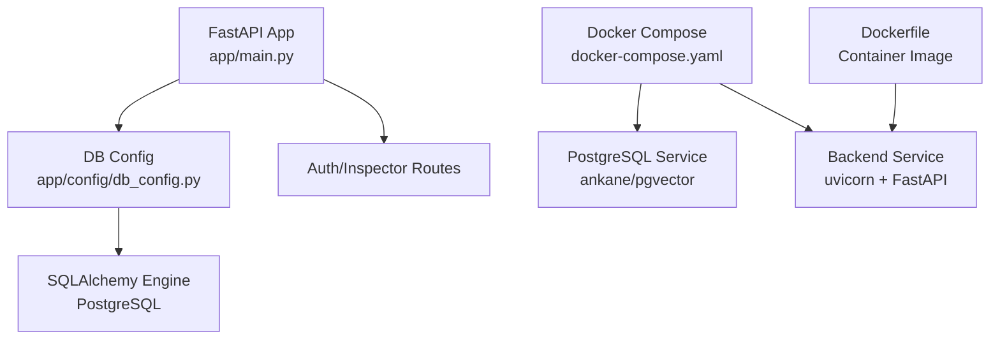
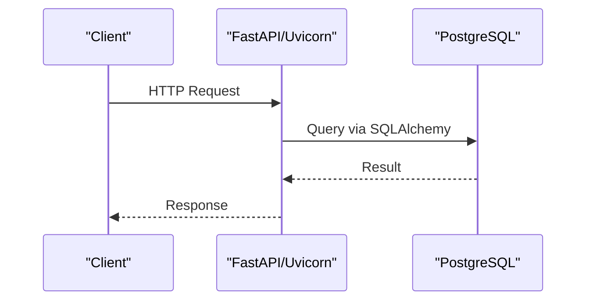
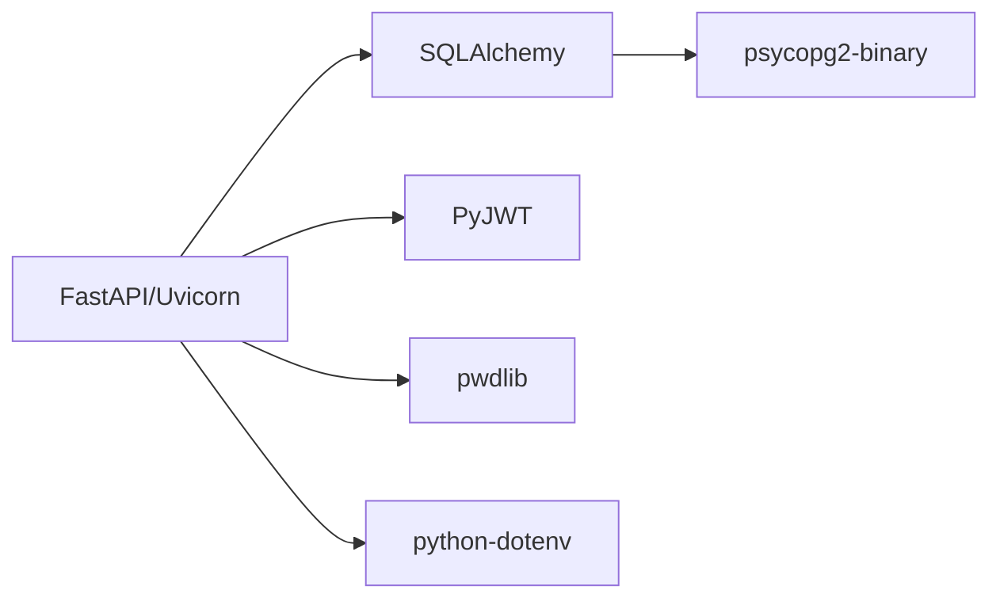

# Configuration & Deployment

<cite>
**Referenced Files in This Document**
- [Dockerfile](file://Dockerfile)
- [docker-compose.yaml](file://docker-compose.yaml)
- [requirements.txt](file://requirements.txt)
- [README.md](file://README.md)
- [app/main.py](file://app/main.py)
- [app/config/db_config.py](file://app/config/db_config.py)
- [app/utils/config_loader.py](file://app/utils/config_loader.py)
- [app/repository/base.py](file://app/repository/base.py)
- [.dockerignore](file://.dockerignore)
- [.gitignore](file://.gitignore)
</cite>

## Table of Contents
1. [Introduction](#introduction)
2. [Project Structure](#project-structure)
3. [Core Components](#core-components)
4. [Architecture Overview](#architecture-overview)
5. [Detailed Component Analysis](#detailed-component-analysis)
6. [Dependency Analysis](#dependency-analysis)
7. [Performance Considerations](#performance-considerations)
8. [Troubleshooting Guide](#troubleshooting-guide)
9. [Conclusion](#conclusion)
10. [Appendices](#appendices)

## Introduction
This document explains how to configure and deploy the application, focusing on environment variables, database connection settings, application parameters, Docker containerization, docker-compose orchestration, and production considerations. It also covers security best practices for sensitive configuration, environment-specific setups, scaling, monitoring, operational maintenance, troubleshooting, and performance optimization tips.

## Project Structure
The project is a FastAPI application with a PostgreSQL database (pgvector-enabled). The runtime is containerized using Docker and orchestrated via docker-compose. Environment variables are loaded from an .env file within the app directory when running locally or passed directly into containers during orchestration.

**Diagram sources**
- [app/main.py:1-30](file://app/main.py#L1-L30)
- [app/config/db_config.py:1-26](file://app/config/db_config.py#L1-L26)
- [docker-compose.yaml:1-48](file://docker-compose.yaml#L1-L48)
- [Dockerfile:1-13](file://Dockerfile#L1-L13)

**Section sources**
- [README.md:66-73](file://README.md#L66-L73)
- [README.md:182-214](file://README.md#L182-L214)

## Core Components
- Application entrypoint initializes the FastAPI app, creates tables at startup, and includes API routers.
- Database configuration loads the DATABASE_URL from environment, creates a SQLAlchemy engine and session factory, and provides a dependency for request-scoped sessions.
- Configuration loader centralizes access token secrets and expiry parsing for JWT-based authentication.
- Container image builds a Python 3.11 slim image, installs dependencies, and runs Uvicorn on port 8000.
- docker-compose defines a PostgreSQL service and a backend service that depends on the database being healthy before starting.

**Section sources**
- [app/main.py:11-21](file://app/main.py#L11-L21)
- [app/config/db_config.py:1-26](file://app/config/db_config.py#L1-L26)
- [app/utils/config_loader.py:1-44](file://app/utils/config_loader.py#L1-L44)
- [Dockerfile:1-13](file://Dockerfile#L1-L13)
- [docker-compose.yaml:1-48](file://docker-compose.yaml#L1-L48)

## Architecture Overview
The system consists of two primary services:
- Backend: FastAPI app served by Uvicorn inside a container.
- Database: PostgreSQL with pgvector extension managed as a separate container.

The backend connects to the database using a connection string provided via environment variables. Tables are created at application startup.

**Diagram sources**
- [app/main.py:11-21](file://app/main.py#L1-L21)
- [app/config/db_config.py:16-26](file://app/config/db_config.py#L16-L26)
- [docker-compose.yaml:22-40](file://docker-compose.yaml#L22-L40)

## Detailed Component Analysis

### Environment Variables and Configuration
- DATABASE_URL: Required for connecting to PostgreSQL. Loaded by db_config and used to create the SQLAlchemy engine.
- ACCESS_TOKEN_SECRET and REFRESH_TOKEN_SECRET: Used by authentication utilities; must be set for secure token signing.
- ACCESS_TOKEN_EXPIRY and REFRESH_TOKEN_EXPIRY: Expiry durations parsed into seconds for token lifetimes.
- Local development uses an .env file under app/.env; Docker Compose injects environment variables directly into the backend service.

Best practices:
- Never commit secrets to version control; ensure .env files are ignored by both .gitignore and .dockerignore.
- Use strong, unique secrets per environment.
- Pin versions for deterministic builds where applicable.

Security considerations:
- Store secrets in a secure secret manager in production (e.g., cloud provider secret stores) and inject them at runtime.
- Restrict network access to the database service to the backend only.
- Avoid logging sensitive values.

Environment-specific configurations:
- Development: Use local ports and default credentials for convenience.
- Staging/Production: Use external managed databases, non-default ports, strong secrets, and proper networking.

Operational notes:
- Ensure DATABASE_URL points to the correct host/port depending on deployment target.
- Validate token expiry formats (e.g., 15m, 10d) to avoid runtime errors.

**Section sources**
- [app/config/db_config.py:11-18](file://app/config/db_config.py#L11-L18)
- [app/utils/config_loader.py:24-43](file://app/utils/config_loader.py#L24-L43)
- [docker-compose.yaml:33-38](file://docker-compose.yaml#L33-L38)
- [.gitignore:1-18](file://.gitignore#L1-L18)
- [.dockerignore:1-17](file://.dockerignore#L1-L17)
- [README.md:170-179](file://README.md#L170-L179)

### Database Connection Settings
- The application uses SQLAlchemy with a connection string (DATABASE_URL).
- On startup, the application creates all mapped tables based on the ORM models.
- Sessions are created per request and closed afterward to manage resources efficiently.

Scaling considerations:
- For high concurrency, consider tuning database connection pool sizes and timeouts if you extend configuration beyond the defaults.
- Use a managed PostgreSQL service with appropriate instance sizing and backups enabled.

Monitoring:
- Enable query logging at the database level in production to diagnose slow queries.
- Monitor connection counts and pool utilization.

**Section sources**
- [app/config/db_config.py:16-26](file://app/config/db_config.py#L16-L26)
- [app/main.py:11-15](file://app/main.py#L11-L15)
- [app/repository/base.py:1-5](file://app/repository/base.py#L1-L5)

### Application Parameters
- Server binding: Host 0.0.0.0 and port 8000 exposed by the container.
- Auto table creation occurs during application lifespan initialization.
- Routers for authentication and inspector features are included at startup.

Operational tips:
- In production, run behind a reverse proxy (e.g., Nginx, Traefik) and disable reload mode.
- Ensure health checks are configured at the orchestrator level to restart unhealthy instances.

**Section sources**
- [Dockerfile:11-13](file://Dockerfile#L11-L13)
- [app/main.py:18-26](file://app/main.py#L18-L26)

### Docker Containerization Setup
- Base image: python:3.11-slim.
- Installs requirements and copies application code.
- Exposes port 8000 and runs Uvicorn with the FastAPI app.

Build and run:
- Build the image using the provided Dockerfile.
- Run the container with environment variables injected via docker-compose or CLI.

Optimization:
- Multi-stage builds can reduce image size further by separating build and runtime stages.
- Pin exact versions in requirements.txt for reproducibility.

**Section sources**
- [Dockerfile:1-13](file://Dockerfile#L1-L13)
- [requirements.txt:1-11](file://requirements.txt#L1-L11)

### Docker Compose Orchestration
Services:
- db: PostgreSQL with pgvector, persistent volume, healthcheck, and internal networking.
- backend: FastAPI app built from Dockerfile, depends on db being healthy, exposes port 8000, and receives environment variables for secrets and database connectivity.

Networking and persistence:
- Internal bridge network isolates services.
- Named volume persists database data across container restarts.

Health and readiness:
- Healthcheck ensures the database is ready before the backend starts.

**Section sources**
- [docker-compose.yaml:1-48](file://docker-compose.yaml#L1-L48)

### Production Deployment Considerations
- Secrets management: Replace inline secrets in docker-compose with environment-specific secret injection mechanisms.
- Externalize the database: Use a managed PostgreSQL service with SSL enforced and restricted network access.
- Reverse proxy: Terminate TLS at a reverse proxy and forward to the backend over localhost or internal network.
- Logging: Centralize logs (e.g., stdout/stderr) and ship to a log aggregation service.
- Backups: Configure automated database backups and retention policies.
- Scaling: Scale backend horizontally behind a load balancer; ensure stateless design and shared storage if needed.
- Monitoring: Add metrics endpoints and integrate with observability tools.

**Section sources**
- [docker-compose.yaml:22-40](file://docker-compose.yaml#L22-L40)
- [README.md:170-179](file://README.md#L170-L179)

### Security Considerations for Sensitive Settings
- Do not commit secrets; rely on environment variables or secret managers.
- Rotate secrets regularly and use strong, unique values per environment.
- Enforce least privilege for database users and restrict network access.
- Validate input and sanitize outputs to prevent injection attacks.
- Use HTTPS everywhere in production.

**Section sources**
- [app/utils/config_loader.py:24-35](file://app/utils/config_loader.py#L24-L35)
- [.gitignore:1-18](file://.gitignore#L1-L18)
- [.dockerignore:1-17](file://.dockerignore#L1-L17)

### Environment-Specific Configurations
- Development: Use local database with convenient credentials and enable debug features like auto-reload.
- Staging: Mirror production settings with less restrictive controls for testing.
- Production: Harden security, enforce SSL, use managed services, and implement robust monitoring and alerting.

**Section sources**
- [README.md:170-179](file://README.md#L170-L179)
- [docker-compose.yaml:33-38](file://docker-compose.yaml#L33-L38)

### Scaling Considerations
- Horizontal scaling: Run multiple backend replicas behind a load balancer.
- Database scaling: Use read replicas for read-heavy workloads and tune connection pools.
- Caching: Introduce caching layers for frequently accessed data.
- Queue processing: Offload long-running tasks (e.g., transcription) to background workers.

[No sources needed since this section provides general guidance]

### Monitoring Setup
- Metrics: Expose application metrics and collect database metrics.
- Logging: Aggregate structured logs from the backend and database.
- Alerts: Set alerts for error rates, latency spikes, and resource exhaustion.
- Health checks: Implement liveness and readiness probes at the orchestrator level.

[No sources needed since this section provides general guidance]

### Operational Maintenance Tasks
- Regularly update base images and dependencies to patch vulnerabilities.
- Rotate secrets and database credentials periodically.
- Perform routine backups and test restore procedures.
- Review and prune unused volumes and images.
- Monitor disk usage and database growth.

[No sources needed since this section provides general guidance]

## Dependency Analysis
The application depends on:
- FastAPI and Uvicorn for serving requests.
- SQLAlchemy and psycopg2-binary for database interactions.
- PyJWT and pwdlib for authentication and password handling.
- python-dotenv for loading environment variables.

**Diagram sources**
- [requirements.txt:1-11](file://requirements.txt#L1-L11)

**Section sources**
- [requirements.txt:1-11](file://requirements.txt#L1-L11)

## Performance Considerations
- Use connection pooling and tune pool sizes for high concurrency.
- Optimize database queries and add indexes where necessary.
- Enable compression at the reverse proxy layer.
- Cache static responses and expensive computations.
- Profile application bottlenecks and optimize hot paths.

[No sources needed since this section provides general guidance]

## Troubleshooting Guide
Common issues and resolutions:
- Missing DATABASE_URL: Ensure the environment variable is set and points to a reachable PostgreSQL instance.
- Authentication failures: Verify ACCESS_TOKEN_SECRET and REFRESH_TOKEN_SECRET are set and match expectations.
- Token expiry errors: Confirm ACCESS_TOKEN_EXPIRY and REFRESH_TOKEN_EXPIRY use supported units (m, h, d, s).
- Database not ready: Check healthcheck status and ensure the backend waits for the database to be healthy.
- Port conflicts: Adjust host port mappings if 8000 or 5433 are already in use.
- Secrets not loaded: Confirm .env location and that it is not excluded by .dockerignore or .gitignore.

Operational checks:
- Inspect container logs for errors.
- Validate network connectivity between services.
- Test database connectivity from the backend container.

**Section sources**
- [app/config/db_config.py:11-18](file://app/config/db_config.py#L11-L18)
- [app/utils/config_loader.py:24-43](file://app/utils/config_loader.py#L24-L43)
- [docker-compose.yaml:16-20](file://docker-compose.yaml#L16-L20)
- [README.md:170-179](file://README.md#L170-L179)

## Conclusion
This guide covered environment configuration, database setup, containerization, orchestration, and production deployment strategies. By following the outlined best practices for secrets management, security, scaling, monitoring, and maintenance, you can reliably operate the application in various environments. Use the troubleshooting section to resolve common issues quickly and maintain optimal performance.

## Appendices

### Quick Start Commands
- Build and start services:
  - docker compose up --build -d
- Stop services:
  - docker compose down
- Access API docs:
  - http://localhost:8000/docs

**Section sources**
- [README.md:86-115](file://README.md#L86-L115)
- [docker-compose.yaml:22-40](file://docker-compose.yaml#L22-L40)