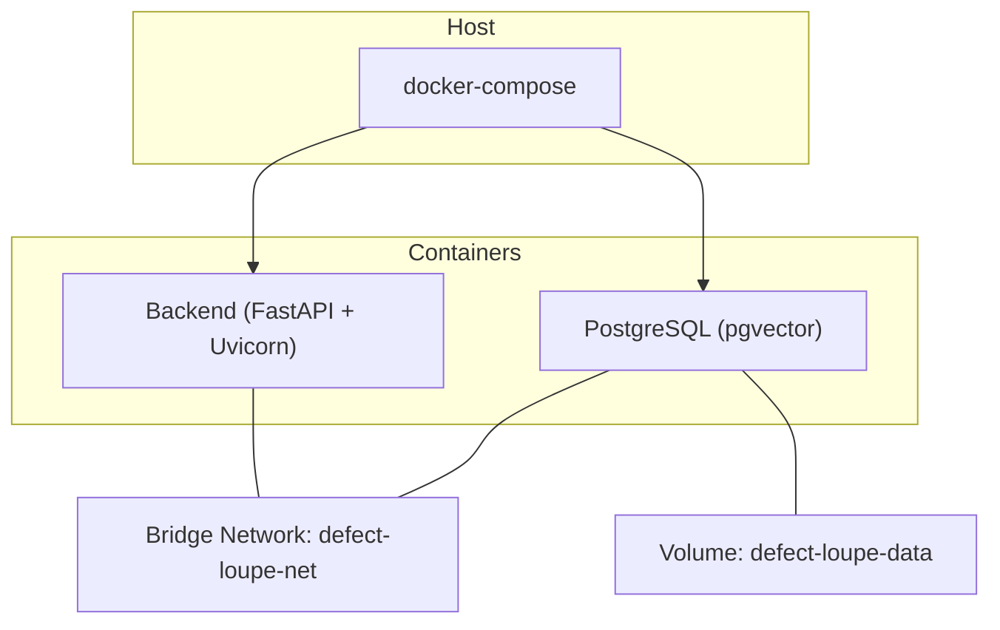
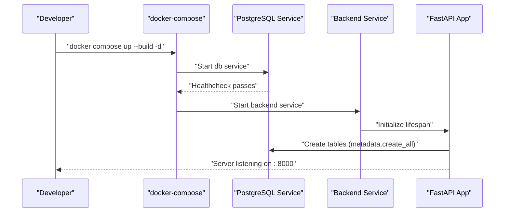
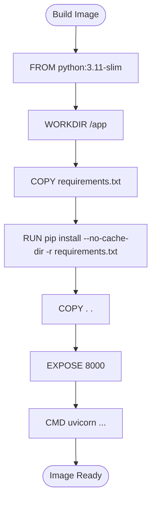
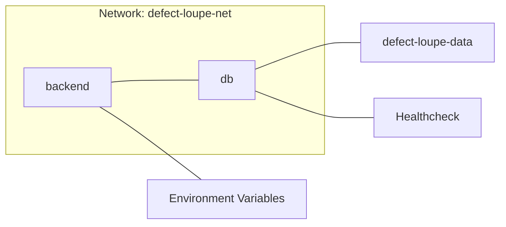
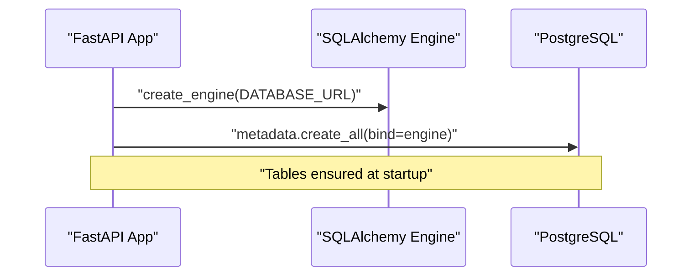
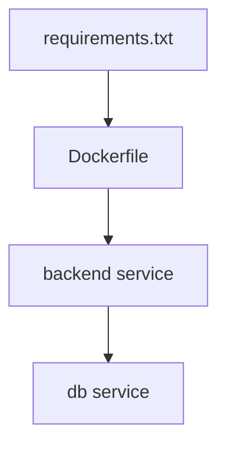

# Docker Containerization

<cite>
**Referenced Files in This Document**
- [Dockerfile](file://Dockerfile)
- [docker-compose.yaml](file://docker-compose.yaml)
- [.dockerignore](file://.dockerignore)
- [requirements.txt](file://requirements.txt)
- [README.md](file://README.md)
- [app/main.py](file://app/main.py)
- [app/config/db_config.py](file://app/config/db_config.py)
</cite>

## Table of Contents
1. [Introduction](#introduction)
2. [Project Structure](#project-structure)
3. [Core Components](#core-components)
4. [Architecture Overview](#architecture-overview)
5. [Detailed Component Analysis](#detailed-component-analysis)
6. [Dependency Analysis](#dependency-analysis)
7. [Performance Considerations](#performance-considerations)
8. [Troubleshooting Guide](#troubleshooting-guide)
9. [Conclusion](#conclusion)
10. [Appendices](#appendices)

## Introduction
This document explains the Docker containerization setup for the project, focusing on the Dockerfile structure, multi-stage build recommendations, image optimization techniques, and docker-compose orchestration for development and production. It also covers service dependencies, networking, volumes, health checks, logging, resource limits, building custom images, lifecycle management, debugging, security considerations, and performance strategies.

## Project Structure
The repository includes a FastAPI application with PostgreSQL as the database. The containerization is defined by:
- A single-stage Dockerfile that installs Python dependencies and runs Uvicorn
- A docker-compose file that orchestrates the backend and a PostgreSQL service with pgvector
- A .dockerignore to reduce context size and avoid sensitive files
- Requirements pinned via requirements.txt

**Diagram sources**
- [docker-compose.yaml:1-48](file://docker-compose.yaml#L1-L48)

**Section sources**
- [README.md:66-73](file://README.md#L66-L73)
- [README.md:84-115](file://README.md#L84-L115)
- [requirements.txt:1-11](file://requirements.txt#L1-L11)

## Core Components
- Dockerfile: Defines the runtime image, dependency installation, and entrypoint command.
- docker-compose.yaml: Declares services (backend and db), networking, volumes, environment variables, health checks, and startup ordering.
- .dockerignore: Excludes unnecessary files from the Docker build context.
- Application configuration: Database connection via environment variable; tables created at startup.

Key behaviors:
- Backend exposes port 8000 and serves via Uvicorn.
- Database uses a dedicated volume for persistence.
- Health check ensures the database is ready before the backend starts.

**Section sources**
- [Dockerfile:1-13](file://Dockerfile#L1-L13)
- [docker-compose.yaml:1-48](file://docker-compose.yaml#L1-L48)
- [.dockerignore:1-17](file://.dockerignore#L1-L17)
- [app/config/db_config.py:1-26](file://app/config/db_config.py#L1-L26)
- [app/main.py:11-18](file://app/main.py#L11-L18)

## Architecture Overview
The system consists of two primary services:
- Backend: FastAPI app running under Uvicorn inside a Python slim image.
- Database: PostgreSQL with pgvector extension for vector operations.

Networking and data flow:
- Both services are connected via a bridge network named defect-loupe-net.
- The backend connects to the database using DATABASE_URL pointing to the db service host.
- The database persists data in a named volume.

**Diagram sources**
- [docker-compose.yaml:16-32](file://docker-compose.yaml#L16-L32)
- [app/main.py:11-18](file://app/main.py#L11-L18)

**Section sources**
- [docker-compose.yaml:1-48](file://docker-compose.yaml#L1-L48)
- [app/main.py:11-18](file://app/main.py#L11-L18)

## Detailed Component Analysis

### Dockerfile Analysis
- Base image: python:3.11-slim provides a minimal Python runtime.
- Working directory: /app
- Dependency installation: Installs packages from requirements.txt without caching to reduce image size.
- Copy strategy: Copies requirements first to leverage layer caching, then copies the rest of the code.
- Exposure and command: Exposes port 8000 and runs Uvicorn bound to 0.0.0.0.

Optimization opportunities:
- Multi-stage builds to separate build-time tools from runtime.
- Pin exact versions in requirements.txt for reproducibility.
- Use a non-root user for improved security.
- Add HEALTHCHECK for container-level health monitoring.

**Diagram sources**
- [Dockerfile:1-13](file://Dockerfile#L1-L13)

**Section sources**
- [Dockerfile:1-13](file://Dockerfile#L1-L13)

### docker-compose Orchestration
Services:
- db: PostgreSQL with pgvector, persistent volume, healthcheck, and exposed host port 5433.
- backend: Builds from the Dockerfile, depends on db being healthy, maps port 8000, sets environment variables for database and JWT secrets.

Networking:
- A bridge network defect-loupe-net connects both services.

Volumes:
- Named volume defect-loupe-data persists database state across restarts.

Startup order:
- Backend waits for db to be healthy before starting.

**Diagram sources**
- [docker-compose.yaml:1-48](file://docker-compose.yaml#L1-L48)

**Section sources**
- [docker-compose.yaml:1-48](file://docker-compose.yaml#L1-L48)

### Application Integration Points
- Database initialization: Tables are created during application lifespan startup.
- Configuration: Database URL is loaded from environment or .env file; missing DATABASE_URL raises an error.

**Diagram sources**
- [app/config/db_config.py:11-18](file://app/config/db_config.py#L11-L18)
- [app/main.py:11-18](file://app/main.py#L11-L18)

**Section sources**
- [app/config/db_config.py:1-26](file://app/config/db_config.py#L1-L26)
- [app/main.py:11-18](file://app/main.py#L11-L18)

## Dependency Analysis
- Build-time dependencies: Defined in requirements.txt and installed during image build.
- Runtime dependencies: Same set as build-time; no extra dev-only packages in this setup.
- Service dependencies: Backend depends on the db service being healthy.

**Diagram sources**
- [requirements.txt:1-11](file://requirements.txt#L1-L11)
- [Dockerfile:5-7](file://Dockerfile#L5-L7)
- [docker-compose.yaml:22-39](file://docker-compose.yaml#L22-L39)

**Section sources**
- [requirements.txt:1-11](file://requirements.txt#L1-L11)
- [docker-compose.yaml:22-39](file://docker-compose.yaml#L22-L39)

## Performance Considerations
- Image size: Using python:3.11-slim reduces base image footprint.
- Layer caching: Copying requirements.txt before source code improves rebuild speed.
- No cache installs: pip install --no-cache-dir avoids storing package caches in layers.
- Single-stage vs multi-stage: For pure Python apps, a single stage is often sufficient; consider multi-stage only if you need build tools not required at runtime.
- Connection pooling: Ensure SQLAlchemy engine settings are tuned for concurrency and connection reuse in production.
- Resource limits: Define CPU/memory limits in docker-compose to prevent noisy neighbor issues.
- Logging: Stream logs to stdout/stderr for centralized collection; avoid heavy synchronous disk writes in hot paths.

[No sources needed since this section provides general guidance]

## Troubleshooting Guide
Common issues and resolutions:
- Missing DATABASE_URL: The application will raise a runtime error if DATABASE_URL is not set. Ensure it is provided via environment or .env file.
- Database not ready: The backend depends_on db with condition service_healthy; verify the db healthcheck succeeds before backend starts.
- Port conflicts: Host ports 8000 and 5433 are mapped; ensure they are free on your machine.
- Volume permissions: If the database fails to start due to permissions, remove or reset the named volume and restart.
- Logs: Inspect container logs using docker compose logs <service>.

Operational tips:
- Rebuild after changing dependencies: docker compose up --build
- Restart services: docker compose restart
- Scale horizontally: docker compose up --scale backend=N (ensure DB can handle connections)

**Section sources**
- [app/config/db_config.py:11-18](file://app/config/db_config.py#L11-L18)
- [docker-compose.yaml:16-32](file://docker-compose.yaml#L16-L32)
- [docker-compose.yaml:10-15](file://docker-compose.yaml#L10-L15)

## Conclusion
The current setup provides a simple, effective containerized environment for development and testing. The Dockerfile is straightforward, and docker-compose orchestrates the backend and database with health checks and persistent storage. For production, consider adding multi-stage builds, non-root users, explicit resource limits, robust logging, and hardened secrets management.

[No sources needed since this section summarizes without analyzing specific files]

## Appendices

### Building Custom Images
- Build locally: docker compose up --build
- Tag and push: docker build -t yourregistry/backend:tag . && docker push yourregistry/backend:tag
- Pin versions: Update requirements.txt to pin exact versions for reproducible builds.

**Section sources**
- [README.md:84-115](file://README.md#L84-L115)
- [requirements.txt:1-11](file://requirements.txt#L1-L11)

### Managing Container Lifecycles
- Start: docker compose up -d
- Stop: docker compose down
- View logs: docker compose logs -f
- Exec into containers: docker compose exec backend bash

**Section sources**
- [README.md:84-115](file://README.md#L84-L115)

### Debugging Containerized Applications
- Check service status: docker compose ps
- Inspect logs: docker compose logs db | backend
- Verify networking: docker compose exec backend ping db
- Validate environment: docker compose exec backend env

**Section sources**
- [docker-compose.yaml:1-48](file://docker-compose.yaml#L1-L48)

### Security Considerations
- Secrets: Avoid hardcoding secrets in compose files; use environment files or secret managers.
- Non-root user: Run the backend as a non-root user to minimize risk.
- Minimal base image: Continue using slim images and avoid installing unnecessary packages.
- Network isolation: Keep services on a private network; expose only necessary ports.
- Regular updates: Keep base images and dependencies updated.

[No sources needed since this section provides general guidance]

### Health Checks and Monitoring
- Database healthcheck: Already configured in docker-compose to wait until Postgres is ready.
- Application health: The root endpoint returns a simple message; consider adding a dedicated /health endpoint for readiness/liveness probes.
- Container health: Optionally add a HEALTHCHECK instruction in the Dockerfile to probe the API.

**Section sources**
- [docker-compose.yaml:16-20](file://docker-compose.yaml#L16-L20)
- [app/main.py:24-26](file://app/main.py#L24-L26)

### Logging Configuration
- Stream logs to stdout/stderr for easy collection by Docker or external log aggregators.
- Configure log levels in Uvicorn and application frameworks as needed.
- Rotate logs if writing to disk; prefer structured JSON logs for parsing.

[No sources needed since this section provides general guidance]

### Resource Limits
- Set CPU and memory limits in docker-compose to protect the host and other services.
- Tune database connection limits based on expected load.

[No sources needed since this section provides general guidance]