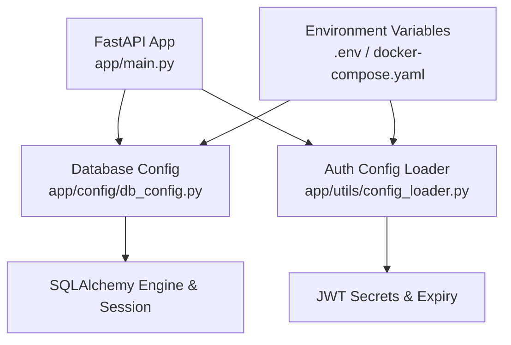
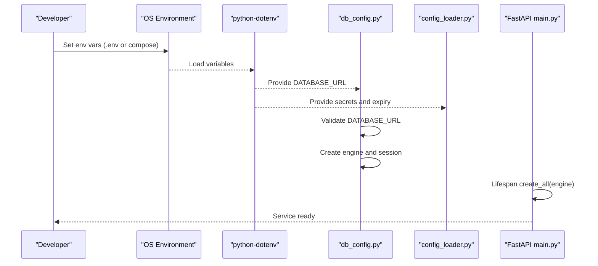
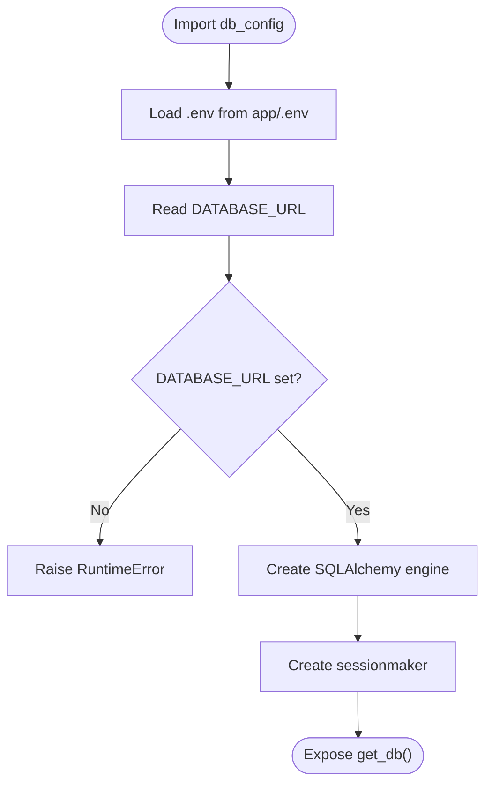
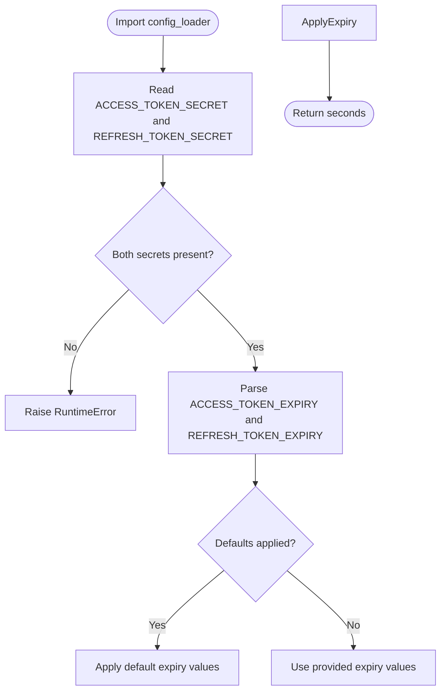
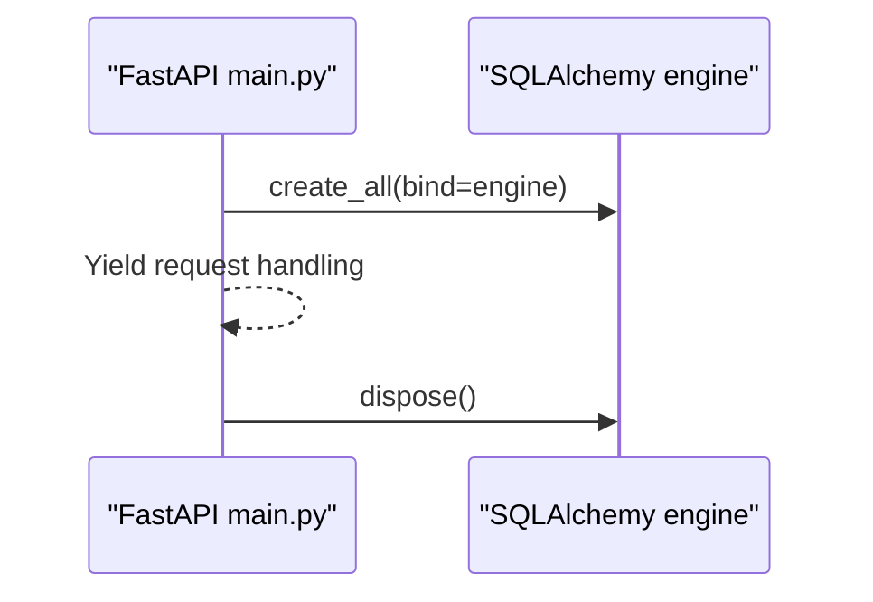
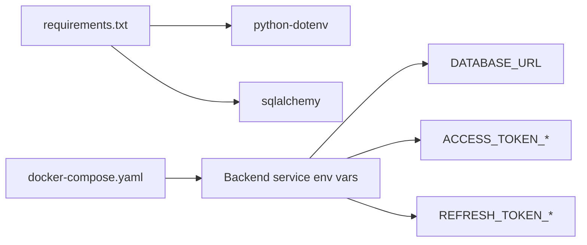

# Environment Configuration

<cite>
**Referenced Files in This Document**
- [db_config.py](file://app/config/db_config.py)
- [config_loader.py](file://app/utils/config_loader.py)
- [main.py](file://app/main.py)
- [docker-compose.yaml](file://docker-compose.yaml)
- [Dockerfile](file://Dockerfile)
- [requirements.txt](file://requirements.txt)
- [README.md](file://README.md)
</cite>

## Table of Contents
1. [Introduction](#introduction)
2. [Project Structure](#project-structure)
3. [Core Components](#core-components)
4. [Architecture Overview](#architecture-overview)
5. [Detailed Component Analysis](#detailed-component-analysis)
6. [Dependency Analysis](#dependency-analysis)
7. [Performance Considerations](#performance-considerations)
8. [Troubleshooting Guide](#troubleshooting-guide)
9. [Conclusion](#conclusion)
10. [Appendices](#appendices)

## Introduction
This document explains how environment configuration is managed in the application, focusing on the .env file structure, required environment variables, and the mechanisms used to load and validate configuration at runtime. It covers database connection settings via DATABASE_URL, application parameters for authentication tokens, and security configurations. It also provides examples for different environments (development, staging, production), guidance on configuration validation, best practices for managing sensitive credentials, environment variable precedence, default values, and troubleshooting common issues.

## Project Structure
The configuration-related code is organized into two primary modules:
- Database configuration module that loads DATABASE_URL and creates a SQLAlchemy engine and session factory.
- Utility module that loads JWT secrets and token expiry settings with defaults and parsing logic.

Environment variables are provided either through a local .env file or via container orchestration (Docker Compose). The application entrypoint initializes the database schema using the configured engine during startup.

**Diagram sources**
- [main.py:11-18](file://app/main.py#L11-L18)
- [db_config.py:1-26](file://app/config/db_config.py#L1-L26)
- [config_loader.py:1-44](file://app/utils/config_loader.py#L1-L44)
- [docker-compose.yaml:33-38](file://docker-compose.yaml#L33-L38)

**Section sources**
- [main.py:11-18](file://app/main.py#L11-L18)
- [db_config.py:1-26](file://app/config/db_config.py#L1-L26)
- [config_loader.py:1-44](file://app/utils/config_loader.py#L1-L44)
- [docker-compose.yaml:33-38](file://docker-compose.yaml#L33-L38)

## Core Components
- Database configuration: Loads DATABASE_URL from environment, validates presence, creates a SQLAlchemy engine, and exposes a session generator for dependency injection.
- Authentication configuration: Loads ACCESS_TOKEN_SECRET, REFRESH_TOKEN_SECRET, and token expiry settings; parses human-friendly expiry strings into seconds; enforces required secrets.
- Application lifecycle: Creates database tables at startup and disposes the engine at shutdown.

Key responsibilities:
- Centralized loading of environment variables via python-dotenv.
- Strict validation for critical secrets and connection strings.
- Default values for non-critical settings like token expiries.

**Section sources**
- [db_config.py:1-26](file://app/config/db_config.py#L1-L26)
- [config_loader.py:1-44](file://app/utils/config_loader.py#L1-L44)
- [main.py:11-18](file://app/main.py#L11-L18)

## Architecture Overview
Configuration flows from environment sources into the application:
- Local development: .env file located under app/.env is loaded by both configuration modules.
- Containerized deployment: docker-compose.yaml injects environment variables directly into the backend service.
- At startup, FastAPI lifespan creates all tables using the configured engine.

**Diagram sources**
- [db_config.py:1-26](file://app/config/db_config.py#L1-L26)
- [config_loader.py:1-44](file://app/utils/config_loader.py#L1-L44)
- [main.py:11-18](file://app/main.py#L11-L18)
- [docker-compose.yaml:33-38](file://docker-compose.yaml#L33-L38)

## Detailed Component Analysis

### Database Configuration (DATABASE_URL)
- Loads .env from app/.env and reads DATABASE_URL.
- Validates that DATABASE_URL is present; raises an error if missing.
- Creates a SQLAlchemy engine bound to the provided URL.
- Provides a session factory and a context manager for per-request sessions.

**Diagram sources**
- [db_config.py:1-26](file://app/config/db_config.py#L1-L26)

**Section sources**
- [db_config.py:1-26](file://app/config/db_config.py#L1-L26)

### Authentication Configuration (JWT Secrets and Expiry)
- Reads ACCESS_TOKEN_SECRET and REFRESH_TOKEN_SECRET; raises errors if missing.
- Parses ACCESS_TOKEN_EXPIRY and REFRESH_TOKEN_EXPIRY into seconds with defaults when not provided.
- Supports units m (minutes), h (hours), d (days), s (seconds).

**Diagram sources**
- [config_loader.py:9-43](file://app/utils/config_loader.py#L9-L43)

**Section sources**
- [config_loader.py:1-44](file://app/utils/config_loader.py#L1-L44)

### Application Startup and Lifecycle
- Uses FastAPI lifespan to create all database tables at startup using the configured engine.
- Disposes the engine on shutdown to release resources.

**Diagram sources**
- [main.py:11-18](file://app/main.py#L11-L18)

**Section sources**
- [main.py:11-18](file://app/main.py#L11-L18)

## Dependency Analysis
- python-dotenv is used to load .env files.
- SQLAlchemy is used to manage database connections and sessions.
- Docker Compose injects environment variables for containerized runs.
- The README documents environment variables and project structure.

**Diagram sources**
- [requirements.txt:1-11](file://requirements.txt#L1-L11)
- [docker-compose.yaml:33-38](file://docker-compose.yaml#L33-L38)

**Section sources**
- [requirements.txt:1-11](file://requirements.txt#L1-L11)
- [docker-compose.yaml:33-38](file://docker-compose.yaml#L33-L38)
- [README.md:170-178](file://README.md#L170-L178)

## Performance Considerations
- Reuse the SQLAlchemy engine across requests; avoid recreating it per request.
- Use short-lived sessions per request via the provided generator to minimize resource usage.
- Keep token expiry values reasonable to balance security and user experience.
- Avoid logging sensitive environment variables (secrets, connection strings).

[No sources needed since this section provides general guidance]

## Troubleshooting Guide
Common issues and resolutions:
- Missing DATABASE_URL:
  - Ensure DATABASE_URL is set in your .env file or injected via Docker Compose.
  - The application will raise a runtime error if DATABASE_URL is absent.
- Missing JWT secrets:
  - Ensure ACCESS_TOKEN_SECRET and REFRESH_TOKEN_SECRET are set; otherwise, the application will raise a runtime error.
- Invalid token expiry format:
  - Use supported units: m, h, d, s. Example formats include 15m, 1h, 10d, 3600s.
- Connection failures:
  - Verify host, port, user, password, and database name in DATABASE_URL match your PostgreSQL instance.
  - In Docker Compose, ensure the backend can reach the db service by hostname and port.
- Environment precedence:
  - When running locally, .env under app/ is loaded explicitly.
  - In containers, environment variables from docker-compose.yaml override .env values.

**Section sources**
- [db_config.py:11-14](file://app/config/db_config.py#L11-L14)
- [config_loader.py:24-43](file://app/utils/config_loader.py#L24-L43)
- [docker-compose.yaml:33-38](file://docker-compose.yaml#L33-L38)
- [README.md:170-178](file://README.md#L170-L178)

## Conclusion
The application centralizes environment configuration through explicit loading of .env and environment variables, with strict validation for critical settings like DATABASE_URL and JWT secrets. Token expiry values support flexible units and sensible defaults. Using Docker Compose simplifies injecting environment variables for consistent deployments. Following the best practices outlined here ensures secure, reliable, and maintainable configuration management across environments.

[No sources needed since this section summarizes without analyzing specific files]

## Appendices

### Environment Variables Reference
- DATABASE_URL: PostgreSQL connection string required by the database configuration module.
- ACCESS_TOKEN_SECRET: Secret key for signing access tokens; mandatory.
- ACCESS_TOKEN_EXPIRY: Access token lifespan; supports units m, h, d, s; defaults apply if not set.
- REFRESH_TOKEN_SECRET: Secret key for refresh tokens; mandatory.
- REFRESH_TOKEN_EXPIRY: Refresh token lifespan; supports units m, h, d, s; defaults apply if not set.

Examples:
- Development (local):
  - DATABASE_URL points to localhost on port 5433.
  - Secrets are strong random strings; expiries may be shorter for rapid iteration.
- Staging:
  - DATABASE_URL points to a staging database host.
  - Secrets are unique per environment; expiries align with operational policies.
- Production:
  - DATABASE_URL points to production database host with secure credentials.
  - Secrets are managed securely (e.g., secret managers); expiries follow security guidelines.

**Section sources**
- [README.md:170-178](file://README.md#L170-L178)
- [docker-compose.yaml:33-38](file://docker-compose.yaml#L33-L38)

### Best Practices for Managing Sensitive Credentials
- Never commit secrets to version control; use .env files and container environment variables.
- Rotate secrets regularly and store them in secure vaults where possible.
- Validate required variables at startup to fail fast on misconfiguration.
- Avoid logging or exposing secrets in error messages or responses.

[No sources needed since this section provides general guidance]