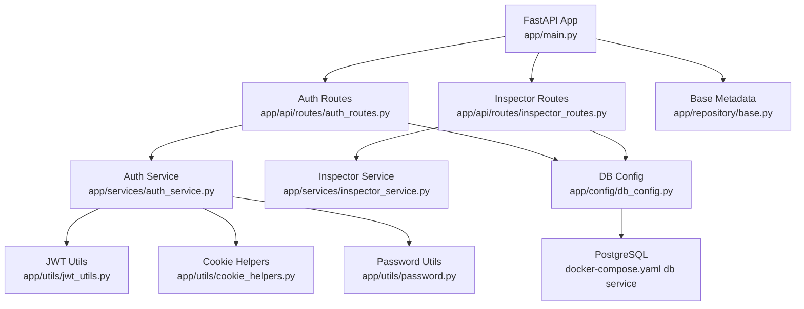
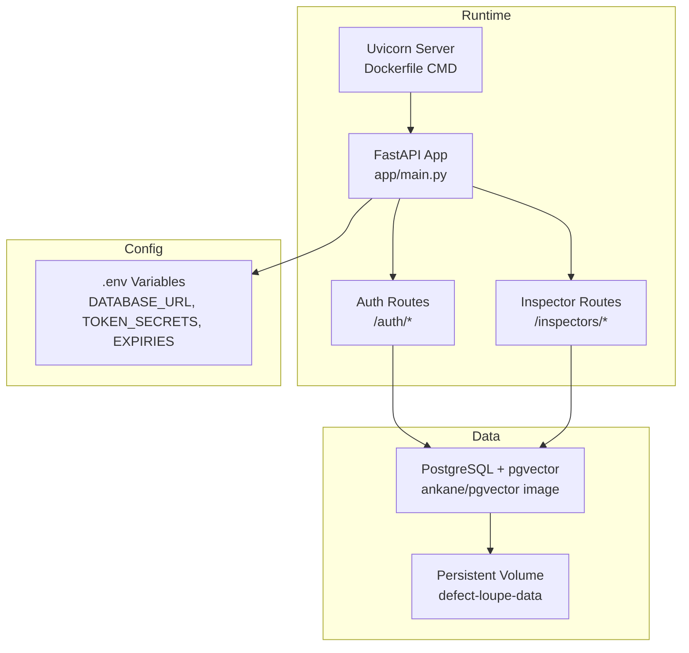
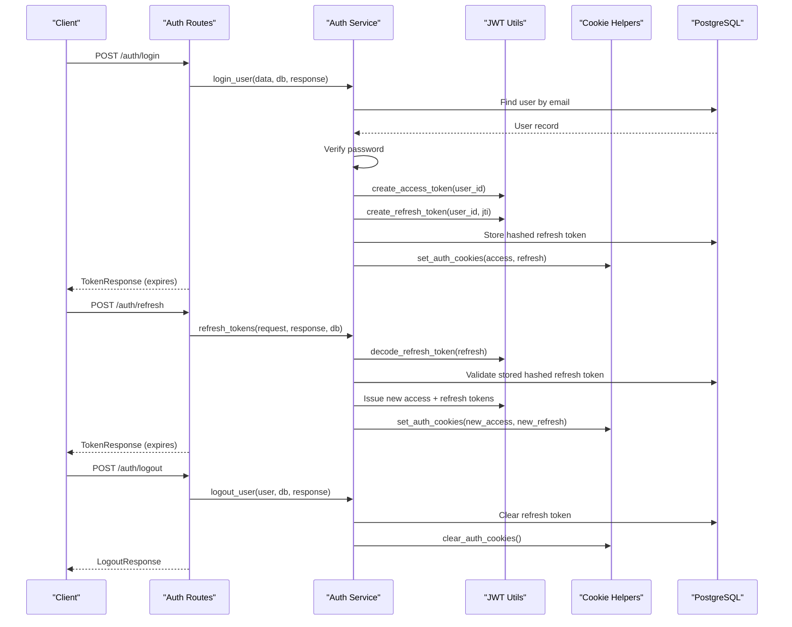
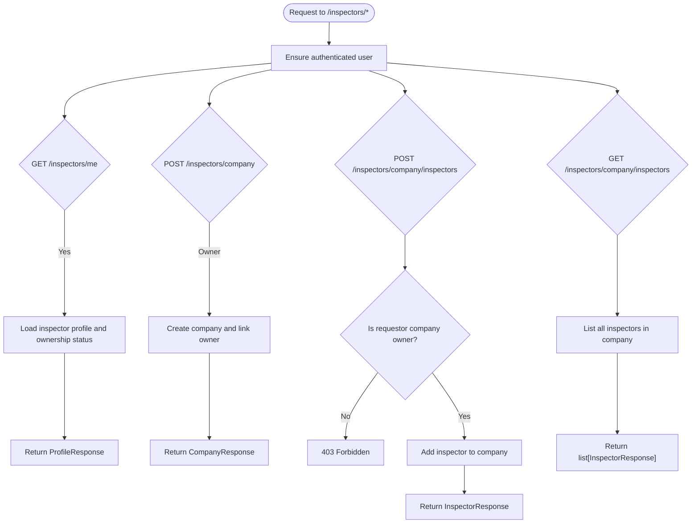
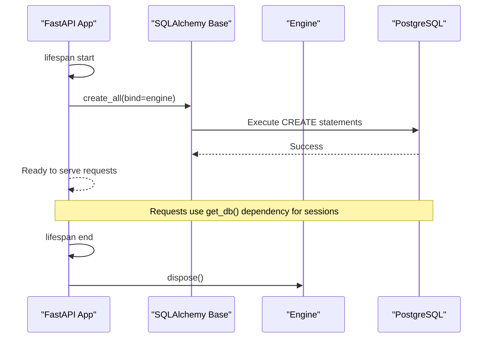
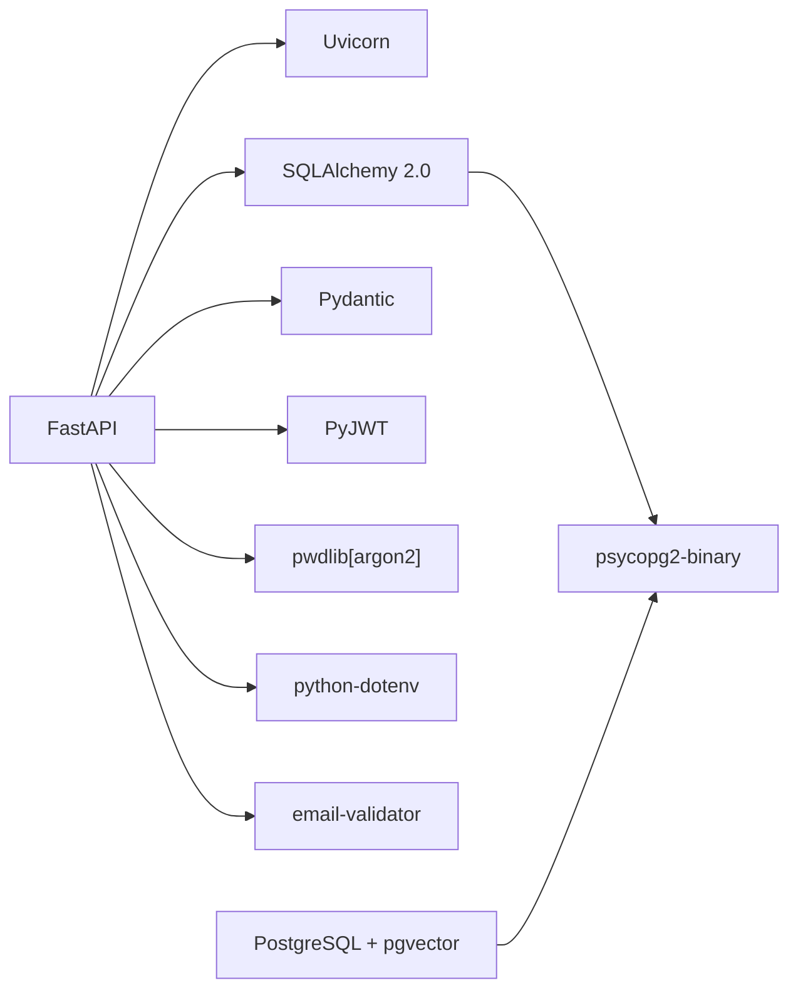

# Production Deployment

<cite>
**Referenced Files in This Document**
- [README.md](file://README.md)
- [Dockerfile](file://Dockerfile)
- [docker-compose.yaml](file://docker-compose.yaml)
- [requirements.txt](file://requirements.txt)
- [app/main.py](file://app/main.py)
- [app/config/db_config.py](file://app/config/db_config.py)
- [app/utils/config_loader.py](file://app/utils/config_loader.py)
- [app/utils/jwt_utils.py](file://app/utils/jwt_utils.py)
- [app/utils/cookie_helpers.py](file://app/utils/cookie_helpers.py)
- [app/utils/password.py](file://app/utils/password.py)
- [app/api/routes/auth_routes.py](file://app/api/routes/auth_routes.py)
- [app/api/routes/inspector_routes.py](file://app/api/routes/inspector_routes.py)
- [app/repository/base.py](file://app/repository/base.py)
- [app/repository/user.py](file://app/repository/user.py)
</cite>

## Table of Contents
1. Introduction
2. Project Structure
3. Core Components
4. Architecture Overview
5. Detailed Component Analysis
6. Dependency Analysis
7. Performance Considerations
8. Troubleshooting Guide
9. Conclusion
10. Appendices

## Introduction
This document provides production deployment guidance for the DefectLoupe backend, a FastAPI application that manages property inspections and defect tracking with PostgreSQL (pgvector). It covers deployment strategies, scaling considerations, operational maintenance, database setup, external service integrations, monitoring and logging, backups and disaster recovery, CI/CD automation, rollback strategies, performance tuning, security hardening, compliance requirements, and troubleshooting best practices.

The application is containerized using Docker and orchestrated via Docker Compose. It uses SQLAlchemy 2.0 with PostgreSQL, JWT-based authentication with secure cookies, and exposes API routes for authentication and inspector/company management.

## Project Structure
At a high level:
- Application entrypoint and lifespan handling are defined in the main module.
- Database configuration and session management are centralized.
- Authentication and authorization logic are implemented in services and utilities.
- API routes expose endpoints under /auth and /inspectors.
- Containerization is configured via Dockerfile and docker-compose.yaml.
- Dependencies are declared in requirements.txt.

**Diagram sources**
- [app/main.py:11-21](file://app/main.py#L11-L21)
- [app/api/routes/auth_routes.py:22-64](file://app/api/routes/auth_routes.py#L22-L64)
- [app/api/routes/inspector_routes.py:23-143](file://app/api/routes/inspector_routes.py#L23-L143)
- [app/config/db_config.py:1-26](file://app/config/db_config.py#L1-L26)
- [docker-compose.yaml:1-48](file://docker-compose.yaml#L1-L48)

**Section sources**
- [README.md:66-115](file://README.md#L66-L115)
- [Dockerfile:1-13](file://Dockerfile#L1-L13)
- [docker-compose.yaml:1-48](file://docker-compose.yaml#L1-L48)
- [requirements.txt:1-11](file://requirements.txt#L1-L11)

## Core Components
- Application lifecycle: The FastAPI app initializes database tables at startup and disposes engine resources on shutdown.
- Database layer: Centralized engine and session factory; environment-driven connection string required.
- Authentication: JWT access and refresh tokens issued as HTTP-only secure cookies; token rotation and revocation supported.
- Authorization: Route-level dependencies enforce user presence and company ownership where needed.
- Configuration: Environment variables loaded from .env within the app directory; expiry parsing supports human-friendly strings.

Key responsibilities:
- app/main.py: Lifespan to create tables and manage engine lifecycle; includes routers; root health endpoint.
- app/config/db_config.py: Loads DATABASE_URL, creates engine and sessionmaker, provides dependency for DB sessions.
- app/utils/config_loader.py: Provides typed getters for secrets and token expirations; parses expiry strings to seconds.
- app/utils/jwt_utils.py: Creates and decodes JWTs for access and refresh tokens.
- app/utils/cookie_helpers.py: Sets and clears secure, HTTP-only cookies for tokens.
- app/utils/password.py: Password hashing and verification using recommended algorithm.
- app/api/routes/auth_routes.py: Endpoints for register, login, logout, refresh, and current user info.
- app/api/routes/inspector_routes.py: Endpoints for profile, company creation, adding inspectors, and listing company members.
- app/repository/base.py and user.py: SQLAlchemy declarative base and User model used across auth flows.

**Section sources**
- [app/main.py:11-21](file://app/main.py#L11-L21)
- [app/config/db_config.py:1-26](file://app/config/db_config.py#L1-L26)
- [app/utils/config_loader.py:1-44](file://app/utils/config_loader.py#L1-L44)
- [app/utils/jwt_utils.py:1-51](file://app/utils/jwt_utils.py#L1-L51)
- [app/utils/cookie_helpers.py:1-42](file://app/utils/cookie_helpers.py#L1-L42)
- [app/utils/password.py:1-12](file://app/utils/password.py#L1-L12)
- [app/api/routes/auth_routes.py:22-64](file://app/api/routes/auth_routes.py#L22-L64)
- [app/api/routes/inspector_routes.py:23-143](file://app/api/routes/inspector_routes.py#L23-L143)
- [app/repository/base.py:1-5](file://app/repository/base.py#L1-L5)
- [app/repository/user.py:10-54](file://app/repository/user.py#L10-L54)

## Architecture Overview
Production architecture centers around a containerized FastAPI service backed by a managed PostgreSQL instance with pgvector enabled. The application uses environment-driven configuration and secure cookie-based authentication.

**Diagram sources**
- [Dockerfile:11-13](file://Dockerfile#L11-L13)
- [app/main.py:11-21](file://app/main.py#L11-L21)
- [app/api/routes/auth_routes.py:22-64](file://app/api/routes/auth_routes.py#L22-L64)
- [app/api/routes/inspector_routes.py:23-143](file://app/api/routes/inspector_routes.py#L23-L143)
- [docker-compose.yaml:1-48](file://docker-compose.yaml#L1-L48)

## Detailed Component Analysis

### Authentication Flow (Login, Refresh, Logout)
The authentication flow issues JWTs as secure cookies and supports token rotation and revocation.

**Diagram sources**
- [app/api/routes/auth_routes.py:25-64](file://app/api/routes/auth_routes.py#L25-L64)
- [app/services/auth_service.py:59-187](file://app/services/auth_service.py#L59-L187)
- [app/utils/jwt_utils.py:14-51](file://app/utils/jwt_utils.py#L14-L51)
- [app/utils/cookie_helpers.py:12-42](file://app/utils/cookie_helpers.py#L12-L42)

**Section sources**
- [app/api/routes/auth_routes.py:25-64](file://app/api/routes/auth_routes.py#L25-L64)
- [app/services/auth_service.py:59-187](file://app/services/auth_service.py#L59-L187)
- [app/utils/jwt_utils.py:14-51](file://app/utils/jwt_utils.py#L14-L51)
- [app/utils/cookie_helpers.py:12-42](file://app/utils/cookie_helpers.py#L12-L42)

### Inspector and Company Management
Inspector routes provide profile retrieval, company creation, and member management with owner-only enforcement.

**Diagram sources**
- [app/api/routes/inspector_routes.py:28-143](file://app/api/routes/inspector_routes.py#L28-L143)

**Section sources**
- [app/api/routes/inspector_routes.py:28-143](file://app/api/routes/inspector_routes.py#L28-L143)

### Database Setup and Lifecycle
- Tables are created at application startup via metadata.create_all bound to the engine.
- Engine disposal occurs during application shutdown.
- Session management uses a dependency that yields a session and ensures closure.

**Diagram sources**
- [app/main.py:11-15](file://app/main.py#L11-L15)
- [app/config/db_config.py:16-26](file://app/config/db_config.py#L16-L26)

**Section sources**
- [app/main.py:11-15](file://app/main.py#L11-L15)
- [app/config/db_config.py:1-26](file://app/config/db_config.py#L1-L26)

## Dependency Analysis
External and internal dependencies:
- Framework and server: FastAPI and Uvicorn.
- Database: PostgreSQL with pgvector extension; psycopg2-binary driver; Alembic for migrations.
- ORM and validation: SQLAlchemy 2.0 and Pydantic.
- Security: PyJWT for token handling; pwdlib for password hashing; email-validator for input validation.
- Configuration: python-dotenv for loading environment variables.

**Diagram sources**
- [requirements.txt:1-11](file://requirements.txt#L1-L11)
- [docker-compose.yaml:1-48](file://docker-compose.yaml#L1-L48)

**Section sources**
- [requirements.txt:1-11](file://requirements.txt#L1-L11)
- [docker-compose.yaml:1-48](file://docker-compose.yaml#L1-L48)

## Performance Considerations
- Concurrency and workers:
  - Use multiple Uvicorn workers behind a reverse proxy to utilize multi-core CPUs.
  - Tune worker count based on CPU cores and expected load.
- Database connections:
  - Configure connection pool size appropriate to workload; avoid excessive concurrent connections.
  - Ensure PostgreSQL max_connections is set to accommodate application needs.
- Query optimization:
  - Use indexes on frequently queried columns (e.g., email, user_id, company_id).
  - Leverage pgvector features for similarity search if applicable.
- Caching:
  - Introduce caching layers (e.g., Redis) for hot data such as profiles or company listings.
- Request payload sizes:
  - Enforce limits on file uploads and large payloads to prevent resource exhaustion.
- Health checks:
  - Expose and monitor a lightweight health endpoint; integrate with orchestrators.

[No sources needed since this section provides general guidance]

## Troubleshooting Guide
Common deployment issues and resolutions:
- Missing DATABASE_URL:
  - Symptom: Application fails to start due to missing database URL.
  - Resolution: Ensure DATABASE_URL is set in environment or .env file within the app directory.
- PostgreSQL not ready:
  - Symptom: Backend cannot connect to database on startup.
  - Resolution: Use healthcheck and depends_on conditions to ensure DB readiness before starting the backend.
- Authentication failures:
  - Symptom: 401 Unauthorized errors on protected endpoints.
  - Resolution: Verify cookies are present and valid; check token secrets and expiry settings; ensure secure cookie flags match deployment scheme.
- Token rotation issues:
  - Symptom: Refresh endpoint returns unauthorized.
  - Resolution: Confirm stored hashed refresh token matches presented token; ensure rotation updates DB and sets new cookies.
- Permission errors:
  - Symptom: 403 Forbidden when managing company inspectors.
  - Resolution: Verify caller is company owner; inspect route-level authorization logic.

Operational tips:
- Logs:
  - Enable structured logging in Uvicorn and FastAPI; forward logs to a central collector.
- Metrics:
  - Expose metrics endpoint (e.g., Prometheus) for latency, error rates, and throughput.
- Backups:
  - Schedule regular PostgreSQL backups; verify restore procedures periodically.
- Rollbacks:
  - Maintain versioned containers; use blue/green or rolling updates to minimize downtime.

**Section sources**
- [app/config/db_config.py:11-16](file://app/config/db_config.py#L11-L16)
- [docker-compose.yaml:16-20](file://docker-compose.yaml#L16-L20)
- [app/utils/cookie_helpers.py:12-42](file://app/utils/cookie_helpers.py#L12-L42)
- [app/api/routes/inspector_routes.py:89-121](file://app/api/routes/inspector_routes.py#L89-L121)

## Conclusion
DefectLoupe’s production deployment leverages containerization, environment-driven configuration, and secure authentication. By following the guidelines in this document—covering scaling, monitoring, backups, CI/CD, performance tuning, security hardening, and troubleshooting—you can deploy a resilient, maintainable, and compliant production system.

[No sources needed since this section summarizes without analyzing specific files]

## Appendices

### Production-Ready Configuration Checklist
- Environment variables:
  - DATABASE_URL: Set to a production PostgreSQL connection string.
  - ACCESS_TOKEN_SECRET and REFRESH_TOKEN_SECRET: Strong, unique secrets per environment.
  - ACCESS_TOKEN_EXPIRY and REFRESH_TOKEN_EXPIRY: Human-readable durations parsed into seconds.
- Container runtime:
  - Use non-root users in images.
  - Pin base image versions; rebuild images regularly.
- Networking:
  - Place application behind a reverse proxy (e.g., Nginx/Traefik) with TLS termination.
  - Restrict inbound ports; expose only necessary services.
- Secrets management:
  - Inject secrets via orchestration platforms (Kubernetes Secrets, AWS Secrets Manager, etc.).
- Database:
  - Use managed PostgreSQL with encryption at rest and in transit.
  - Enable backups and point-in-time recovery.
- Monitoring and logging:
  - Collect application logs and metrics; set up alerting thresholds.
- Compliance:
  - Enforce least privilege access; audit sensitive operations; retain logs per policy.

[No sources needed since this section provides general guidance]

### CI/CD Pipeline Integration
- Build:
  - Lint and test code; build Docker image; push to registry.
- Deploy:
  - Use rolling updates or blue/green deployments.
  - Run migrations before switching traffic.
- Rollback:
  - Keep previous image tags; revert quickly on failure.
- Validation:
  - Smoke tests against staging; promote to production after success.

[No sources needed since this section provides general guidance]

### Backup and Disaster Recovery Plan
- Backup strategy:
  - Daily full backups; incremental WAL archiving for PITR.
  - Offsite storage for backup artifacts.
- Restore procedure:
  - Test restore in isolated environment regularly.
  - Document steps to recover data and validate integrity.
- RTO/RPO:
  - Define acceptable recovery time and point objectives; align infrastructure accordingly.

[No sources needed since this section provides general guidance]