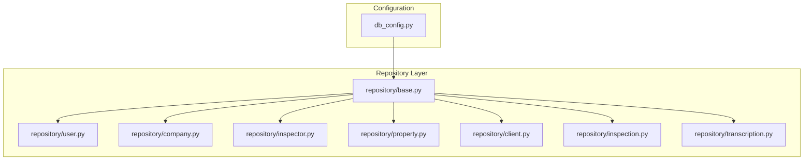
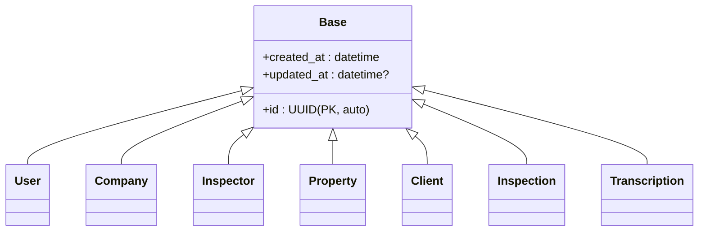
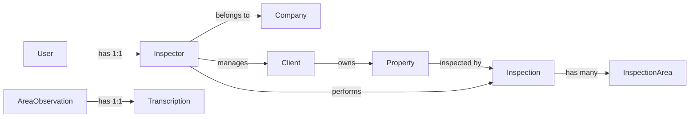

# Base Model & Common Patterns

<cite>
**Referenced Files in This Document**
- [base.py](file://app/repository/base.py)
- [db_config.py](file://app/config/db_config.py)
- [user.py](file://app/repository/user.py)
- [company.py](file://app/repository/company.py)
- [inspection.py](file://app/repository/inspection.py)
- [inspector.py](file://app/repository/inspector.py)
- [property.py](file://app/repository/property.py)
- [client.py](file://app/repository/client.py)
- [transcription.py](file://app/repository/transcription.py)
</cite>

## Table of Contents
1. [Introduction](#introduction)
2. [Project Structure](#project-structure)
3. [Core Components](#core-components)
4. [Architecture Overview](#architecture-overview)
5. [Detailed Component Analysis](#detailed-component-analysis)
6. [Dependency Analysis](#dependency-analysis)
7. [Performance Considerations](#performance-considerations)
8. [Troubleshooting Guide](#troubleshooting-guide)
9. [Conclusion](#conclusion)

## Introduction
This document explains the base SQLAlchemy model and common patterns used across all entities in the repository. It focuses on:
- The DeclarativeBase implementation and how it is extended by every entity
- Shared fields such as UUID primary keys, timestamps, and optional audit fields
- Consistent conventions for relationships, enums, and foreign keys
- How to create new models that follow established patterns

The goal is to make it straightforward to add new entities while maintaining consistency, reliability, and performance.

## Project Structure
At a high level:
- Database configuration and session management are centralized under app/config/db_config.py
- All domain models live under app/repository and inherit from a shared base class defined in app/repository/base.py
- Models consistently use PostgreSQL-specific UUID types and server-managed timestamps

**Diagram sources**
- [db_config.py:1-26](file://app/config/db_config.py#L1-L26)
- [base.py:1-5](file://app/repository/base.py#L1-L5)
- [user.py:1-54](file://app/repository/user.py#L1-L54)
- [company.py:1-61](file://app/repository/company.py#L1-L61)
- [inspector.py:1-82](file://app/repository/inspector.py#L1-L82)
- [property.py:1-70](file://app/repository/property.py#L1-L70)
- [client.py:1-78](file://app/repository/client.py#L1-L78)
- [inspection.py:1-75](file://app/repository/inspection.py#L1-L75)
- [transcription.py:1-50](file://app/repository/transcription.py#L1-L50)

**Section sources**
- [db_config.py:1-26](file://app/config/db_config.py#L1-L26)
- [base.py:1-5](file://app/repository/base.py#L1-L5)

## Core Components
- Base declarative model: A minimal base class that all entities extend.
- Database engine and session: Centralized configuration with environment-driven database URL and a generator for scoped sessions.
- Common field patterns:
  - UUID primary keys using PostgreSQL UUID type with auto-generation
  - Timestamps created_at and updated_at using server-side defaults and updates
  - Foreign keys with explicit ondelete behavior
  - Enumerated columns for constrained values
  - Relationships with back_populates and consistent lazy loading strategies

These patterns ensure uniformity, data integrity, and predictable behavior across the application.

**Section sources**
- [base.py:1-5](file://app/repository/base.py#L1-L5)
- [db_config.py:1-26](file://app/config/db_config.py#L1-L26)
- [user.py:1-54](file://app/repository/user.py#L1-L54)
- [company.py:1-61](file://app/repository/company.py#L1-L61)
- [inspector.py:1-82](file://app/repository/inspector.py#L1-L82)
- [property.py:1-70](file://app/repository/property.py#L1-L70)
- [client.py:1-78](file://app/repository/client.py#L1-L78)
- [inspection.py:1-75](file://app/repository/inspection.py#L1-L75)
- [transcription.py:1-50](file://app/repository/transcription.py#L1-L50)

## Architecture Overview
The architecture centers around a single DeclarativeBase subclass that all models inherit. Each model defines its table schema, constraints, and relationships. Database connectivity is configured once and reused via a session generator.

**Diagram sources**
- [base.py:1-5](file://app/repository/base.py#L1-L5)
- [user.py:10-54](file://app/repository/user.py#L10-L54)
- [company.py:12-61](file://app/repository/company.py#L12-L61)
- [inspector.py:18-82](file://app/repository/inspector.py#L18-L82)
- [property.py:20-70](file://app/repository/property.py#L20-L70)
- [client.py:12-78](file://app/repository/client.py#L12-L78)
- [inspection.py:19-75](file://app/repository/inspection.py#L19-L75)
- [transcription.py:12-50](file://app/repository/transcription.py#L12-L50)

## Detailed Component Analysis

### Base Class and Inheritance Pattern
- All models inherit from a minimal Base class that extends SQLAlchemy’s DeclarativeBase.
- This keeps the ORM metadata registration centralized and ensures consistent behavior across tables.

Key implications:
- New models simply subclass Base and define __tablename__ and columns.
- No additional mixins or base methods are required; common fields are repeated per model for clarity and control.

**Section sources**
- [base.py:1-5](file://app/repository/base.py#L1-L5)

### UUID Primary Keys
- Every entity uses a UUID primary key column typed with PostgreSQL’s UUID dialect and set to auto-generate via uuid4.
- Benefits:
  - Globally unique identifiers without relying on auto-increment sequences
  - Safe distribution across services and databases

Common pattern:
- Define id as a UUID mapped column with primary_key=True and default=uuid4.

**Section sources**
- [user.py:13-17](file://app/repository/user.py#L13-L17)
- [company.py:15-19](file://app/repository/company.py#L15-L19)
- [inspector.py:21-25](file://app/repository/inspector.py#L21-L25)
- [property.py:23-27](file://app/repository/property.py#L23-L27)
- [client.py:18-22](file://app/repository/client.py#L18-L22)
- [inspection.py:23-27](file://app/repository/inspection.py#L23-L27)
- [transcription.py:19-23](file://app/repository/transcription.py#L19-L23)

### Timestamps and Audit Trails
- Most models include created_at and updated_at columns using DateTime(timezone=True).
- created_at is set server-side via func.now() as server_default.
- updated_at is set server-side via func.now() with onupdate=func.now().
- Some models only include created_at when an update timestamp is not needed.

Audit trail notes:
- There is no explicit “deleted_at” soft-delete field in these models. Deletions rely on hard deletes and foreign key cascade rules.

Best practices:
- Prefer server-side defaults for timestamps to avoid clock skew and reduce application logic.
- Use timezone-aware timestamps consistently.

**Section sources**
- [company.py:40-48](file://app/repository/company.py#L40-L48)
- [inspection.py:50-58](file://app/repository/inspection.py#L50-L58)
- [inspector.py:53-61](file://app/repository/inspector.py#L53-L61)
- [property.py:50-58](file://app/repository/property.py#L50-L58)
- [client.py:51-59](file://app/repository/client.py#L51-L59)
- [transcription.py:39-42](file://app/repository/transcription.py#L39-L42)
- [user.py:45-48](file://app/repository/user.py#L45-L48)

### Enums and Constrained Fields
- Domain-constrained fields are modeled as Python enums mapped to SQL enums.
- Examples include inspection status, inspector type, and property type.
- Defaults are provided at the column level to ensure valid initial states.

Benefits:
- Enforces data integrity at both application and database layers
- Improves readability and maintainability

**Section sources**
- [inspection.py:13-16](file://app/repository/inspection.py#L13-L16)
- [inspection.py:42-46](file://app/repository/inspection.py#L42-L46)
- [inspector.py:13-15](file://app/repository/inspector.py#L13-L15)
- [inspector.py:45-49](file://app/repository/inspector.py#L45-L49)
- [property.py:13-17](file://app/repository/property.py#L13-L17)
- [property.py:42-46](file://app/repository/property.py#L42-L46)

### Relationships and Foreign Keys
- Relationships are declared with Mapped[...] and relationship(...), using back_populates to link bidirectional associations.
- Foreign keys specify ondelete policies:
  - CASCADE for dependent records (e.g., inspections, properties)
  - SET NULL where deletion should preserve referential integrity but detach the reference (e.g., company_id on inspectors)
- Lazy loading strategy selectin is used for collection relationships to optimize N+1 queries.

Examples:
- One-to-many: Company has many Inspectors and Clients; Inspector has many Clients and Inspections; Property has many Inspections.
- One-to-one: Transcription is uniquely linked to AreaObservation via a unique foreign key.

**Section sources**
- [company.py:51-60](file://app/repository/company.py#L51-L60)
- [inspector.py:63-81](file://app/repository/inspector.py#L63-L81)
- [property.py:61-69](file://app/repository/property.py#L61-L69)
- [client.py:64-78](file://app/repository/client.py#L64-L78)
- [inspection.py:61-75](file://app/repository/inspection.py#L61-L75)
- [transcription.py:26-31](file://app/repository/transcription.py#L26-L31)
- [transcription.py:47-49](file://app/repository/transcription.py#L47-L49)

### Database Configuration and Session Management
- DATABASE_URL is loaded from environment variables and validated at startup.
- An engine is created and a sessionmaker is bound to it.
- A get_db generator yields a session per request and ensures proper cleanup.

Usage guidance:
- Inject get_db into routes or services to obtain a scoped session.
- Always commit transactions explicitly within the context of the yielded session.

**Section sources**
- [db_config.py:1-26](file://app/config/db_config.py#L1-L26)

## Dependency Analysis
The following diagram shows how models depend on each other through foreign keys and relationships.

Notes:
- InspectionArea and AreaObservation are referenced by Inspection and Transcription respectively. Their definitions are not included here but are part of the broader schema.
- Cascade and nullability policies influence deletion behavior across these relationships.

**Diagram sources**
- [user.py:50-54](file://app/repository/user.py#L50-L54)
- [inspector.py:27-38](file://app/repository/inspector.py#L27-L38)
- [inspector.py:63-81](file://app/repository/inspector.py#L63-L81)
- [company.py:51-60](file://app/repository/company.py#L51-L60)
- [client.py:64-78](file://app/repository/client.py#L64-L78)
- [property.py:61-69](file://app/repository/property.py#L61-L69)
- [inspection.py:61-75](file://app/repository/inspection.py#L61-L75)
- [transcription.py:26-31](file://app/repository/transcription.py#L26-L31)

**Section sources**
- [user.py:50-54](file://app/repository/user.py#L50-L54)
- [inspector.py:27-38](file://app/repository/inspector.py#L27-L38)
- [company.py:51-60](file://app/repository/company.py#L51-L60)
- [client.py:64-78](file://app/repository/client.py#L64-L78)
- [property.py:61-69](file://app/repository/property.py#L61-L69)
- [inspection.py:61-75](file://app/repository/inspection.py#L61-L75)
- [transcription.py:26-31](file://app/repository/transcription.py#L26-L31)

## Performance Considerations
- Use selectin loading for collection relationships to reduce N+1 query issues when accessing related lists.
- Prefer server-side defaults for timestamps to minimize round trips and avoid time zone inconsistencies.
- Keep foreign key constraints tight (CASCADE vs SET NULL) to reflect real-world deletion semantics and avoid orphaned rows.
- Indexing: Ensure frequently filtered or joined columns (e.g., email, foreign keys) are indexed at the database level if not already.

[No sources needed since this section provides general guidance]

## Troubleshooting Guide
- Missing DATABASE_URL: The configuration raises a runtime error if the environment variable is not set. Ensure your .env file contains DATABASE_URL and is loaded correctly.
- Timezone issues: All timestamps use timezone-aware DateTime. If you see inconsistent times, verify client and server timezones and ensure reads/writes go through the configured session.
- Relationship errors: When deleting parent records, check ondelete policies. For example, cascading deletes will remove dependent rows automatically; SET NULL will leave references but clear them.
- Enum mismatches: If inserting invalid enum values, validate inputs before persistence. The database enforces enum constraints, so mismatches will raise errors.

**Section sources**
- [db_config.py:11-14](file://app/config/db_config.py#L11-L14)
- [inspection.py:42-46](file://app/repository/inspection.py#L42-L46)
- [inspector.py:45-49](file://app/repository/inspector.py#L45-L49)
- [property.py:42-46](file://app/repository/property.py#L42-L46)

## Conclusion
The codebase follows a consistent and robust pattern for SQLAlchemy models:
- A minimal Base class extending DeclarativeBase
- UUID primary keys with auto-generation
- Server-managed timestamps for created_at and updated_at
- Explicit enums for constrained fields
- Clear relationships with appropriate cascade and nullability policies
- Centralized database configuration and session management

When adding new models, adhere to these conventions to ensure compatibility, maintainability, and predictable behavior across the system.

[No sources needed since this section summarizes without analyzing specific files]