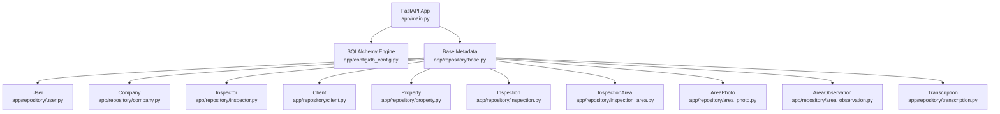
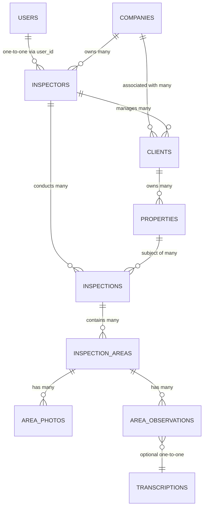
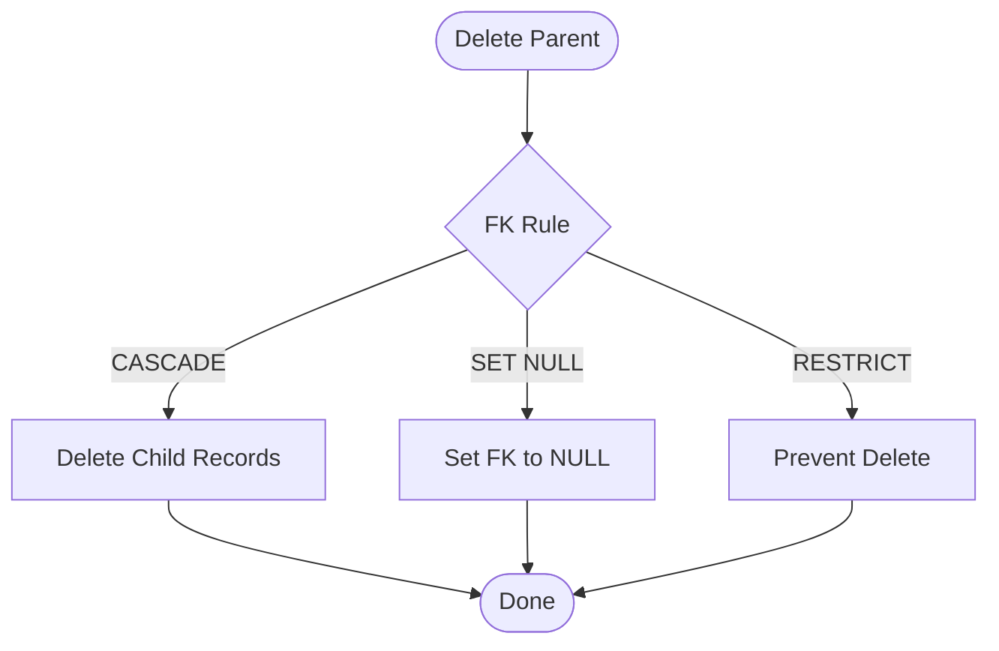

# Data Models & Database Schema

<cite>
**Referenced Files in This Document**
- [db_config.py](file://app/config/db_config.py)
- [base.py](file://app/repository/base.py)
- [user.py](file://app/repository/user.py)
- [company.py](file://app/repository/company.py)
- [inspector.py](file://app/repository/inspector.py)
- [client.py](file://app/repository/client.py)
- [property.py](file://app/repository/property.py)
- [inspection.py](file://app/repository/inspection.py)
- [inspection_area.py](file://app/repository/inspection_area.py)
- [area_photo.py](file://app/repository/area_photo.py)
- [area_observation.py](file://app/repository/area_observation.py)
- [transcription.py](file://app/repository/transcription.py)
- [main.py](file://app/main.py)
</cite>

## Table of Contents
1. [Introduction](#introduction)
2. [Project Structure](#project-structure)
3. [Core Components](#core-components)
4. [Architecture Overview](#architecture-overview)
5. [Detailed Component Analysis](#detailed-component-analysis)
6. [Dependency Analysis](#dependency-analysis)
7. [Performance Considerations](#performance-considerations)
8. [Troubleshooting Guide](#troubleshooting-guide)
9. [Conclusion](#conclusion)
10. [Appendices](#appendices)

## Introduction
This document provides a comprehensive data model and database schema reference for the project. It covers all database entities, their fields, types, constraints, relationships, cascade rules, indexing strategies, validation rules, migration approach, and common query patterns. The system uses SQLAlchemy 2.0 with PostgreSQL and models are defined declaratively under a shared base class.

## Project Structure
The data models live under app/repository and share a common Base class. The application initializes the database engine and creates tables at startup.

**Diagram sources**
- [main.py:11-15](file://app/main.py#L11-L15)
- [db_config.py:16-18](file://app/config/db_config.py#L16-L18)
- [base.py:1-5](file://app/repository/base.py#L1-L5)

**Section sources**
- [main.py:11-15](file://app/main.py#L11-L15)
- [db_config.py:11-18](file://app/config/db_config.py#L11-L18)
- [base.py:1-5](file://app/repository/base.py#L1-L5)

## Core Components
- Base: Declarative base used by all models to define tables and relationships.
- User: Authentication account holder; one-to-one with Inspector.
- Company: Agency profile; optional owner inspector and many inspectors/clients.
- Inspector: Professional profile linked to a User and optionally a Company.
- Client: Property owner/buyer linked to an Inspector and/or Company.
- Property: Physical property owned by a Client.
- Inspection: Job linking an Inspector and a Property with status and metadata.
- InspectionArea: Ordered area within an Inspection (e.g., Kitchen).
- AreaPhoto: Photo attached to an InspectionArea.
- AreaObservation: Text or voice observation tied to an InspectionArea and optionally a photo.
- Transcription: One-to-one text transcription for voice observations.

Key ORM patterns:
- All models inherit from Base (DeclarativeBase).
- UUID primary keys using PostgreSQL UUID type.
- Relationships use back_populates for bidirectional navigation.
- Cascade delete-orphan on parent-child relationships where appropriate.
- Enums for constrained fields (status, type).

**Section sources**
- [base.py:1-5](file://app/repository/base.py#L1-L5)
- [user.py:10-54](file://app/repository/user.py#L10-L54)
- [company.py:12-61](file://app/repository/company.py#L12-L61)
- [inspector.py:18-82](file://app/repository/inspector.py#L18-L82)
- [client.py:12-78](file://app/repository/client.py#L12-L78)
- [property.py:20-70](file://app/repository/property.py#L20-L70)
- [inspection.py:19-75](file://app/repository/inspection.py#L19-L75)
- [inspection_area.py:12-51](file://app/repository/inspection_area.py#L12-L51)
- [area_photo.py:12-43](file://app/repository/area_photo.py#L12-L43)
- [area_observation.py:18-70](file://app/repository/area_observation.py#L18-L70)
- [transcription.py:12-50](file://app/repository/transcription.py#L12-L50)

## Architecture Overview
High-level entity relationships and cardinality:

**Diagram sources**
- [user.py:10-54](file://app/repository/user.py#L10-L54)
- [inspector.py:18-82](file://app/repository/inspector.py#L18-L82)
- [company.py:12-61](file://app/repository/company.py#L12-L61)
- [client.py:12-78](file://app/repository/client.py#L12-L78)
- [property.py:20-70](file://app/repository/property.py#L20-L70)
- [inspection.py:19-75](file://app/repository/inspection.py#L19-L75)
- [inspection_area.py:12-51](file://app/repository/inspection_area.py#L12-L51)
- [area_photo.py:12-43](file://app/repository/area_photo.py#L12-L43)
- [area_observation.py:18-70](file://app/repository/area_observation.py#L18-L70)
- [transcription.py:12-50](file://app/repository/transcription.py#L12-L50)

## Detailed Component Analysis

### Base and Engine
- Base is a simple DeclarativeBase subclass used across all models.
- Engine and session factory are created from DATABASE_URL; tables are created at application lifespan start.

Operational notes:
- Tables are created once when the FastAPI lifespan starts.
- Engine is disposed on shutdown.

**Section sources**
- [base.py:1-5](file://app/repository/base.py#L1-L5)
- [db_config.py:11-18](file://app/config/db_config.py#L11-L18)
- [main.py:11-15](file://app/main.py#L11-L15)

### User
- Primary key: UUID
- Unique email
- Password hash, active flag, admin flag, refresh token
- One-to-one relationship to Inspector (delete-orphan cascade)

Constraints and validation:
- Email uniqueness enforced at DB level.
- Boolean flags default to True/False as defined.

Indexes:
- Unique index on email (implicit unique constraint).

**Section sources**
- [user.py:10-54](file://app/repository/user.py#L10-L54)

### Company
- Primary key: UUID
- Name, logo URL, contact info, full address fields
- Optional owner inspector (SET NULL on delete)
- Relationships: many inspectors, many clients (delete-orphan cascade)

Constraints and validation:
- Unique email at DB level.
- Address fields required.

Indexes:
- Unique index on email.

**Section sources**
- [company.py:12-61](file://app/repository/company.py#L12-L61)

### Inspector
- Primary key: UUID
- Links to User (unique, CASCADE delete)
- Optional link to Company (SET NULL on delete)
- Type enum (individual or agency_member), active flag
- Relationships: company, clients (delete-orphan), inspections (delete-orphan)

Constraints and validation:
- user_id unique and not null.
- Enum field constrains inspector_type.

Indexes:
- Unique index on user_id.

**Section sources**
- [inspector.py:18-82](file://app/repository/inspector.py#L18-L82)

### Client
- Primary key: UUID
- Names, unique email, phone
- Optional links to Inspector and Company (SET NULL on delete)
- Relationship: properties (delete-orphan cascade)

Constraints and validation:
- Email unique and not null.

Indexes:
- Unique index on email.

**Section sources**
- [client.py:12-78](file://app/repository/client.py#L12-L78)

### Property
- Primary key: UUID
- Belongs to Client (CASCADE delete)
- Address fields, country default
- Enum property_type with default
- Relationships: inspections (delete-orphan cascade)

Constraints and validation:
- client_id not null.
- Enum constrains property_type.

Indexes:
- None explicitly declared beyond PK.

**Section sources**
- [property.py:20-70](file://app/repository/property.py#L20-L70)

### Inspection
- Primary key: UUID
- Required links to Inspector and Property (CASCADE delete)
- Status enum with default
- Optional title, report_url, notes
- Relationships: inspector, property, inspection_areas (delete-orphan cascade)

Constraints and validation:
- inspector_id and property_id not null.
- Enum constrains status.

Indexes:
- None explicitly declared beyond PK.

**Section sources**
- [inspection.py:19-75](file://app/repository/inspection.py#L19-L75)

### InspectionArea
- Primary key: UUID
- Belongs to Inspection (CASCADE delete)
- name and display_order (default 0)
- Relationships: photos (delete-orphan), observations (delete-orphan)

Constraints and validation:
- inspection_id not null.

Indexes:
- None explicitly declared beyond PK.

**Section sources**
- [inspection_area.py:12-51](file://app/repository/inspection_area.py#L12-L51)

### AreaPhoto
- Primary key: UUID
- Belongs to InspectionArea (CASCADE delete)
- photo_url required
- Relationships: observations (optional FK)

Constraints and validation:
- inspection_area_id not null.
- photo_url not null.

Indexes:
- None explicitly declared beyond PK.

**Section sources**
- [area_photo.py:12-43](file://app/repository/area_photo.py#L12-L43)

### AreaObservation
- Primary key: UUID
- Belongs to InspectionArea (CASCADE delete)
- Optional link to AreaPhoto (SET NULL on delete)
- Enum observation_type (text or voice)
- Optional text, audio_url
- Relationships: inspection_area, photo, transcription (delete-orphan, one-to-one)

Constraints and validation:
- inspection_area_id not null.
- Enum constrains observation_type.

Indexes:
- None explicitly declared beyond PK.

**Section sources**
- [area_observation.py:18-70](file://app/repository/area_observation.py#L18-L70)

### Transcription
- Primary key: UUID
- One-to-one with AreaObservation via unique FK
- transcription_text required
- Optional confidence score
- Relationships: observation

Constraints and validation:
- observation_id unique and not null.

Indexes:
- Unique index on observation_id.

**Section sources**
- [transcription.py:12-50](file://app/repository/transcription.py#L12-L50)

## Dependency Analysis
Relationships and referential integrity summary:

- User 1:1 Inspector (via user_id, unique, CASCADE)
- Company N:1 Inspector (owner_id, SET NULL)
- Company 1:N Inspector (relationship)
- Company 1:N Client (relationship)
- Inspector 1:N Client (relationship)
- Inspector 1:N Inspection (relationship)
- Client 1:N Property (relationship)
- Property 1:N Inspection (relationship)
- Inspection 1:N InspectionArea (relationship)
- InspectionArea 1:N AreaPhoto (relationship)
- InspectionArea 1:N AreaObservation (relationship)
- AreaObservation 1:1 Transcription (unique FK)

Cascade behavior:
- Parent deletions cascade to children in most cases (delete-orphan or CASCADE on FK).
- Some optional references use SET NULL to preserve child records when parents are removed.

[No sources needed since this diagram shows conceptual cascade behavior]

**Section sources**
- [inspector.py:27-38](file://app/repository/inspector.py#L27-L38)
- [client.py:38-49](file://app/repository/client.py#L38-L49)
- [property.py:30-34](file://app/repository/property.py#L30-L34)
- [inspection.py:29-38](file://app/repository/inspection.py#L29-L38)
- [inspection_area.py:22-26](file://app/repository/inspection_area.py#L22-L26)
- [area_photo.py:22-26](file://app/repository/area_photo.py#L22-L26)
- [area_observation.py:27-37](file://app/repository/area_observation.py#L27-L37)
- [transcription.py:25-31](file://app/repository/transcription.py#L25-L31)

## Performance Considerations
- Indexing strategy:
  - Unique indexes exist implicitly for unique columns (email, user_id, observation_id).
  - Recommended additional indexes for frequent queries:
    - properties(client_id)
    - inspections(inspector_id, property_id)
    - inspection_areas(inspection_id, display_order)
    - area_photos(inspection_area_id)
    - area_observations(inspection_area_id)
- Query efficiency:
  - Use eager loading (selectin) where relationships are already configured to avoid N+1 queries.
  - Filter by enums and foreign keys to reduce result sets.
- Storage:
  - Large text fields (Text) should be used judiciously; consider offloading large media to object storage and storing URLs only.

[No sources needed since this section provides general guidance]

## Troubleshooting Guide
Common issues and resolutions:
- Missing DATABASE_URL:
  - Ensure .env exists in app/ and contains DATABASE_URL; the engine creation will raise if missing.
- Table creation:
  - Tables are created at app lifespan start; verify that Base.metadata.create_all runs successfully.
- Constraint violations:
  - Unique constraints on email, user_id, and observation_id will cause errors if violated.
  - Not-null constraints on required fields must be satisfied.
- Cascade deletes:
  - Deleting a parent may cascade to children; ensure application logic accounts for this.

**Section sources**
- [db_config.py:11-18](file://app/config/db_config.py#L11-L18)
- [main.py:11-15](file://app/main.py#L11-L15)
- [user.py:19-23](file://app/repository/user.py#L19-L23)
- [inspector.py:27-32](file://app/repository/inspector.py#L27-L32)
- [transcription.py:25-31](file://app/repository/transcription.py#L25-L31)

## Conclusion
The data model is a well-structured relational schema built with SQLAlchemy 2.0 and PostgreSQL. It enforces strong referential integrity through explicit foreign keys and cascade rules, uses enums for controlled values, and supports rich inspection workflows with hierarchical areas, photos, observations, and transcriptions. Proper indexing and careful querying will ensure performance at scale.

[No sources needed since this section summarizes without analyzing specific files]

## Appendices

### Entity Field Specifications and Constraints
- Users
  - id: UUID PK
  - email: String(255), unique, not null
  - hashed_password: Text, not null
  - is_active: Boolean, default True
  - refresh_token: Text, nullable
  - is_admin: Boolean, default False
  - created_at: DateTime(tz), server default now
  - Relationships: one-to-one with Inspector (delete-orphan)

- Companies
  - id: UUID PK
  - name: Text, not null
  - logo_url: Text, nullable
  - owner_id: UUID FK to Inspectors.id, SET NULL
  - email: String(255), unique, not null
  - phone_number: String(20), nullable
  - website: Text, nullable
  - address, city, state, zip_code, country: required
  - created_at/updated_at: timestamps
  - Relationships: many Inspectors, many Clients (delete-orphan)

- Inspectors
  - id: UUID PK
  - user_id: UUID, unique, not null, FK to Users.id, CASCADE
  - company_id: UUID FK to Companies.id, SET NULL
  - first_name, last_name: Text, not null
  - phone_number: String(20), nullable
  - license_number: Text, nullable
  - inspector_type: Enum (individual, agency_member), default individual
  - is_active: Boolean, default True
  - created_at/updated_at: timestamps
  - Relationships: Company, Clients (delete-orphan), Inspections (delete-orphan)

- Clients
  - id: UUID PK
  - first_name, last_name: Text, not null
  - email: String(255), unique, not null
  - phone_number: String(20), nullable
  - inspector_id: UUID FK to Inspectors.id, SET NULL
  - company_id: UUID FK to Companies.id, SET NULL
  - created_at/updated_at: timestamps
  - Relationships: Company, Inspector, Properties (delete-orphan)

- Properties
  - id: UUID PK
  - client_id: UUID, not null, FK to Clients.id, CASCADE
  - address, city, state, zip_code: required
  - country: String(100), default US
  - property_type: Enum (residential, commercial, industrial, other), default residential
  - year_built: Integer, nullable
  - square_footage: Integer, nullable
  - created_at/updated_at: timestamps
  - Relationships: Client, Inspections (delete-orphan)

- Inspections
  - id: UUID PK
  - inspector_id: UUID, not null, FK to Inspectors.id, CASCADE
  - property_id: UUID, not null, FK to Properties.id, CASCADE
  - title: Text, nullable
  - status: Enum (in_progress, completed, cancelled), default in_progress
  - report_url: Text, nullable
  - notes: Text, nullable
  - created_at/updated_at: timestamps
  - Relationships: Inspector, Property, InspectionAreas (delete-orphan)

- InspectionAreas
  - id: UUID PK
  - inspection_id: UUID, not null, FK to Inspections.id, CASCADE
  - name: Text, not null
  - display_order: Integer, default 0
  - created_at: timestamp
  - Relationships: Inspection, Photos (delete-orphan), Observations (delete-orphan)

- AreaPhotos
  - id: UUID PK
  - inspection_area_id: UUID, not null, FK to InspectionAreas.id, CASCADE
  - photo_url: Text, not null
  - created_at: timestamp
  - Relationships: InspectionArea, Observations (optional FK)

- AreaObservations
  - id: UUID PK
  - inspection_area_id: UUID, not null, FK to InspectionAreas.id, CASCADE
  - photo_id: UUID FK to AreaPhotos.id, SET NULL
  - observation_type: Enum (text, voice), not null
  - observation_text: Text, nullable
  - audio_url: Text, nullable
  - created_at/updated_at: timestamps
  - Relationships: InspectionArea, Photo, Transcription (delete-orphan, one-to-one)

- Transcriptions
  - id: UUID PK
  - observation_id: UUID, unique, not null, FK to AreaObservations.id, CASCADE
  - transcription_text: Text, not null
  - confidence: Float, nullable
  - created_at: timestamp
  - Relationships: Observation

**Section sources**
- [user.py:10-54](file://app/repository/user.py#L10-L54)
- [company.py:12-61](file://app/repository/company.py#L12-L61)
- [inspector.py:18-82](file://app/repository/inspector.py#L18-L82)
- [client.py:12-78](file://app/repository/client.py#L12-L78)
- [property.py:20-70](file://app/repository/property.py#L20-L70)
- [inspection.py:19-75](file://app/repository/inspection.py#L19-L75)
- [inspection_area.py:12-51](file://app/repository/inspection_area.py#L12-L51)
- [area_photo.py:12-43](file://app/repository/area_photo.py#L12-L43)
- [area_observation.py:18-70](file://app/repository/area_observation.py#L18-L70)
- [transcription.py:12-50](file://app/repository/transcription.py#L12-L50)

### Migration Approach and Version Management
- Current approach:
  - Tables are created automatically at application startup using Base.metadata.create_all.
- Recommended approach:
  - Adopt a migration tool such as Alembic to manage schema changes over time.
  - Generate migrations for each schema change and apply them in CI/CD pipelines.
  - Keep migration scripts versioned alongside code to ensure reproducible deployments.

[No sources needed since this section provides general guidance]

### Common Queries and Data Access Patterns
- Find all inspections for a given inspector:
  - Filter inspections by inspector_id; include related property and areas as needed.
- List properties for a client:
  - Filter properties by client_id; eager load inspections if necessary.
- Get inspection areas for an inspection:
  - Filter inspection_areas by inspection_id; order by display_order.
- Attach a photo to an area:
  - Create AreaPhoto with inspection_area_id; optionally link AreaObservation.photo_id.
- Record a voice observation and its transcription:
  - Create AreaObservation with observation_type=voice; create Transcription with observation_id set to the new observation’s id.

[No sources needed since this section provides general guidance]