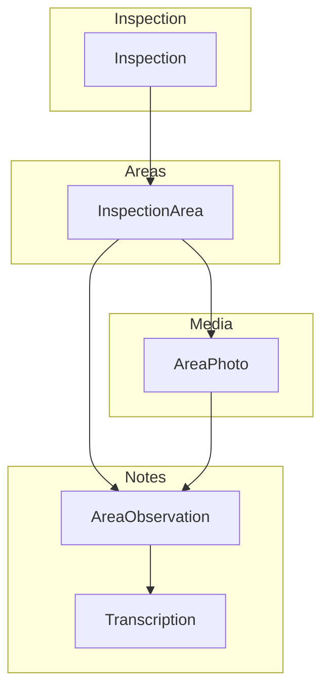
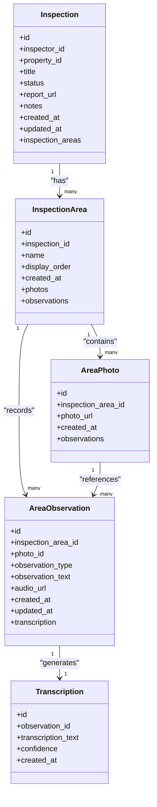
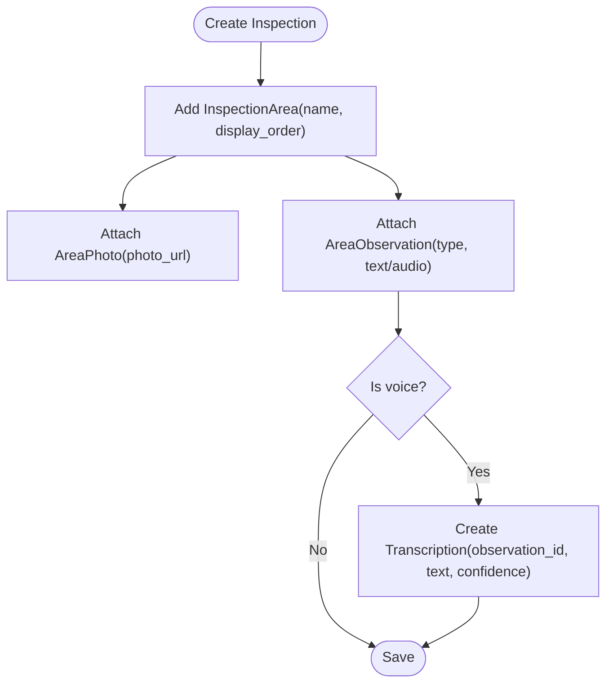
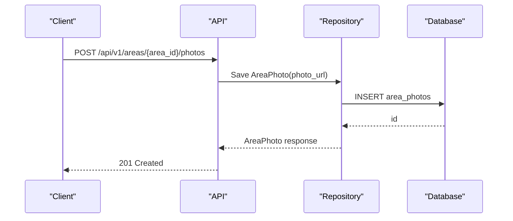
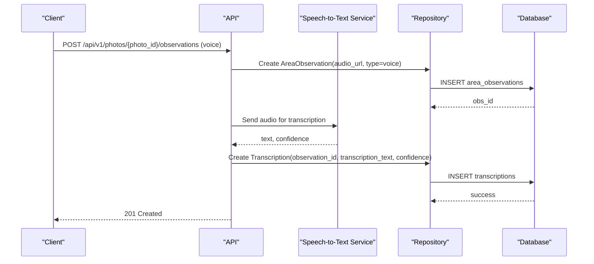
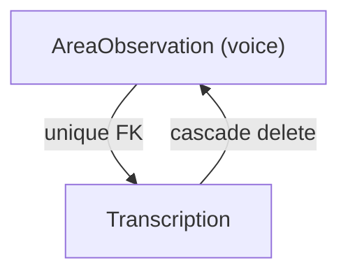
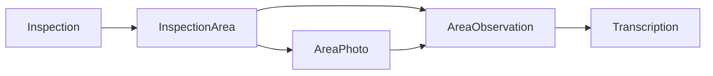

# Inspection Area, Photos & Observations

<cite>
**Referenced Files in This Document**
- [inspection.py](file://app/repository/inspection.py)
- [inspection_area.py](file://app/repository/inspection_area.py)
- [area_photo.py](file://app/repository/area_photo.py)
- [area_observation.py](file://app/repository/area_observation.py)
- [transcription.py](file://app/repository/transcription.py)
- [base.py](file://app/repository/base.py)
- [README.md](file://README.md)
- [TASK_DECOMPOSITION.md](file://TASK_DECOMPOSITION.md)
</cite>

## Table of Contents
1. [Introduction](#introduction)
2. [Project Structure](#project-structure)
3. [Core Components](#core-components)
4. [Architecture Overview](#architecture-overview)
5. [Detailed Component Analysis](#detailed-component-analysis)
6. [Dependency Analysis](#dependency-analysis)
7. [Performance Considerations](#performance-considerations)
8. [Troubleshooting Guide](#troubleshooting-guide)
9. [Conclusion](#conclusion)
10. [Appendices](#appendices)

## Introduction
This document explains how the inspection area documentation system models and manages inspections by breaking them into specific areas, capturing multimedia evidence through photos, and recording observations as text or voice notes. It also documents the integration with transcription for voice observations and clarifies the hierarchical relationships between inspections, areas, photos, observations, and transcriptions. You will find guidance on file handling patterns, media metadata considerations, and the one-to-one relationship between voice observations and their transcriptions. Examples are provided to illustrate documenting inspection areas with photos and voice notes.

## Project Structure
The repository organizes data models under app/repository, where each entity is defined as a SQLAlchemy model. The core entities relevant to this documentation are:
- Inspection: represents an inspection job tied to an inspector and property
- InspectionArea: defines a named, ordered section within an inspection
- AreaPhoto: stores references to photo assets associated with an area
- AreaObservation: captures text or voice observations linked to an area and optionally a photo
- Transcription: stores speech-to-text output for voice observations (one per observation)

**Diagram sources**
- [inspection.py:19-75](file://app/repository/inspection.py#L19-L75)
- [inspection_area.py:12-51](file://app/repository/inspection_area.py#L12-L51)
- [area_photo.py:12-43](file://app/repository/area_photo.py#L12-L43)
- [area_observation.py:18-70](file://app/repository/area_observation.py#L18-L70)
- [transcription.py:12-50](file://app/repository/transcription.py#L12-L50)

**Section sources**
- [README.md:21-63](file://README.md#L21-L63)
- [inspection.py:19-75](file://app/repository/inspection.py#L19-L75)
- [inspection_area.py:12-51](file://app/repository/inspection_area.py#L12-L51)
- [area_photo.py:12-43](file://app/repository/area_photo.py#L12-L43)
- [area_observation.py:18-70](file://app/repository/area_observation.py#L18-L70)
- [transcription.py:12-50](file://app/repository/transcription.py#L12-L50)

## Core Components
- Inspection: Top-level record for an inspection event; links to an inspector and property; contains ordered inspection areas.
- InspectionArea: Represents a specific part of the property being inspected (e.g., kitchen, roof). Includes name and display order. Holds lists of photos and observations.
- AreaPhoto: Stores a URL reference to a photo asset captured during the inspection. Linked to an inspection area.
- AreaObservation: Captures either text or voice observations. Can be attached to an area directly or to a specific photo. For voice observations, supports audio storage and optional transcription.
- Transcription: Stores the generated text from voice observations. Enforced one-to-one relationship with AreaObservation via unique foreign key.

Key behaviors:
- Hierarchical breakdown: Inspection → InspectionArea → AreaPhoto/AreaObservation
- Multimedia support: Photos stored as URLs; voice notes stored as audio URLs; optional transcription stored separately
- Cascade rules: Deleting an inspection area cascades to its photos and observations; deleting an observation cascades to its transcription

**Section sources**
- [inspection.py:19-75](file://app/repository/inspection.py#L19-L75)
- [inspection_area.py:12-51](file://app/repository/inspection_area.py#L12-L51)
- [area_photo.py:12-43](file://app/repository/area_photo.py#L12-L43)
- [area_observation.py:18-70](file://app/repository/area_observation.py#L18-L70)
- [transcription.py:12-50](file://app/repository/transcription.py#L12-L50)

## Architecture Overview
The system uses a relational model with clear ownership and cascade semantics. Inspections contain multiple inspection areas. Each area can have many photos and many observations. Observations may reference a photo. Voice observations generate transcriptions, which are uniquely bound to the observation.

**Diagram sources**
- [inspection.py:19-75](file://app/repository/inspection.py#L19-L75)
- [inspection_area.py:12-51](file://app/repository/inspection_area.py#L12-L51)
- [area_photo.py:12-43](file://app/repository/area_photo.py#L12-L43)
- [area_observation.py:18-70](file://app/repository/area_observation.py#L18-L70)
- [transcription.py:12-50](file://app/repository/transcription.py#L12-L50)

## Detailed Component Analysis

### Inspection and InspectionArea
- Inspection holds references to inspector and property and aggregates ordered inspection areas.
- InspectionArea includes name and display_order to control presentation sequence. It maintains relationships to photos and observations with cascade delete behavior.

**Diagram sources**
- [inspection.py:19-75](file://app/repository/inspection.py#L19-L75)
- [inspection_area.py:12-51](file://app/repository/inspection_area.py#L12-L51)
- [area_observation.py:18-70](file://app/repository/area_observation.py#L18-L70)
- [transcription.py:12-50](file://app/repository/transcription.py#L12-L50)

**Section sources**
- [inspection.py:19-75](file://app/repository/inspection.py#L19-L75)
- [inspection_area.py:12-51](file://app/repository/inspection_area.py#L12-L51)

### AreaPhoto
- Stores a photo URL and links back to its parent inspection area.
- Supports multiple observations per photo, enabling contextual notes tied to specific images.

**Diagram sources**
- [area_photo.py:12-43](file://app/repository/area_photo.py#L12-L43)
- [TASK_DECOMPOSITION.md:289-294](file://TASK_DECOMPOSITION.md#L289-L294)

**Section sources**
- [area_photo.py:12-43](file://app/repository/area_photo.py#L12-L43)
- [TASK_DECOMPOSITION.md:289-294](file://TASK_DECOMPOSITION.md#L289-L294)

### AreaObservation and Transcription Integration
- AreaObservation supports two types: text and voice. Text observations store observation_text; voice observations store audio_url.
- For voice observations, a Transcription is created with a one-to-one relationship enforced by a unique foreign key on observation_id.
- Optional fields include confidence scores from the speech-to-text provider.

**Diagram sources**
- [area_observation.py:18-70](file://app/repository/area_observation.py#L18-L70)
- [transcription.py:12-50](file://app/repository/transcription.py#L12-L50)
- [TASK_DECOMPOSITION.md:289-294](file://TASK_DECOMPOSITION.md#L289-L294)

**Section sources**
- [area_observation.py:18-70](file://app/repository/area_observation.py#L18-L70)
- [transcription.py:12-50](file://app/repository/transcription.py#L12-L50)
- [TASK_DECOMPOSITION.md:289-294](file://TASK_DECOMPOSITION.md#L289-L294)

### File Handling Patterns and Media Metadata
- Photos: Stored as URLs in AreaPhoto.photo_url. The task plan mentions pluggable storage backends and image optimization including thumbnail generation and EXIF metadata extraction (timestamp, GPS if present).
- Voice notes: Stored as URLs in AreaObservation.audio_url. The task plan outlines supported formats and asynchronous background processing for transcription to avoid blocking requests.
- Transcriptions: Store transcription_text and optional confidence score; updated manually via PATCH endpoint when inspectors correct text.

Practical implications:
- Use consistent URL schemes for media storage to simplify retrieval and caching.
- Capture and persist EXIF metadata at upload time to enrich photo records.
- Queue transcription tasks asynchronously to improve responsiveness.

**Section sources**
- [area_photo.py:12-43](file://app/repository/area_photo.py#L12-L43)
- [area_observation.py:18-70](file://app/repository/area_observation.py#L18-L70)
- [transcription.py:12-50](file://app/repository/transcription.py#L12-L50)
- [TASK_DECOMPOSITION.md:123-138](file://TASK_DECOMPOSITION.md#L123-L138)
- [TASK_DECOMPOSITION.md:289-294](file://TASK_DECOMPOSITION.md#L289-L294)

### One-to-One Relationship Between Observations and Transcriptions
- The Transcription model enforces a one-to-one relationship with AreaObservation using a unique foreign key on observation_id.
- Deletion of an observation cascades to its transcription, ensuring referential integrity.

**Diagram sources**
- [transcription.py:25-31](file://app/repository/transcription.py#L25-L31)
- [area_observation.py:65-69](file://app/repository/area_observation.py#L65-L69)

**Section sources**
- [transcription.py:25-31](file://app/repository/transcription.py#L25-L31)
- [area_observation.py:65-69](file://app/repository/area_observation.py#L65-L69)

## Dependency Analysis
The components exhibit clear hierarchical dependencies:
- Inspection depends on Inspector and Property (not shown here), and contains InspectionArea(s).
- InspectionArea depends on Inspection and owns AreaPhoto(s) and AreaObservation(s).
- AreaPhoto depends on InspectionArea and can be referenced by AreaObservation(s).
- AreaObservation depends on InspectionArea and optionally AreaPhoto; generates Transcription(s).
- Transcription depends on AreaObservation via a unique foreign key.

**Diagram sources**
- [inspection.py:19-75](file://app/repository/inspection.py#L19-L75)
- [inspection_area.py:12-51](file://app/repository/inspection_area.py#L12-L51)
- [area_photo.py:12-43](file://app/repository/area_photo.py#L12-L43)
- [area_observation.py:18-70](file://app/repository/area_observation.py#L18-L70)
- [transcription.py:12-50](file://app/repository/transcription.py#L12-L50)

**Section sources**
- [inspection.py:19-75](file://app/repository/inspection.py#L19-L75)
- [inspection_area.py:12-51](file://app/repository/inspection_area.py#L12-L51)
- [area_photo.py:12-43](file://app/repository/area_photo.py#L12-L43)
- [area_observation.py:18-70](file://app/repository/area_observation.py#L18-L70)
- [transcription.py:12-50](file://app/repository/transcription.py#L12-L50)

## Performance Considerations
- Lazy loading: Relationships use selectin loading to reduce N+1 queries when retrieving areas with photos and observations.
- Cascade deletes: Prevents orphaned records and reduces cleanup overhead.
- Asynchronous transcription: Offload speech-to-text processing to background tasks to keep API responses fast.
- Media optimization: Generate thumbnails and extract EXIF metadata at upload time to speed up rendering and enable richer queries.

[No sources needed since this section provides general guidance]

## Troubleshooting Guide
Common issues and resolutions:
- Missing transcription after voice upload: Ensure transcription creation is triggered after successful audio upload and that the unique constraint on observation_id is respected.
- Orphaned photos or observations: Verify cascade rules and deletion paths; inspect foreign keys and ensure parent records exist before creating children.
- Slow list endpoints: Check lazy loading strategies and consider eager loading for frequently accessed relationships.
- Audio format errors: Validate supported formats and handle transcoding gracefully before storing audio_url.

**Section sources**
- [area_observation.py:18-70](file://app/repository/area_observation.py#L18-L70)
- [transcription.py:12-50](file://app/repository/transcription.py#L12-L50)
- [area_photo.py:12-43](file://app/repository/area_photo.py#L12-L43)

## Conclusion
The inspection area documentation system provides a robust, hierarchical model for capturing structured inspection data with rich multimedia support. By organizing content around InspectionArea, linking photos and observations, and integrating transcription for voice notes, the system enables comprehensive defect documentation. The one-to-one relationship between observations and transcriptions ensures data integrity, while cascade rules and lazy loading optimize performance and maintainability.

[No sources needed since this section summarizes without analyzing specific files]

## Appendices

### Example Workflows

#### Documenting an Inspection Area with Photos
1. Create an InspectionArea within an Inspection with a name and display_order.
2. Upload one or more photos to the area, storing photo URLs in AreaPhoto records.
3. Optionally attach observations to specific photos for detailed context.

References:
- [inspection_area.py:12-51](file://app/repository/inspection_area.py#L12-L51)
- [area_photo.py:12-43](file://app/repository/area_photo.py#L12-L43)
- [TASK_DECOMPOSITION.md:289-294](file://TASK_DECOMPOSITION.md#L289-L294)

#### Adding Voice Notes and Transcriptions
1. Create an AreaObservation with observation_type set to voice and store audio_url.
2. Trigger transcription asynchronously to generate transcription_text and confidence.
3. Allow manual correction of transcription via PATCH endpoint.

References:
- [area_observation.py:18-70](file://app/repository/area_observation.py#L18-L70)
- [transcription.py:12-50](file://app/repository/transcription.py#L12-L50)
- [TASK_DECOMPOSITION.md:289-294](file://TASK_DECOMPOSITION.md#L289-L294)