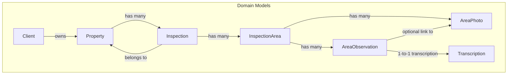
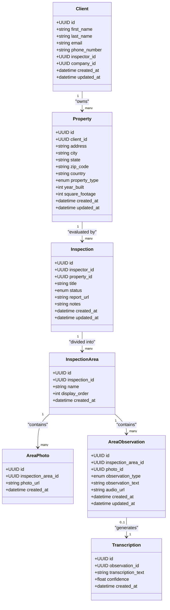
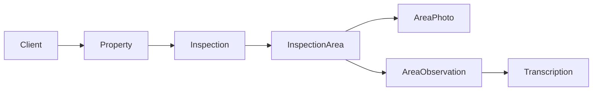
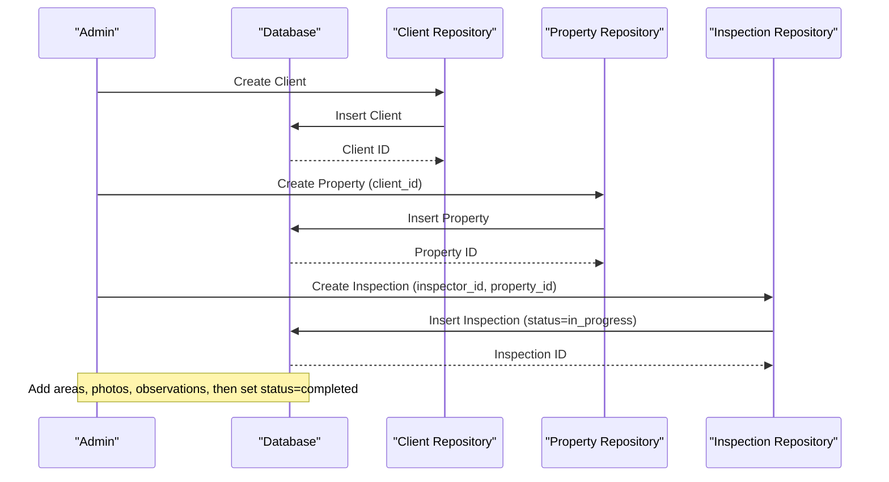

# Property, Client & Inspection Models

<cite>
**Referenced Files in This Document**
- [client.py](file://app/repository/client.py)
- [property.py](file://app/repository/property.py)
- [inspection.py](file://app/repository/inspection.py)
- [inspection_area.py](file://app/repository/inspection_area.py)
- [area_observation.py](file://app/repository/area_observation.py)
- [area_photo.py](file://app/repository/area_photo.py)
- [transcription.py](file://app/repository/transcription.py)
- [base.py](file://app/repository/base.py)
- [README.md](file://README.md)
</cite>

## Table of Contents
1. [Introduction](#introduction)
2. [Project Structure](#project-structure)
3. [Core Components](#core-components)
4. [Architecture Overview](#architecture-overview)
5. [Detailed Component Analysis](#detailed-component-analysis)
6. [Dependency Analysis](#dependency-analysis)
7. [Performance Considerations](#performance-considerations)
8. [Troubleshooting Guide](#troubleshooting-guide)
9. [Conclusion](#conclusion)
10. [Appendices](#appendices)

## Introduction
This document explains the property management and inspection workflow models that underpin DefectLoupe’s backend. It focuses on the Client–Property–Inspection hierarchy: clients own properties, and inspections document evaluations of those properties. You will find field specifications for client information, property details, and inspection records, along with examples of creating inspection workflows and managing property data. The supporting entities (inspection areas, photos, observations, transcriptions) are included to show how detailed inspection content is structured around an inspection.

## Project Structure
The relevant domain models live in the repository layer as SQLAlchemy declarative classes. They define tables, columns, constraints, and relationships that enforce data integrity across clients, properties, and inspections. Supporting models capture the granular inspection content such as areas, photos, observations, and voice transcriptions.

**Diagram sources**
- [client.py:12-78](file://app/repository/client.py#L12-L78)
- [property.py:20-70](file://app/repository/property.py#L20-L70)
- [inspection.py:19-75](file://app/repository/inspection.py#L19-L75)
- [inspection_area.py:12-51](file://app/repository/inspection_area.py#L12-L51)
- [area_photo.py:12-43](file://app/repository/area_photo.py#L12-L43)
- [area_observation.py:18-70](file://app/repository/area_observation.py#L18-L70)
- [transcription.py:12-50](file://app/repository/transcription.py#L12-L50)

**Section sources**
- [README.md:21-63](file://README.md#L21-L63)

## Core Components
This section summarizes the primary entities and their roles in the Client–Property–Inspection workflow.

- Client: Represents a property owner or home buyer. Clients can be associated with an inspector and/or a company (agency). Clients own one or more properties.
- Property: Represents a physical location with address and attributes (type, year built, square footage). Each property belongs to exactly one client and can have multiple inspections.
- Inspection: Represents a job evaluating a specific property by a specific inspector. Inspections have lifecycle states and optional metadata like title, report URL, and notes.
- InspectionArea: Breaks an inspection into ordered sections (e.g., kitchen, roof). Areas can contain photos and observations.
- AreaPhoto: Stores a photo URL tied to an inspection area.
- AreaObservation: Captures text or voice observations linked to an area or optionally to a specific photo. Voice observations may have a transcription.
- Transcription: One-to-one text transcription generated from a voice observation.

These components together enable a structured, auditable inspection process from scheduling to completion.

**Section sources**
- [client.py:12-78](file://app/repository/client.py#L12-L78)
- [property.py:20-70](file://app/repository/property.py#L20-L70)
- [inspection.py:19-75](file://app/repository/inspection.py#L19-L75)
- [inspection_area.py:12-51](file://app/repository/inspection_area.py#L12-L51)
- [area_photo.py:12-43](file://app/repository/area_photo.py#L12-L43)
- [area_observation.py:18-70](file://app/repository/area_observation.py#L18-L70)
- [transcription.py:12-50](file://app/repository/transcription.py#L12-L50)

## Architecture Overview
The system enforces a clear hierarchy:
- A Client owns multiple Properties.
- An Inspection is created for a Property by an Inspector and progresses through defined statuses.
- An Inspection is decomposed into InspectionAreas, each containing AreaPhotos and AreaObservations.
- Voice-based AreaObservations can generate a Transcription.

**Diagram sources**
- [client.py:12-78](file://app/repository/client.py#L12-L78)
- [property.py:20-70](file://app/repository/property.py#L20-L70)
- [inspection.py:19-75](file://app/repository/inspection.py#L19-L75)
- [inspection_area.py:12-51](file://app/repository/inspection_area.py#L12-L51)
- [area_photo.py:12-43](file://app/repository/area_photo.py#L12-L43)
- [area_observation.py:18-70](file://app/repository/area_observation.py#L18-L70)
- [transcription.py:12-50](file://app/repository/transcription.py#L12-L50)

## Detailed Component Analysis

### Client Model
Purpose:
- Identifies the person or entity requesting or receiving inspection services.
- Supports both solo inspectors and agency contexts via optional links to an inspector and a company.

Key fields:
- Identifier: UUID primary key
- Name: first_name, last_name
- Contact: email (unique), phone_number (optional)
- Associations: inspector_id (optional), company_id (optional)
- Audit timestamps: created_at, updated_at

Relationships:
- One-to-many with Property (cascade delete-orphan ensures properties are removed when a client is deleted)
- Optional relationships to Inspector and Company

Constraints and behavior:
- Email uniqueness enforced at the database level
- Timestamps auto-managed by server defaults and update triggers

Use cases:
- Create a new client profile
- Link a client to an inspector or company
- Retrieve all properties owned by a client

**Section sources**
- [client.py:12-78](file://app/repository/client.py#L12-L78)

### Property Model
Purpose:
- Represents a physical asset evaluated during inspections.
- Encapsulates location and descriptive attributes.

Key fields:
- Identifier: UUID primary key
- Ownership: client_id (required; cascade delete on client removal)
- Address: address, city, state, zip_code, country (default US)
- Attributes: property_type (enum), year_built (optional), square_footage (optional)
- Audit timestamps: created_at, updated_at

Relationships:
- Many-to-one with Client
- One-to-many with Inspection (cascade delete-orphan ensures inspections are removed when a property is deleted)

Constraints and behavior:
- Required address fields ensure geolocation completeness
- Enumerated property type constrains input values

Use cases:
- Add a new property to a client
- Update property details
- Query properties by client or attribute filters

**Section sources**
- [property.py:20-70](file://app/repository/property.py#L20-L70)

### Inspection Model
Purpose:
- Records a scheduled or completed evaluation of a specific property by a specific inspector.
- Tracks lifecycle status and optional deliverables.

Key fields:
- Identifier: UUID primary key
- Associations: inspector_id (required), property_id (required)
- Metadata: title (optional), status (enum), report_url (optional), notes (optional)
- Audit timestamps: created_at, updated_at

Lifecycle states:
- IN_PROGRESS: Inspection started but not finished
- COMPLETED: Inspection finished and finalized
- CANCELLED: Inspection cancelled before completion

Relationships:
- Many-to-one with Property and Inspector
- One-to-many with InspectionArea (cascade delete-orphan)

Constraints and behavior:
- Status defaults to IN_PROGRESS upon creation
- Deleting a property cascades to its inspections

Use cases:
- Create an inspection for a property
- Transition status to COMPLETED or CANCELLED
- Attach a final report URL and notes

**Section sources**
- [inspection.py:19-75](file://app/repository/inspection.py#L19-L75)

### InspectionArea, AreaPhoto, AreaObservation, Transcription
Purpose:
- Decompose an inspection into ordered areas and attach rich media and observations.
- Support voice observations with automatic transcription.

Key points:
- InspectionArea: name and display_order define structure and sequence within an inspection.
- AreaPhoto: stores photo_url per area.
- AreaObservation: supports TEXT or VOICE types; can optionally link to a photo; includes audio_url for voice.
- Transcription: one-to-one mapping to a voice observation; stores transcription_text and optional confidence score.

Relationships:
- InspectionArea belongs to an Inspection
- AreaPhoto and AreaObservation belong to an InspectionArea
- AreaObservation optionally references an AreaPhoto
- AreaObservation has a one-to-one Transcription

Use cases:
- Define inspection areas in order
- Upload photos per area
- Record text or voice observations per area
- Generate and store transcriptions for voice notes

**Section sources**
- [inspection_area.py:12-51](file://app/repository/inspection_area.py#L12-L51)
- [area_photo.py:12-43](file://app/repository/area_photo.py#L12-L43)
- [area_observation.py:18-70](file://app/repository/area_observation.py#L18-L70)
- [transcription.py:12-50](file://app/repository/transcription.py#L12-L50)

## Dependency Analysis
The models form a layered dependency graph where higher-level entities depend on lower-level ones:
- Client depends on no other domain model (except optional Inspector/Company)
- Property depends on Client
- Inspection depends on Property and Inspector
- InspectionArea depends on Inspection
- AreaPhoto and AreaObservation depend on InspectionArea
- Transcription depends on AreaObservation

Cascade rules:
- Deleting a Client cascades to its Properties
- Deleting a Property cascades to its Inspections
- Deleting an Inspection cascades to its InspectionAreas
- Deleting an InspectionArea cascades to its Photos and Observations
- Deleting an AreaObservation cascades to its Transcription

**Diagram sources**
- [client.py:12-78](file://app/repository/client.py#L12-L78)
- [property.py:20-70](file://app/repository/property.py#L20-L70)
- [inspection.py:19-75](file://app/repository/inspection.py#L19-L75)
- [inspection_area.py:12-51](file://app/repository/inspection_area.py#L12-L51)
- [area_photo.py:12-43](file://app/repository/area_photo.py#L12-L43)
- [area_observation.py:18-70](file://app/repository/area_observation.py#L18-L70)
- [transcription.py:12-50](file://app/repository/transcription.py#L12-L50)

**Section sources**
- [client.py:12-78](file://app/repository/client.py#L12-L78)
- [property.py:20-70](file://app/repository/property.py#L20-L70)
- [inspection.py:19-75](file://app/repository/inspection.py#L19-L75)
- [inspection_area.py:12-51](file://app/repository/inspection_area.py#L12-L51)
- [area_photo.py:12-43](file://app/repository/area_photo.py#L12-L43)
- [area_observation.py:18-70](file://app/repository/area_observation.py#L18-L70)
- [transcription.py:12-50](file://app/repository/transcription.py#L12-L50)

## Performance Considerations
- Use selectin loading for eager-loaded collections (e.g., Client.properties, Property.inspections, Inspection.inspection_areas) to reduce N+1 queries when retrieving hierarchical data.
- Keep large text fields (notes, addresses) appropriately sized; consider indexing frequently filtered fields such as email and property_type if needed.
- For high-volume photo uploads, store URLs rather than binary data in the database to minimize storage overhead.
- When querying inspection histories, filter by status and date ranges to limit result sets.
- Ensure foreign keys and indexes exist on commonly joined columns (e.g., client_id, property_id, inspection_id) to optimize joins.

[No sources needed since this section provides general guidance]

## Troubleshooting Guide
Common issues and resolutions:
- Missing required fields:
  - Property requires a valid client_id and complete address fields. Validate inputs before insertion.
  - Inspection requires inspector_id and property_id. Ensure these IDs exist before creating an inspection.
- Status transitions:
  - Inspections default to IN_PROGRESS. If an inspection appears stuck, verify business logic updates status to COMPLETED or CANCELLED appropriately.
- Cascade deletions:
  - Deleting a Client removes all its Properties and subsequent Inspections. Confirm intended scope before deletion.
  - Deleting a Property removes all related Inspections and their areas/photos/observations.
- Duplicate emails:
  - Client email must be unique. Handle duplicate attempts gracefully with appropriate error responses.
- Voice observations without transcription:
  - Transcription is optional for text observations. For voice observations, ensure transcription generation runs successfully; otherwise, keep audio_url accessible for manual review.

**Section sources**
- [client.py:27-31](file://app/repository/client.py#L27-L31)
- [property.py:30-48](file://app/repository/property.py#L30-L48)
- [inspection.py:29-48](file://app/repository/inspection.py#L29-L48)
- [area_observation.py:33-45](file://app/repository/area_observation.py#L33-L45)
- [transcription.py:25-37](file://app/repository/transcription.py#L25-L37)

## Conclusion
The Client–Property–Inspection hierarchy provides a robust foundation for property inspection workflows. Clients own properties, which are evaluated through structured inspections composed of ordered areas, photos, and observations. The model design enforces referential integrity, supports rich inspection content, and enables scalable operations for both solo inspectors and agencies. By following the field specifications and lifecycle states outlined here, teams can reliably create, manage, and audit inspection processes.

[No sources needed since this section summarizes without analyzing specific files]

## Appendices

### Field Specifications Summary

- Client
  - id: UUID PK
  - first_name: Text, required
  - last_name: Text, required
  - email: String(255), unique, required
  - phone_number: String(20), optional
  - inspector_id: UUID FK, optional
  - company_id: UUID FK, optional
  - created_at, updated_at: DateTime with timezone defaults

- Property
  - id: UUID PK
  - client_id: UUID FK, required
  - address: Text, required
  - city: String(100), required
  - state: String(100), required
  - zip_code: String(20), required
  - country: String(100), default US
  - property_type: Enum (residential, commercial, industrial, other), default residential
  - year_built: Integer, optional
  - square_footage: Integer, optional
  - created_at, updated_at: DateTime with timezone defaults

- Inspection
  - id: UUID PK
  - inspector_id: UUID FK, required
  - property_id: UUID FK, required
  - title: Text, optional
  - status: Enum (in_progress, completed, cancelled), default in_progress
  - report_url: Text, optional
  - notes: Text, optional
  - created_at, updated_at: DateTime with timezone defaults

- InspectionArea
  - id: UUID PK
  - inspection_id: UUID FK, required
  - name: Text, required
  - display_order: Integer, default 0
  - created_at: DateTime with timezone default

- AreaPhoto
  - id: UUID PK
  - inspection_area_id: UUID FK, required
  - photo_url: Text, required
  - created_at: DateTime with timezone default

- AreaObservation
  - id: UUID PK
  - inspection_area_id: UUID FK, required
  - photo_id: UUID FK, optional
  - observation_type: Enum (text, voice), required
  - observation_text: Text, optional
  - audio_url: Text, optional
  - created_at, updated_at: DateTime with timezone defaults

- Transcription
  - id: UUID PK
  - observation_id: UUID FK, unique, required
  - transcription_text: Text, required
  - confidence: Float, optional
  - created_at: DateTime with timezone default

**Section sources**
- [client.py:18-59](file://app/repository/client.py#L18-L59)
- [property.py:23-58](file://app/repository/property.py#L23-L58)
- [inspection.py:23-58](file://app/repository/inspection.py#L23-L58)
- [inspection_area.py:16-34](file://app/repository/inspection_area.py#L16-L34)
- [area_photo.py:16-33](file://app/repository/area_photo.py#L16-L33)
- [area_observation.py:21-55](file://app/repository/area_observation.py#L21-L55)
- [transcription.py:19-42](file://app/repository/transcription.py#L19-L42)

### Example Workflows

- Create a Client
  - Steps:
    - Provide first_name, last_name, email (unique), and optional phone_number
    - Optionally associate with inspector_id and/or company_id
  - Outcome: New client record with timestamps

- Add a Property to a Client
  - Steps:
    - Provide client_id and full address fields
    - Set property_type and optional attributes (year_built, square_footage)
  - Outcome: Property linked to client; can be inspected later

- Create an Inspection for a Property
  - Steps:
    - Provide inspector_id and property_id
    - Set optional title, notes, and report_url
    - Status defaults to IN_PROGRESS
  - Outcome: Inspection record created; can be broken into areas

- Build an Inspection Workflow
  - Steps:
    - Define InspectionAreas with names and display_order
    - Upload AreaPhotos per area
    - Record AreaObservations (text or voice) per area
    - For voice observations, generate Transcription entries
    - Mark Inspection status as COMPLETED when done
  - Outcome: Complete, auditable inspection record with rich media and notes

**Diagram sources**
- [client.py:12-78](file://app/repository/client.py#L12-L78)
- [property.py:20-70](file://app/repository/property.py#L20-L70)
- [inspection.py:19-75](file://app/repository/inspection.py#L19-L75)