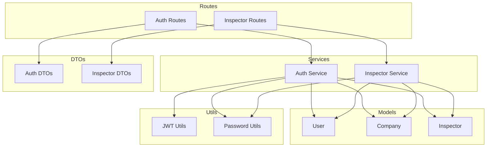
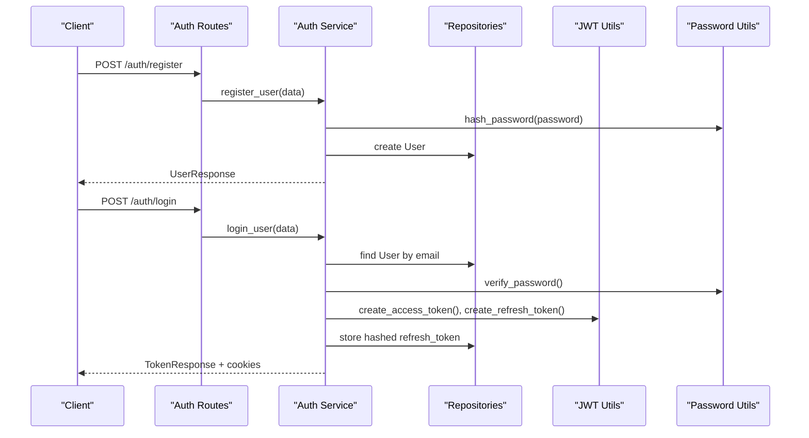
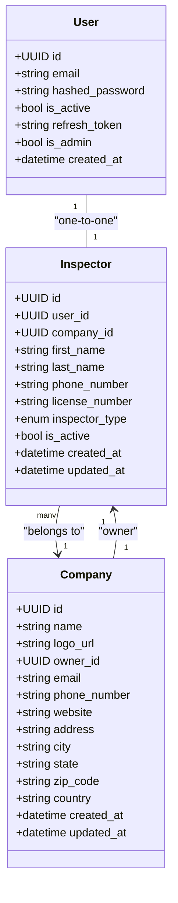
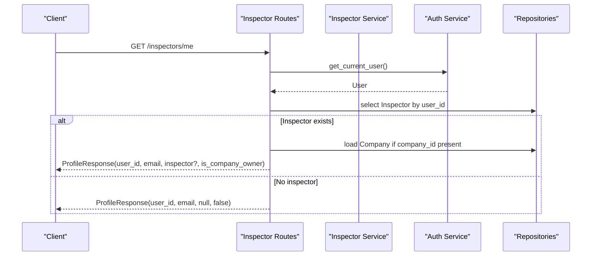
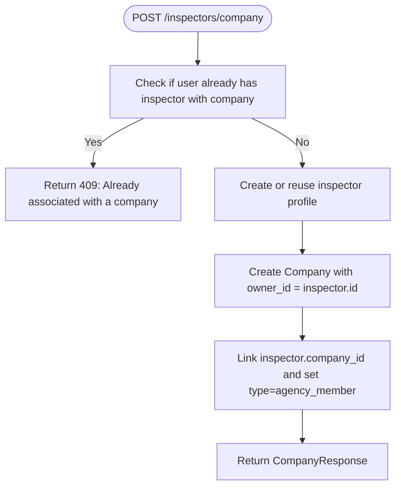
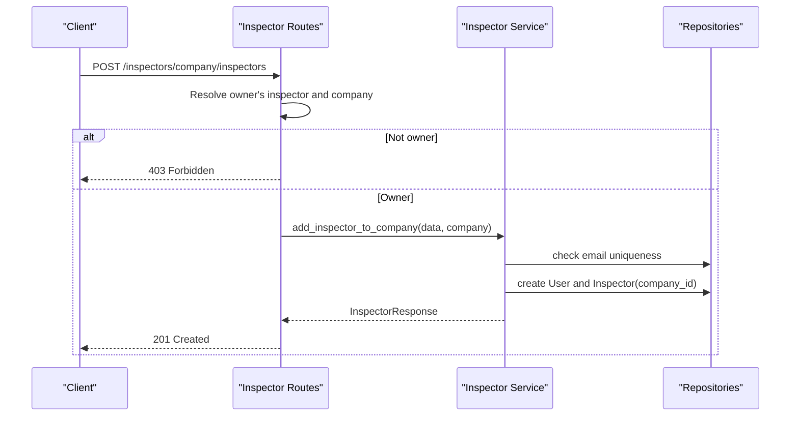
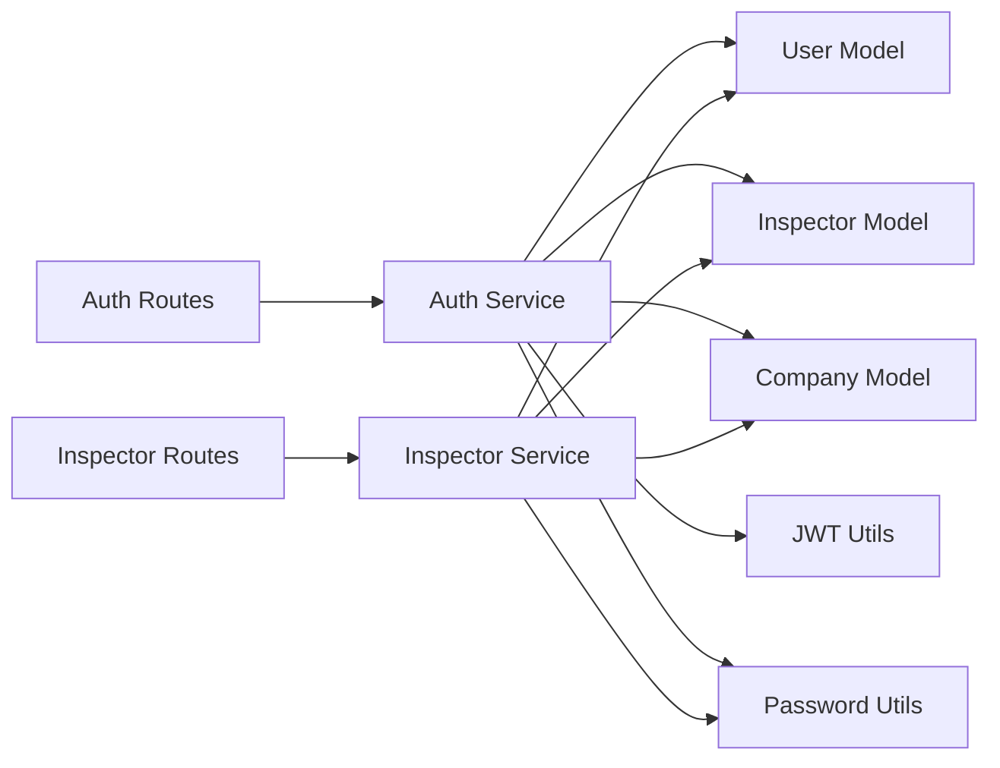

# User, Company & Inspector Models

<cite>
**Referenced Files in This Document**
- [user.py](file://app/repository/user.py)
- [company.py](file://app/repository/company.py)
- [inspector.py](file://app/repository/inspector.py)
- [auth_routes.py](file://app/api/routes/auth_routes.py)
- [inspector_routes.py](file://app/api/routes/inspector_routes.py)
- [auth_service.py](file://app/services/auth_service.py)
- [inspector_service.py](file://app/services/inspector_service.py)
- [auth_dtos.py](file://app/api/dtos/auth_dtos.py)
- [inspector_dtos.py](file://app/api/dtos/inspector_dtos.py)
- [jwt_utils.py](file://app/utils/jwt_utils.py)
- [password.py](file://app/utils/password.py)
</cite>

## Table of Contents
1. [Introduction](#introduction)
2. [Project Structure](#project-structure)
3. [Core Components](#core-components)
4. [Architecture Overview](#architecture-overview)
5. [Detailed Component Analysis](#detailed-component-analysis)
6. [Dependency Analysis](#dependency-analysis)
7. [Performance Considerations](#performance-considerations)
8. [Troubleshooting Guide](#troubleshooting-guide)
9. [Conclusion](#conclusion)
10. [Appendices](#appendices)

## Introduction
This document explains the core identity and organizational models: User, Company, and Inspector. It details their fields, relationships, and business rules, focusing on a multi-tenant architecture where inspectors belong to companies and users have inspector profiles. It also documents authentication-related fields, role-based access patterns, and the one-to-one relationship between users and inspectors. Practical examples are provided for creating users, assigning them to companies, and managing inspector profiles via API endpoints.

## Project Structure
The identity and organization features span repositories (data models), services (business logic), routes (APIs), DTOs (request/response schemas), and utilities (JWT and password handling). The key files involved are listed below.

**Diagram sources**
- [user.py:10-54](file://app/repository/user.py#L10-L54)
- [company.py:12-61](file://app/repository/company.py#L12-L61)
- [inspector.py:18-82](file://app/repository/inspector.py#L18-L82)
- [auth_routes.py:22-65](file://app/api/routes/auth_routes.py#L22-L65)
- [inspector_routes.py:23-143](file://app/api/routes/inspector_routes.py#L23-L143)
- [auth_service.py:36-270](file://app/services/auth_service.py#L36-L270)
- [inspector_service.py:17-134](file://app/services/inspector_service.py#L17-L134)
- [auth_dtos.py:7-39](file://app/api/dtos/auth_dtos.py#L7-L39)
- [inspector_dtos.py:5-63](file://app/api/dtos/inspector_dtos.py#L5-L63)
- [jwt_utils.py:14-51](file://app/utils/jwt_utils.py#L14-L51)
- [password.py:6-12](file://app/utils/password.py#L6-L12)

**Section sources**
- [user.py:10-54](file://app/repository/user.py#L10-L54)
- [company.py:12-61](file://app/repository/company.py#L12-L61)
- [inspector.py:18-82](file://app/repository/inspector.py#L18-L82)
- [auth_routes.py:22-65](file://app/api/routes/auth_routes.py#L22-L65)
- [inspector_routes.py:23-143](file://app/api/routes/inspector_routes.py#L23-L143)
- [auth_service.py:36-270](file://app/services/auth_service.py#L36-L270)
- [inspector_service.py:17-134](file://app/services/inspector_service.py#L17-L134)
- [auth_dtos.py:7-39](file://app/api/dtos/auth_dtos.py#L7-L39)
- [inspector_dtos.py:5-63](file://app/api/dtos/inspector_dtos.py#L5-L63)
- [jwt_utils.py:14-51](file://app/utils/jwt_utils.py#L14-L51)
- [password.py:6-12](file://app/utils/password.py#L6-L12)

## Core Components
- User: Represents an account with authentication credentials and session state.
- Inspector: A profile tied to a user that can be associated with a company; includes type and activity flags.
- Company: An organization entity with contact details and an owner inspector.

Key relationships:
- One-to-one between User and Inspector (via user_id unique constraint and back_populates).
- Many-to-one from Inspector to Company (company_id foreign key).
- Company has an owner_id referencing an Inspector (one company has one owner inspector).

Authentication-related fields:
- User stores hashed_password and refresh_token (hashed).
- Access and refresh tokens are issued as JWTs and stored in cookies; refresh token is hashed in DB for rotation and revocation.

Role-based access patterns:
- get_current_user validates access token and ensures the user is active.
- get_current_inspector resolves the inspector profile for the current user.
- require_company_owner ensures the current user’s inspector owns the company.

**Section sources**
- [user.py:10-54](file://app/repository/user.py#L10-L54)
- [inspector.py:18-82](file://app/repository/inspector.py#L18-L82)
- [company.py:12-61](file://app/repository/company.py#L12-L61)
- [auth_service.py:195-270](file://app/services/auth_service.py#L195-L270)

## Architecture Overview
The system uses FastAPI routes to expose APIs, which delegate to services for business logic. Services interact with SQLAlchemy models (repositories) and use utilities for JWT and password hashing.

**Diagram sources**
- [auth_routes.py:25-34](file://app/api/routes/auth_routes.py#L25-L34)
- [auth_service.py:36-99](file://app/services/auth_service.py#L36-L99)
- [jwt_utils.py:14-40](file://app/utils/jwt_utils.py#L14-L40)
- [password.py:6-12](file://app/utils/password.py#L6-L12)

**Section sources**
- [auth_routes.py:25-65](file://app/api/routes/auth_routes.py#L25-L65)
- [auth_service.py:36-270](file://app/services/auth_service.py#L36-L270)
- [jwt_utils.py:14-51](file://app/utils/jwt_utils.py#L14-L51)
- [password.py:6-12](file://app/utils/password.py#L6-L12)

## Detailed Component Analysis

### Data Model Relationships

**Diagram sources**
- [user.py:10-54](file://app/repository/user.py#L10-L54)
- [inspector.py:18-82](file://app/repository/inspector.py#L18-L82)
- [company.py:12-61](file://app/repository/company.py#L12-L61)

**Section sources**
- [user.py:10-54](file://app/repository/user.py#L10-L54)
- [inspector.py:18-82](file://app/repository/inspector.py#L18-L82)
- [company.py:12-61](file://app/repository/company.py#L12-L61)

### Authentication Flow and Role Resolution

**Diagram sources**
- [inspector_routes.py:28-48](file://app/api/routes/inspector_routes.py#L28-L48)
- [auth_service.py:195-242](file://app/services/auth_service.py#L195-L242)

**Section sources**
- [inspector_routes.py:28-48](file://app/api/routes/inspector_routes.py#L28-L48)
- [auth_service.py:195-242](file://app/services/auth_service.py#L195-L242)

### Multi-Tenant Company Creation and Ownership

**Diagram sources**
- [inspector_service.py:17-72](file://app/services/inspector_service.py#L17-L72)
- [inspector_routes.py:53-64](file://app/api/routes/inspector_routes.py#L53-L64)

**Section sources**
- [inspector_service.py:17-72](file://app/services/inspector_service.py#L17-L72)
- [inspector_routes.py:53-64](file://app/api/routes/inspector_routes.py#L53-L64)

### Adding Inspectors to a Company (Owner-only)

**Diagram sources**
- [inspector_routes.py:89-121](file://app/api/routes/inspector_routes.py#L89-L121)
- [inspector_service.py:75-122](file://app/services/inspector_service.py#L75-L122)

**Section sources**
- [inspector_routes.py:89-121](file://app/api/routes/inspector_routes.py#L89-L121)
- [inspector_service.py:75-122](file://app/services/inspector_service.py#L75-L122)

### Field Definitions and Business Rules

- User
  - Fields: id (UUID), email (unique), hashed_password, is_active (default True), refresh_token (nullable), is_admin (default False), created_at.
  - Rules: Email must be unique; passwords are hashed; refresh_token is stored hashed for rotation and revocation.

- Inspector
  - Fields: id (UUID), user_id (unique FK to users), company_id (nullable FK to companies), first_name, last_name, phone_number, license_number, inspector_type (enum: individual, agency_member), is_active (default True), created_at, updated_at.
  - Rules: One-to-one with User via user_id; belongs to at most one Company; type indicates individual vs agency member; activity flag controls access.

- Company
  - Fields: id (UUID), name, logo_url (nullable), owner_id (FK to inspectors), email (unique), phone_number, website, address, city, state, zip_code, country, created_at, updated_at.
  - Rules: Has many inspectors; one owner inspector; owner_id determines who can manage company-level actions.

- Multi-tenancy
  - Inspectors belong to a Company; operations scoped to a company enforce tenant isolation.
  - Owner checks ensure only the company owner can perform sensitive actions like adding inspectors.

- Authentication and Authorization
  - Access token validates identity; refresh token rotation invalidates old tokens.
  - get_current_user enforces active status.
  - get_current_inspector ensures the user has an inspector profile.
  - require_company_owner ensures ownership before allowing company management.

**Section sources**
- [user.py:10-54](file://app/repository/user.py#L10-L54)
- [inspector.py:18-82](file://app/repository/inspector.py#L18-L82)
- [company.py:12-61](file://app/repository/company.py#L12-L61)
- [auth_service.py:59-190](file://app/services/auth_service.py#L59-L190)
- [auth_service.py:195-270](file://app/services/auth_service.py#L195-L270)

## Dependency Analysis

**Diagram sources**
- [auth_routes.py:22-65](file://app/api/routes/auth_routes.py#L22-L65)
- [inspector_routes.py:23-143](file://app/api/routes/inspector_routes.py#L23-L143)
- [auth_service.py:36-270](file://app/services/auth_service.py#L36-L270)
- [inspector_service.py:17-134](file://app/services/inspector_service.py#L17-L134)
- [jwt_utils.py:14-51](file://app/utils/jwt_utils.py#L14-L51)
- [password.py:6-12](file://app/utils/password.py#L6-L12)

**Section sources**
- [auth_routes.py:22-65](file://app/api/routes/auth_routes.py#L22-L65)
- [inspector_routes.py:23-143](file://app/api/routes/inspector_routes.py#L23-L143)
- [auth_service.py:36-270](file://app/services/auth_service.py#L36-L270)
- [inspector_service.py:17-134](file://app/services/inspector_service.py#L17-L134)
- [jwt_utils.py:14-51](file://app/utils/jwt_utils.py#L14-L51)
- [password.py:6-12](file://app/utils/password.py#L6-L12)

## Performance Considerations
- Use eager loading where appropriate to reduce N+1 queries when fetching related entities (e.g., company inspectors).
- Indexing recommendations:
  - users.email (unique)
  - inspectors.user_id (unique)
  - inspectors.company_id
  - companies.owner_id
- Token rotation minimizes risk but requires careful handling of refresh token storage and validation.

[No sources needed since this section provides general guidance]

## Troubleshooting Guide
Common issues and resolutions:
- Invalid credentials: Ensure email exists and password matches; check hashing utility usage.
- Account deactivated: Verify user.is_active; reactivation may be required.
- Refresh token reuse detected: Indicates possible token theft; sessions are revoked; re-authenticate.
- Not a company member: Ensure the current user’s inspector has a company_id.
- Only the company owner can perform this action: Validate company.owner_id against current inspector.id.

**Section sources**
- [auth_service.py:59-190](file://app/services/auth_service.py#L59-L190)
- [auth_service.py:195-270](file://app/services/auth_service.py#L195-L270)
- [inspector_routes.py:89-121](file://app/api/routes/inspector_routes.py#L89-L121)

## Conclusion
The identity and organizational model centers around a one-to-one User–Inspector relationship and a many-to-one Inspector–Company relationship. Authentication leverages JWT access and refresh tokens with secure cookie handling and token rotation. Multi-tenancy is enforced through company association and owner-based authorization. The provided APIs support creating users, forming companies, and managing inspector profiles within tenants.

[No sources needed since this section summarizes without analyzing specific files]

## Appendices

### API Examples

- Create a user
  - Endpoint: POST /auth/register
  - Request body: email, password
  - Response: UserResponse
  - Notes: Password is hashed; email must be unique.

- Log in and receive tokens
  - Endpoint: POST /auth/login
  - Request body: email, password
  - Response: TokenResponse with expiry times; cookies set for access and refresh tokens.

- Get current user profile
  - Endpoint: GET /auth/me
  - Requires: Valid access token cookie
  - Response: UserResponse

- Get inspector profile and ownership status
  - Endpoint: GET /inspectors/me
  - Requires: Valid access token cookie
  - Response: ProfileResponse including inspector (if any) and is_company_owner flag.

- Create a company (become owner)
  - Endpoint: POST /inspectors/company
  - Requires: Valid access token cookie
  - Request body: name, email, address, city, state, zip_code, country, optional phone_number, website
  - Behavior: Creates inspector profile if missing, sets inspector type to agency_member, links company owner to inspector.

- Add an inspector to your company (owner-only)
  - Endpoint: POST /inspectors/company/inspectors
  - Requires: Valid access token cookie; caller must be company owner
  - Request body: email, password, first_name, last_name, optional phone_number, license_number
  - Behavior: Creates User and Inspector linked to the company; sets inspector type to agency_member.

- List inspectors in your company
  - Endpoint: GET /inspectors/company/inspectors
  - Requires: Valid access token cookie; caller must belong to a company
  - Response: List of InspectorResponse

- Logout
  - Endpoint: POST /auth/logout
  - Requires: Valid access token cookie
  - Behavior: Clears refresh token in DB and removes auth cookies.

**Section sources**
- [auth_routes.py:25-65](file://app/api/routes/auth_routes.py#L25-L65)
- [inspector_routes.py:28-143](file://app/api/routes/inspector_routes.py#L28-L143)
- [auth_service.py:36-270](file://app/services/auth_service.py#L36-L270)
- [inspector_service.py:17-134](file://app/services/inspector_service.py#L17-L134)
- [auth_dtos.py:7-39](file://app/api/dtos/auth_dtos.py#L7-L39)
- [inspector_dtos.py:5-63](file://app/api/dtos/inspector_dtos.py#L5-L63)