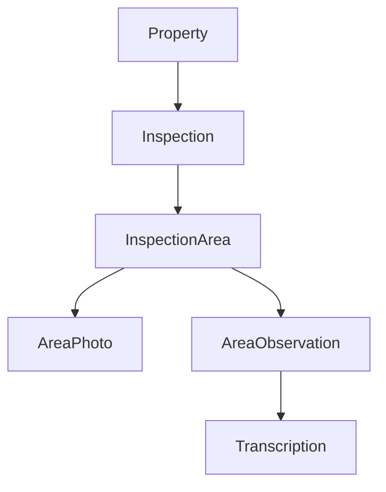
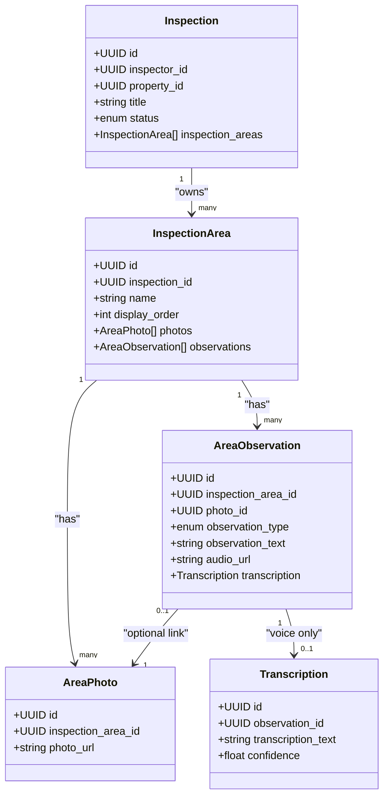
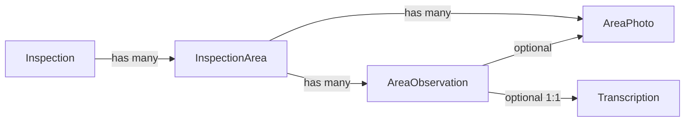

# Area Documentation

<cite>
**Referenced Files in This Document**
- [inspection.py](file://app/repository/inspection.py)
- [inspection_area.py](file://app/repository/inspection_area.py)
- [area_observation.py](file://app/repository/area_observation.py)
- [area_photo.py](file://app/repository/area_photo.py)
- [transcription.py](file://app/repository/transcription.py)
- [property.py](file://app/repository/property.py)
- [base.py](file://app/repository/base.py)
</cite>

## Table of Contents
1. [Introduction](#introduction)
2. [Project Structure](#project-structure)
3. [Core Components](#core-components)
4. [Architecture Overview](#architecture-overview)
5. [Detailed Component Analysis](#detailed-component-analysis)
6. [Dependency Analysis](#dependency-analysis)
7. [Performance Considerations](#performance-considerations)
8. [Troubleshooting Guide](#troubleshooting-guide)
9. [Conclusion](#conclusion)

## Introduction
This document explains the area-based inspection model used to organize and record inspection content. It covers how properties are divided into areas, how areas relate to inspections, and how observations (text or voice) and photos are attached to areas. It also documents ordering and organization rules, data integrity constraints, and provides practical examples for creating areas, adding observations, attaching photos, and organizing inspection content.

## Project Structure
The area-based inspection system is implemented as a set of relational models with clear parent-child relationships:
- Inspections belong to a property and an inspector.
- Each inspection contains multiple InspectionAreas.
- Each InspectionArea can have multiple AreaPhotos and AreaObservations.
- Voice observations can have an optional Transcription.

**Diagram sources**
- [inspection.py:19-75](file://app/repository/inspection.py#L19-L75)
- [inspection_area.py:12-51](file://app/repository/inspection_area.py#L12-L51)
- [area_photo.py:12-43](file://app/repository/area_photo.py#L12-L43)
- [area_observation.py:18-70](file://app/repository/area_observation.py#L18-L70)
- [transcription.py:12-50](file://app/repository/transcription.py#L12-L50)

**Section sources**
- [inspection.py:19-75](file://app/repository/inspection.py#L19-L75)
- [inspection_area.py:12-51](file://app/repository/inspection_area.py#L12-L51)
- [area_photo.py:12-43](file://app/repository/area_photo.py#L12-L43)
- [area_observation.py:18-70](file://app/repository/area_observation.py#L18-L70)
- [transcription.py:12-50](file://app/repository/transcription.py#L12-L50)
- [property.py:20-70](file://app/repository/property.py#L20-L70)

## Core Components
- Inspection: Represents a single inspection event tied to a property and inspector. Contains ordered areas via a relationship configured to sort by display order.
- InspectionArea: A named section within an inspection that groups related observations and photos. Supports explicit ordering through a display_order field.
- AreaObservation: Records an observation linked to an area. Supports two types: text and voice. Can optionally attach a photo and, if voice, may have a transcription.
- AreaPhoto: Stores a photo URL associated with an area. Observations can reference a specific photo.
- Transcription: Optional one-to-one text transcription generated from a voice observation.

Key responsibilities:
- Organize inspection content by area with deterministic ordering.
- Support both text and voice observations with optional media attachments.
- Enforce referential integrity between areas, observations, photos, and transcriptions.

**Section sources**
- [inspection.py:19-75](file://app/repository/inspection.py#L19-L75)
- [inspection_area.py:12-51](file://app/repository/inspection_area.py#L12-L51)
- [area_observation.py:13-70](file://app/repository/area_observation.py#L13-L70)
- [area_photo.py:12-43](file://app/repository/area_photo.py#L12-L43)
- [transcription.py:12-50](file://app/repository/transcription.py#L12-L50)

## Architecture Overview
The area-based inspection architecture centers on InspectionArea as the grouping unit for observations and photos. The Inspection entity owns the list of areas, which are returned in a stable order based on display_order. Observations can be text or voice; voice observations can generate a transcription. Photos are stored at the area level and can be referenced by individual observations.

**Diagram sources**
- [inspection.py:19-75](file://app/repository/inspection.py#L19-L75)
- [inspection_area.py:12-51](file://app/repository/inspection_area.py#L12-L51)
- [area_observation.py:18-70](file://app/repository/area_observation.py#L18-L70)
- [area_photo.py:12-43](file://app/repository/area_photo.py#L12-L43)
- [transcription.py:12-50](file://app/repository/transcription.py#L12-L50)

## Detailed Component Analysis

### Inspection and Area Ordering
- Inspection holds a collection of InspectionArea objects.
- Areas are ordered by display_order when retrieved, ensuring consistent presentation across views.
- This ordering supports systematic walkthroughs during inspections.

Practical implications:
- When creating areas, assign meaningful display_order values to control sequence.
- If not specified, default ordering behavior applies; consider setting explicit order for clarity.

**Section sources**
- [inspection.py:70-75](file://app/repository/inspection.py#L70-L75)
- [inspection_area.py:28-29](file://app/repository/inspection_area.py#L28-L29)

### Area Model and Relationships
- InspectionArea links to its parent Inspection and aggregates AreaPhoto and AreaObservation collections.
- Deleting an Inspection cascades deletion to its areas, photos, and observations, preserving referential integrity.

Data integrity highlights:
- inspection_id is required and enforced by foreign key.
- name is required for each area.
- display_order is required and defaults to a safe value.

**Section sources**
- [inspection_area.py:12-51](file://app/repository/inspection_area.py#L12-L51)

### Observation Recording System (Text and Voice)
- AreaObservation supports two observation types: text and voice.
- Text observations store content in observation_text.
- Voice observations store audio_url and may include a Transcription entry.
- An observation can optionally reference a photo via photo_id to associate visual context.

Validation and constraints:
- observation_type must be one of the defined enum values.
- For text observations, provide observation_text.
- For voice observations, provide audio_url; transcription is optional but recommended for searchability and reporting.

Example workflows:
- Create a text observation: set observation_type to text and populate observation_text.
- Create a voice observation: set observation_type to voice, upload audio to obtain audio_url, and optionally create a transcription afterward.

**Section sources**
- [area_observation.py:13-70](file://app/repository/area_observation.py#L13-L70)
- [transcription.py:12-50](file://app/repository/transcription.py#L12-L50)

### Photo Attachments and Association
- AreaPhoto stores photo_url and belongs to an InspectionArea.
- Observations can link to a specific photo using photo_id, enabling precise contextual references.
- Deleting an area cascades deletion of its photos.

Usage patterns:
- Upload a photo to obtain a URL, then create an AreaPhoto linked to the target area.
- To associate a photo with an observation, set the observation’s photo_id to the desired AreaPhoto id.

**Section sources**
- [area_photo.py:12-43](file://app/repository/area_photo.py#L12-L43)
- [area_observation.py:33-37](file://app/repository/area_observation.py#L33-L37)

### Creating Inspection Areas
Steps:
1. Ensure an Inspection exists for the target Property.
2. Create an InspectionArea with:
   - inspection_id referencing the Inspection.
   - name describing the area.
   - display_order to define sequence.
3. Optionally add AreaPhotos to the area.
4. Add AreaObservations (text or voice) to the area.

Ordering tip:
- Use increasing display_order values to establish a logical flow (e.g., 1, 2, 3).

**Section sources**
- [inspection.py:19-75](file://app/repository/inspection.py#L19-L75)
- [inspection_area.py:12-51](file://app/repository/inspection_area.py#L12-L51)

### Adding Observations and Attaching Photos
Steps:
1. Identify the target InspectionArea.
2. Create an AreaObservation:
   - Set observation_type to text or voice.
   - For text: set observation_text.
   - For voice: set audio_url; optionally create a Transcription later.
3. To attach a photo to an observation:
   - Ensure an AreaPhoto exists for the area.
   - Set observation.photo_id to the AreaPhoto id.

Notes:
- Observations are independent records; they do not require a photo.
- Photos are scoped to areas; observations can reference any photo within the same area.

**Section sources**
- [area_observation.py:18-70](file://app/repository/area_observation.py#L18-L70)
- [area_photo.py:12-43](file://app/repository/area_photo.py#L12-L43)

### Organizing Inspection Content
- Group related findings under a single InspectionArea to maintain structure.
- Use display_order to control the sequence of areas during review.
- Link observations to photos where appropriate to provide visual evidence.
- For voice observations, generate and store transcriptions to enable text-based search and reporting.

Best practices:
- Keep area names descriptive and concise.
- Maintain consistent display_order increments to allow future insertions.
- Prefer linking photos directly to observations for traceability.

[No sources needed since this section provides general guidance]

## Dependency Analysis
The following diagram shows how the core entities depend on each other and how deletions propagate.

Cascade behaviors:
- Deleting an Inspection removes all its areas, photos, and observations.
- Deleting an InspectionArea removes its photos and observations.
- Deleting an AreaPhoto does not remove observations; their photo_id becomes null-safe due to SET NULL behavior.
- Deleting an AreaObservation removes its optional Transcription.

**Diagram sources**
- [inspection.py:70-75](file://app/repository/inspection.py#L70-L75)
- [inspection_area.py:41-51](file://app/repository/inspection_area.py#L41-L51)
- [area_photo.py:22-43](file://app/repository/area_photo.py#L22-L43)
- [area_observation.py:27-70](file://app/repository/area_observation.py#L27-L70)
- [transcription.py:25-50](file://app/repository/transcription.py#L25-L50)

**Section sources**
- [inspection.py:70-75](file://app/repository/inspection.py#L70-L75)
- [inspection_area.py:41-51](file://app/repository/inspection_area.py#L41-L51)
- [area_photo.py:22-43](file://app/repository/area_photo.py#L22-L43)
- [area_observation.py:27-70](file://app/repository/area_observation.py#L27-L70)
- [transcription.py:25-50](file://app/repository/transcription.py#L25-L50)

## Performance Considerations
- Eager loading: Relationships use selectin loading for photos and observations to reduce N+1 queries when retrieving areas with their contents.
- Ordering: Display order ensures predictable UI rendering without additional sorting overhead.
- Indexes: While not defined here, consider indexing frequently queried fields such as inspection_id and inspection_area_id for performance at scale.

[No sources needed since this section provides general guidance]

## Troubleshooting Guide
Common issues and resolutions:
- Missing area name: Ensure name is provided when creating an InspectionArea.
- Invalid observation type: Use only supported enum values for observation_type.
- Orphaned photo references: If a photo is deleted, observation.photo_id will be set to null; handle gracefully in UI.
- Cascade deletes: Removing an Inspection or InspectionArea will delete dependent records; verify before destructive operations.
- Voice transcription: For voice observations, ensure transcription creation logic runs after audio processing to keep data consistent.

Operational tips:
- Validate required fields at the API layer before persisting.
- Use transactions to ensure atomicity when creating multiple related records (area, photos, observations).
- Log errors for failed transcription generation and retry as needed.

**Section sources**
- [inspection_area.py:28-29](file://app/repository/inspection_area.py#L28-L29)
- [area_observation.py:39-45](file://app/repository/area_observation.py#L39-L45)
- [area_photo.py:22-28](file://app/repository/area_photo.py#L22-L28)
- [transcription.py:25-37](file://app/repository/transcription.py#L25-L37)

## Conclusion
The area-based inspection model provides a structured way to organize inspection content through InspectionArea, supporting both text and voice observations with optional photo attachments and transcriptions. Clear relationships and cascade rules ensure data integrity, while display_order enables consistent presentation. By following the guidelines and constraints outlined above, teams can reliably create, manage, and retrieve inspection data in a scalable and maintainable manner.

[No sources needed since this section summarizes without analyzing specific files]