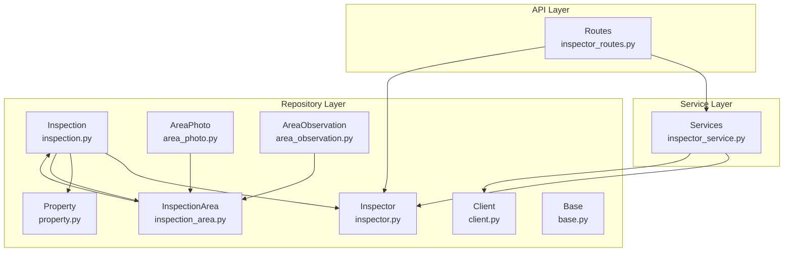
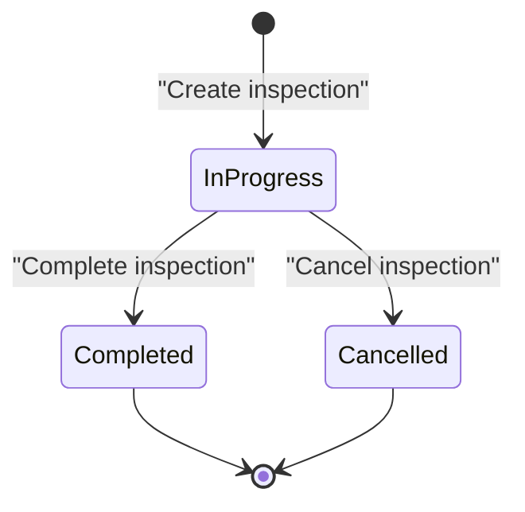
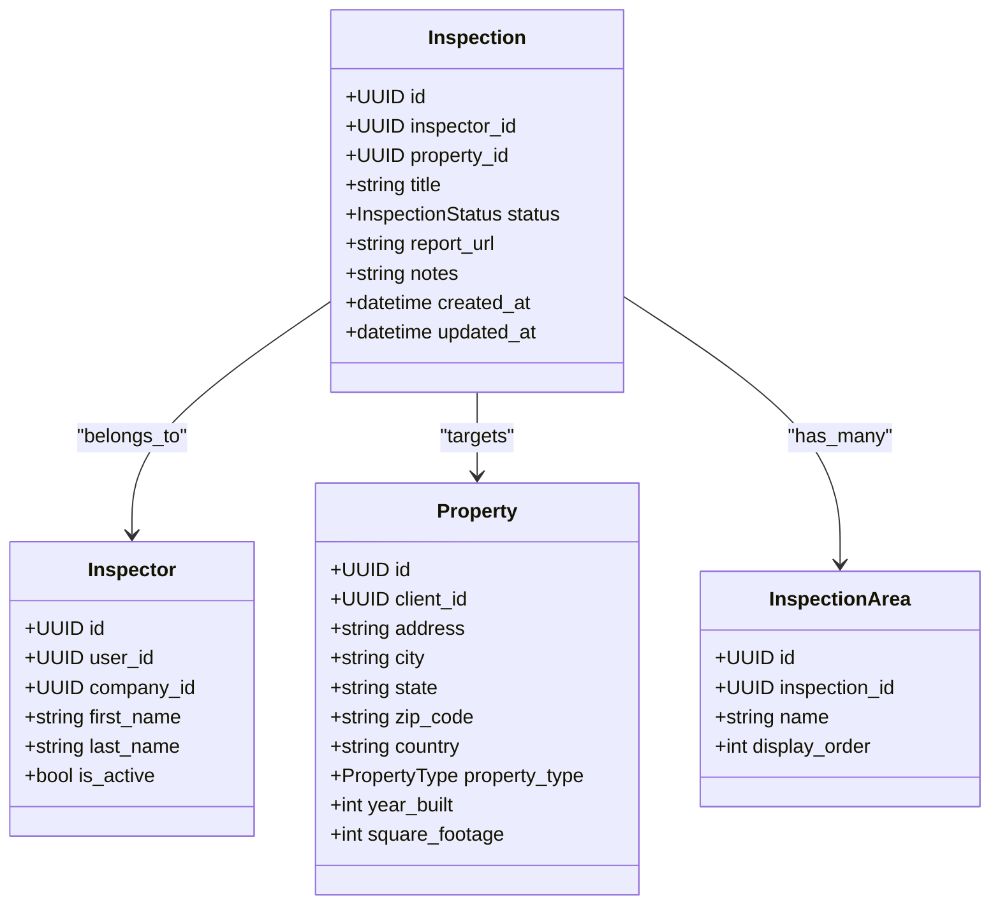
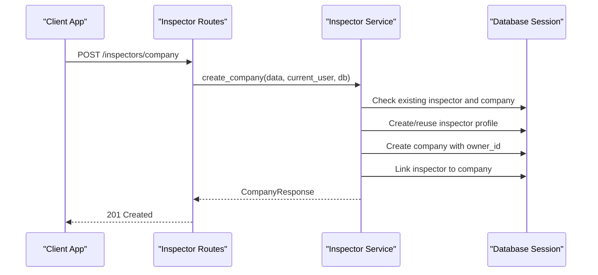
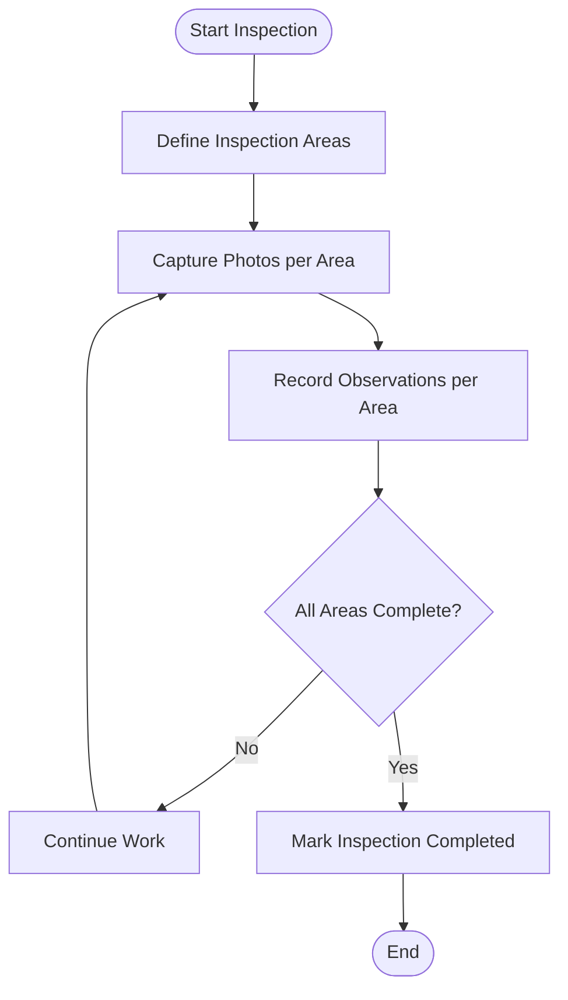
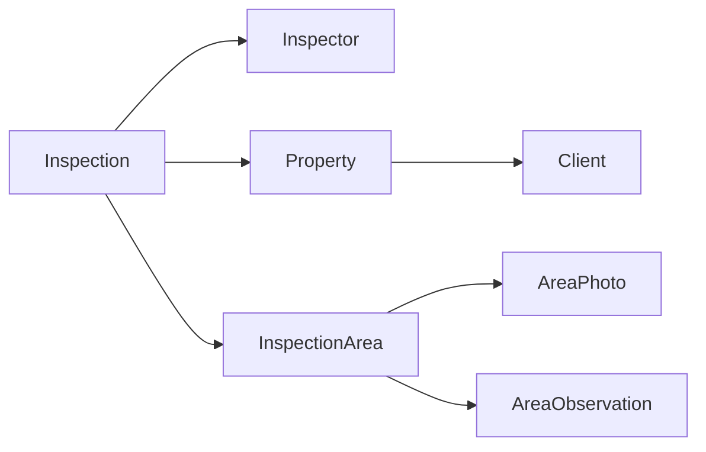

# Inspection Lifecycle

<cite>
**Referenced Files in This Document**
- [inspection.py](file://app/repository/inspection.py)
- [inspector.py](file://app/repository/inspector.py)
- [property.py](file://app/repository/property.py)
- [client.py](file://app/repository/client.py)
- [inspection_area.py](file://app/repository/inspection_area.py)
- [area_photo.py](file://app/repository/area_photo.py)
- [area_observation.py](file://app/repository/area_observation.py)
- [inspector_routes.py](file://app/api/routes/inspector_routes.py)
- [inspector_service.py](file://app/services/inspector_service.py)
- [inspector_dtos.py](file://app/api/dtos/inspector_dtos.py)
- [base.py](file://app/repository/base.py)
- [README.md](file://README.md)
</cite>

## Table of Contents
1. [Introduction](#introduction)
2. [Project Structure](#project-structure)
3. [Core Components](#core-components)
4. [Architecture Overview](#architecture-overview)
5. [Detailed Component Analysis](#detailed-component-analysis)
6. [Dependency Analysis](#dependency-analysis)
7. [Performance Considerations](#performance-considerations)
8. [Troubleshooting Guide](#troubleshooting-guide)
9. [Conclusion](#conclusion)
10. [Appendices](#appendices)

## Introduction
This document explains the inspection lifecycle management system, focusing on how inspections are created, assigned to inspectors, tracked through their status transitions, and completed with associated metadata. It covers the data model for inspections and its relationships to inspectors and properties, as well as the supporting structures for areas, photos, and observations that enable progress tracking and reporting.

The system supports:
- Creating an inspection linked to a specific inspector and property
- Tracking status transitions (in_progress, completed, cancelled)
- Managing inspection areas and associated media/observations
- Maintaining metadata such as timestamps, notes, and report links

## Project Structure
At a high level, the inspection lifecycle spans:
- Repository layer: ORM models defining entities and relationships
- API routes: HTTP endpoints for managing inspectors and company context
- Services: Business logic for orchestrating operations
- DTOs: Request/response schemas used by APIs

**Diagram sources**
- [inspector_routes.py:1-143](file://app/api/routes/inspector_routes.py#L1-L143)
- [inspector_service.py:1-134](file://app/services/inspector_service.py#L1-L134)
- [inspection.py:1-75](file://app/repository/inspection.py#L1-L75)
- [inspector.py:1-82](file://app/repository/inspector.py#L1-L82)
- [property.py:1-70](file://app/repository/property.py#L1-L70)
- [client.py:1-78](file://app/repository/client.py#L1-L78)
- [inspection_area.py:1-51](file://app/repository/inspection_area.py#L1-L51)
- [area_photo.py:1-43](file://app/repository/area_photo.py#L1-L43)
- [area_observation.py:1-70](file://app/repository/area_observation.py#L1-L70)
- [base.py:1-5](file://app/repository/base.py#L1-L5)

**Section sources**
- [README.md:21-63](file://README.md#L21-L63)
- [README.md:182-214](file://README.md#L182-L214)

## Core Components
- Inspection: Represents a job linking an inspector to a property, with status, notes, and report URL.
- Inspector: The person or agency member performing inspections; can be individual or part of a company.
- Property: The physical location being inspected, owned by a client.
- Client: The owner or buyer who engages the inspector.
- InspectionArea: Ordered sections within an inspection (e.g., Roof, Kitchen).
- AreaPhoto and AreaObservation: Media and notes attached to areas, enabling detailed progress tracking and evidence capture.

Key attributes and behaviors:
- Status transitions: in_progress, completed, cancelled
- Metadata: title, notes, report_url, created_at, updated_at
- Relationships: one-to-many from inspector to inspections; one-to-many from property to inspections; one-to-many from inspection to inspection_areas

**Section sources**
- [inspection.py:13-75](file://app/repository/inspection.py#L13-L75)
- [inspector.py:13-82](file://app/repository/inspector.py#L13-L82)
- [property.py:13-70](file://app/repository/property.py#L13-L70)
- [client.py:12-78](file://app/repository/client.py#L12-L78)
- [inspection_area.py:12-51](file://app/repository/inspection_area.py#L12-L51)
- [area_photo.py:12-43](file://app/repository/area_photo.py#L12-L43)
- [area_observation.py:13-70](file://app/repository/area_observation.py#L13-L70)

## Architecture Overview
The inspection lifecycle is modeled as a state machine with three primary statuses:
- in_progress: An inspection has been created and is actively underway
- completed: The inspection has finished and results are available
- cancelled: The inspection was terminated before completion

**Diagram sources**
- [inspection.py:13-46](file://app/repository/inspection.py#L13-L46)

## Detailed Component Analysis

### Inspection Model and Status Transitions
- The Inspection entity stores:
  - Links to inspector and property via foreign keys
  - Optional title, notes, and report_url
  - Timestamps for creation and updates
  - A status field constrained to the defined enum values
- Default status is set at creation time to in_progress
- Relationships:
  - One-to-one with Inspector (via inspector_id)
  - One-to-one with Property (via property_id)
  - One-to-many with InspectionArea (ordered list)

**Diagram sources**
- [inspection.py:19-75](file://app/repository/inspection.py#L19-L75)
- [inspector.py:18-82](file://app/repository/inspector.py#L18-L82)
- [property.py:20-70](file://app/repository/property.py#L20-L70)
- [inspection_area.py:12-51](file://app/repository/inspection_area.py#L12-L51)

**Section sources**
- [inspection.py:19-75](file://app/repository/inspection.py#L19-L75)

### Inspector Assignment and Company Context
- Inspectors can be individuals or agency members
- Company association enables multi-inspector workflows
- Routes provide endpoints to:
  - Retrieve current inspector profile
  - Create a company and associate the current user as owner
  - Add inspectors to a company (owner-only)
  - List inspectors within a company

**Diagram sources**
- [inspector_routes.py:53-64](file://app/api/routes/inspector_routes.py#L53-L64)
- [inspector_service.py:17-72](file://app/services/inspector_service.py#L17-L72)

**Section sources**
- [inspector_routes.py:26-143](file://app/api/routes/inspector_routes.py#L26-L143)
- [inspector_service.py:17-134](file://app/services/inspector_service.py#L17-L134)
- [inspector_dtos.py:5-63](file://app/api/dtos/inspector_dtos.py#L5-L63)

### Inspection Areas, Photos, and Observations
- InspectionArea provides ordered sections for structured walkthroughs
- AreaPhoto captures images tied to an area
- AreaObservation records text or voice notes, optionally linked to a photo
- These components support progress tracking and evidence collection during inspections

**Diagram sources**
- [inspection_area.py:12-51](file://app/repository/inspection_area.py#L12-L51)
- [area_photo.py:12-43](file://app/repository/area_photo.py#L12-L43)
- [area_observation.py:13-70](file://app/repository/area_observation.py#L13-L70)

**Section sources**
- [inspection_area.py:12-51](file://app/repository/inspection_area.py#L12-L51)
- [area_photo.py:12-43](file://app/repository/area_photo.py#L12-L43)
- [area_observation.py:13-70](file://app/repository/area_observation.py#L13-L70)

### Practical Examples

#### Example: Starting an Inspection
- Create an Inspection record linking:
  - inspector_id: the assigned inspector
  - property_id: the target property
  - status: defaults to in_progress
  - optional title and notes
- Use the repository to persist the inspection and ensure relationships are established

Reference paths:
- [inspection.py:19-46](file://app/repository/inspection.py#L19-L46)

#### Example: Updating Status
- Transition status between in_progress, completed, and cancelled based on workflow events
- Ensure updated_at timestamp reflects changes

Reference paths:
- [inspection.py:42-58](file://app/repository/inspection.py#L42-L58)

#### Example: Generating Reports
- After completing an inspection, set report_url to point to the generated report
- Optionally add notes summarizing findings

Reference paths:
- [inspection.py:47-48](file://app/repository/inspection.py#L47-L48)

#### Example: Progress Tracking
- Track progress by inspecting areas and adding photos/observations
- Use display_order to structure walkthroughs and compute completion metrics

Reference paths:
- [inspection_area.py:22-30](file://app/repository/inspection_area.py#L22-L30)
- [area_photo.py:22-29](file://app/repository/area_photo.py#L22-L29)
- [area_observation.py:27-45](file://app/repository/area_observation.py#L27-L45)

## Dependency Analysis
The inspection lifecycle depends on several interconnected components:

**Diagram sources**
- [inspection.py:29-75](file://app/repository/inspection.py#L29-L75)
- [inspector.py:27-82](file://app/repository/inspector.py#L27-L82)
- [property.py:30-70](file://app/repository/property.py#L30-L70)
- [client.py:36-78](file://app/repository/client.py#L36-L78)
- [inspection_area.py:22-51](file://app/repository/inspection_area.py#L22-L51)
- [area_photo.py:22-43](file://app/repository/area_photo.py#L22-L43)
- [area_observation.py:27-70](file://app/repository/area_observation.py#L27-L70)

**Section sources**
- [inspection.py:29-75](file://app/repository/inspection.py#L29-L75)
- [inspector.py:27-82](file://app/repository/inspector.py#L27-L82)
- [property.py:30-70](file://app/repository/property.py#L30-L70)
- [client.py:36-78](file://app/repository/client.py#L36-L78)
- [inspection_area.py:22-51](file://app/repository/inspection_area.py#L22-L51)
- [area_photo.py:22-43](file://app/repository/area_photo.py#L22-L43)
- [area_observation.py:27-70](file://app/repository/area_observation.py#L27-L70)

## Performance Considerations
- Use selectin loading for related collections (e.g., inspection_areas) to reduce N+1 queries when retrieving inspections with areas
- Keep status transitions atomic to avoid inconsistent states
- Index frequently queried fields such as inspector_id, property_id, and status for efficient filtering and listing
- Avoid excessive nested joins; prefer separate queries where appropriate for clarity and performance

[No sources needed since this section provides general guidance]

## Troubleshooting Guide
Common issues and resolutions:
- Missing inspector or property references: Ensure both IDs exist before creating an inspection
- Invalid status transitions: Validate allowed transitions in business logic
- Duplicate company associations: Prevent users from being associated with multiple companies
- Unauthorized actions: Enforce ownership checks for company-level operations

Reference paths:
- [inspector_service.py:27-72](file://app/services/inspector_service.py#L27-L72)
- [inspector_routes.py:89-121](file://app/api/routes/inspector_routes.py#L89-L121)

**Section sources**
- [inspector_service.py:27-134](file://app/services/inspector_service.py#L27-L134)
- [inspector_routes.py:89-143](file://app/api/routes/inspector_routes.py#L89-L143)

## Conclusion
The inspection lifecycle system centers around a robust Inspection model with clear status transitions and strong relationships to inspectors and properties. Supporting structures for areas, photos, and observations enable detailed progress tracking and reporting. While the current implementation focuses on core entities and inspector/company management, extending the API with dedicated inspection endpoints will complete the lifecycle workflow for creation, assignment, scheduling, and completion.

[No sources needed since this section summarizes without analyzing specific files]

## Appendices

### Data Model Summary
- User: Authentication and account management
- Company: Agency profile for multi-inspector organizations
- Inspector: Inspector profile linked to a user and optionally a company
- Client: Property owner or home buyer
- Property: Physical details of the inspected site
- Inspection: Job record linking inspector and property with status and metadata
- InspectionArea: Ordered sections within an inspection
- AreaPhoto: Images captured during inspections
- AreaObservation: Text or voice notes attached to areas or photos
- Transcription: Speech-to-text output for voice observations

**Section sources**
- [README.md:21-63](file://README.md#L21-L63)