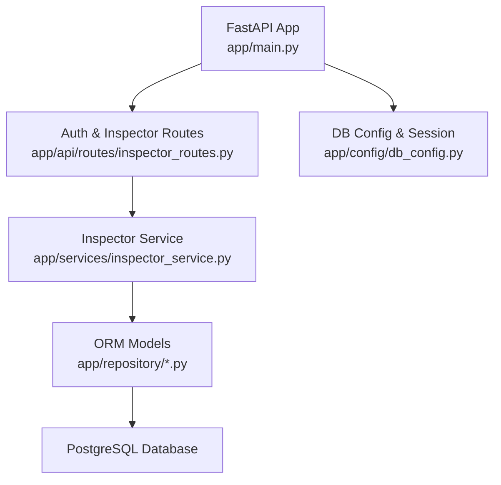
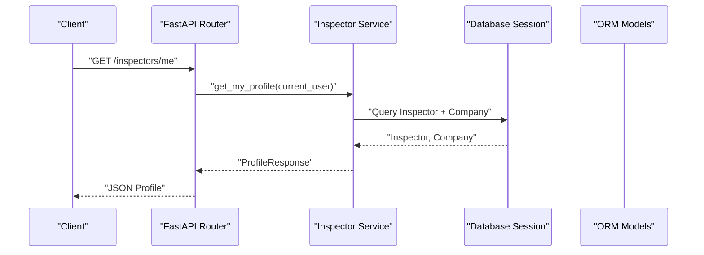
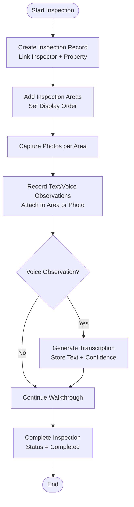
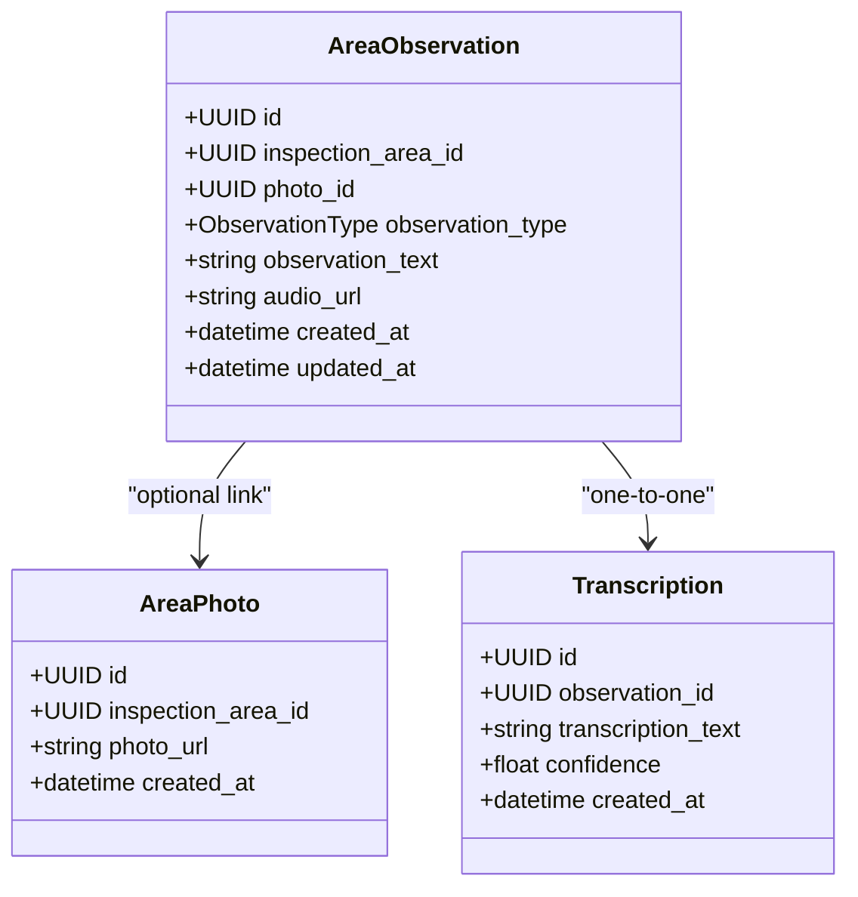
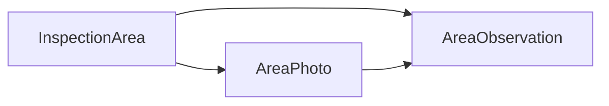
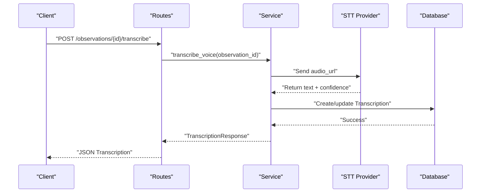
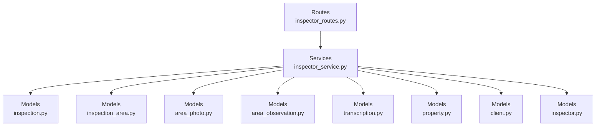

# Inspection Workflow

<cite>
**Referenced Files in This Document**
- [README.md](file://README.md)
- [TASK_DECOMPOSITION.md](file://TASK_DECOMPOSITION.md)
- [main.py](file://app/main.py)
- [db_config.py](file://app/config/db_config.py)
- [inspector_routes.py](file://app/api/routes/inspector_routes.py)
- [inspector_service.py](file://app/services/inspector_service.py)
- [inspection.py](file://app/repository/inspection.py)
- [inspection_area.py](file://app/repository/inspection_area.py)
- [area_photo.py](file://app/repository/area_photo.py)
- [area_observation.py](file://app/repository/area_observation.py)
- [transcription.py](file://app/repository/transcription.py)
- [property.py](file://app/repository/property.py)
- [client.py](file://app/repository/client.py)
- [inspector.py](file://app/repository/inspector.py)
- [inspector_dtos.py](file://app/api/dtos/inspector_dtos.py)
</cite>

## Table of Contents
1. Introduction
2. Project Structure
3. Core Components
4. Architecture Overview
5. Detailed Component Analysis
6. Dependency Analysis
7. Performance Considerations
8. Troubleshooting Guide
9. Conclusion
10. Appendices

## Introduction
This document explains the property inspection workflow system, focusing on how inspections are organized hierarchically from property selection through area-based documentation. It covers the inspection lifecycle, area organization, observation recording (text and voice), photo attachment, transcription processing, and the relationships between inspections, properties, areas, observations, photos, and transcriptions. It also provides practical examples for conducting inspections, managing data, and generating reports, along with guidance for extending workflows and customizing area types.

The system is a FastAPI backend that uses SQLAlchemy 2.0 with PostgreSQL and supports multi-tenant operations via companies and inspectors. The core relational model includes users, companies, inspectors, clients, properties, inspections, inspection areas, area photos, area observations, and transcriptions.

**Section sources**
- [README.md:21-63](file://README.md#L21-L63)
- [TASK_DECOMPOSITION.md:11-33](file://TASK_DECOMPOSITION.md#L11-L33)

## Project Structure
The application follows a layered architecture:
- API routes define endpoints and enforce authentication via dependencies.
- Services encapsulate business logic.
- Repositories define ORM models and relationships.
- Configuration manages database connections and sessions.
- Utilities provide shared helpers.



**Diagram sources**
- [main.py:11-21](file://app/main.py#L11-L21)
- [db_config.py:16-26](file://app/config/db_config.py#L16-L26)
- [inspector_routes.py:1-23](file://app/api/routes/inspector_routes.py#L1-L23)
- [inspector_service.py:1-15](file://app/services/inspector_service.py#L1-L15)

**Section sources**
- [main.py:11-21](file://app/main.py#L11-L21)
- [db_config.py:11-26](file://app/config/db_config.py#L11-L26)
- [README.md:182-213](file://README.md#L182-L213)

## Core Components
- Authentication and inspector profile management:
  - Endpoints to retrieve the current user’s inspector profile and company ownership status.
  - Company creation and inspector addition flows with validation and conflict checks.
- Data models for inspection workflow:
  - Inspection, Property, Client, Inspector, InspectionArea, AreaPhoto, AreaObservation, Transcription.
  - Relationships ensure referential integrity and cascade behaviors.

Key responsibilities:
- Inspections link an inspector to a property and track lifecycle status.
- Areas organize walkthroughs with ordering and support photos and observations.
- Observations capture text or voice notes; voice notes can be linked to transcriptions.
- Photos attach visual evidence to areas and optionally to specific observations.

**Section sources**
- [inspector_routes.py:26-143](file://app/api/routes/inspector_routes.py#L26-L143)
- [inspector_service.py:17-134](file://app/services/inspector_service.py#L17-L134)
- [inspection.py:13-75](file://app/repository/inspection.py#L13-L75)
- [inspection_area.py:12-51](file://app/repository/inspection_area.py#L12-L51)
- [area_photo.py:12-43](file://app/repository/area_photo.py#L12-L43)
- [area_observation.py:13-70](file://app/repository/area_observation.py#L13-L70)
- [transcription.py:12-50](file://app/repository/transcription.py#L12-L50)
- [property.py:20-70](file://app/repository/property.py#L20-L70)
- [client.py:12-78](file://app/repository/client.py#L12-L78)
- [inspector.py:18-82](file://app/repository/inspector.py#L18-L82)

## Architecture Overview
The inspection workflow spans multiple layers and entities:
- API layer exposes endpoints for inspector management and future inspection/media endpoints.
- Service layer enforces business rules (e.g., company ownership, inspector uniqueness).
- Repository layer defines persistent models and relationships.
- Database stores structured data with constraints and cascades.



**Diagram sources**
- [inspector_routes.py:28-48](file://app/api/routes/inspector_routes.py#L28-L48)
- [inspector_service.py:17-73](file://app/services/inspector_service.py#L17-L73)
- [db_config.py:21-26](file://app/config/db_config.py#L21-L26)

## Detailed Component Analysis

### Inspection Lifecycle and Area Organization
- Inspections represent a job linking an inspector and a property, with status transitions (in progress, completed, cancelled).
- Areas break down the inspection into ordered sections (e.g., kitchen, roof) and support photos and observations.
- Relationships:
  - Inspection has many InspectionAreas.
  - InspectionArea has many AreaPhotos and AreaObservations.
  - AreaObservation may reference an AreaPhoto and have one Transcription.



**Diagram sources**
- [inspection.py:13-75](file://app/repository/inspection.py#L13-L75)
- [inspection_area.py:12-51](file://app/repository/inspection_area.py#L12-L51)
- [area_observation.py:13-70](file://app/repository/area_observation.py#L13-L70)
- [transcription.py:12-50](file://app/repository/transcription.py#L12-L50)

**Section sources**
- [inspection.py:13-75](file://app/repository/inspection.py#L13-L75)
- [inspection_area.py:12-51](file://app/repository/inspection_area.py#L12-L51)

### Observation Recording (Text and Voice)
- Observations can be text or voice.
- Text observations store content directly.
- Voice observations store audio URL and can be linked to a transcription.
- Optional linkage to a specific photo enables defect-specific notes.



**Diagram sources**
- [area_observation.py:13-70](file://app/repository/area_observation.py#L13-L70)
- [area_photo.py:12-43](file://app/repository/area_photo.py#L12-L43)
- [transcription.py:12-50](file://app/repository/transcription.py#L12-L50)

**Section sources**
- [area_observation.py:13-70](file://app/repository/area_observation.py#L13-L70)
- [transcription.py:12-50](file://app/repository/transcription.py#L12-L50)

### Photo Attachment and Media Handling
- Photos are attached to inspection areas and can be referenced by observations.
- URLs store media references; actual storage backend is abstracted outside these models.
- Relationships ensure photos are deleted when their area is removed.



**Diagram sources**
- [inspection_area.py:12-51](file://app/repository/inspection_area.py#L12-L51)
- [area_photo.py:12-43](file://app/repository/area_photo.py#L12-L43)
- [area_observation.py:13-70](file://app/repository/area_observation.py#L13-L70)

**Section sources**
- [area_photo.py:12-43](file://app/repository/area_photo.py#L12-L43)
- [inspection_area.py:12-51](file://app/repository/inspection_area.py#L12-L51)

### Transcription Processing Integration
- Voice observations can trigger transcription generation.
- Transcription stores text and optional confidence score.
- One transcription per voice observation ensures traceability.



Note: The above sequence outlines the intended integration flow; implementation details for STT calls are not present in the examined files.

[No sources needed since this diagram shows conceptual workflow, not actual code structure]

### Practical Examples
- Conducting an inspection:
  - Create an inspection record linking inspector and property.
  - Add inspection areas with display order.
  - Capture photos per area and attach text or voice observations.
  - For voice observations, generate transcriptions and review results.
- Managing inspection data:
  - Retrieve inspection summaries including areas, photos, and observations.
  - Update statuses (in progress, completed, cancelled).
  - Edit transcription text if manual corrections are needed.
- Generating reports:
  - Aggregate inspection metadata, area contents, photos, and transcriptions.
  - Use RAG and vision AI components (planned) to synthesize technical reports.

[No sources needed since this section provides general guidance]

## Dependency Analysis
The system exhibits clear separation of concerns:
- Routes depend on services for business logic.
- Services depend on repositories (models) for persistence.
- Models define relationships and constraints ensuring data integrity.



**Diagram sources**
- [inspector_routes.py:1-23](file://app/api/routes/inspector_routes.py#L1-L23)
- [inspector_service.py:1-15](file://app/services/inspector_service.py#L1-L15)
- [inspection.py:13-75](file://app/repository/inspection.py#L13-L75)
- [inspection_area.py:12-51](file://app/repository/inspection_area.py#L12-L51)
- [area_photo.py:12-43](file://app/repository/area_photo.py#L12-L43)
- [area_observation.py:13-70](file://app/repository/area_observation.py#L13-L70)
- [transcription.py:12-50](file://app/repository/transcription.py#L12-L50)
- [property.py:20-70](file://app/repository/property.py#L20-L70)
- [client.py:12-78](file://app/repository/client.py#L12-L78)
- [inspector.py:18-82](file://app/repository/inspector.py#L18-L82)

**Section sources**
- [inspector_routes.py:1-23](file://app/api/routes/inspector_routes.py#L1-L23)
- [inspector_service.py:1-15](file://app/services/inspector_service.py#L1-L15)

## Performance Considerations
- Use eager loading where appropriate to reduce N+1 queries when retrieving inspection contexts with areas, photos, and observations.
- Index foreign keys and frequently queried fields (e.g., inspection_id, area_id) to improve query performance.
- Offload transcription processing to background tasks to avoid blocking HTTP requests.
- Optimize media handling by storing only URLs in the database and using efficient storage backends.

[No sources needed since this section provides general guidance]

## Troubleshooting Guide
Common issues and resolutions:
- Missing database configuration:
  - Ensure DATABASE_URL is set in environment variables before starting the application.
- Authentication errors:
  - Verify JWT tokens and user context; check that get_current_user dependency resolves correctly.
- Conflict during company creation:
  - If a user is already associated with a company, create attempts will fail with a conflict error.
- Forbidden actions:
  - Only company owners can add inspectors; non-owners will receive forbidden responses.

**Section sources**
- [db_config.py:11-15](file://app/config/db_config.py#L11-L15)
- [inspector_routes.py:76-84](file://app/api/routes/inspector_routes.py#L76-L84)
- [inspector_routes.py:104-117](file://app/api/routes/inspector_routes.py#L104-L117)
- [inspector_service.py:27-35](file://app/services/inspector_service.py#L27-L35)
- [inspector_service.py:85-98](file://app/services/inspector_service.py#L85-L98)

## Conclusion
The inspection workflow system provides a robust foundation for structured property inspections with hierarchical area organization, rich media attachments, and transcription support. The layered architecture separates concerns effectively, enabling extensibility for advanced features like vision AI analysis and report synthesis. By following the outlined processes and leveraging the defined relationships, teams can conduct comprehensive inspections, manage data reliably, and generate actionable reports.

[No sources needed since this section summarizes without analyzing specific files]

## Appendices

### Extending the Inspection Workflow
- Add new area types:
  - Extend the inspection area model to include type classification and custom fields.
  - Update DTOs and routes to support new area attributes.
- Customize observation types:
  - Introduce additional observation categories beyond text and voice.
  - Store type-specific metadata in observations.
- Enhance transcription pipeline:
  - Implement asynchronous background jobs for STT processing.
  - Add retry logic and error handling for external STT providers.

[No sources needed since this section provides general guidance]

### Data Model Summary
```mermaid
erDiagram
USER {
uuid id PK
string email UK
boolean active
}
COMPANY {
uuid id PK
string name
string email
uuid owner_id FK
}
INSPECTOR {
uuid id PK
uuid user_id FK
uuid company_id FK
enum inspector_type
boolean is_active
}
CLIENT {
uuid id PK
string first_name
string last_name
string email UK
uuid inspector_id FK
uuid company_id FK
}
PROPERTY {
uuid id PK
uuid client_id FK
string address
string city
string state
string zip_code
string country
enum property_type
int year_built
int square_footage
}
INSPECTION {
uuid id PK
uuid inspector_id FK
uuid property_id FK
enum status
string title
string report_url
text notes
}
INSPECTION_AREA {
uuid id PK
uuid inspection_id FK
string name
int display_order
}
AREA_PHOTO {
uuid id PK
uuid inspection_area_id FK
string photo_url
}
AREA_OBSERVATION {
uuid id PK
uuid inspection_area_id FK
uuid photo_id FK
enum observation_type
text observation_text
string audio_url
}
TRANSCRIPTION {
uuid id PK
uuid observation_id FK UK
text transcription_text
float confidence
}
USER ||--o{ INSPECTOR : "has"
COMPANY ||--o{ INSPECTOR : "owns"
INSPECTOR ||--o{ CLIENT : "manages"
CLIENT ||--o{ PROPERTY : "owns"
PROPERTY ||--o{ INSPECTION : "has"
INSPECTION ||--o{ INSPECTION_AREA : "contains"
INSPECTION_AREA ||--o{ AREA_PHOTO : "has"
INSPECTION_AREA ||--o{ AREA_OBSERVATION : "has"
AREA_PHOTO ||--o{ AREA_OBSERVATION : "linked_to"
AREA_OBSERVATION ||--o| TRANSCRIPTION : "produces"
```

**Diagram sources**
- [user.py](file://app/repository/user.py)
- [company.py](file://app/repository/company.py)
- [inspector.py:18-82](file://app/repository/inspector.py#L18-L82)
- [client.py:12-78](file://app/repository/client.py#L12-L78)
- [property.py:20-70](file://app/repository/property.py#L20-L70)
- [inspection.py:13-75](file://app/repository/inspection.py#L13-L75)
- [inspection_area.py:12-51](file://app/repository/inspection_area.py#L12-L51)
- [area_photo.py:12-43](file://app/repository/area_photo.py#L12-L43)
- [area_observation.py:13-70](file://app/repository/area_observation.py#L13-L70)
- [transcription.py:12-50](file://app/repository/transcription.py#L12-L50)