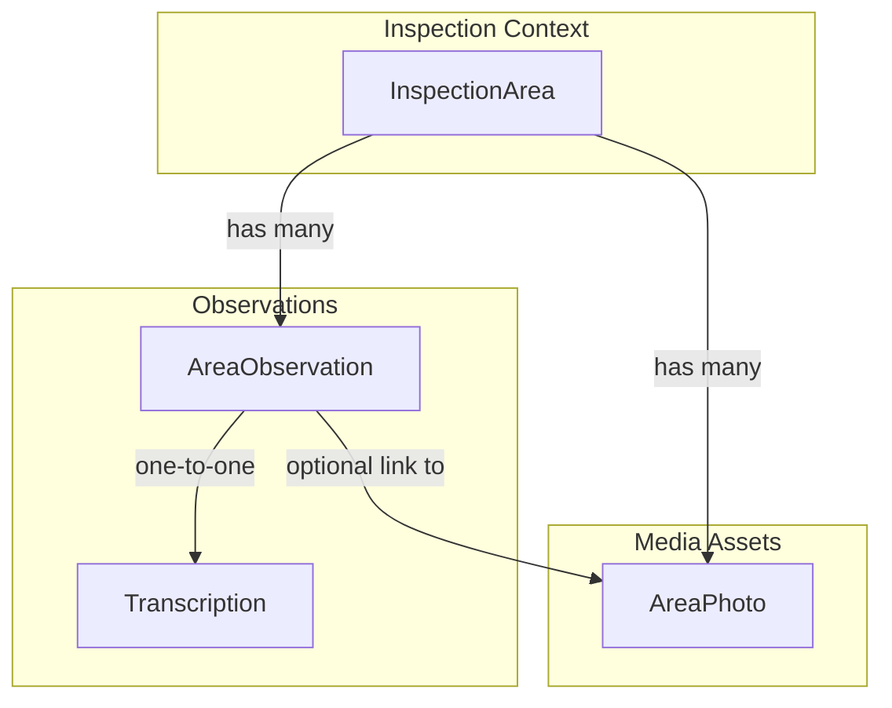
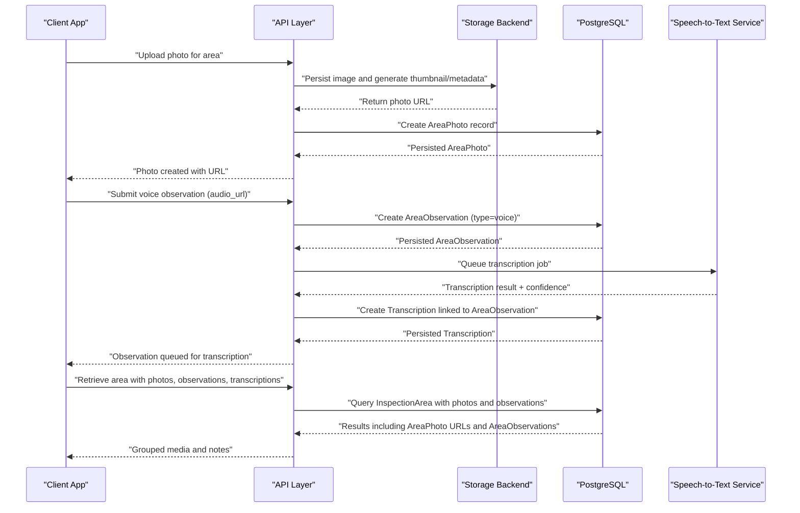
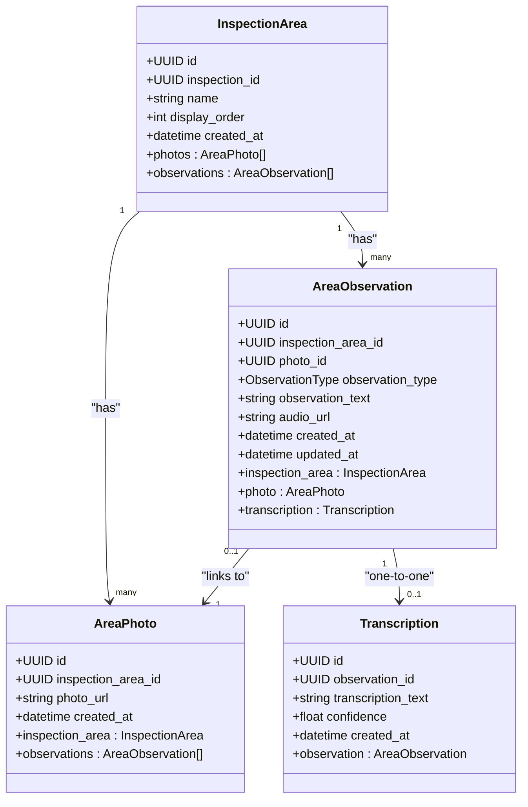
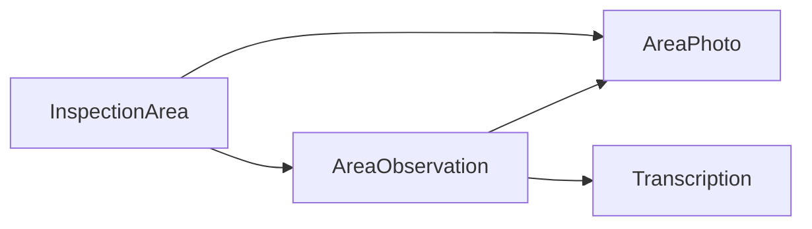

# Media Handling

<cite>
**Referenced Files in This Document**
- [area_photo.py](file://app/repository/area_photo.py)
- [area_observation.py](file://app/repository/area_observation.py)
- [transcription.py](file://app/repository/transcription.py)
- [inspection_area.py](file://app/repository/inspection_area.py)
- [base.py](file://app/repository/base.py)
- [README.md](file://README.md)
- [TASK_DECOMPOSITION.md](file://TASK_DECOMPOSITION.md)
</cite>

## Table of Contents
1. Introduction
2. Project Structure
3. Core Components
4. Architecture Overview
5. Detailed Component Analysis
6. Dependency Analysis
7. Performance Considerations
8. Troubleshooting Guide
9. Conclusion
10. Appendices

## Introduction
This document explains media handling for the inspection workflow, focusing on photo attachment and management for inspection areas, voice transcription integration, and retrieval processes. It covers how photos are associated with areas and observations, how voice recordings are linked to observations, and how transcriptions relate to observations. It also outlines file format support, storage optimization strategies, and error handling considerations for media operations.

## Project Structure
The media-related data model is implemented using SQLAlchemy ORM models under app/repository. The key entities involved in media handling are:
- InspectionArea: Represents a specific area within an inspection (e.g., Kitchen, Roof).
- AreaPhoto: Stores metadata for photos taken in an inspection area.
- AreaObservation: Captures text or voice observations attached to an area or a specific photo.
- Transcription: Holds speech-to-text output generated from voice observations.

**Diagram sources**
- [inspection_area.py:12-51](file://app/repository/inspection_area.py#L12-L51)
- [area_photo.py:12-42](file://app/repository/area_photo.py#L12-L42)
- [area_observation.py:18-69](file://app/repository/area_observation.py#L18-L69)
- [transcription.py:12-49](file://app/repository/transcription.py#L12-L49)

**Section sources**
- [inspection_area.py:12-51](file://app/repository/inspection_area.py#L12-L51)
- [area_photo.py:12-42](file://app/repository/area_photo.py#L12-L42)
- [area_observation.py:18-69](file://app/repository/area_observation.py#L18-L69)
- [transcription.py:12-49](file://app/repository/transcription.py#L12-L49)
- [base.py:1-5](file://app/repository/base.py#L1-L5)
- [README.md:21-63](file://README.md#L21-L63)

## Core Components
- InspectionArea: Defines the context for media capture; owns lists of photos and observations.
- AreaPhoto: Stores the URL/path to a photo and links back to its inspection area; supports lazy loading of related observations.
- AreaObservation: Represents either a text note or a voice recording; can optionally reference a photo; includes timestamps and type.
- Transcription: One-to-one relationship with a voice observation; stores transcription text, optional confidence score, and creation timestamp.

Key relationships:
- InspectionArea has many AreaPhotos and AreaObservations.
- AreaObservation optionally references an AreaPhoto.
- AreaObservation has one Transcription when it is a voice observation.

**Section sources**
- [inspection_area.py:12-51](file://app/repository/inspection_area.py#L12-L51)
- [area_photo.py:12-42](file://app/repository/area_photo.py#L12-L42)
- [area_observation.py:18-69](file://app/repository/area_observation.py#L18-L69)
- [transcription.py:12-49](file://app/repository/transcription.py#L12-L49)

## Architecture Overview
The media handling architecture integrates photo uploads, voice observation capture, and transcription processing into the inspection workflow.

**Diagram sources**
- [inspection_area.py:12-51](file://app/repository/inspection_area.py#L12-L51)
- [area_photo.py:12-42](file://app/repository/area_photo.py#L12-L42)
- [area_observation.py:18-69](file://app/repository/area_observation.py#L18-L69)
- [transcription.py:12-49](file://app/repository/transcription.py#L12-L49)

## Detailed Component Analysis

### Photo Attachment and Management
- Storage: Photos are represented by AreaPhoto records containing a URL/path to the stored asset. The design supports pluggable storage backends (local filesystem or cloud object storage) as outlined in the project plan.
- Metadata: Image optimization (thumbnail generation) and EXIF extraction (timestamp, GPS if present) are planned to enrich photo metadata.
- Relationships: Each AreaPhoto belongs to an InspectionArea and can be referenced by AreaObservation. Observations linked to a photo are loaded via a selectin strategy for efficient queries.

Operational flow:
- Upload: Accept multipart photo, validate format, store asset, generate thumbnails, extract metadata, persist AreaPhoto with URL.
- Retrieve: Query InspectionArea and eagerly load photos and observations to assemble grouped media for UI display.

Error handling considerations:
- Validate supported formats and sizes before upload.
- Handle storage backend failures with retries and fallbacks.
- Ensure referential integrity when deleting areas or photos (cascade rules apply at the ORM level).

**Section sources**
- [area_photo.py:12-42](file://app/repository/area_photo.py#L12-L42)
- [inspection_area.py:12-51](file://app/repository/inspection_area.py#L12-L51)
- [TASK_DECOMPOSITION.md:123-138](file://TASK_DECOMPOSITION.md#L123-L138)

### Voice Observation and Transcription Integration
- Voice observations are captured as AreaObservation records with observation_type set to voice and audio_url pointing to the stored audio asset.
- Transcription: A one-to-one Transcription record is created per voice observation, storing transcription_text and optional confidence. The relationship uses cascade delete-orphan so that removing an observation removes its transcription.
- Processing: Transcription jobs are queued asynchronously to avoid blocking HTTP requests. Results include text and confidence scores.

Operational flow:
- Submit: Upload audio, create AreaObservation (type=voice), queue transcription job.
- Process: Background worker calls Speech-to-Text service, writes Transcription with text and confidence.
- Retrieve: Fetch AreaObservation and its Transcription to display both original audio and transcribed text.

Error handling considerations:
- Validate audio formats and durations.
- Retry failed transcription jobs with exponential backoff.
- Allow manual correction of transcription text via update endpoints.

**Section sources**
- [area_observation.py:18-69](file://app/repository/area_observation.py#L18-L69)
- [transcription.py:12-49](file://app/repository/transcription.py#L12-L49)
- [TASK_DECOMPOSITION.md:128-138](file://TASK_DECOMPOSITION.md#L128-L138)

### Retrieval Processes
- Grouping: Queries retrieve InspectionArea along with its photos and observations. Observations may include linked transcriptions.
- Efficiency: Use selectin loading for collections to minimize N+1 queries when rendering area details.
- Filtering: Support filtering by area, date ranges, and observation types (text vs voice).

Example retrieval pattern:
- Load InspectionArea by ID.
- Eagerly load photos and observations.
- For each observation, load transcription if present.
- Return structured response grouping media and notes per area.

**Section sources**
- [inspection_area.py:41-51](file://app/repository/inspection_area.py#L41-L51)
- [area_photo.py:35-42](file://app/repository/area_photo.py#L35-L42)
- [area_observation.py:58-69](file://app/repository/area_observation.py#L58-L69)

### Data Models Diagram

**Diagram sources**
- [inspection_area.py:12-51](file://app/repository/inspection_area.py#L12-L51)
- [area_photo.py:12-42](file://app/repository/area_photo.py#L12-L42)
- [area_observation.py:18-69](file://app/repository/area_observation.py#L18-L69)
- [transcription.py:12-49](file://app/repository/transcription.py#L12-L49)

### Conceptual Overview
The media handling workflow enables inspectors to capture rich contextual evidence during property inspections:
- Photos provide visual documentation of defects.
- Voice observations allow hands-free note-taking, later converted to text for searchability and reporting.
- Transcriptions ensure that spoken insights are preserved alongside visual evidence.
- Retrieval APIs group media and notes by area to streamline report generation and review.

[No sources needed since this section provides conceptual overview]

## Dependency Analysis
- ORM Base: All models inherit from a shared DeclarativeBase, ensuring consistent session and metadata usage.
- Relational Integrity:
  - AreaPhoto depends on InspectionArea via foreign key.
  - AreaObservation depends on InspectionArea and optionally AreaPhoto.
  - Transcription depends on AreaObservation with unique constraint to enforce one-to-one mapping.
- Cascade Rules:
  - Deleting an InspectionArea cascades to photos and observations.
  - Deleting an AreaObservation cascades to its Transcription.

**Diagram sources**
- [inspection_area.py:12-51](file://app/repository/inspection_area.py#L12-L51)
- [area_photo.py:12-42](file://app/repository/area_photo.py#L12-L42)
- [area_observation.py:18-69](file://app/repository/area_observation.py#L18-L69)
- [transcription.py:12-49](file://app/repository/transcription.py#L12-L49)
- [base.py:1-5](file://app/repository/base.py#L1-L5)

**Section sources**
- [inspection_area.py:12-51](file://app/repository/inspection_area.py#L12-L51)
- [area_photo.py:12-42](file://app/repository/area_photo.py#L12-L42)
- [area_observation.py:18-69](file://app/repository/area_observation.py#L18-L69)
- [transcription.py:12-49](file://app/repository/transcription.py#L12-L49)
- [base.py:1-5](file://app/repository/base.py#L1-L5)

## Performance Considerations
- Lazy Loading Strategy: Use selectin loading for collections like photos and observations to reduce query overhead when rendering area details.
- Thumbnail Generation: Precompute thumbnails at upload time to speed up list views and reduce bandwidth.
- EXIF Extraction: Capture metadata once at upload to avoid repeated parsing.
- Asynchronous Transcription: Offload STT processing to background tasks to keep API responses fast and responsive.
- Indexing: Consider indexing frequently queried fields such as inspection_area_id and observation_type to optimize retrieval performance.

[No sources needed since this section provides general guidance]

## Troubleshooting Guide
Common issues and resolutions:
- Invalid File Formats:
  - Photos: Reject unsupported formats and sizes at upload validation.
  - Audio: Enforce allowed formats (.wav, .mp3, .m4a, .webm, .ogg) and duration limits.
- Storage Failures:
  - Implement retries and fallback mechanisms for local/cloud storage backends.
  - Log detailed errors and surface user-friendly messages.
- Transcription Errors:
  - Queue failed jobs with retry policies.
  - Provide status endpoints to check transcription progress and results.
- Referential Integrity:
  - Ensure deletion cascades work as expected to avoid orphaned records.
  - Validate foreign keys before creating associations.

**Section sources**
- [area_observation.py:18-69](file://app/repository/area_observation.py#L18-L69)
- [transcription.py:12-49](file://app/repository/transcription.py#L12-L49)
- [TASK_DECOMPOSITION.md:123-138](file://TASK_DECOMPOSITION.md#L123-L138)

## Conclusion
The media handling subsystem integrates photo and voice capture with robust relational modeling and asynchronous transcription processing. By associating media with inspection areas and observations, and linking transcriptions to voice notes, the system supports comprehensive inspection workflows. Planned optimizations include image processing, metadata extraction, and efficient retrieval patterns to enhance performance and usability.

[No sources needed since this section summarizes without analyzing specific files]

## Appendices

### Supported File Formats
- Photos: Typical image formats (e.g., JPEG, PNG); validation enforced at upload.
- Audio: .wav, .mp3, .m4a, .webm, .ogg as specified in the project plan.

**Section sources**
- [TASK_DECOMPOSITION.md:123-138](file://TASK_DECOMPOSITION.md#L123-L138)

### Example Workflows

#### Uploading a Photo
- Steps:
  - Validate image format and size.
  - Store asset and generate thumbnail.
  - Extract EXIF metadata (timestamp, GPS if available).
  - Create AreaPhoto record with URL.
  - Associate with InspectionArea.

**Section sources**
- [area_photo.py:12-42](file://app/repository/area_photo.py#L12-L42)
- [inspection_area.py:12-51](file://app/repository/inspection_area.py#L12-L51)
- [TASK_DECOMPOSITION.md:123-138](file://TASK_DECOMPOSITION.md#L123-L138)

#### Processing a Voice Recording
- Steps:
  - Validate audio format and duration.
  - Store audio and create AreaObservation (type=voice) with audio_url.
  - Queue transcription job to Speech-to-Text service.
  - On completion, create Transcription with transcription_text and confidence.
  - Allow manual correction of transcription text.

**Section sources**
- [area_observation.py:18-69](file://app/repository/area_observation.py#L18-L69)
- [transcription.py:12-49](file://app/repository/transcription.py#L12-L49)
- [TASK_DECOMPOSITION.md:128-138](file://TASK_DECOMPOSITION.md#L128-L138)

#### Retrieving Transcribed Content
- Steps:
  - Query InspectionArea and eager-load photos and observations.
  - For each observation, load associated Transcription if present.
  - Return grouped data for UI presentation and report generation.

**Section sources**
- [inspection_area.py:41-51](file://app/repository/inspection_area.py#L41-L51)
- [area_photo.py:35-42](file://app/repository/area_photo.py#L35-L42)
- [area_observation.py:58-69](file://app/repository/area_observation.py#L58-L69)
- [transcription.py:44-49](file://app/repository/transcription.py#L44-L49)