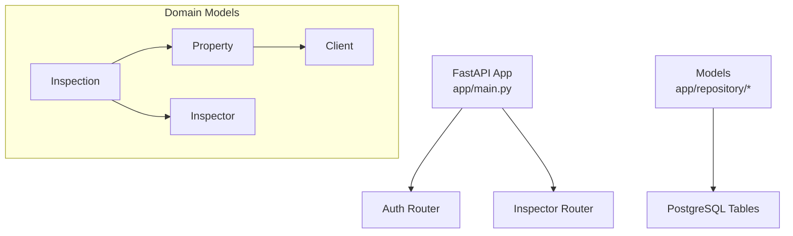
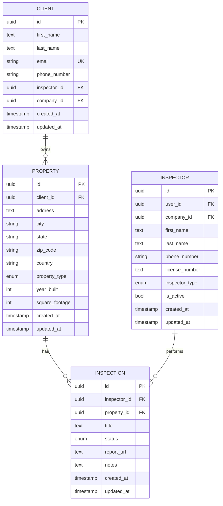
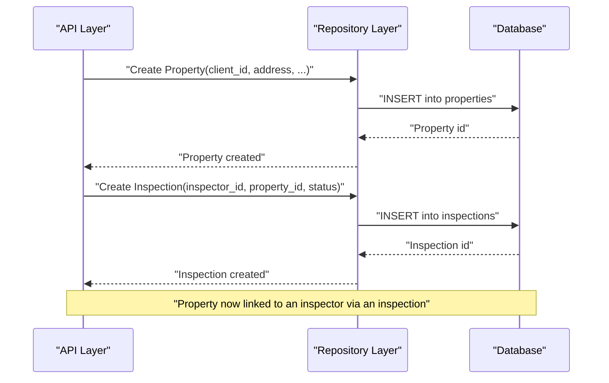
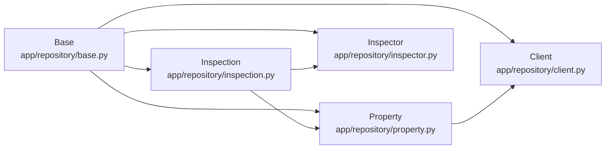

# Property Management

<cite>
**Referenced Files in This Document**
- [property.py](file://app/repository/property.py)
- [client.py](file://app/repository/client.py)
- [inspection.py](file://app/repository/inspection.py)
- [inspector.py](file://app/repository/inspector.py)
- [base.py](file://app/repository/base.py)
- [__init__.py](file://app/repository/__init__.py)
- [main.py](file://app/main.py)
</cite>

## Table of Contents
1. [Introduction](#introduction)
2. [Project Structure](#project-structure)
3. [Core Components](#core-components)
4. [Architecture Overview](#architecture-overview)
5. [Detailed Component Analysis](#detailed-component-analysis)
6. [Dependency Analysis](#dependency-analysis)
7. [Performance Considerations](#performance-considerations)
8. [Troubleshooting Guide](#troubleshooting-guide)
9. [Conclusion](#conclusion)

## Introduction
This document explains property management within the inspection workflow: how properties are created, associated with clients, and linked to inspections; how inspectors are involved; and how the property lifecycle is managed. It also documents the property data model (address fields, property types, client relationships), validation rules enforced by the database schema, and practical examples for creating, updating, and querying properties.

## Project Structure
The property domain is implemented as a set of SQLAlchemy ORM models under app/repository. The application initializes database tables at startup and exposes routes through FastAPI routers. Property-related entities include Property, Client, Inspection, and Inspector, which together define the core workflow.

**Diagram sources**
- [main.py:11-21](file://app/main.py#L11-L21)
- [property.py:20-70](file://app/repository/property.py#L20-L70)
- [client.py:12-78](file://app/repository/client.py#L12-L78)
- [inspection.py:19-75](file://app/repository/inspection.py#L19-L75)
- [inspector.py:18-82](file://app/repository/inspector.py#L18-L82)

**Section sources**
- [main.py:11-21](file://app/main.py#L11-L21)
- [property.py:20-70](file://app/repository/property.py#L20-L70)
- [client.py:12-78](file://app/repository/client.py#L12-L78)
- [inspection.py:19-75](file://app/repository/inspection.py#L19-L75)
- [inspector.py:18-82](file://app/repository/inspector.py#L18-L82)

## Core Components
- Property: Represents a physical location to be inspected. Includes address information, type, optional attributes, timestamps, and relationships to Client and Inspections.
- Client: Owner or stakeholder associated with one or more properties.
- Inspection: A scheduled or completed job tied to an inspector and a property.
- Inspector: The person or agency member who performs inspections and may manage clients.

Key responsibilities:
- Property stores address details and links to a single client.
- Inspections link a property to an inspector and track status and metadata.
- Clients can be assigned to inspectors for relationship tracking.

**Section sources**
- [property.py:20-70](file://app/repository/property.py#L20-L70)
- [client.py:12-78](file://app/repository/client.py#L12-L78)
- [inspection.py:19-75](file://app/repository/inspection.py#L19-L75)
- [inspector.py:18-82](file://app/repository/inspector.py#L18-L82)

## Architecture Overview
The system uses SQLAlchemy declarative models that map to PostgreSQL tables. Relationships enforce referential integrity:
- Each Property belongs to exactly one Client.
- Each Inspection belongs to one Property and one Inspector.
- Deleting a Client cascades to its Properties; deleting a Property cascades to its Inspections.

**Diagram sources**
- [client.py:12-78](file://app/repository/client.py#L12-L78)
- [property.py:20-70](file://app/repository/property.py#L20-L70)
- [inspection.py:19-75](file://app/repository/inspection.py#L19-L75)
- [inspector.py:18-82](file://app/repository/inspector.py#L18-L82)

## Detailed Component Analysis

### Property Data Model
- Identifier: UUID primary key.
- Address fields: address, city, state, zip_code, country (default US). All required except optional attributes.
- Type: Enumerated property_type with default residential.
- Optional attributes: year_built, square_footage.
- Timestamps: created_at, updated_at with server defaults and auto-update.
- Relationships:
  - Belongs to Client via client_id (required).
  - Has many Inspections via inspections collection with cascade delete-orphan.

Validation and constraints enforced by the schema:
- Required fields: client_id, address, city, state, zip_code, country, property_type.
- Referential integrity: client_id must reference an existing client; deletion of client cascades to properties.
- Enum enforcement: property_type restricted to defined values.

Example usage patterns (conceptual):
- Create a new property: Provide client_id and address fields; property_type defaults if omitted.
- Update property details: Modify address or optional attributes; updated_at refreshes automatically.
- Query by client: Retrieve all properties where client_id matches a given client.
- Query by inspector: Indirectly via inspections; find inspections by inspector_id, then resolve their property_id to get properties.

**Section sources**
- [property.py:13-70](file://app/repository/property.py#L13-L70)
- [client.py:12-78](file://app/repository/client.py#L12-L78)
- [inspection.py:19-75](file://app/repository/inspection.py#L19-L75)

### Client Relationship and Ownership
- A Client owns multiple Properties (one-to-many).
- Deleting a Client cascades to its Properties, ensuring no orphaned properties remain.
- Clients can optionally be associated with an Inspector and/or Company for organizational tracking.

Lifecycle considerations:
- When a Client is removed, all their Properties are removed automatically due to cascade behavior.
- Ensure any dependent Inspections are handled before removing a Property (cascade handles this).

**Section sources**
- [client.py:12-78](file://app/repository/client.py#L12-L78)
- [property.py:20-70](file://app/repository/property.py#L20-L70)

### Linking Properties to Inspections
- An Inspection references a specific Property and an Inspector.
- Status field tracks workflow state (e.g., in progress, completed, cancelled).
- Deleting a Property cascades to its Inspections, preventing orphaned jobs.

Assignment process:
- To assign an inspector to inspect a property, create an Inspection record linking the inspector_id and property_id.
- Use Inspection status to manage lifecycle transitions (e.g., from in_progress to completed).

Querying:
- Find inspections by inspector_id to list assignments.
- Resolve property details via the property relationship on each Inspection.

**Section sources**
- [inspection.py:19-75](file://app/repository/inspection.py#L19-L75)
- [inspector.py:18-82](file://app/repository/inspector.py#L18-L82)
- [property.py:20-70](file://app/repository/property.py#L20-L70)

### Inspector Role in Property Lifecycle
- Inspectors perform Inspections on Properties.
- Inspectors may manage Clients directly (optional relationship).
- Active status flag allows filtering active vs inactive inspectors when assigning work.

Operational guidance:
- Assign inspections only to active inspectors to ensure availability.
- Track inspector performance via counts of completed inspections per property.

**Section sources**
- [inspector.py:18-82](file://app/repository/inspector.py#L18-L82)
- [inspection.py:19-75](file://app/repository/inspection.py#L19-L75)

### Workflow Sequence: Creating and Assigning an Inspection

**Diagram sources**
- [property.py:20-70](file://app/repository/property.py#L20-L70)
- [inspection.py:19-75](file://app/repository/inspection.py#L19-L75)

### Property Validation Rules and Business Constraints
- Required fields: client_id, address, city, state, zip_code, country, property_type.
- Default values: country defaults to US; property_type defaults to residential.
- Referential integrity: client_id must exist; property_id referenced by inspections must exist.
- Cascade deletes:
  - Deleting a Client removes all their Properties.
  - Deleting a Property removes all its Inspections.

Practical implications:
- Always validate presence of client_id before creating a property.
- Avoid manual deletion of clients without considering cascading effects.
- Use enums for property_type to prevent invalid values.

**Section sources**
- [property.py:20-70](file://app/repository/property.py#L20-L70)
- [client.py:12-78](file://app/repository/client.py#L12-L78)
- [inspection.py:19-75](file://app/repository/inspection.py#L19-L75)

### Examples (Conceptual)
- Create a new property:
  - Provide client_id and full address fields; omit property_type to use default residential.
- Update property details:
  - Update address or optional attributes like year_built or square_footage; updated_at will reflect changes.
- Query properties by client:
  - Filter properties by client_id to retrieve all properties owned by a specific client.
- Query properties by inspector:
  - First query inspections by inspector_id, then collect distinct property_ids from those inspections.

Note: These examples describe conceptual operations based on the data model and relationships. Actual endpoints are not present in the current codebase; implement them using the repository models.

[No sources needed since this section provides conceptual examples]

## Dependency Analysis
The property module depends on base ORM definitions and interacts with related models.

**Diagram sources**
- [base.py:1-5](file://app/repository/base.py#L1-L5)
- [property.py:20-70](file://app/repository/property.py#L20-L70)
- [client.py:12-78](file://app/repository/client.py#L12-L78)
- [inspection.py:19-75](file://app/repository/inspection.py#L19-L75)
- [inspector.py:18-82](file://app/repository/inspector.py#L18-L82)

**Section sources**
- [base.py:1-5](file://app/repository/base.py#L1-L5)
- [property.py:20-70](file://app/repository/property.py#L20-L70)
- [client.py:12-78](file://app/repository/client.py#L12-L78)
- [inspection.py:19-75](file://app/repository/inspection.py#L19-L75)
- [inspector.py:18-82](file://app/repository/inspector.py#L18-L82)

## Performance Considerations
- Use selectin loading for collections (as configured in relationships) to reduce N+1 queries when accessing related objects.
- Index frequently queried columns such as client_id and property_id to speed up lookups and joins.
- Batch operations for bulk creation or updates to minimize round trips to the database.
- Keep property_type and status as enums to leverage database-level constraints and efficient comparisons.

[No sources needed since this section provides general guidance]

## Troubleshooting Guide
Common issues and resolutions:
- Missing client_id: Ensure a valid client exists before creating a property; foreign key constraint will reject invalid references.
- Invalid property_type: Only allowed enum values are accepted; verify input against the defined types.
- Orphaned inspections after property deletion: Deletion cascades remove inspections automatically; avoid relying on manual cleanup.
- Cascade deletion of client: Removing a client deletes all associated properties; plan accordingly to preserve important records.

Operational checks:
- Verify database migrations have been applied so tables and constraints exist.
- Confirm relationships are correctly configured in models to avoid unexpected behavior during deletions or updates.

**Section sources**
- [property.py:20-70](file://app/repository/property.py#L20-L70)
- [client.py:12-78](file://app/repository/client.py#L12-L78)
- [inspection.py:19-75](file://app/repository/inspection.py#L19-L75)

## Conclusion
Properties form the central entity in the inspection workflow, linking clients to inspections performed by inspectors. The data model enforces strong validation and referential integrity, while cascade behaviors simplify lifecycle management. By understanding these relationships and constraints, you can reliably create, update, and query properties, and assign inspections to inspectors in a consistent manner.

[No sources needed since this section summarizes without analyzing specific files]