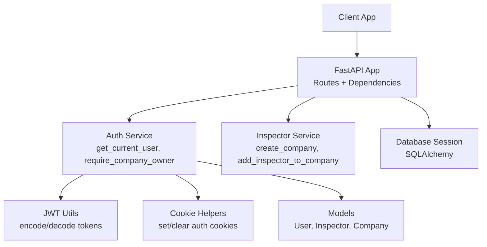
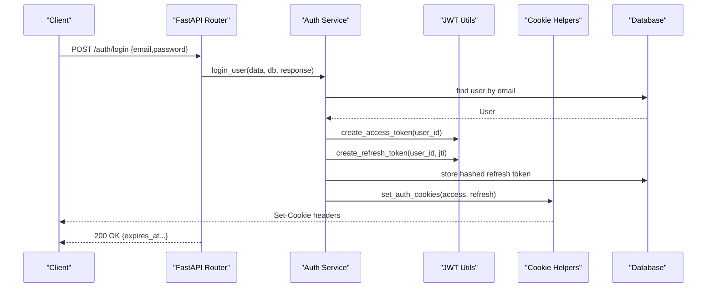
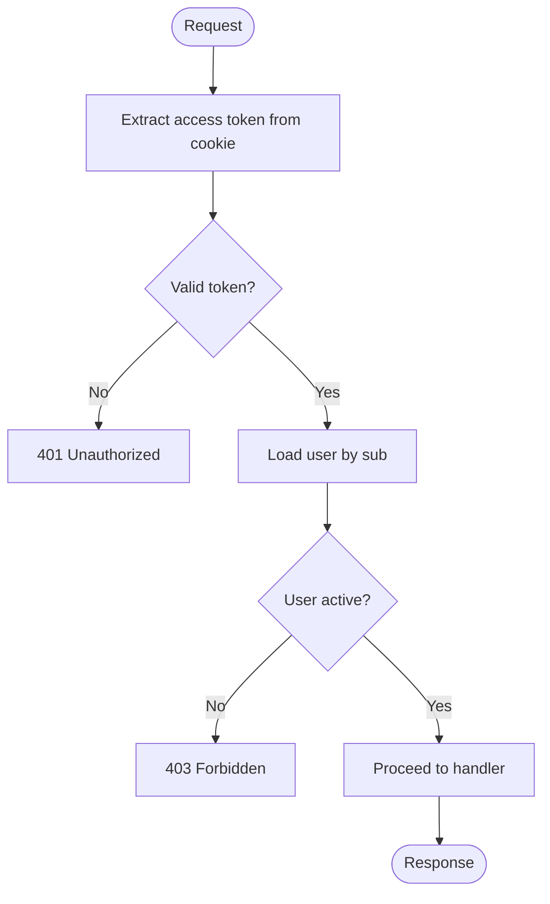
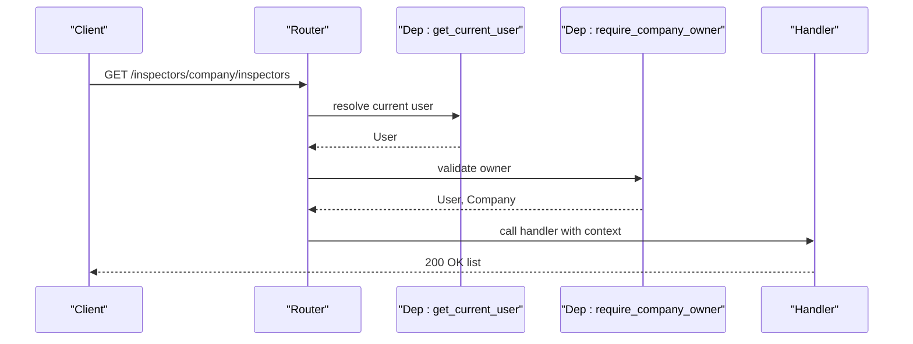
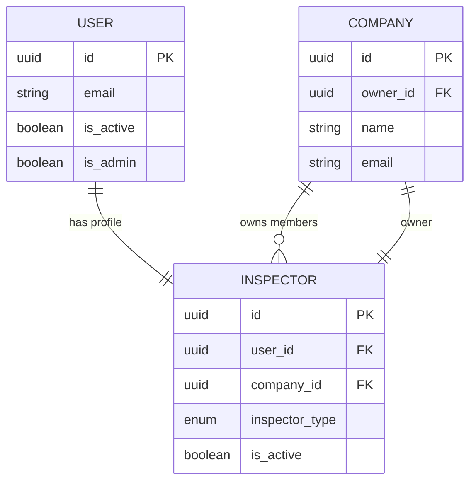
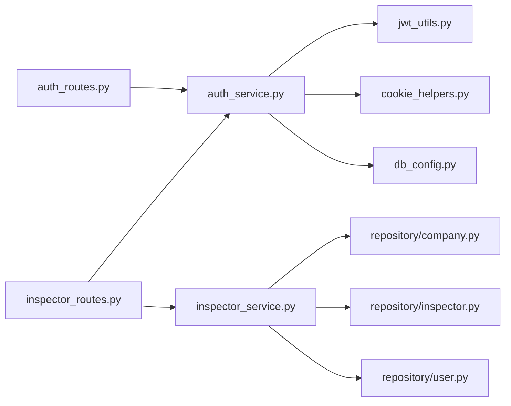

# Access Control & Permissions

<cite>
**Referenced Files in This Document**
- [main.py](file://app/main.py)
- [auth_routes.py](file://app/api/routes/auth_routes.py)
- [inspector_routes.py](file://app/api/routes/inspector_routes.py)
- [auth_service.py](file://app/services/auth_service.py)
- [jwt_utils.py](file://app/utils/jwt_utils.py)
- [cookie_helpers.py](file://app/utils/cookie_helpers.py)
- [config_loader.py](file://app/utils/config_loader.py)
- [db_config.py](file://app/config/db_config.py)
- [user.py](file://app/repository/user.py)
- [company.py](file://app/repository/company.py)
- [inspector.py](file://app/repository/inspector.py)
- [inspector_service.py](file://app/services/inspector_service.py)
- [auth_dtos.py](file://app/api/dtos/auth_dtos.py)
- [inspector_dtos.py](file://app/api/dtos/inspector_dtos.py)
</cite>

## Table of Contents
1. [Introduction](#introduction)
2. [Project Structure](#project-structure)
3. [Core Components](#core-components)
4. [Architecture Overview](#architecture-overview)
5. [Detailed Component Analysis](#detailed-component-analysis)
6. [Dependency Analysis](#dependency-analysis)
7. [Performance Considerations](#performance-considerations)
8. [Troubleshooting Guide](#troubleshooting-guide)
9. [Conclusion](#conclusion)
10. [Appendices](#appendices)

## Introduction
This document explains the multi-tenant access control system for inspectors and companies. It covers how user roles and company affiliations determine data access, how authorization middleware validates requests, how tenant isolation is enforced at the application layer, and how token-based authentication integrates with cookie handling. It also provides examples of protected endpoints, permission validation flows, error handling for unauthorized or forbidden access, security considerations, and best practices for adding new protected resources.

## Project Structure
The application is a FastAPI service that:
- Exposes authentication routes under /auth
- Exposes inspector and company management routes under /inspectors
- Uses JWTs stored in HTTP-only secure cookies for session management
- Enforces per-company (tenant) isolation by linking users to inspectors and inspectors to companies
- Provides reusable dependencies to resolve the current user and enforce ownership checks

**Diagram sources**
- [main.py:18-21](file://app/main.py#L18-L21)
- [auth_routes.py:22-64](file://app/api/routes/auth_routes.py#L22-L64)
- [inspector_routes.py:23-142](file://app/api/routes/inspector_routes.py#L23-L142)
- [auth_service.py:193-268](file://app/services/auth_service.py#L193-L268)
- [jwt_utils.py:14-50](file://app/utils/jwt_utils.py#L14-L50)
- [cookie_helpers.py:12-41](file://app/utils/cookie_helpers.py#L12-L41)
- [user.py:10-54](file://app/repository/user.py#L10-L54)
- [company.py:12-61](file://app/repository/company.py#L12-L61)
- [inspector.py:18-82](file://app/repository/inspector.py#L18-L82)

**Section sources**
- [main.py:18-21](file://app/main.py#L18-L21)
- [auth_routes.py:22-64](file://app/api/routes/auth_routes.py#L22-L64)
- [inspector_routes.py:23-142](file://app/api/routes/inspector_routes.py#L23-L142)

## Core Components
- Authentication and session management:
  - Login issues access and refresh tokens as secure HTTP-only cookies
  - Refresh endpoint rotates refresh tokens and invalidates previous ones
  - Logout clears server-side refresh token and client cookies
  - Current user resolution dependency decodes access token from cookies and loads the user
- Authorization and tenant isolation:
  - Owner-only operations are guarded by a dependency that ensures the logged-in user’s inspector belongs to a company and is the owner
  - All company-scoped queries filter by the resolved company ID to prevent cross-tenant data leakage
- Data models:
  - User represents accounts with active status and optional admin flag
  - Inspector links a user to a company and carries role/type metadata
  - Company stores tenant identity and an owner reference to an inspector

Key responsibilities:
- Token lifecycle and rotation: [auth_service.py:59-188](file://app/services/auth_service.py#L59-L188), [jwt_utils.py:14-50](file://app/utils/jwt_utils.py#L14-L50), [cookie_helpers.py:12-41](file://app/utils/cookie_helpers.py#L12-L41)
- Current user resolution: [auth_service.py:193-224](file://app/services/auth_service.py#L193-L224)
- Ownership enforcement: [auth_service.py:243-268](file://app/services/auth_service.py#L243-L268)
- Tenant-scoped queries: [inspector_routes.py:66-84](file://app/api/routes/inspector_routes.py#L66-L84), [inspector_routes.py:124-142](file://app/api/routes/inspector_routes.py#L124-L142), [inspector_service.py:125-133](file://app/services/inspector_service.py#L125-L133)

**Section sources**
- [auth_service.py:59-188](file://app/services/auth_service.py#L59-L188)
- [auth_service.py:193-268](file://app/services/auth_service.py#L193-L268)
- [inspector_routes.py:66-142](file://app/api/routes/inspector_routes.py#L66-L142)
- [inspector_service.py:17-133](file://app/services/inspector_service.py#L17-L133)
- [jwt_utils.py:14-50](file://app/utils/jwt_utils.py#L14-L50)
- [cookie_helpers.py:12-41](file://app/utils/cookie_helpers.py#L12-L41)

## Architecture Overview
The system uses a layered architecture:
- Routes define endpoints and apply FastAPI dependencies for authentication and authorization
- Services implement business logic and enforce tenant scoping
- Repositories define ORM models and relationships
- Utilities handle JWT creation/validation and cookie management
- Configuration centralizes secrets and expiry settings

**Diagram sources**
- [auth_routes.py:31-34](file://app/api/routes/auth_routes.py#L31-L34)
- [auth_service.py:59-99](file://app/services/auth_service.py#L59-L99)
- [jwt_utils.py:14-40](file://app/utils/jwt_utils.py#L14-L40)
- [cookie_helpers.py:12-35](file://app/utils/cookie_helpers.py#L12-L35)
- [db_config.py:21-26](file://app/config/db_config.py#L21-L26)

## Detailed Component Analysis

### Authentication Flow and Token Handling
- Registration creates a user account and returns user details
- Login authenticates credentials, issues short-lived access tokens and longer-lived refresh tokens, and sets them as secure HTTP-only cookies
- Refresh endpoint validates the stored refresh token hash, rotates tokens, and updates cookies
- Logout revokes the refresh token and clears cookies

**Diagram sources**
- [auth_service.py:193-224](file://app/services/auth_service.py#L193-L224)

**Section sources**
- [auth_routes.py:25-64](file://app/api/routes/auth_routes.py#L25-L64)
- [auth_service.py:36-188](file://app/services/auth_service.py#L36-L188)
- [jwt_utils.py:14-50](file://app/utils/jwt_utils.py#L14-L50)
- [cookie_helpers.py:12-41](file://app/utils/cookie_helpers.py#L12-L41)

### Authorization Middleware and Permission Checks
- get_current_user resolves the authenticated user from the access token cookie
- require_company_owner ensures the user is associated with a company and is its owner; it raises 403 if not
- These dependencies are applied on endpoints that require authentication and/or ownership

**Diagram sources**
- [auth_service.py:193-268](file://app/services/auth_service.py#L193-L268)
- [inspector_routes.py:124-142](file://app/api/routes/inspector_routes.py#L124-L142)

**Section sources**
- [auth_service.py:193-268](file://app/services/auth_service.py#L193-L268)
- [inspector_routes.py:89-121](file://app/api/routes/inspector_routes.py#L89-L121)

### Tenant Isolation Mechanisms
- Users link to inspectors via user_id
- Inspectors belong to a company via company_id
- Company has an owner_id referencing an inspector
- All company-scoped operations resolve the current user’s inspector and use its company_id to scope queries
- This prevents cross-tenant data access because handlers never accept arbitrary company IDs from clients for listing or mutating company-owned resources

Examples:
- Get my company: resolves inspector by current user, then fetches company by inspector.company_id
- List company inspectors: filters inspectors by the resolved company.id
- Add inspector to company: enforces owner check before creating a new inspector linked to the same company

**Diagram sources**
- [user.py:10-54](file://app/repository/user.py#L10-L54)
- [inspector.py:18-82](file://app/repository/inspector.py#L18-L82)
- [company.py:12-61](file://app/repository/company.py#L12-L61)

**Section sources**
- [inspector_routes.py:66-84](file://app/api/routes/inspector_routes.py#L66-L84)
- [inspector_routes.py:124-142](file://app/api/routes/inspector_routes.py#L124-L142)
- [inspector_service.py:17-72](file://app/services/inspector_service.py#L17-L72)
- [inspector_service.py:75-133](file://app/services/inspector_service.py#L75-L133)

### Protected Endpoints and Permission Validation
- Authentication required:
  - GET /inspectors/me: requires valid access token; returns profile and ownership flag
  - GET /inspectors/company: requires valid access token; returns company if associated
  - POST /inspectors/company/inspectors: requires valid access token and company owner role
  - GET /inspectors/company/inspectors: requires valid access token and company membership
- Error handling:
  - 401 Unauthorized when no token or invalid/expired token
  - 403 Forbidden when account inactive or insufficient permissions (e.g., non-owner attempting owner-only actions)
  - 404 Not Found when user is not associated with a company where expected

**Section sources**
- [inspector_routes.py:28-48](file://app/api/routes/inspector_routes.py#L28-L48)
- [inspector_routes.py:66-84](file://app/api/routes/inspector_routes.py#L66-L84)
- [inspector_routes.py:89-121](file://app/api/routes/inspector_routes.py#L89-L121)
- [inspector_routes.py:124-142](file://app/api/routes/inspector_routes.py#L124-L142)
- [auth_service.py:193-268](file://app/services/auth_service.py#L193-L268)

### Security Considerations
- Tokens are stored in HTTP-only, secure cookies with SameSite lax to mitigate XSS and CSRF exposure
- Refresh tokens are rotated and stored as hashes to prevent reuse and detect theft
- Secrets for signing tokens are loaded from environment variables; missing secrets raise runtime errors
- Account deactivation blocks authentication and token refresh
- Owner-only endpoints explicitly verify company ownership before allowing mutations

**Section sources**
- [cookie_helpers.py:12-41](file://app/utils/cookie_helpers.py#L12-L41)
- [auth_service.py:116-188](file://app/services/auth_service.py#L116-L188)
- [config_loader.py:24-43](file://app/utils/config_loader.py#L24-L43)

### Best Practices for Implementing New Protected Resources
- Always protect endpoints with get_current_user to ensure authentication
- For tenant-scoped resources, resolve the current user’s inspector and derive the company_id from it; never trust client-supplied company IDs for scoping
- Use require_company_owner for operations that must be performed by the company owner
- Validate inputs using Pydantic DTOs and return appropriate HTTP status codes for errors
- Keep sensitive configuration out of code; load secrets and expiry values from environment
- Ensure database sessions are scoped per request via the provided dependency

[No sources needed since this section provides general guidance]

## Dependency Analysis
The following diagram shows key module dependencies involved in access control:

**Diagram sources**
- [auth_routes.py:1-64](file://app/api/routes/auth_routes.py#L1-L64)
- [inspector_routes.py:1-142](file://app/api/routes/inspector_routes.py#L1-L142)
- [auth_service.py:1-268](file://app/services/auth_service.py#L1-L268)
- [inspector_service.py:1-134](file://app/services/inspector_service.py#L1-L134)
- [jwt_utils.py:1-51](file://app/utils/jwt_utils.py#L1-L51)
- [cookie_helpers.py:1-42](file://app/utils/cookie_helpers.py#L1-L42)
- [db_config.py:1-26](file://app/config/db_config.py#L1-L26)
- [user.py:1-54](file://app/repository/user.py#L1-L54)
- [company.py:1-61](file://app/repository/company.py#L1-L61)
- [inspector.py:1-82](file://app/repository/inspector.py#L1-L82)

**Section sources**
- [auth_routes.py:1-64](file://app/api/routes/auth_routes.py#L1-L64)
- [inspector_routes.py:1-142](file://app/api/routes/inspector_routes.py#L1-L142)
- [auth_service.py:1-268](file://app/services/auth_service.py#L1-L268)
- [inspector_service.py:1-134](file://app/services/inspector_service.py#L1-L134)

## Performance Considerations
- Token decoding is lightweight and stateless; keep access tokens small and short-lived
- Database queries are simple and filtered by primary keys or indexed foreign keys (user_id, company_id)
- Avoid eager loading unnecessary relationships; only load what is needed for responses
- Consider caching frequently accessed company metadata if read-heavy workloads emerge

[No sources needed since this section provides general guidance]

## Troubleshooting Guide
Common issues and resolutions:
- 401 Unauthorized:
  - Missing or invalid access token in cookies; ensure login succeeded and cookies are present
  - Expired access token; refresh flow can obtain a new pair
  - Invalid or expired refresh token; clear cookies and re-login
- 403 Forbidden:
  - Account deactivated; contact administrator to reactivate
  - Non-owner attempting owner-only action; verify current user’s inspector and company ownership
- 404 Not Found:
  - User not associated with any company; create a company first or assign the user to one
- Token rotation failures:
  - Reuse detection revokes all sessions; re-authenticate after receiving a 401 during refresh

**Section sources**
- [auth_service.py:59-188](file://app/services/auth_service.py#L59-L188)
- [auth_service.py:193-268](file://app/services/auth_service.py#L193-L268)
- [inspector_routes.py:66-121](file://app/api/routes/inspector_routes.py#L66-L121)

## Conclusion
The system implements robust multi-tenant access control through:
- Secure, cookie-based JWT authentication with token rotation
- Centralized dependencies for resolving the current user and enforcing ownership
- Strict tenant scoping by deriving company context from the authenticated user’s inspector profile
- Clear error handling for unauthenticated, unauthorized, and forbidden scenarios
Adhering to the outlined best practices will help maintain security and prevent data leakage across tenants as new features are added.

[No sources needed since this section summarizes without analyzing specific files]

## Appendices

### Example Endpoints Summary
- Authentication
  - POST /auth/register: Create user account
  - POST /auth/login: Authenticate and receive cookies
  - POST /auth/logout: Revoke refresh token and clear cookies
  - POST /auth/refresh: Rotate refresh token and update cookies
  - GET /auth/me: Get current user info
- Inspectors and Companies
  - GET /inspectors/me: Get profile and ownership status
  - POST /inspectors/company: Create company (current user becomes owner)
  - GET /inspectors/company: Get current user’s company
  - POST /inspectors/company/inspectors: Add inspector (owner-only)
  - GET /inspectors/company/inspectors: List inspectors (company-scoped)

**Section sources**
- [auth_routes.py:25-64](file://app/api/routes/auth_routes.py#L25-L64)
- [inspector_routes.py:28-142](file://app/api/routes/inspector_routes.py#L28-L142)