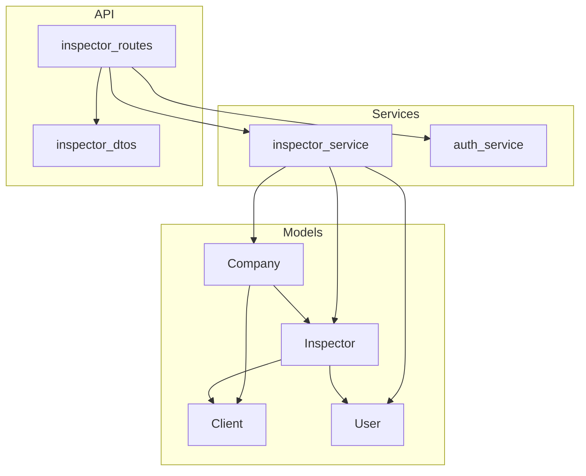
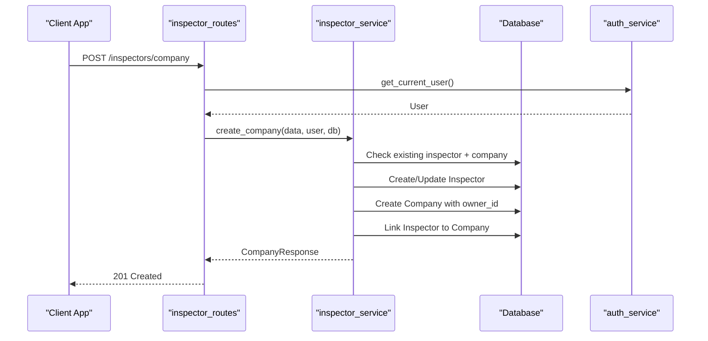
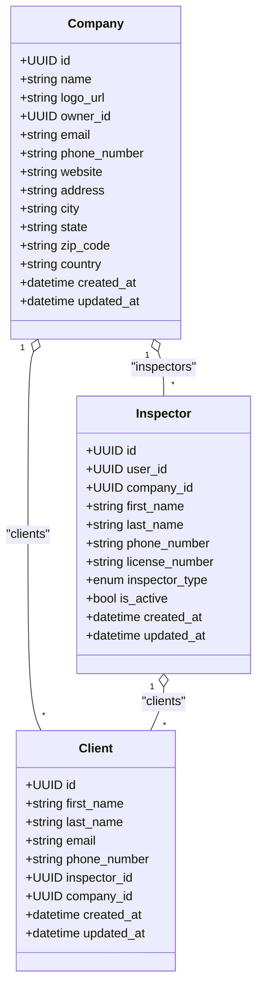
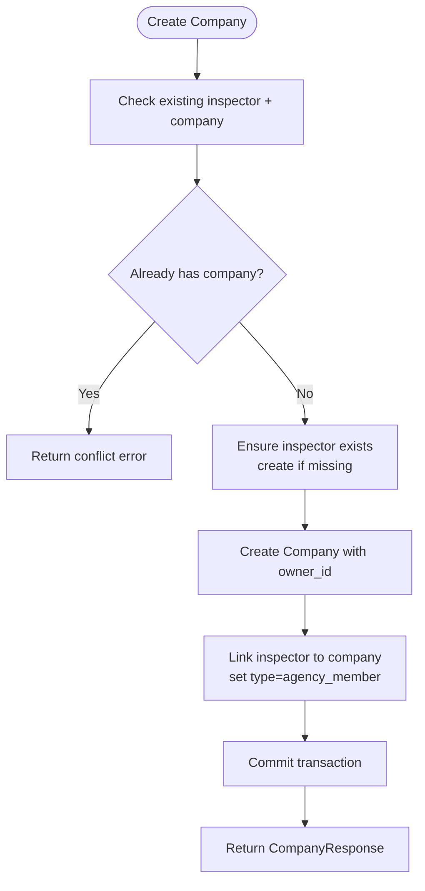
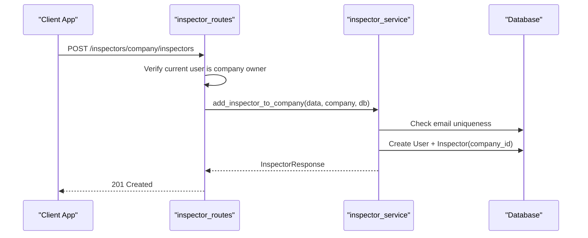
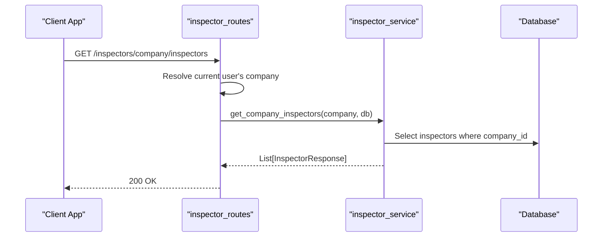
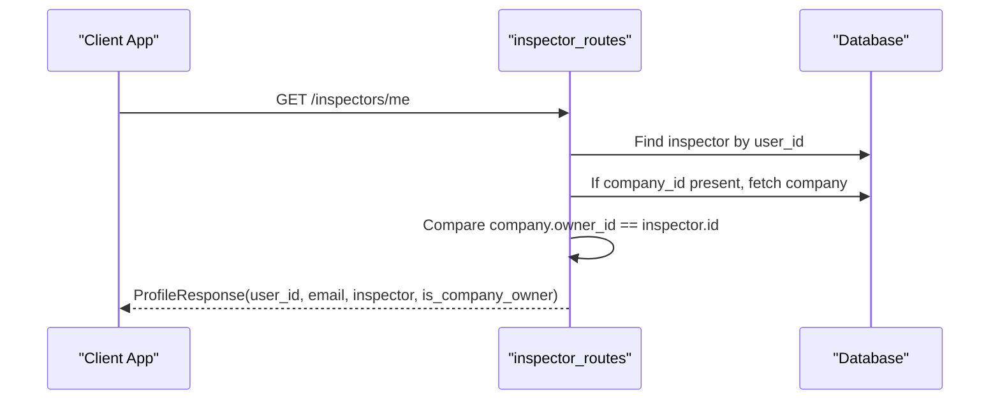
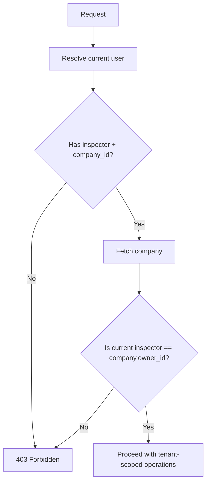
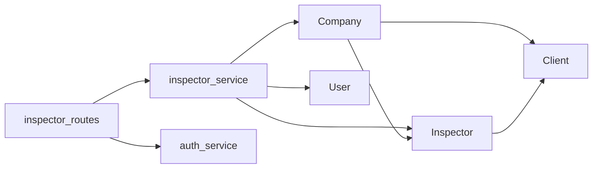

# Company Management

<cite>
**Referenced Files in This Document**
- [company.py](file://app/repository/company.py)
- [inspector.py](file://app/repository/inspector.py)
- [client.py](file://app/repository/client.py)
- [user.py](file://app/repository/user.py)
- [base.py](file://app/repository/base.py)
- [inspector_service.py](file://app/services/inspector_service.py)
- [auth_service.py](file://app/services/auth_service.py)
- [inspector_routes.py](file://app/api/routes/inspector_routes.py)
- [inspector_dtos.py](file://app/api/dtos/inspector_dtos.py)
</cite>

## Table of Contents
1. Introduction
2. Project Structure
3. Core Components
4. Architecture Overview
5. Detailed Component Analysis
6. Dependency Analysis
7. Performance Considerations
8. Troubleshooting Guide
9. Conclusion

## Introduction
This document explains the company management functionality within a multi-tenant architecture. It covers the Company model, ownership relationships with inspectors and clients, company creation workflows, profile management, administrative operations, and data isolation patterns that enforce tenant boundaries. Practical examples illustrate CRUD operations, ownership verification, and lifecycle management from creation to deactivation.

## Project Structure
The company management feature spans models (repositories), services, API routes, and DTOs:
- Models define entities such as Company, Inspector, Client, and User, establishing relationships and constraints.
- Services implement business logic for creating companies, adding inspectors, and listing company members.
- Routes expose endpoints for profile retrieval, company creation, inspector addition, and listing company inspectors.
- DTOs define request/response schemas used by routes and services.

**Diagram sources**
- [company.py:12-60](file://app/repository/company.py#L12-L60)
- [inspector.py:18-81](file://app/repository/inspector.py#L18-L81)
- [client.py:12-78](file://app/repository/client.py#L12-L78)
- [user.py:10-54](file://app/repository/user.py#L10-L54)
- [inspector_service.py:17-133](file://app/services/inspector_service.py#L17-L133)
- [auth_service.py:197-271](file://app/services/auth_service.py#L197-L271)
- [inspector_routes.py:23-143](file://app/api/routes/inspector_routes.py#L23-L143)
- [inspector_dtos.py:5-62](file://app/api/dtos/inspector_dtos.py#L5-L62)

**Section sources**
- [company.py:12-60](file://app/repository/company.py#L12-L60)
- [inspector.py:18-81](file://app/repository/inspector.py#L18-L81)
- [client.py:12-78](file://app/repository/client.py#L12-L78)
- [user.py:10-54](file://app/repository/user.py#L10-L54)
- [inspector_service.py:17-133](file://app/services/inspector_service.py#L17-L133)
- [auth_service.py:197-271](file://app/services/auth_service.py#L197-L271)
- [inspector_routes.py:23-143](file://app/api/routes/inspector_routes.py#L23-L143)
- [inspector_dtos.py:5-62](file://app/api/dtos/inspector_dtos.py#L5-L62)

## Core Components
- Company: Represents a tenant boundary with identity, contact details, address fields, timestamps, and relationships to inspectors and clients. Includes an owner reference to an inspector.
- Inspector: Links a user to a company (optional), tracks type (individual or agency member), activity status, and relationships to clients and inspections.
- Client: Represents property owners/buyers associated with an inspector and/or company; includes relationships to properties.
- User: Authentication entity with email, password hash, active status, admin flag, and optional inspector profile.

Key responsibilities:
- Enforce ownership via Company.owner_id referencing Inspector.id.
- Provide multi-tenant isolation through Inspector.company_id and Client.company_id.
- Support lifecycle states via is_active flags on users and inspectors.

**Section sources**
- [company.py:12-60](file://app/repository/company.py#L12-L60)
- [inspector.py:18-81](file://app/repository/inspector.py#L18-L81)
- [client.py:12-78](file://app/repository/client.py#L12-L78)
- [user.py:10-54](file://app/repository/user.py#L10-L54)

## Architecture Overview
The system uses FastAPI routes to handle requests, service functions to enforce business rules, and SQLAlchemy models for persistence. Ownership and tenant boundaries are enforced at both route and service layers using dependencies and explicit checks.

**Diagram sources**
- [inspector_routes.py:53-63](file://app/api/routes/inspector_routes.py#L53-L63)
- [inspector_service.py:17-72](file://app/services/inspector_service.py#L17-L72)
- [auth_service.py:197-228](file://app/services/auth_service.py#L197-L228)

## Detailed Component Analysis

### Company Model and Relationships
- Identity and metadata: UUID primary key, name, logo_url, email (unique), phone_number, website, full address fields, timestamps.
- Ownership: owner_id references Inspector.id with SET NULL on delete, allowing safe removal without orphaning company records.
- Relationships:
  - inspectors: one-to-many back-reference from Inspector.company_id to Company.id.
  - clients: one-to-many cascade delete-orphan to ensure client data is removed when company is deleted.

**Diagram sources**
- [company.py:12-60](file://app/repository/company.py#L12-L60)
- [inspector.py:18-81](file://app/repository/inspector.py#L18-L81)
- [client.py:12-78](file://app/repository/client.py#L12-L78)

**Section sources**
- [company.py:12-60](file://app/repository/company.py#L12-L60)
- [inspector.py:18-81](file://app/repository/inspector.py#L18-L81)
- [client.py:12-78](file://app/repository/client.py#L12-L78)

### Company Creation Workflow
- Validates that the current user does not already belong to a company.
- Creates or reuses an Inspector profile for the user if missing.
- Creates a Company record with the inspector as owner.
- Links the inspector to the company and updates inspector type to agency member.
- Returns a validated Company response.

**Diagram sources**
- [inspector_service.py:17-72](file://app/services/inspector_service.py#L17-L72)

**Section sources**
- [inspector_service.py:17-72](file://app/services/inspector_service.py#L17-L72)
- [inspector_routes.py:53-63](file://app/api/routes/inspector_routes.py#L53-L63)
- [inspector_dtos.py:5-30](file://app/api/dtos/inspector_dtos.py#L5-L30)

### Adding Inspectors to a Company (Owner-only)
- Requires the current user to be a company member and verified as the owner.
- Ensures uniqueness of the new inspector’s email and prevents duplicate inspector profiles.
- Creates a User account and Inspector profile linked to the company.
- Returns a validated Inspector response.

**Diagram sources**
- [inspector_routes.py:89-121](file://app/api/routes/inspector_routes.py#L89-L121)
- [inspector_service.py:75-122](file://app/services/inspector_service.py#L75-L122)

**Section sources**
- [inspector_routes.py:89-121](file://app/api/routes/inspector_routes.py#L89-L121)
- [inspector_service.py:75-122](file://app/services/inspector_service.py#L75-L122)
- [inspector_dtos.py:34-55](file://app/api/dtos/inspector_dtos.py#L34-L55)

### Listing Company Inspectors
- Requires the current user to be associated with a company.
- Retrieves all inspectors belonging to the logged-in user’s company.
- Returns a list of Inspector responses.

**Diagram sources**
- [inspector_routes.py:124-143](file://app/api/routes/inspector_routes.py#L124-L143)
- [inspector_service.py:125-133](file://app/services/inspector_service.py#L125-L133)

**Section sources**
- [inspector_routes.py:124-143](file://app/api/routes/inspector_routes.py#L124-L143)
- [inspector_service.py:125-133](file://app/services/inspector_service.py#L125-L133)

### Profile Management and Ownership Verification
- Retrieve current user’s inspector profile and determine if they own their company.
- Ownership check compares the inspector’s id with the company’s owner_id.
- Returns a profile including inspector details and is_company_owner flag.

**Diagram sources**
- [inspector_routes.py:28-48](file://app/api/routes/inspector_routes.py#L28-L48)

**Section sources**
- [inspector_routes.py:28-48](file://app/api/routes/inspector_routes.py#L28-L48)

### Multi-Tenant Data Segregation Patterns
- Tenant boundary: Company acts as the tenant scope.
- Access control:
  - Inspector.company_id associates inspectors with a specific company.
  - Client.company_id associates clients with a company, enabling tenant-scoped queries.
  - Owner verification ensures only the company owner can perform administrative actions like adding inspectors.
- Reusable dependency: require_company_owner enforces ownership across endpoints.

**Diagram sources**
- [auth_service.py:247-271](file://app/services/auth_service.py#L247-L271)
- [inspector_routes.py:89-121](file://app/api/routes/inspector_routes.py#L89-L121)

**Section sources**
- [auth_service.py:247-271](file://app/services/auth_service.py#L247-L271)
- [inspector_routes.py:89-121](file://app/api/routes/inspector_routes.py#L89-L121)

## Dependency Analysis
- Routes depend on services for business logic and on auth dependencies for authentication and authorization.
- Services depend on repository models for persistence and validation.
- Models define relationships that enforce referential integrity and cascade behaviors.

**Diagram sources**
- [inspector_routes.py:23-143](file://app/api/routes/inspector_routes.py#L23-L143)
- [inspector_service.py:17-133](file://app/services/inspector_service.py#L17-L133)
- [auth_service.py:197-271](file://app/services/auth_service.py#L197-L271)
- [company.py:12-60](file://app/repository/company.py#L12-L60)
- [inspector.py:18-81](file://app/repository/inspector.py#L18-L81)
- [client.py:12-78](file://app/repository/client.py#L12-L78)

**Section sources**
- [inspector_routes.py:23-143](file://app/api/routes/inspector_routes.py#L23-L143)
- [inspector_service.py:17-133](file://app/services/inspector_service.py#L17-L133)
- [auth_service.py:197-271](file://app/services/auth_service.py#L197-L271)
- [company.py:12-60](file://app/repository/company.py#L12-L60)
- [inspector.py:18-81](file://app/repository/inspector.py#L18-L81)
- [client.py:12-78](file://app/repository/client.py#L12-L78)

## Performance Considerations
- Use selectin loading for relationships to reduce N+1 queries when accessing related inspectors and clients.
- Keep database transactions minimal around writes to avoid long locks.
- Validate inputs early to fail fast and reduce unnecessary DB calls.
- Index foreign keys (e.g., Inspector.company_id, Client.company_id) to optimize tenant-scoped queries.

[No sources needed since this section provides general guidance]

## Troubleshooting Guide
Common issues and resolutions:
- Conflict when creating a company because the user already belongs to a company:
  - Cause: Existing inspector with a non-null company_id.
  - Resolution: Remove association or use existing company.
  - Reference: [inspector_service.py:27-35](file://app/services/inspector_service.py#L27-L35)
- Not a company member or not owner errors:
  - Cause: Missing inspector profile, no company association, or insufficient permissions.
  - Resolution: Ensure inspector exists and is linked to a company; verify ownership before admin actions.
  - Reference: [auth_service.py:247-271](file://app/services/auth_service.py#L247-L271), [inspector_routes.py:99-117](file://app/api/routes/inspector_routes.py#L99-L117)
- Not found when retrieving company:
  - Cause: Current user lacks company association.
  - Resolution: Create company first or associate inspector with a company.
  - Reference: [inspector_routes.py:72-84](file://app/api/routes/inspector_routes.py#L72-L84)
- Email uniqueness conflicts when adding inspectors:
  - Cause: Duplicate user email or existing inspector profile.
  - Resolution: Use unique email per user; ensure no existing inspector profile for the email.
  - Reference: [inspector_service.py:85-98](file://app/services/inspector_service.py#L85-L98)

**Section sources**
- [inspector_service.py:27-35](file://app/services/inspector_service.py#L27-L35)
- [auth_service.py:247-271](file://app/services/auth_service.py#L247-L271)
- [inspector_routes.py:72-84](file://app/api/routes/inspector_routes.py#L72-L84)
- [inspector_routes.py:99-117](file://app/api/routes/inspector_routes.py#L99-L117)
- [inspector_service.py:85-98](file://app/services/inspector_service.py#L85-L98)

## Conclusion
The company management feature establishes clear tenant boundaries via the Company model and enforces access control through inspector ownership and company associations. The workflow supports creating companies, managing inspectors, and listing team members while ensuring data isolation per tenant. Ownership verification and reusable dependencies provide robust administrative controls. Lifecycle management leverages active flags and cascades to maintain data integrity. For future enhancements, consider adding deactivation flows for companies and inspectors, audit logging for ownership changes, and expanded tenant-scoped query helpers to streamline multi-tenant access patterns.

[No sources needed since this section summarizes without analyzing specific files]