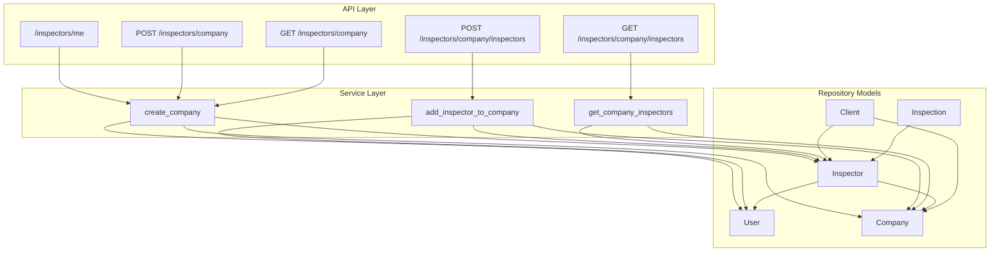
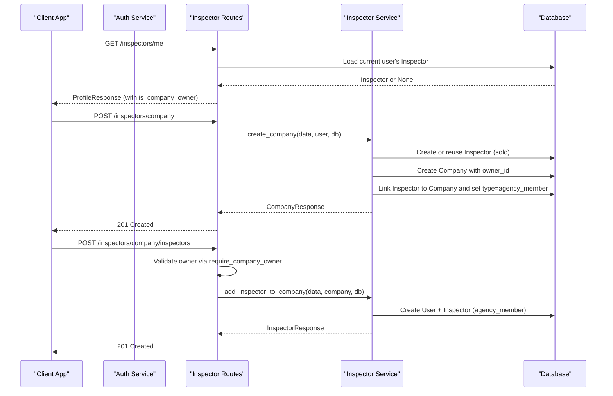
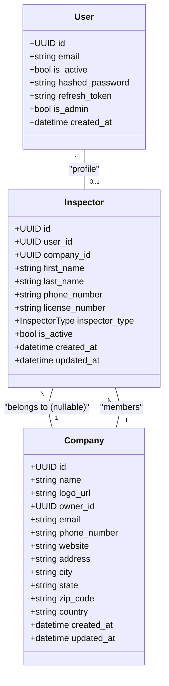
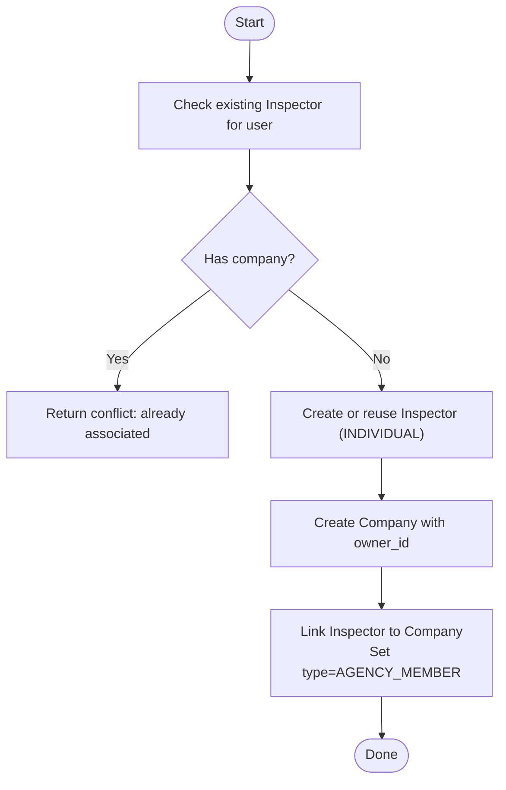
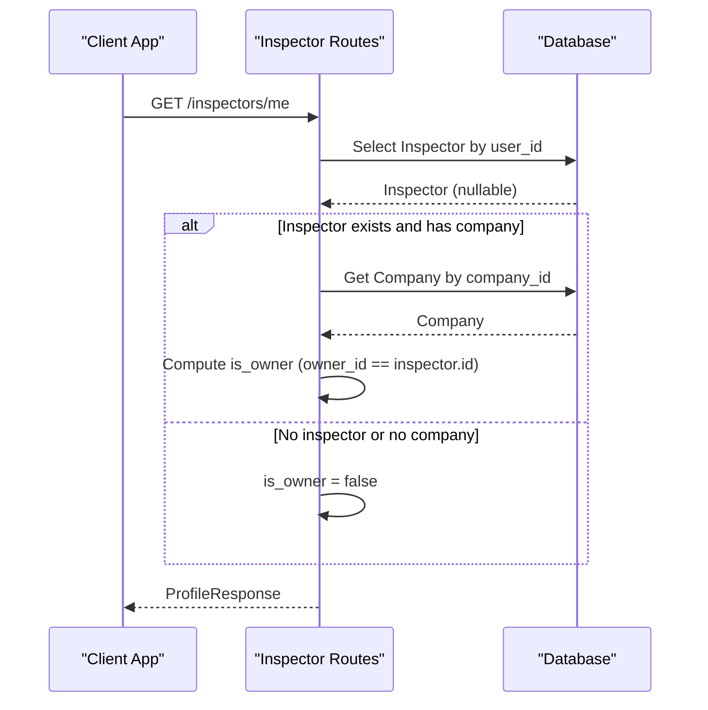
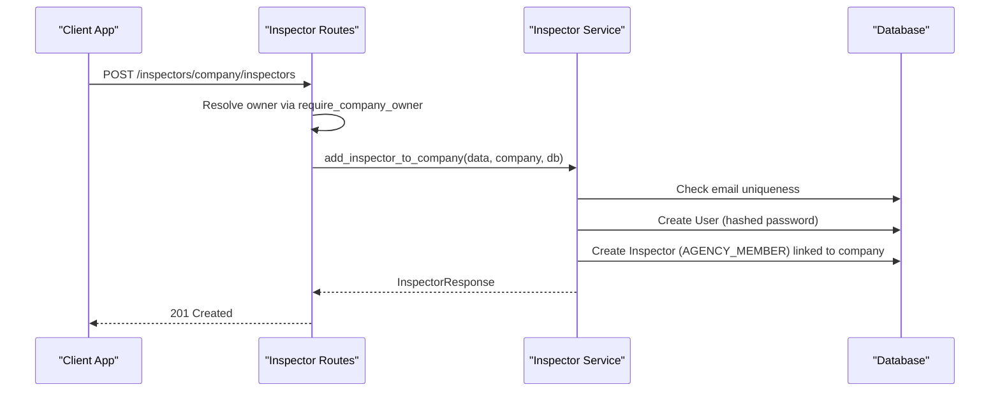
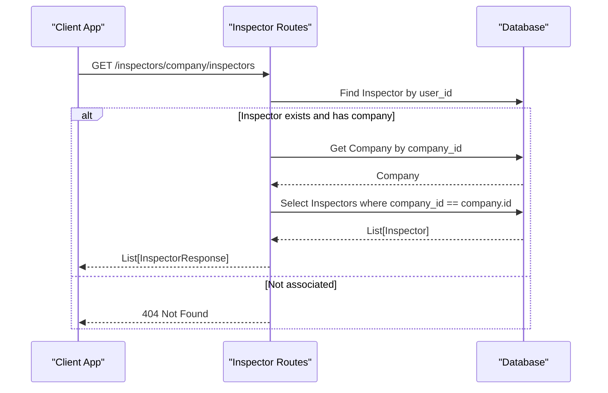
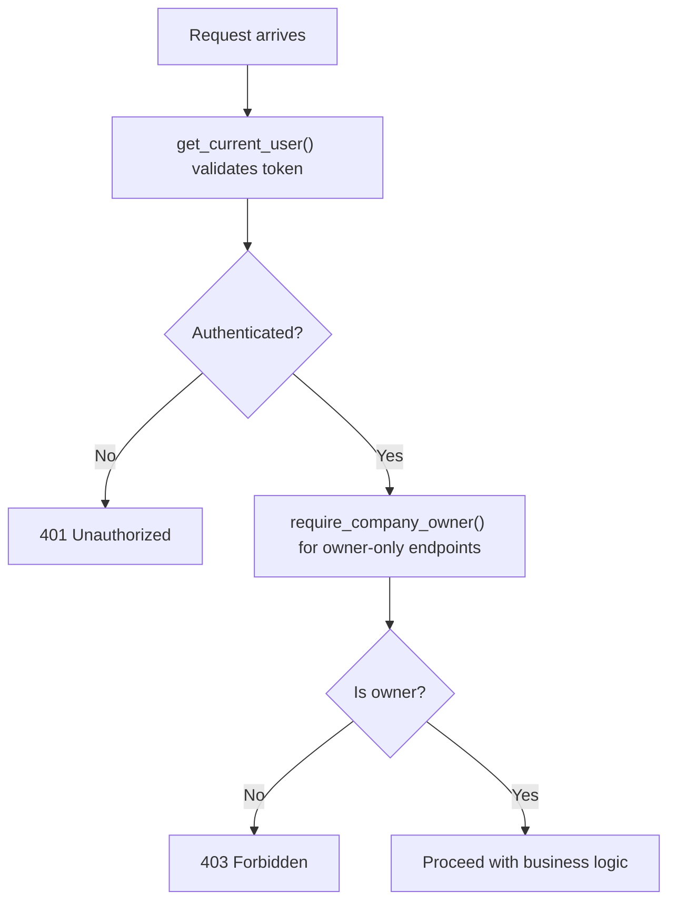
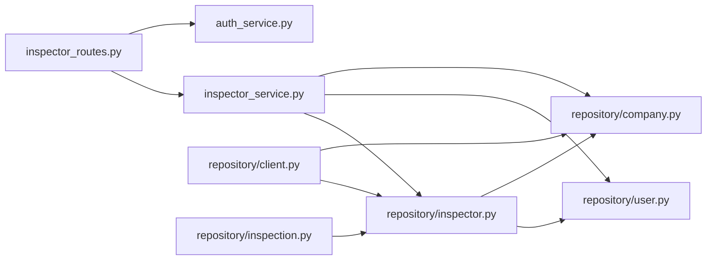

# Inspector Workflows

<cite>
**Referenced Files in This Document**
- [inspector.py](file://app/repository/inspector.py)
- [user.py](file://app/repository/user.py)
- [company.py](file://app/repository/company.py)
- [client.py](file://app/repository/client.py)
- [inspection.py](file://app/repository/inspection.py)
- [inspector_service.py](file://app/services/inspector_service.py)
- [auth_service.py](file://app/services/auth_service.py)
- [inspector_routes.py](file://app/api/routes/inspector_routes.py)
- [inspector_dtos.py](file://app/api/dtos/inspector_dtos.py)
- [db_config.py](file://app/config/db_config.py)
- [README.md](file://README.md)
</cite>

## Table of Contents
1. Introduction
2. Project Structure
3. Core Components
4. Architecture Overview
5. Detailed Component Analysis
6. Dependency Analysis
7. Performance Considerations
8. Troubleshooting Guide
9. Conclusion

## Introduction
This document explains the inspector workflow management for both solo inspectors and agency employees. It covers the Inspector model, its relationships with Users and Companies, role differentiation between solo and agency modes, registration flows, profile management, company assignment, permissions, data access patterns, and transitions between workflows. The goal is to help developers and product teams understand how the system supports independent inspectors and multi-inspector agencies within a single platform.

## Project Structure
The inspector workflow spans three layers:
- API routes define endpoints for profile retrieval, company creation, and inspector onboarding.
- Services implement business logic for creating companies, adding inspectors, and listing company members.
- Repository models define the database schema and relationships among User, Inspector, Company, Client, and Inspection.

**Diagram sources**
- [inspector_routes.py:28-143](file://app/api/routes/inspector_routes.py#L28-L143)
- [inspector_service.py:17-134](file://app/services/inspector_service.py#L17-L134)
- [inspector.py:18-82](file://app/repository/inspector.py#L18-L82)
- [user.py:10-54](file://app/repository/user.py#L10-L54)
- [company.py:12-61](file://app/repository/company.py#L12-L61)
- [client.py:12-78](file://app/repository/client.py#L12-L78)
- [inspection.py:19-75](file://app/repository/inspection.py#L19-L75)

**Section sources**
- [inspector_routes.py:28-143](file://app/api/routes/inspector_routes.py#L28-L143)
- [inspector_service.py:17-134](file://app/services/inspector_service.py#L17-L134)
- [inspector.py:18-82](file://app/repository/inspector.py#L18-L82)
- [user.py:10-54](file://app/repository/user.py#L10-L54)
- [company.py:12-61](file://app/repository/company.py#L12-L61)
- [client.py:12-78](file://app/repository/client.py#L12-L78)
- [inspection.py:19-75](file://app/repository/inspection.py#L19-L75)

## Core Components
- User: Authentication identity with email, password hash, active status, and optional inspector profile link.
- Inspector: Profile tied to a User, optionally linked to a Company, with type distinguishing solo vs agency member.
- Company: Agency entity with owner reference to an Inspector; holds clients and inspectors.
- Client: Managed by an Inspector or Company; can be associated with either depending on workflow.
- Inspection: Job record linking an Inspector to a Property, with status tracking.

Key relationships:
- One-to-one between User and Inspector (optional).
- Inspector belongs to a Company (nullable), enabling solo mode when unlinked.
- Company owns multiple Inspectors and Clients.
- Inspections belong to an Inspector.

**Section sources**
- [user.py:10-54](file://app/repository/user.py#L10-L54)
- [inspector.py:18-82](file://app/repository/inspector.py#L18-L82)
- [company.py:12-61](file://app/repository/company.py#L12-L61)
- [client.py:12-78](file://app/repository/client.py#L12-L78)
- [inspection.py:19-75](file://app/repository/inspection.py#L19-L75)

## Architecture Overview
The inspector workflow supports two primary modes:
- Solo Inspector: A User creates an Inspector profile without a Company affiliation. They manage their own clients and inspections independently.
- Agency Member: A Company owner creates a Company and becomes its owner. Additional inspectors are added to the Company as agency members.

Authentication and authorization:
- Access tokens and refresh tokens manage session state.
- get_current_user dependency ensures requests are authenticated.
- require_company_owner dependency enforces that only the company owner can add inspectors.

**Diagram sources**
- [inspector_routes.py:28-143](file://app/api/routes/inspector_routes.py#L28-L143)
- [inspector_service.py:17-134](file://app/services/inspector_service.py#L17-L134)
- [auth_service.py:196-271](file://app/services/auth_service.py#L196-L271)

**Section sources**
- [inspector_routes.py:28-143](file://app/api/routes/inspector_routes.py#L28-L143)
- [inspector_service.py:17-134](file://app/services/inspector_service.py#L17-L134)
- [auth_service.py:196-271](file://app/services/auth_service.py#L196-L271)

## Detailed Component Analysis

### Inspector Model and Role Differentiation
- InspectorType distinguishes between INDIVIDUAL (solo) and AGENCY_MEMBER (company-affiliated).
- Default type is INDIVIDUAL when a new Inspector profile is created without a company.
- When a company is created and linked to the inspector, the type switches to AGENCY_MEMBER.

**Diagram sources**
- [user.py:10-54](file://app/repository/user.py#L10-L54)
- [inspector.py:18-82](file://app/repository/inspector.py#L18-L82)
- [company.py:12-61](file://app/repository/company.py#L12-L61)

**Section sources**
- [inspector.py:13-49](file://app/repository/inspector.py#L13-L49)
- [inspector_service.py:27-72](file://app/services/inspector_service.py#L27-L72)

### Registration and Onboarding Flows
- Solo Inspector Onboarding:
  - A User registers and obtains an Inspector profile automatically when creating a company, initially as INDIVIDUAL.
  - If no company is created, the Inspector remains solo until later association.
- Agency Inspector Onboarding:
  - Company owner adds inspectors by creating a User and Inspector profile linked to the company with type AGENCY_MEMBER.

**Diagram sources**
- [inspector_service.py:17-72](file://app/services/inspector_service.py#L17-L72)

**Section sources**
- [inspector_service.py:17-72](file://app/services/inspector_service.py#L17-L72)
- [inspector_routes.py:53-64](file://app/api/routes/inspector_routes.py#L53-L64)

### Profile Management and Context Switching
- Retrieving current profile:
  - Endpoint returns the logged-in user’s Inspector profile if present and determines ownership status.
- Context switching:
  - Solo mode: Inspector has no company_id; they operate independently.
  - Agency mode: Inspector has company_id and type AGENCY_MEMBER; they operate under the company context.
- Ownership detection:
  - is_company_owner is true when the inspector’s company exists and the company’s owner_id matches the inspector’s id.

**Diagram sources**
- [inspector_routes.py:28-48](file://app/api/routes/inspector_routes.py#L28-L48)

**Section sources**
- [inspector_routes.py:28-48](file://app/api/routes/inspector_routes.py#L28-L48)

### Adding Inspectors to a Company (Agency Workflow)
- Only the company owner can add inspectors.
- Validation includes checking email uniqueness and ensuring the caller is the owner.
- Creates a new User account and Inspector profile linked to the company with type AGENCY_MEMBER.

**Diagram sources**
- [inspector_routes.py:89-121](file://app/api/routes/inspector_routes.py#L89-L121)
- [inspector_service.py:75-122](file://app/services/inspector_service.py#L75-L122)
- [auth_service.py:246-271](file://app/services/auth_service.py#L246-L271)

**Section sources**
- [inspector_routes.py:89-121](file://app/api/routes/inspector_routes.py#L89-L121)
- [inspector_service.py:75-122](file://app/services/inspector_service.py#L75-L122)
- [auth_service.py:246-271](file://app/services/auth_service.py#L246-L271)

### Listing Company Inspectors
- Requires being associated with a company; returns all inspectors belonging to the company.
- Used by agency owners to view team members.

**Diagram sources**
- [inspector_routes.py:124-143](file://app/api/routes/inspector_routes.py#L124-L143)

**Section sources**
- [inspector_routes.py:124-143](file://app/api/routes/inspector_routes.py#L124-L143)

### Data Access Patterns and Permissions
- Authentication:
  - get_current_user extracts and validates access token from cookies; returns User if active.
- Authorization:
  - require_company_owner ensures the current user is the owner of the company before allowing inspector addition.
- Data isolation:
  - Solo inspectors see only their own data unless explicitly shared.
  - Agency members operate within the company context; endpoints restrict access based on company membership.

**Diagram sources**
- [auth_service.py:196-271](file://app/services/auth_service.py#L196-L271)

**Section sources**
- [auth_service.py:196-271](file://app/services/auth_service.py#L196-L271)

### Practical Examples
- Solo Inspector Onboarding:
  - Register a User, then call create company endpoint to auto-create an Inspector profile and switch to agency mode upon company creation.
  - Alternatively, remain solo by not creating a company; the Inspector remains INDIVIDUAL.
- Agency Inspector Onboarding:
  - As company owner, call add inspector endpoint to create a new User and Inspector profile linked to the company.
- Profile Updates:
  - Use the profile endpoint to retrieve current inspector details and ownership status; update fields through appropriate endpoints as needed.
- Context Switching:
  - Transition from solo to agency by creating a company and linking the inspector; the inspector_type changes to AGENCY_MEMBER.

[No sources needed since this section provides conceptual guidance]

## Dependency Analysis
Inspector-related dependencies across layers:

**Diagram sources**
- [inspector_routes.py:1-143](file://app/api/routes/inspector_routes.py#L1-L143)
- [inspector_service.py:1-134](file://app/services/inspector_service.py#L1-L134)
- [inspector.py:18-82](file://app/repository/inspector.py#L18-L82)
- [user.py:10-54](file://app/repository/user.py#L10-L54)
- [company.py:12-61](file://app/repository/company.py#L12-L61)
- [client.py:12-78](file://app/repository/client.py#L12-L78)
- [inspection.py:19-75](file://app/repository/inspection.py#L19-L75)
- [auth_service.py:196-271](file://app/services/auth_service.py#L196-L271)

**Section sources**
- [inspector_routes.py:1-143](file://app/api/routes/inspector_routes.py#L1-L143)
- [inspector_service.py:1-134](file://app/services/inspector_service.py#L1-L134)
- [inspector.py:18-82](file://app/repository/inspector.py#L18-L82)
- [user.py:10-54](file://app/repository/user.py#L10-L54)
- [company.py:12-61](file://app/repository/company.py#L12-L61)
- [client.py:12-78](file://app/repository/client.py#L12-L78)
- [inspection.py:19-75](file://app/repository/inspection.py#L19-L75)
- [auth_service.py:196-271](file://app/services/auth_service.py#L196-L271)

## Performance Considerations
- Database queries:
  - Use selectin loading for related collections (e.g., clients, inspections) to avoid N+1 queries.
- Session management:
  - Ensure proper commit and refresh calls after inserts to obtain IDs and maintain consistency.
- Token handling:
  - Refresh token rotation minimizes risk and reduces long-lived sensitive tokens in storage.

[No sources needed since this section provides general guidance]

## Troubleshooting Guide
Common issues and resolutions:
- Already associated with a company:
  - Occurs when attempting to create a company while already linked to one. Resolve by removing the existing association or using the existing company.
- Not a company member:
  - Attempting to add inspectors without being associated with a company results in forbidden access. Ensure the user is part of a company.
- Only the company owner can add inspectors:
  - Non-owners cannot add inspectors. Verify ownership via require_company_owner dependency.
- Not associated with any company:
  - Trying to access company-specific endpoints without a company association returns not found. Create a company first.
- Invalid credentials or deactivated account:
  - Login failures due to incorrect passwords or inactive accounts. Reset credentials or reactivate the account.

**Section sources**
- [inspector_service.py:27-35](file://app/services/inspector_service.py#L27-L35)
- [inspector_routes.py:99-117](file://app/api/routes/inspector_routes.py#L99-L117)
- [inspector_routes.py:130-139](file://app/api/routes/inspector_routes.py#L130-L139)
- [auth_service.py:65-84](file://app/services/auth_service.py#L65-L84)

## Conclusion
The inspector workflow supports both solo inspectors and agency employees through clear role differentiation and controlled transitions. Solo inspectors operate independently without company affiliation, while agency members work within a company context managed by an owner. The system enforces authentication and authorization at each step, ensuring secure and consistent operations. By understanding the models, services, and routes outlined here, teams can confidently extend and maintain inspector workflows for diverse inspection scenarios.