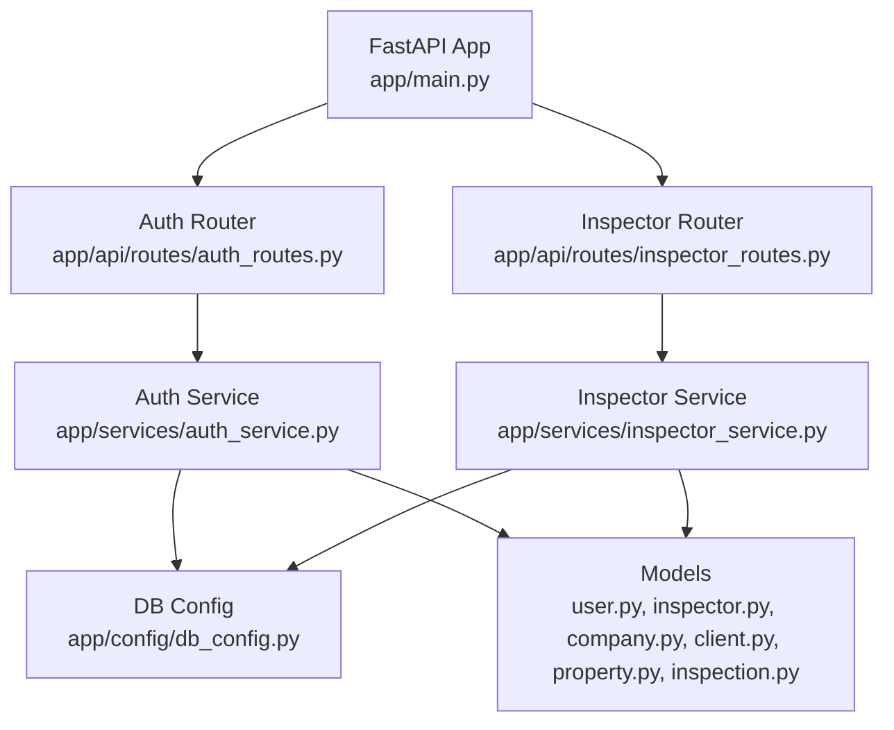
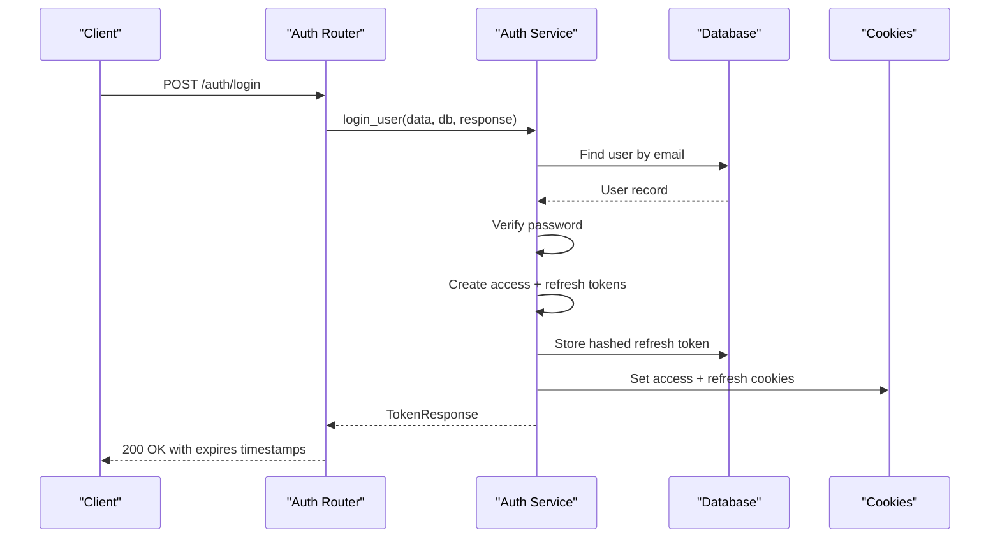
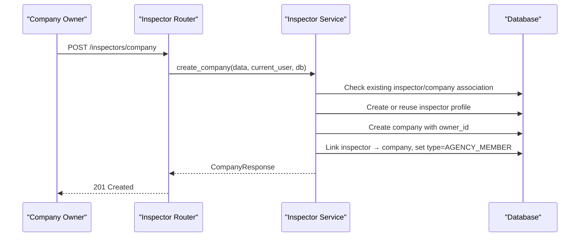
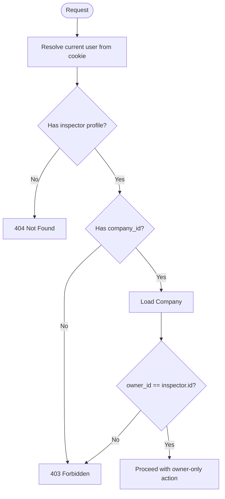
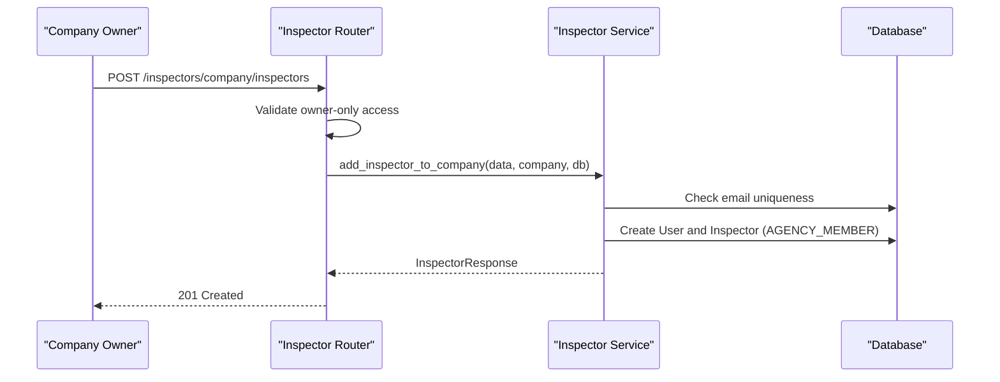
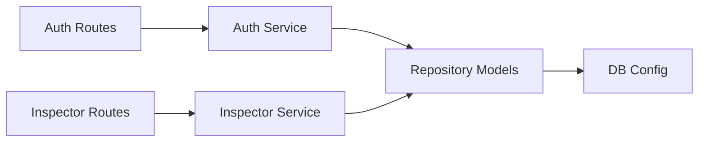

# Multi-Tenant Architecture

<cite>
**Referenced Files in This Document**
- [main.py](file://app/main.py)
- [db_config.py](file://app/config/db_config.py)
- [README.md](file://README.md)
- [auth_routes.py](file://app/api/routes/auth_routes.py)
- [inspector_routes.py](file://app/api/routes/inspector_routes.py)
- [auth_service.py](file://app/services/auth_service.py)
- [inspector_service.py](file://app/services/inspector_service.py)
- [user.py](file://app/repository/user.py)
- [company.py](file://app/repository/company.py)
- [inspector.py](file://app/repository/inspector.py)
- [client.py](file://app/repository/client.py)
- [property.py](file://app/repository/property.py)
- [inspection.py](file://app/repository/inspection.py)
</cite>

## Table of Contents
1. Introduction
2. Project Structure
3. Core Components
4. Architecture Overview
5. Detailed Component Analysis
6. Dependency Analysis
7. Performance Considerations
8. Troubleshooting Guide
9. Conclusion

## Introduction
This document explains the multi-tenant architecture that supports both solo inspectors and inspection agencies. It covers company-inspector-client relationships, ownership verification mechanisms, role-based access control, inspector profile management, company creation and administration, client assignment workflows, business logic for distinguishing solo vs agency contexts, permission checks, data isolation patterns, practical API usage examples, administrative tasks, scalability considerations, and tenant data segregation strategies.

The system is built with FastAPI, SQLAlchemy 2.0, and PostgreSQL. Authentication uses JWT tokens stored in secure cookies with refresh token rotation. The core entities include User, Inspector (with type INDIVIDUAL or AGENCY_MEMBER), Company (agency), Client, Property, Inspection, and related assets.

**Section sources**
- [README.md:1-214](file://README.md#L1-L214)

## Project Structure
At a high level:
- Application entrypoint registers routers and initializes database tables.
- API routes expose authentication and inspector/company endpoints.
- Services implement business logic for auth flows and company/inspector operations.
- Repository models define the relational schema and relationships.
- Configuration provides database engine and session management.



**Diagram sources**
- [main.py:11-21](file://app/main.py#L11-L21)
- [auth_routes.py:22-65](file://app/api/routes/auth_routes.py#L22-L65)
- [inspector_routes.py:23-143](file://app/api/routes/inspector_routes.py#L23-L143)
- [auth_service.py:35-274](file://app/services/auth_service.py#L35-L274)
- [inspector_service.py:17-134](file://app/services/inspector_service.py#L17-L134)
- [db_config.py:16-26](file://app/config/db_config.py#L16-L26)
- [user.py:10-54](file://app/repository/user.py#L10-L54)
- [inspector.py:13-82](file://app/repository/inspector.py#L13-L82)
- [company.py:12-61](file://app/repository/company.py#L12-L61)
- [client.py:12-78](file://app/repository/client.py#L12-L78)
- [property.py:20-70](file://app/repository/property.py#L20-L70)
- [inspection.py:19-75](file://app/repository/inspection.py#L19-L75)

**Section sources**
- [main.py:11-21](file://app/main.py#L11-L21)
- [db_config.py:16-26](file://app/config/db_config.py#L16-L26)

## Core Components
- Authentication service handles registration, login, logout, token refresh, and current user resolution via cookies.
- Inspector service manages company creation and membership, including owner-only operations.
- Models define multi-tenant boundaries:
  - InspectorType distinguishes solo (INDIVIDUAL) from agency members (AGENCY_MEMBER).
  - Company has an owner_id referencing an Inspector.
  - Client can be associated with an Inspector or a Company (or both optional).
  - Property belongs to a Client; Inspections link Inspector and Property.

Key relationships:
- One-to-one between User and Inspector.
- One-to-many from Company to Inspectors and Clients.
- Many-to-one from Inspector to Company (optional).
- Many-to-one from Client to Inspector and Company (optional).
- Many-to-one from Property to Client.
- Many-to-one from Inspection to Inspector and Property.

**Section sources**
- [auth_service.py:35-274](file://app/services/auth_service.py#L35-L274)
- [inspector_service.py:17-134](file://app/services/inspector_service.py#L17-L134)
- [inspector.py:13-82](file://app/repository/inspector.py#L13-L82)
- [company.py:12-61](file://app/repository/company.py#L12-L61)
- [client.py:12-78](file://app/repository/client.py#L12-L78)
- [property.py:20-70](file://app/repository/property.py#L20-L70)
- [inspection.py:19-75](file://app/repository/inspection.py#L19-L75)

## Architecture Overview
The application follows a layered architecture:
- API Layer: FastAPI routers define endpoints for authentication and inspector/company management.
- Service Layer: Business logic enforces multi-tenant rules, ownership checks, and data integrity.
- Data Layer: SQLAlchemy models represent entities and relationships; sessions are provided by dependency injection.



**Diagram sources**
- [auth_routes.py:31-34](file://app/api/routes/auth_routes.py#L31-L34)
- [auth_service.py:61-103](file://app/services/auth_service.py#L61-L103)



**Diagram sources**
- [inspector_routes.py:53-64](file://app/api/routes/inspector_routes.py#L53-L64)
- [inspector_service.py:17-72](file://app/services/inspector_service.py#L17-L72)

## Detailed Component Analysis

### Multi-Tenant Entities and Relationships
The core multi-tenant model centers on Company, Inspector, and Client:
- Company represents an agency with an owner (an Inspector).
- Inspector can be INDIVIDUAL (solo) or AGENCY_MEMBER (part of a company).
- Client can be managed by an Inspector directly or associated with a Company.
- Property belongs to a Client; Inspections tie an Inspector to a Property.

```mermaid
erDiagram
USER {
uuid id PK
string email UK
boolean is_active
text hashed_password
text refresh_token
boolean is_admin
timestamp created_at
}
INSPECTOR {
uuid id PK
uuid user_id UK FK
uuid company_id FK
enum inspector_type
boolean is_active
timestamp created_at
timestamp updated_at
}
COMPANY {
uuid id PK
uuid owner_id FK
string name
string email UK
timestamp created_at
timestamp updated_at
}
CLIENT {
uuid id PK
uuid inspector_id FK
uuid company_id FK
timestamp created_at
timestamp updated_at
}
PROPERTY {
uuid id PK
uuid client_id FK
timestamp created_at
timestamp updated_at
}
INSPECTION {
uuid id PK
uuid inspector_id FK
uuid property_id FK
enum status
timestamp created_at
timestamp updated_at
}
USER ||--|| INSPECTOR : "one-to-one"
COMPANY ||--o{ INSPECTOR : "has many"
COMPANY ||--o{ CLIENT : "has many"
INSPECTOR ||--o{ CLIENT : "manages many"
CLIENT ||--o{ PROPERTY : "owns many"
INSPECTOR ||--o{ INSPECTION : "conducts many"
PROPERTY ||--o{ INSPECTION : "subject of many"
```

**Diagram sources**
- [user.py:10-54](file://app/repository/user.py#L10-L54)
- [inspector.py:13-82](file://app/repository/inspector.py#L13-L82)
- [company.py:12-61](file://app/repository/company.py#L12-L61)
- [client.py:12-78](file://app/repository/client.py#L12-L78)
- [property.py:20-70](file://app/repository/property.py#L20-L70)
- [inspection.py:19-75](file://app/repository/inspection.py#L19-L75)

**Section sources**
- [inspector.py:13-82](file://app/repository/inspector.py#L13-L82)
- [company.py:12-61](file://app/repository/company.py#L12-L61)
- [client.py:12-78](file://app/repository/client.py#L12-L78)
- [property.py:20-70](file://app/repository/property.py#L20-L70)
- [inspection.py:19-75](file://app/repository/inspection.py#L19-L75)

### Ownership Verification and Role-Based Access Control
- Current user resolution:
  - get_current_user extracts access token from cookie, decodes it, loads User, and validates active status.
- Inspector profile resolution:
  - get_current_inspector resolves Inspector by current user’s ID.
- Company owner enforcement:
  - require_company_owner ensures the current user’s Inspector belongs to a Company and matches Company.owner_id.
- Route-level checks:
  - Adding inspectors and listing company inspectors verify company association and ownership before proceeding.



**Diagram sources**
- [auth_service.py:199-274](file://app/services/auth_service.py#L199-L274)
- [inspector_routes.py:89-143](file://app/api/routes/inspector_routes.py#L89-L143)

**Section sources**
- [auth_service.py:199-274](file://app/services/auth_service.py#L199-L274)
- [inspector_routes.py:89-143](file://app/api/routes/inspector_routes.py#L89-L143)

### Inspector Profile Management
- Profile retrieval:
  - GET /inspectors/me returns the logged-in user’s inspector profile and indicates whether they own their company.
- Solo vs Agency context:
  - If inspector.inspector_type is INDIVIDUAL, the user operates as a solo inspector without company scope.
  - If AGENCY_MEMBER, the user is scoped to their company’s resources.

Practical example:
- To check your profile and ownership status, call GET /inspectors/me after logging in.

**Section sources**
- [inspector_routes.py:28-48](file://app/api/routes/inspector_routes.py#L28-L48)
- [inspector.py:13-82](file://app/repository/inspector.py#L13-L82)

### Company Creation and Administration
- Create company:
  - POST /inspectors/company creates a company and sets the requester as owner; if the user already has an inspector profile without a company, it reuses it; otherwise, it creates one and links it.
- Add inspector (owner-only):
  - POST /inspectors/company/inspectors requires company ownership; creates a new User and Inspector linked to the company.
- List company inspectors:
  - GET /inspectors/company/inspectors lists all inspectors under the logged-in user’s company.



**Diagram sources**
- [inspector_routes.py:89-121](file://app/api/routes/inspector_routes.py#L89-L121)
- [inspector_service.py:75-122](file://app/services/inspector_service.py#L75-L122)

**Section sources**
- [inspector_routes.py:53-143](file://app/api/routes/inspector_routes.py#L53-L143)
- [inspector_service.py:17-134](file://app/services/inspector_service.py#L17-L134)

### Client Assignment Workflows
- Client entity supports two association paths:
  - Directly managed by an Inspector (inspector_id).
  - Associated with a Company (company_id).
- This allows flexibility:
  - Solo inspectors manage clients directly.
  - Agencies associate clients at the company level, enabling shared visibility and reporting.

Data isolation pattern:
- When operating in agency context, queries should filter by company_id to isolate tenants.
- For solo inspectors, queries should filter by inspector_id.

**Section sources**
- [client.py:12-78](file://app/repository/client.py#L12-L78)

### Permission Checks and Data Isolation Patterns
- Permission checks:
  - get_current_user enforces authentication and active status.
  - require_company_owner enforces company ownership for admin actions.
  - Route handlers validate company association before performing scoped operations.
- Data isolation:
  - Use inspector.company_id to scope queries when in agency mode.
  - Use inspector.id to scope queries when in solo mode.
  - Ensure cascades and foreign keys maintain referential integrity across tenants.

**Section sources**
- [auth_service.py:199-274](file://app/services/auth_service.py#L199-L274)
- [inspector_routes.py:66-143](file://app/api/routes/inspector_routes.py#L66-L143)

### Practical API Usage Examples
- Authentication:
  - Register: POST /auth/register with email and password.
  - Login: POST /auth/login with email and password; receives access and refresh token expiry times; cookies are set automatically.
  - Refresh: POST /auth/refresh with optional body refresh_token; rotates tokens and sets new cookies.
  - Logout: POST /auth/logout revokes refresh token and clears cookies.
  - Me: GET /auth/me returns current user info.
- Inspector and Company:
  - Profile: GET /inspectors/me returns inspector profile and ownership flag.
  - Create Company: POST /inspectors/company creates agency and sets owner.
  - Add Inspector: POST /inspectors/company/inspectors adds team member (owner-only).
  - List Inspectors: GET /inspectors/company/inspectors lists team members.

Note: These endpoints rely on secure cookies for tokens; ensure your client handles cookies appropriately.

**Section sources**
- [auth_routes.py:25-65](file://app/api/routes/auth_routes.py#L25-L65)
- [inspector_routes.py:28-143](file://app/api/routes/inspector_routes.py#L28-L143)

### Common Administrative Tasks
- As a company owner:
  - Create the company once; subsequent users can be added as inspectors.
  - List and manage inspectors within the company scope.
- As a solo inspector:
  - Manage your own clients and properties without company scoping.
  - Use inspector_type INDIVIDUAL to operate independently.

**Section sources**
- [inspector_service.py:17-134](file://app/services/inspector_service.py#L17-L134)
- [inspector_routes.py:28-143](file://app/api/routes/inspector_routes.py#L28-L143)

## Dependency Analysis
The system exhibits clear separation of concerns:
- Routers depend on services for business logic.
- Services depend on repository models for data access.
- Database configuration is centralized and injected into routes and services.



**Diagram sources**
- [auth_routes.py:1-65](file://app/api/routes/auth_routes.py#L1-L65)
- [inspector_routes.py:1-143](file://app/api/routes/inspector_routes.py#L1-L143)
- [auth_service.py:1-274](file://app/services/auth_service.py#L1-L274)
- [inspector_service.py:1-134](file://app/services/inspector_service.py#L1-L134)
- [db_config.py:16-26](file://app/config/db_config.py#L16-L26)

**Section sources**
- [auth_routes.py:1-65](file://app/api/routes/auth_routes.py#L1-L65)
- [inspector_routes.py:1-143](file://app/api/routes/inspector_routes.py#L1-L143)
- [auth_service.py:1-274](file://app/services/auth_service.py#L1-L274)
- [inspector_service.py:1-134](file://app/services/inspector_service.py#L1-L134)
- [db_config.py:16-26](file://app/config/db_config.py#L16-L26)

## Performance Considerations
- Session management:
  - Use dependency-injected sessions to avoid connection leaks; ensure proper cleanup in finally blocks.
- Query efficiency:
  - Prefer selectin loading for relationships where needed to reduce N+1 queries.
  - Filter queries by tenant identifiers (company_id or inspector_id) to minimize result sets.
- Indexing:
  - Add indexes on frequently filtered columns such as company_id, inspector_id, client_id, and email to improve lookup performance.
- Token handling:
  - Keep access tokens short-lived; use refresh token rotation to balance security and performance.
- Database constraints:
  - Leverage unique constraints (e.g., email) and foreign key cascades to maintain integrity and reduce validation overhead.

[No sources needed since this section provides general guidance]

## Troubleshooting Guide
Common issues and resolutions:
- Authentication failures:
  - Invalid or expired access token: Ensure cookies are present and not blocked by browser settings; re-login if necessary.
  - Invalid or expired refresh token: Rotate tokens via /auth/refresh; if reuse detected, all sessions may be revoked for safety.
- Account deactivated:
  - If user.is_active is false, login and refresh will be rejected; reactivate the account through administrative processes.
- Not authenticated:
  - Missing access cookie; verify login flow and cookie domain/path configuration.
- Not a company member:
  - Attempting owner-only actions without being part of a company; ensure the user has an inspector profile linked to a company.
- Only the company owner can perform this action:
  - Non-owner attempting to add inspectors or manage company settings; verify ownership via require_company_owner.

**Section sources**
- [auth_service.py:61-194](file://app/services/auth_service.py#L61-L194)
- [auth_service.py:199-274](file://app/services/auth_service.py#L199-L274)
- [inspector_routes.py:66-143](file://app/api/routes/inspector_routes.py#L66-L143)

## Conclusion
The multi-tenant architecture cleanly separates solo inspectors from agency contexts using InspectorType, Company ownership, and flexible Client associations. Role-based access control is enforced through service-layer dependencies and route-level checks, ensuring data isolation and secure operations. The API surface supports essential administrative tasks like company creation and inspector management, while maintaining scalability through efficient querying, indexing, and robust session/token handling.

[No sources needed since this section summarizes without analyzing specific files]