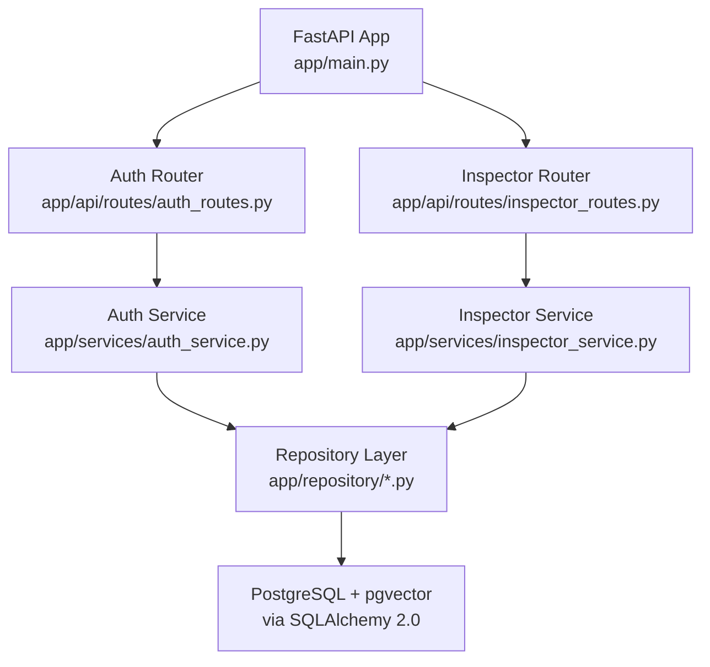
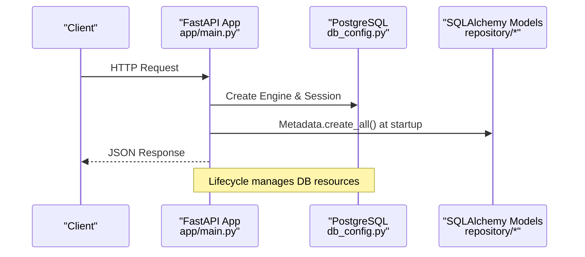
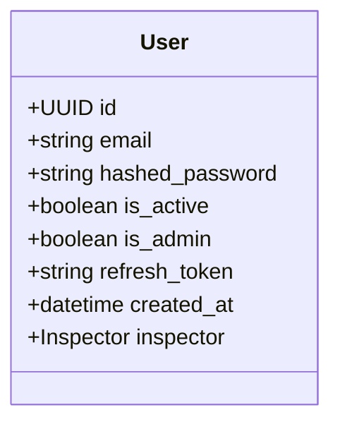
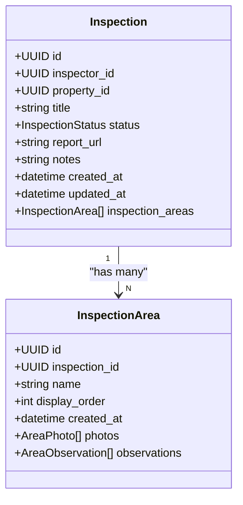
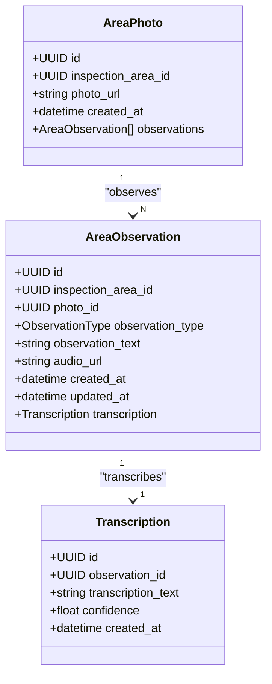
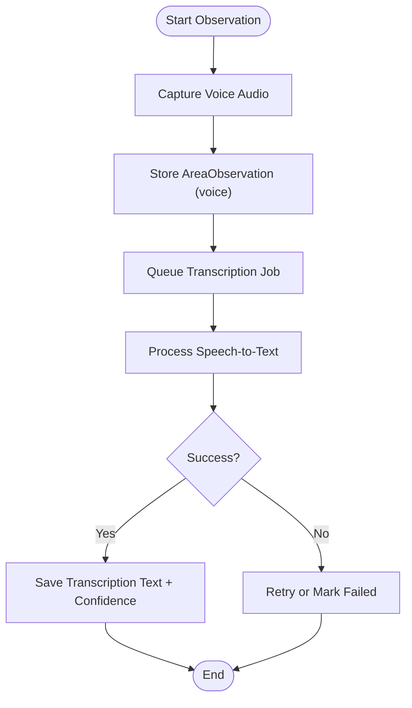
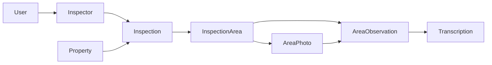

# Project Overview

<cite>
**Referenced Files in This Document**
- [README.md](file://README.md)
- [TASK_DECOMPOSITION.md](file://TASK_DECOMPOSITION.md)
- [app/main.py](file://app/main.py)
- [requirements.txt](file://requirements.txt)
- [app/config/db_config.py](file://app/config/db_config.py)
- [app/repository/base.py](file://app/repository/base.py)
- [app/repository/inspection.py](file://app/repository/inspection.py)
- [app/repository/inspection_area.py](file://app/repository/inspection_area.py)
- [app/repository/area_photo.py](file://app/repository/area_photo.py)
- [app/repository/area_observation.py](file://app/repository/area_observation.py)
- [app/repository/transcription.py](file://app/repository/transcription.py)
- [app/repository/user.py](file://app/repository/user.py)
</cite>

## Table of Contents
1. [Introduction](#introduction)
2. [Project Structure](#project-structure)
3. [Core Components](#core-components)
4. [Architecture Overview](#architecture-overview)
5. [Detailed Component Analysis](#detailed-component-analysis)
6. [Dependency Analysis](#dependency-analysis)
7. [Performance Considerations](#performance-considerations)
8. [Troubleshooting Guide](#troubleshooting-guide)
9. [Conclusion](#conclusion)

## Introduction
DefectLoupe is a modern backend platform for property inspection and defect tracking. It enables independent inspectors and inspection agencies to conduct structured walkthroughs, capture photos, record text or voice notes, and generate detailed inspection records with automated voice transcription. The system supports both solo inspectors and agency workflows through multi-tenant flexibility, hierarchical inspection flows, rich media capture, automated transcription, and strong relational data integrity.

Key objectives:
- Provide a fast, reliable, hands-free workflow for documenting defects across property areas.
- Support solo inspectors and agencies managing multiple inspectors and clients.
- Maintain strict data relationships and auditability via SQLAlchemy 2.0 and PostgreSQL (with pgvector enabled).
- Offer a scalable FastAPI-based API surface for frontend or mobile clients.

Target audience:
- Independent home inspectors seeking a streamlined inspection tool.
- Inspection agencies requiring multi-inspector management, client catalogs, and standardized reporting pipelines.

Technology stack overview:
- Framework: FastAPI with Uvicorn ASGI server.
- ORM: SQLAlchemy 2.0 using mapped column syntax.
- Database: PostgreSQL 15 with pgvector extension for vector similarity search.
- Containerization: Docker and Docker Compose for local and production environments.

**Section sources**
- [README.md:1-18](file://README.md#L1-L18)
- [README.md:66-73](file://README.md#L66-L73)
- [requirements.txt:1-11](file://requirements.txt#L1-L11)

## Project Structure
The backend follows a layered architecture:
- API layer: Routes and DTOs under app/api/routes and app/api/dtos.
- Services: Business logic under app/services.
- Repository: SQLAlchemy models under app/repository.
- Configuration: Database engine and session factory under app/config.
- Utilities: Helpers for JWT, cookies, password hashing, and config loading under app/utils.
- Entrypoint: FastAPI application initialization and router mounting in app/main.py.

**Diagram sources**
- [app/main.py:1-30](file://app/main.py#L1-L30)
- [app/config/db_config.py:1-26](file://app/config/db_config.py#L1-L26)

**Section sources**
- [README.md:182-214](file://README.md#L182-L214)
- [app/main.py:1-30](file://app/main.py#L1-L30)

## Core Components
DefectLoupe’s core components implement the inspection lifecycle and media handling:

- Authentication and user context:
  - User model with email, hashed password, active status, admin flag, refresh token, and inspector linkage.
  - JWT-based access and refresh tokens configured via environment variables.

- Multi-tenant and organizational structure:
  - Company (agency) and Inspector profiles support both solo and agency modes.
  - Inspectors are linked to Users; optional Company association for agencies.

- Inspection workflow:
  - Inspection entities link an Inspector to a Property with status transitions and metadata.
  - Hierarchical InspectionArea defines ordered sections within an inspection.

- Rich media and observations:
  - AreaPhoto stores high-resolution images per area.
  - AreaObservation captures text or voice notes, optionally tied to a photo.
  - Transcription provides one-to-one speech-to-text output for voice observations.

- Data integrity:
  - Strong foreign keys and cascade rules ensure referential consistency.
  - Enumerated statuses and typed columns enforce schema constraints.

**Section sources**
- [app/repository/user.py:1-54](file://app/repository/user.py#L1-L54)
- [app/repository/inspection.py:1-75](file://app/repository/inspection.py#L1-L75)
- [app/repository/inspection_area.py:1-51](file://app/repository/inspection_area.py#L1-L51)
- [app/repository/area_photo.py:1-43](file://app/repository/area_photo.py#L1-L43)
- [app/repository/area_observation.py:1-70](file://app/repository/area_observation.py#L1-L70)
- [app/repository/transcription.py:1-50](file://app/repository/transcription.py#L1-L50)

## Architecture Overview
The system uses a FastAPI application that mounts routers for authentication and inspector-related endpoints. On startup, it creates database tables based on SQLAlchemy models and disposes engines on shutdown. The database configuration loads environment variables and initializes the engine and session factory.

**Diagram sources**
- [app/main.py:11-18](file://app/main.py#L11-L18)
- [app/config/db_config.py:1-26](file://app/config/db_config.py#L1-L26)

**Section sources**
- [app/main.py:1-30](file://app/main.py#L1-L30)
- [app/config/db_config.py:1-26](file://app/config/db_config.py#L1-L26)

## Detailed Component Analysis

### Authentication and User Context
- User model includes email, hashed password, active/admin flags, refresh token, and inspector relationship.
- Environment-driven secrets for JWT signing and token lifetimes.
- Routers mount auth routes to provide login, signup, and token refresh endpoints.

**Diagram sources**
- [app/repository/user.py:10-54](file://app/repository/user.py#L10-L54)

**Section sources**
- [app/repository/user.py:1-54](file://app/repository/user.py#L1-L54)
- [README.md:170-179](file://README.md#L170-L179)

### Inspection Workflow and Areas
- Inspection links Inspector and Property with status transitions and report URL.
- InspectionArea defines ordered sections within an inspection, supporting photos and observations.
- Relationships use cascades to maintain integrity when parent records are deleted.

**Diagram sources**
- [app/repository/inspection.py:19-75](file://app/repository/inspection.py#L19-L75)
- [app/repository/inspection_area.py:12-51](file://app/repository/inspection_area.py#L12-L51)

**Section sources**
- [app/repository/inspection.py:1-75](file://app/repository/inspection.py#L1-L75)
- [app/repository/inspection_area.py:1-51](file://app/repository/inspection_area.py#L1-L51)

### Media Capture and Observations
- AreaPhoto stores image URLs associated with an inspection area.
- AreaObservation supports text or voice notes, optionally linked to a photo.
- Transcription provides one-to-one mapping from voice observation to transcribed text with confidence scores.

**Diagram sources**
- [app/repository/area_photo.py:12-43](file://app/repository/area_photo.py#L12-L43)
- [app/repository/area_observation.py:18-70](file://app/repository/area_observation.py#L18-L70)
- [app/repository/transcription.py:12-50](file://app/repository/transcription.py#L12-L50)

**Section sources**
- [app/repository/area_photo.py:1-43](file://app/repository/area_photo.py#L1-L43)
- [app/repository/area_observation.py:1-70](file://app/repository/area_observation.py#L1-L70)
- [app/repository/transcription.py:1-50](file://app/repository/transcription.py#L1-L50)

### Voice Transcription Pipeline Flow
This flow shows how voice observations are captured and transcribed asynchronously:

[No sources needed since this diagram shows conceptual workflow, not actual code structure]

## Dependency Analysis
The repository layer defines clear dependencies between entities:
- Inspection depends on Inspector and Property.
- InspectionArea belongs to Inspection and owns Photos and Observations.
- AreaObservation can belong to an InspectionArea or an AreaPhoto and has a one-to-one Transcription.
- User optionally links to Inspector for solo vs. agency contexts.

**Diagram sources**
- [app/repository/inspection.py:61-75](file://app/repository/inspection.py#L61-L75)
- [app/repository/inspection_area.py:37-51](file://app/repository/inspection_area.py#L37-L51)
- [app/repository/area_observation.py:58-70](file://app/repository/area_observation.py#L58-L70)
- [app/repository/transcription.py:44-50](file://app/repository/transcription.py#L44-L50)
- [app/repository/user.py:50-54](file://app/repository/user.py#L50-L54)

**Section sources**
- [app/repository/inspection.py:1-75](file://app/repository/inspection.py#L1-L75)
- [app/repository/inspection_area.py:1-51](file://app/repository/inspection_area.py#L1-L51)
- [app/repository/area_observation.py:1-70](file://app/repository/area_observation.py#L1-L70)
- [app/repository/transcription.py:1-50](file://app/repository/transcription.py#L1-L50)
- [app/repository/user.py:1-54](file://app/repository/user.py#L1-L54)

## Performance Considerations
- Use selectin loading for collections to reduce N+1 queries when fetching inspections with areas, photos, and observations.
- Leverage PostgreSQL indexes on frequently queried fields such as inspection_area_id, photo_id, and observation_id.
- Offload transcription processing to background tasks to keep API responses fast.
- Optimize storage backends for large media files and consider CDN caching for photo URLs.
- Utilize pgvector for efficient similarity searches in future RAG/report generation features.

[No sources needed since this section provides general guidance]

## Troubleshooting Guide
Common issues and resolutions:
- Missing DATABASE_URL: Ensure environment variables are set in the .env file located at app/.env.
- Startup errors: Verify that Base.metadata.create_all runs during lifespan and that the database container is reachable.
- Authentication failures: Check ACCESS_TOKEN_SECRET and REFRESH_TOKEN_SECRET values and token expiry settings.
- Relationship errors: Confirm foreign key constraints and cascade rules when deleting parents or updating references.

**Section sources**
- [app/config/db_config.py:11-18](file://app/config/db_config.py#L11-L18)
- [app/main.py:11-18](file://app/main.py#L11-L18)
- [README.md:170-179](file://README.md#L170-L179)

## Conclusion
DefectLoupe provides a robust, scalable backend for property inspections tailored to both solo inspectors and agencies. Its layered architecture, strong relational model, and modern tech stack enable efficient workflows for capturing media, recording observations, and generating reports. With multi-tenant flexibility and automated transcription, the platform streamlines inspection processes while maintaining data integrity and performance.

[No sources needed since this section summarizes without analyzing specific files]