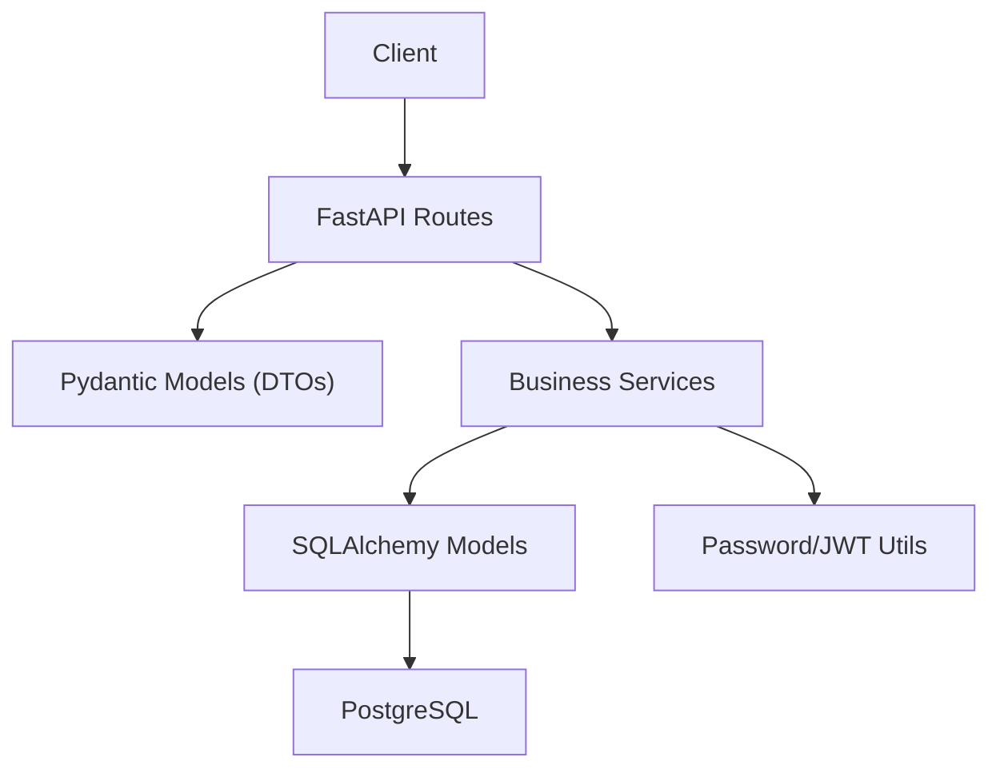
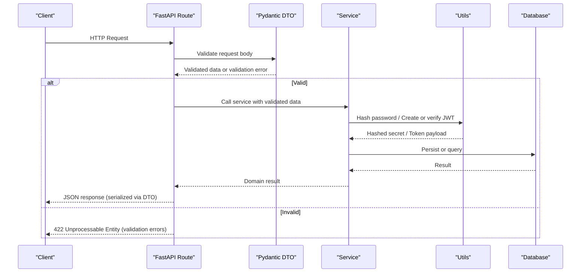
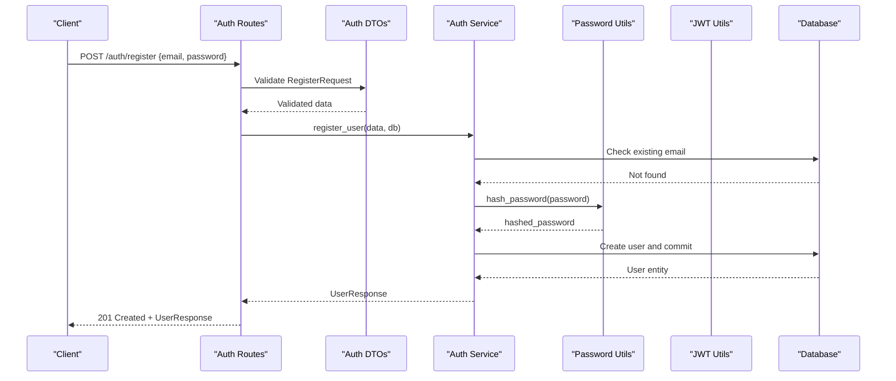
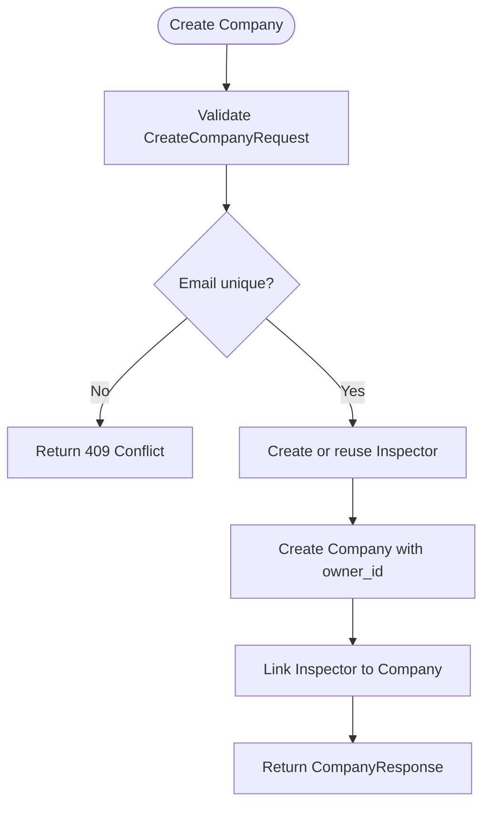
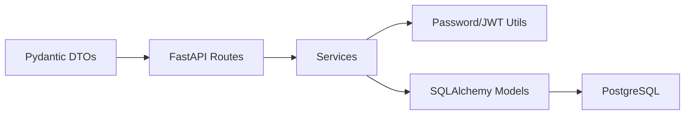

# Input Validation & Sanitization

<cite>
**Referenced Files in This Document**
- [auth_dtos.py](file://app/api/dtos/auth_dtos.py)
- [inspector_dtos.py](file://app/api/dtos/inspector_dtos.py)
- [auth_routes.py](file://app/api/routes/auth_routes.py)
- [inspector_routes.py](file://app/api/routes/inspector_routes.py)
- [auth_service.py](file://app/services/auth_service.py)
- [inspector_service.py](file://app/services/inspector_service.py)
- [password.py](file://app/utils/password.py)
- [jwt_utils.py](file://app/utils/jwt_utils.py)
- [user.py](file://app/repository/user.py)
- [company.py](file://app/repository/company.py)
- [inspector.py](file://app/repository/inspector.py)
- [db_config.py](file://app/config/db_config.py)
- [main.py](file://app/main.py)
</cite>

## Table of Contents
1. Introduction
2. Project Structure
3. Core Components
4. Architecture Overview
5. Detailed Component Analysis
6. Dependency Analysis
7. Performance Considerations
8. Troubleshooting Guide
9. Conclusion

## Introduction
This document explains how the application validates and sanitizes inputs using Pydantic v2 models, enforces data type constraints, and protects against common input-based vulnerabilities such as SQL injection and cross-site scripting (XSS). It covers request/response validation patterns, error handling for invalid inputs, and guidance on testing and performance considerations.

The system uses FastAPI with Pydantic v2 schemas to validate all incoming requests and serialize responses. Business logic resides in services, which interact with SQLAlchemy ORM models and a PostgreSQL database. Security-sensitive operations like password hashing and JWT handling are centralized in utilities.

## Project Structure
At a high level:
- API routes define endpoints and rely on Pydantic models for request validation and response serialization.
- Services implement business rules and orchestrate repository interactions.
- Repository models define database schema and constraints.
- Utilities handle security primitives (password hashing, JWT creation/validation).

**Diagram sources**
- [auth_routes.py:25-64](file://app/api/routes/auth_routes.py#L25-L64)
- [inspector_routes.py:28-143](file://app/api/routes/inspector_routes.py#L28-L143)
- [auth_service.py:36-262](file://app/services/auth_service.py#L36-L262)
- [inspector_service.py:17-134](file://app/services/inspector_service.py#L17-L134)
- [user.py:10-54](file://app/repository/user.py#L10-L54)
- [company.py:12-61](file://app/repository/company.py#L12-L61)
- [inspector.py:13-82](file://app/repository/inspector.py#L13-L82)
- [password.py:1-12](file://app/utils/password.py#L1-L12)
- [jwt_utils.py:14-51](file://app/utils/jwt_utils.py#L14-L51)

**Section sources**
- [main.py:11-21](file://app/main.py#L11-L21)
- [db_config.py:1-26](file://app/config/db_config.py#L1-L26)

## Core Components
- Request DTOs: Pydantic v2 models that enforce field types, lengths, and formats at the API boundary.
- Response DTOs: Pydantic v2 models used to serialize ORM entities consistently.
- Services: Validate business rules beyond schema constraints and coordinate persistence.
- Utilities: Secure password hashing and JWT token lifecycle management.
- Database models: Enforce additional constraints via column definitions and unique indexes.

Key validation highlights:
- Email addresses validated via EmailStr.
- Passwords constrained by minimum/maximum length.
- Optional fields explicitly typed as nullable.
- UUIDs enforced for identifiers.
- Datetime fields validated for timestamps.

**Section sources**
- [auth_dtos.py:7-39](file://app/api/dtos/auth_dtos.py#L7-L39)
- [inspector_dtos.py:5-63](file://app/api/dtos/inspector_dtos.py#L5-L63)
- [user.py:10-54](file://app/repository/user.py#L10-L54)
- [company.py:12-61](file://app/repository/company.py#L12-L61)
- [inspector.py:13-82](file://app/repository/inspector.py#L13-L82)

## Architecture Overview
Input flows through FastAPI into Pydantic models for validation before reaching service functions. Responses are serialized back through Pydantic models. Security-sensitive values are never stored or transmitted in plain text; passwords are hashed, and tokens are signed and validated.

**Diagram sources**
- [auth_routes.py:25-64](file://app/api/routes/auth_routes.py#L25-L64)
- [inspector_routes.py:53-121](file://app/api/routes/inspector_routes.py#L53-L121)
- [auth_service.py:36-183](file://app/services/auth_service.py#L36-L183)
- [inspector_service.py:17-122](file://app/services/inspector_service.py#L17-L122)
- [password.py:6-11](file://app/utils/password.py#L6-L11)
- [jwt_utils.py:14-51](file://app/utils/jwt_utils.py#L14-L51)

## Detailed Component Analysis

### Authentication DTOs and Flow
- RegisterRequest: Validates email format and password length constraints.
- LoginRequest: Validates email format and ensures non-empty password.
- RefreshTokenRequest: Accepts optional refresh token string.
- UserResponse, TokenResponse, LogoutResponse: Define consistent response shapes.

Validation behavior:
- EmailStr enforces RFC-compliant email syntax.
- Field constraints enforce min/max lengths for sensitive fields.
- Optional fields use union types with None.

Error handling:
- FastAPI returns 422 with detailed validation errors when DTOs fail.
- Services raise HTTPException for business rule violations (e.g., duplicate emails, inactive accounts).

Security notes:
- Passwords are hashed before storage; never persisted in plaintext.
- Tokens are created and verified using HS256 with secrets from configuration.

**Diagram sources**
- [auth_routes.py:25-28](file://app/api/routes/auth_routes.py#L25-L28)
- [auth_dtos.py:7-15](file://app/api/dtos/auth_dtos.py#L7-L15)
- [auth_service.py:36-55](file://app/services/auth_service.py#L36-L55)
- [password.py:6-11](file://app/utils/password.py#L6-L11)

**Section sources**
- [auth_dtos.py:7-39](file://app/api/dtos/auth_dtos.py#L7-L39)
- [auth_routes.py:25-64](file://app/api/routes/auth_routes.py#L25-L64)
- [auth_service.py:36-183](file://app/services/auth_service.py#L36-L183)

### Inspector DTOs and Flow
- CreateCompanyRequest: Validates company details including name, email, address, city/state/zip/country lengths, and optional phone/website.
- AddInspectorRequest: Validates inspector credentials and profile fields.
- CompanyResponse, InspectorResponse, ProfileResponse: Serialize domain objects consistently.

Validation behavior:
- String fields constrained by min_length and max_length.
- EmailStr ensures valid email format.
- Optional fields allow None where appropriate.

Business rules:
- Ensure uniqueness of emails across users and inspectors.
- Enforce ownership constraints for adding inspectors.

**Diagram sources**
- [inspector_routes.py:53-63](file://app/api/routes/inspector_routes.py#L53-L63)
- [inspector_service.py:17-72](file://app/services/inspector_service.py#L17-L72)
- [inspector_dtos.py:5-31](file://app/api/dtos/inspector_dtos.py#L5-L31)

**Section sources**
- [inspector_dtos.py:5-63](file://app/api/dtos/inspector_dtos.py#L5-L63)
- [inspector_routes.py:53-121](file://app/api/routes/inspector_routes.py#L53-L121)
- [inspector_service.py:17-122](file://app/services/inspector_service.py#L17-L122)

### Data Type Constraints and Custom Validators
- Email validation: EmailStr enforces standard email format.
- Password constraints: Minimum and maximum length enforced via Field.
- Identifier types: UUID enforced for IDs.
- Timestamps: datetime fields validated for proper ISO formats.
- Nullable fields: Union types with None indicate optional inputs.

Custom validators:
- No explicit custom validators are defined in DTOs; validation relies on built-in Pydantic types and Field constraints.
- Business rule validations are implemented in services (e.g., checking duplicates, ownership).

**Section sources**
- [auth_dtos.py:7-19](file://app/api/dtos/auth_dtos.py#L7-L19)
- [inspector_dtos.py:5-41](file://app/api/dtos/inspector_dtos.py#L5-L41)
- [auth_service.py:36-183](file://app/services/auth_service.py#L36-L183)
- [inspector_service.py:17-122](file://app/services/inspector_service.py#L17-L122)

### Protection Against SQL Injection
- Parameterized queries: All database interactions use SQLAlchemy ORM with parameter binding, preventing SQL injection.
- Unique constraints: Database-level unique constraints on emails reduce risk of duplicate entries and associated injection vectors.
- Input validation: Pydantic DTOs ensure only expected fields and types reach the service layer.

Evidence:
- Queries constructed with select and where clauses bound to validated parameters.
- ORM relationships and foreign keys enforce referential integrity.

**Section sources**
- [auth_service.py:41-55](file://app/services/auth_service.py#L41-L55)
- [inspector_service.py:28-72](file://app/services/inspector_service.py#L28-L72)
- [user.py:19-23](file://app/repository/user.py#L19-L23)
- [company.py:30-38](file://app/repository/company.py#L30-L38)
- [inspector.py:27-49](file://app/repository/inspector.py#L27-L49)

### Protection Against XSS and Other Input-Based Vulnerabilities
- Output serialization: Responses are serialized via Pydantic models, reducing accidental exposure of raw HTML or scripts.
- Input constraints: Length limits and type enforcement mitigate oversized payloads and malformed inputs.
- No direct rendering: The backend does not render templates; it returns JSON, minimizing XSS surface.
- Recommendations: If any text is later rendered in frontend contexts, apply context-aware escaping on the client side.

**Section sources**
- [auth_dtos.py:22-39](file://app/api/dtos/auth_dtos.py#L22-L39)
- [inspector_dtos.py:17-63](file://app/api/dtos/inspector_dtos.py#L17-L63)

### Request/Response Validation Patterns
- Requests: Each endpoint declares a Pydantic model for the request body, ensuring strict validation before processing.
- Responses: Endpoints declare response_model to serialize outputs consistently and safely.
- Optional bodies: Some endpoints accept optional request bodies (e.g., refresh token), handled via union types.

Examples:
- Registration and login endpoints validate credentials via DTOs and return structured responses.
- Company and inspector endpoints validate organizational data and return standardized responses.

**Section sources**
- [auth_routes.py:25-64](file://app/api/routes/auth_routes.py#L25-L64)
- [inspector_routes.py:28-143](file://app/api/routes/inspector_routes.py#L28-L143)

### Error Handling for Invalid Inputs
- Validation errors: FastAPI returns 422 with a list of field-specific errors when DTO validation fails.
- Business errors: Services raise HTTPException with appropriate status codes (e.g., 409 for conflicts, 401/403 for auth issues).
- Consistent messages: Error details describe the issue without exposing sensitive internals.

Common scenarios:
- Duplicate email registration leads to 409 Conflict.
- Inactive accounts lead to 403 Forbidden during login/token refresh.
- Missing or invalid refresh tokens lead to 401 Unauthorized.

**Section sources**
- [auth_service.py:41-183](file://app/services/auth_service.py#L41-L183)
- [inspector_service.py:28-122](file://app/services/inspector_service.py#L28-L122)
- [inspector_routes.py:76-117](file://app/api/routes/inspector_routes.py#L76-L117)

### Validation Error Formatting
- FastAPI automatically formats validation errors into a structured JSON response containing field names, error types, and messages.
- Clients can parse these errors to guide user feedback and corrections.

Best practices:
- Keep DTOs precise to produce meaningful error messages.
- Avoid overly permissive types to ensure clear validation failures.

**Section sources**
- [auth_routes.py:25-64](file://app/api/routes/auth_routes.py#L25-L64)
- [inspector_routes.py:53-121](file://app/api/routes/inspector_routes.py#L53-L121)

### Examples of Validating User Inputs and Sanitizing Data
- Email validation: EmailStr ensures syntactically correct emails.
- Password validation: Field(min_length=...) enforces minimum complexity indirectly via length.
- Address and location fields: Min/max length constraints prevent excessively long or empty inputs.
- Optional fields: Union types with None allow optional phone numbers and websites.

Sanitization approach:
- Use Pydantic’s built-in validation to normalize and constrain inputs.
- Store only hashed passwords; never store raw secrets.
- Use ORM to bind parameters safely to queries.

**Section sources**
- [auth_dtos.py:7-19](file://app/api/dtos/auth_dtos.py#L7-L19)
- [inspector_dtos.py:5-41](file://app/api/dtos/inspector_dtos.py#L5-L41)
- [password.py:6-11](file://app/utils/password.py#L6-L11)

### Implementing Business Rule Validations
- Uniqueness checks: Services query the database to ensure email uniqueness before creating users or inspectors.
- Ownership checks: Dependencies and service logic enforce that only company owners can add inspectors.
- Account status checks: Login and token refresh reject inactive accounts.

**Section sources**
- [auth_service.py:41-84](file://app/services/auth_service.py#L41-L84)
- [inspector_service.py:28-72](file://app/services/inspector_service.py#L28-L72)
- [inspector_routes.py:99-117](file://app/api/routes/inspector_routes.py#L99-L117)

## Dependency Analysis
The validation pipeline depends on:
- Pydantic models for input/output contracts.
- FastAPI route decorators for automatic validation and serialization.
- Services for business rule enforcement.
- Utilities for secure credential handling and token management.
- SQLAlchemy models for database constraints and relationships.

**Diagram sources**
- [auth_dtos.py:7-39](file://app/api/dtos/auth_dtos.py#L7-L39)
- [inspector_dtos.py:5-63](file://app/api/dtos/inspector_dtos.py#L5-L63)
- [auth_routes.py:25-64](file://app/api/routes/auth_routes.py#L25-L64)
- [inspector_routes.py:28-143](file://app/api/routes/inspector_routes.py#L28-L143)
- [auth_service.py:36-262](file://app/services/auth_service.py#L36-L262)
- [inspector_service.py:17-134](file://app/services/inspector_service.py#L17-L134)
- [password.py:1-12](file://app/utils/password.py#L1-L12)
- [jwt_utils.py:14-51](file://app/utils/jwt_utils.py#L14-L51)
- [user.py:10-54](file://app/repository/user.py#L10-L54)
- [company.py:12-61](file://app/repository/company.py#L12-L61)
- [inspector.py:13-82](file://app/repository/inspector.py#L13-L82)

**Section sources**
- [main.py:11-21](file://app/main.py#L11-L21)
- [db_config.py:1-26](file://app/config/db_config.py#L1-L26)

## Performance Considerations
- Validation overhead: Pydantic v2 provides fast validation; keep DTOs minimal and precise to avoid unnecessary parsing costs.
- Database queries: Services perform targeted queries; ensure indexes exist on frequently filtered columns (e.g., email).
- Token operations: JWT decoding/encoding is lightweight; avoid excessive token refreshes.
- Caching strategies:
  - Consider caching frequent read-only lookups (e.g., company profiles) if access patterns justify it.
  - Use short-lived caches with appropriate invalidation policies to maintain consistency.
- Connection management: SessionLocal ensures scoped sessions; avoid holding sessions longer than necessary.

[No sources needed since this section provides general guidance]

## Troubleshooting Guide
Common validation-related issues and resolutions:
- 422 Unprocessable Entity: Indicates DTO validation failure; inspect field-specific error messages to correct input.
- 409 Conflict: Duplicate email detected; ensure unique emails or update existing records appropriately.
- 401 Unauthorized: Missing or invalid tokens; verify cookies or request body contain valid tokens.
- 403 Forbidden: Inactive account or insufficient permissions; check account status and ownership constraints.

Debugging steps:
- Review DTO definitions to confirm required fields and constraints.
- Inspect service logic for business rule violations.
- Verify database constraints and indexes align with application expectations.

**Section sources**
- [auth_service.py:41-183](file://app/services/auth_service.py#L41-L183)
- [inspector_service.py:28-122](file://app/services/inspector_service.py#L28-L122)
- [inspector_routes.py:76-117](file://app/api/routes/inspector_routes.py#L76-L117)

## Conclusion
The application employs a robust input validation and sanitization strategy centered around Pydantic v2 models and FastAPI’s automatic validation and serialization. Security-sensitive operations are protected through password hashing and JWT token management. Database-level constraints complement application-side validation to ensure data integrity and protect against injection attacks. By adhering to these patterns, the system maintains strong boundaries between external inputs and internal processing, enabling reliable and secure operations.

[No sources needed since this section summarizes without analyzing specific files]