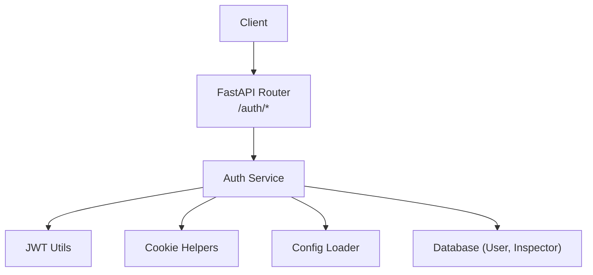
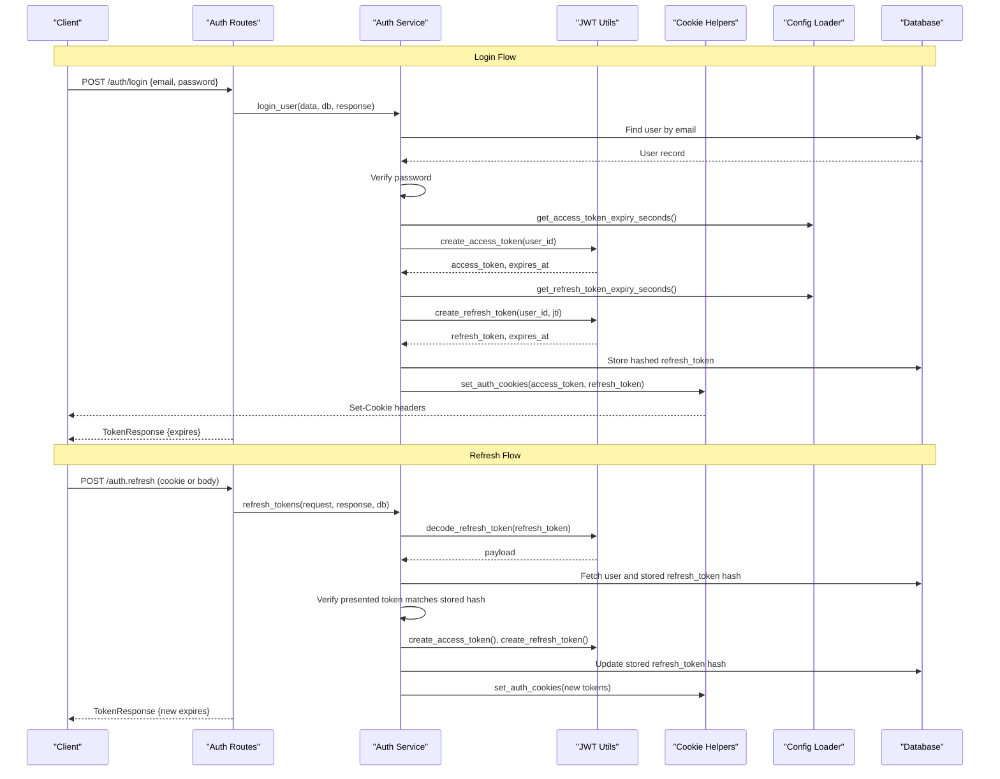
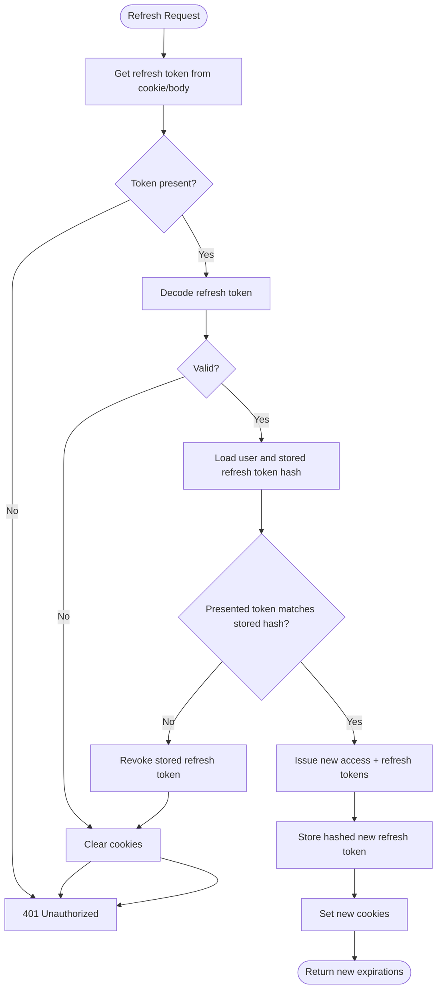
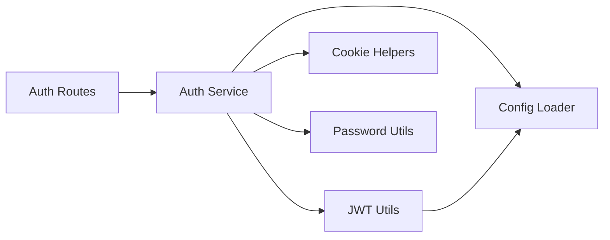

# JWT Authentication

<cite>
**Referenced Files in This Document**
- [jwt_utils.py](file://app/utils/jwt_utils.py)
- [auth_service.py](file://app/services/auth_service.py)
- [auth_routes.py](file://app/api/routes/auth_routes.py)
- [auth_dtos.py](file://app/api/dtos/auth_dtos.py)
- [cookie_helpers.py](file://app/utils/cookie_helpers.py)
- [config_loader.py](file://app/utils/config_loader.py)
- [password.py](file://app/utils/password.py)
- [main.py](file://app/main.py)
</cite>

## Table of Contents
1. Introduction
2. Project Structure
3. Core Components
4. Architecture Overview
5. Detailed Component Analysis
6. Dependency Analysis
7. Performance Considerations
8. Troubleshooting Guide
9. Conclusion

## Introduction
This document explains the JWT-based authentication implementation, including token creation, validation, refresh with rotation, expiration handling, signing algorithms, and secret key management. It also covers security considerations for storage and transmission, and provides troubleshooting guidance for common issues.

## Project Structure
The JWT authentication spans utilities, services, routes, DTOs, and configuration:
- Utilities: JWT encoding/decoding, cookie helpers, password hashing, environment config
- Services: Business logic for login, logout, refresh, and current user resolution
- Routes: HTTP endpoints for register, login, logout, refresh, and profile retrieval
- DTOs: Request/response schemas
- Configuration: Secrets and expiry settings loaded from environment variables

**Diagram sources**
- [auth_routes.py:22-64](file://app/api/routes/auth_routes.py#L22-L64)
- [auth_service.py:59-226](file://app/services/auth_service.py#L59-L226)
- [jwt_utils.py:14-50](file://app/utils/jwt_utils.py#L14-L50)
- [cookie_helpers.py:12-41](file://app/utils/cookie_helpers.py#L12-L41)
- [config_loader.py:24-43](file://app/utils/config_loader.py#L24-L43)

**Section sources**
- [main.py:18-21](file://app/main.py#L18-L21)
- [auth_routes.py:22-64](file://app/api/routes/auth_routes.py#L22-L64)

## Core Components
- JWT token creation and decoding: HS256 algorithm, separate secrets for access and refresh tokens, configurable expirations
- Cookie-based transport: HttpOnly, Secure, SameSite=Lax cookies for both access and refresh tokens
- Refresh token rotation: One-time use refresh tokens; each refresh invalidates the previous one and issues a new pair
- Current user dependency: Extracts and validates access token from cookies to resolve the active user
- Password hashing: Secure hashing for passwords and stored refresh token hashes

Key responsibilities by file:
- jwt_utils.py: Create and decode access/refresh tokens using HS256
- auth_service.py: Login, logout, refresh flow, and current user resolution
- auth_routes.py: Expose /register, /login, /logout, /refresh, /me
- cookie_helpers.py: Set/clear secure cookies with appropriate attributes
- config_loader.py: Load secrets and expiry durations from environment
- password.py: Hash and verify passwords and stored refresh token hashes
- auth_dtos.py: Validate request/response payloads

**Section sources**
- [jwt_utils.py:14-50](file://app/utils/jwt_utils.py#L14-L50)
- [auth_service.py:59-226](file://app/services/auth_service.py#L59-L226)
- [auth_routes.py:25-64](file://app/api/routes/auth_routes.py#L25-L64)
- [cookie_helpers.py:12-41](file://app/utils/cookie_helpers.py#L12-L41)
- [config_loader.py:24-43](file://app/utils/config_loader.py#L24-L43)
- [password.py:6-11](file://app/utils/password.py#L6-L11)
- [auth_dtos.py:7-39](file://app/api/dtos/auth_dtos.py#L7-L39)

## Architecture Overview
The authentication architecture uses short-lived access tokens and longer-lived refresh tokens. Tokens are transported via secure cookies. On login, both tokens are issued and stored as cookies; the refresh token is hashed and persisted in the database. On refresh, the old refresh token is validated against the stored hash, then rotated to a new pair. Protected endpoints extract the access token from cookies and validate it to identify the current user.

**Diagram sources**
- [auth_routes.py:31-58](file://app/api/routes/auth_routes.py#L31-L58)
- [auth_service.py:59-190](file://app/services/auth_service.py#L59-L190)
- [jwt_utils.py:14-50](file://app/utils/jwt_utils.py#L14-L50)
- [cookie_helpers.py:12-35](file://app/utils/cookie_helpers.py#L12-L35)
- [config_loader.py:38-43](file://app/utils/config_loader.py#L38-L43)

## Detailed Component Analysis

### JWT Structure and Signing
- Algorithm: HS256 for both access and refresh tokens
- Access token payload includes subject (user ID), expiration time, and type
- Refresh token payload includes subject, expiration time, type, and a unique jti identifier
- Separate secrets are used for access and refresh tokens, loaded from environment variables
- Expiration times are configured via environment variables and parsed into seconds

Security notes:
- Use strong, unique secrets per environment
- Keep refresh token expiry shorter than necessary but long enough for UX
- HS256 requires keeping the secret confidential; consider rotating periodically

**Section sources**
- [jwt_utils.py:14-50](file://app/utils/jwt_utils.py#L14-L50)
- [config_loader.py:24-43](file://app/utils/config_loader.py#L24-L43)

### Token Creation During Login
- On successful login, an access token and a refresh token are created
- The refresh token’s jti is generated and included in the token payload
- The refresh token is hashed and stored in the database associated with the user
- Both tokens are set as HttpOnly, Secure cookies with SameSite=Lax
- Response returns expiration timestamps for client-side handling

**Section sources**
- [auth_service.py:59-99](file://app/services/auth_service.py#L59-L99)
- [cookie_helpers.py:12-35](file://app/utils/cookie_helpers.py#L12-L35)
- [auth_routes.py:31-34](file://app/api/routes/auth_routes.py#L31-L34)

### Validation on Protected Endpoints
- Protected endpoints use a FastAPI dependency to extract the access token from cookies
- The access token is decoded and validated; if invalid or expired, a 401 error is raised
- The user is fetched from the database and checked for active status
- If valid, the user object is injected into the endpoint handler

Example protected endpoint:
- GET /auth/me returns the current user’s profile after validating the access token

**Section sources**
- [auth_service.py:195-226](file://app/services/auth_service.py#L195-L226)
- [auth_routes.py:61-64](file://app/api/routes/auth_routes.py#L61-L64)

### Refresh Token Flow with Rotation
- The refresh endpoint accepts the refresh token from cookies or body
- The token is decoded; if invalid or expired, cookies are cleared and a 401 is returned
- The user is retrieved and the stored refresh token hash is verified against the presented token
- If mismatch detected (possible reuse/theft), all sessions are revoked by clearing the stored refresh token
- A new access token and a new refresh token are issued; the old refresh token is invalidated by storing only the new hashed token
- New tokens are set as cookies; response includes new expiration timestamps

**Diagram sources**
- [auth_service.py:118-190](file://app/services/auth_service.py#L118-L190)
- [jwt_utils.py:28-50](file://app/utils/jwt_utils.py#L28-L50)
- [cookie_helpers.py:12-41](file://app/utils/cookie_helpers.py#L12-L41)

**Section sources**
- [auth_service.py:118-190](file://app/services/auth_service.py#L118-L190)
- [auth_routes.py:47-58](file://app/api/routes/auth_routes.py#L47-L58)

### Logout
- Clears the stored refresh token in the database
- Clears authentication cookies
- Returns a success message

**Section sources**
- [auth_service.py:104-113](file://app/services/auth_service.py#L104-L113)
- [auth_routes.py:37-44](file://app/api/routes/auth_routes.py#L37-L44)

### Data Models and DTOs
- RegisterRequest: email and password with validation constraints
- LoginRequest: email and password
- RefreshTokenRequest: optional refresh token field
- TokenResponse: message and expiration timestamps
- UserResponse: user identity fields mapped from ORM model

**Section sources**
- [auth_dtos.py:7-39](file://app/api/dtos/auth_dtos.py#L7-L39)

## Dependency Analysis
- Routes depend on service functions for business logic
- Services depend on JWT utils for token operations, cookie helpers for transport, config loader for secrets/expiry, and password utils for hashing
- JWT utils depend on config loader for secrets and expiry values
- Cookies are set with attributes that enforce secure transmission and browser restrictions

**Diagram sources**
- [auth_routes.py:1-20](file://app/api/routes/auth_routes.py#L1-L20)
- [auth_service.py:1-33](file://app/services/auth_service.py#L1-L33)
- [jwt_utils.py:1-11](file://app/utils/jwt_utils.py#L1-L11)
- [cookie_helpers.py:1-6](file://app/utils/cookie_helpers.py#L1-L6)
- [config_loader.py:1-6](file://app/utils/config_loader.py#L1-L6)
- [password.py:1-3](file://app/utils/password.py#L1-L3)

**Section sources**
- [auth_routes.py:1-20](file://app/api/routes/auth_routes.py#L1-L20)
- [auth_service.py:1-33](file://app/services/auth_service.py#L1-L33)
- [jwt_utils.py:1-11](file://app/utils/jwt_utils.py#L1-L11)

## Performance Considerations
- Short-lived access tokens reduce risk and minimize server-side checks; clients should cache them locally
- Refresh token rotation adds database writes but improves security by limiting reuse
- Using HS256 avoids asymmetric verification overhead; ensure secrets are managed securely
- Cookie size is small; avoid adding large claims to tokens
- Database lookups occur per request for current user; ensure indexes on user identifiers

[No sources needed since this section provides general guidance]

## Troubleshooting Guide
Common issues and resolutions:
- Invalid or expired access token: Ensure the access token is present in cookies and not expired; re-login if necessary
- Invalid or expired refresh token: Check that the refresh token cookie exists and is within its expiry; call refresh endpoint to rotate
- Account deactivated: User must be active to log in or refresh; activate account before proceeding
- Refresh token reuse detected: Indicates possible token theft; all sessions are revoked; re-login required
- Missing environment variables: ACCESS_TOKEN_SECRET, REFRESH_TOKEN_SECRET, ACCESS_TOKEN_EXPIRY, REFRESH_TOKEN_EXPIRY must be set; otherwise runtime errors will occur during token operations
- Cookie not sent: Ensure HTTPS and SameSite settings align with client domain; verify browser settings allow cookies

Debugging techniques:
- Inspect cookies in browser developer tools to confirm presence and attributes (HttpOnly, Secure, SameSite)
- Log token payloads when decoding to verify structure and expiration
- Verify database state for stored refresh token hash after login and refresh
- Confirm environment variables are loaded correctly at startup

**Section sources**
- [auth_service.py:65-99](file://app/services/auth_service.py#L65-L99)
- [auth_service.py:118-190](file://app/services/auth_service.py#L118-L190)
- [auth_service.py:195-226](file://app/services/auth_service.py#L195-L226)
- [config_loader.py:24-43](file://app/utils/config_loader.py#L24-L43)

## Conclusion
This JWT authentication system uses short-lived access tokens and rotating refresh tokens secured via HttpOnly, Secure cookies. HS256 signing with separate secrets ensures clear separation of concerns between access and refresh flows. The refresh endpoint enforces strict validation and rotation to mitigate token reuse and theft risks. Proper environment configuration and secure cookie handling are essential for robust security. For production, consider additional measures such as token revocation lists, rate limiting, and monitoring for suspicious activity.

[No sources needed since this section summarizes without analyzing specific files]