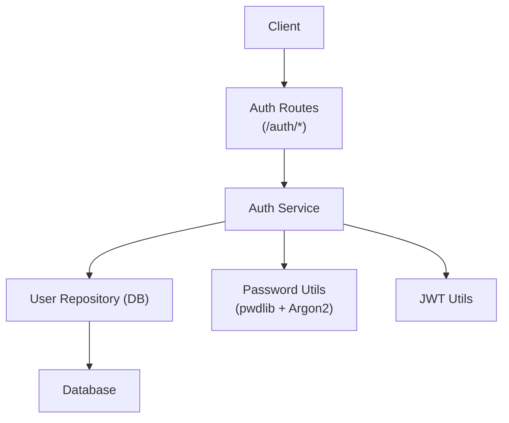
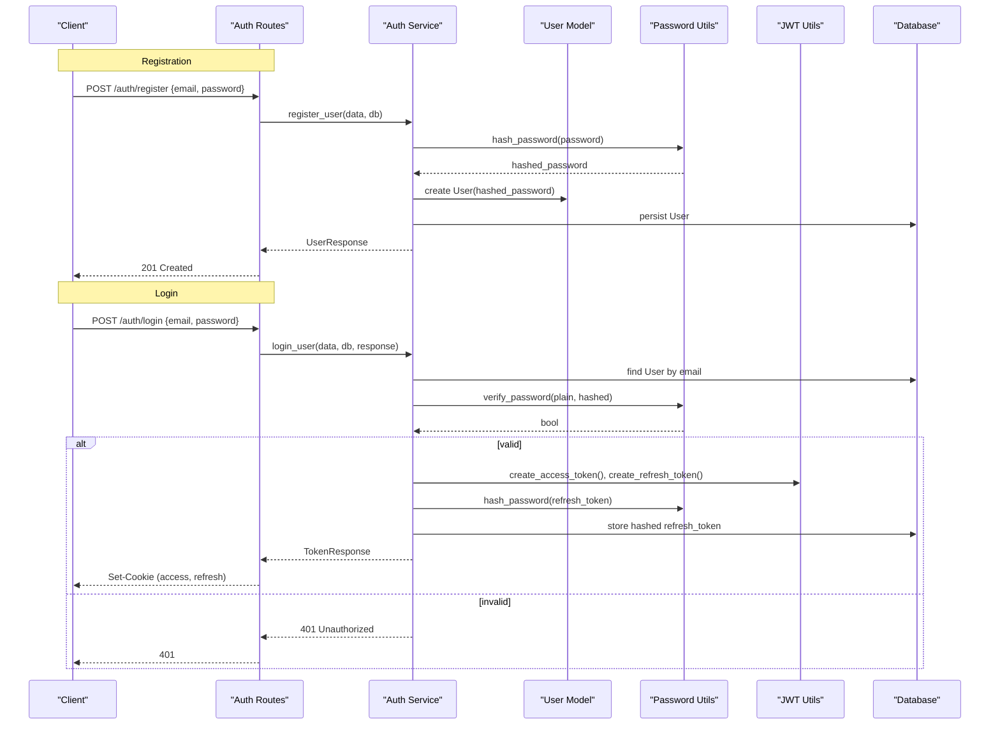
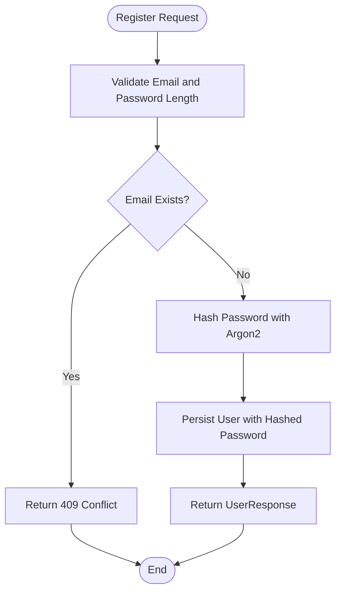
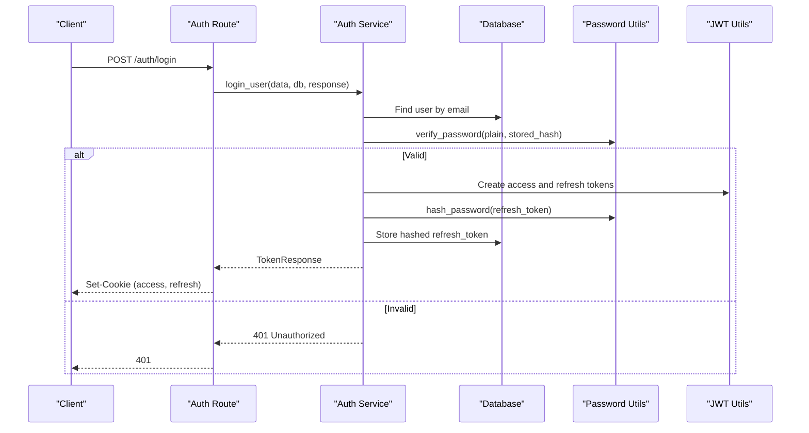
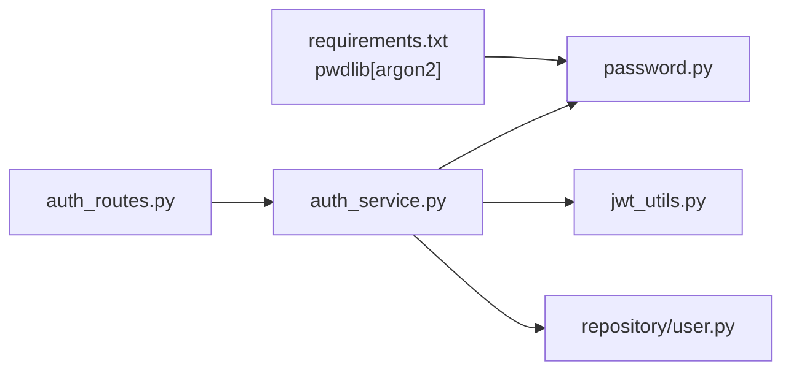

# Password Security

<cite>
**Referenced Files in This Document**
- [password.py](file://app/utils/password.py)
- [auth_service.py](file://app/services/auth_service.py)
- [auth_routes.py](file://app/api/routes/auth_routes.py)
- [user.py](file://app/repository/user.py)
- [auth_dtos.py](file://app/api/dtos/auth_dtos.py)
- [jwt_utils.py](file://app/utils/jwt_utils.py)
- [requirements.txt](file://requirements.txt)
</cite>

## Table of Contents
1. Introduction
2. Project Structure
3. Core Components
4. Architecture Overview
5. Detailed Component Analysis
6. Dependency Analysis
7. Performance Considerations
8. Troubleshooting Guide
9. Conclusion
10. Appendices

## Introduction
This document explains how DefectLoupe secures user passwords using the pwdlib library with Argon2 hashing. It covers the implementation of password hashing and verification, integration points during registration and login, security benefits of Argon2, password complexity rules enforced by the API, salt handling, and strategies for migrating existing password databases.

## Project Structure
Password security is implemented across a small set of focused modules:
- Password utilities provide a single entry point for hashing and verifying passwords.
- Authentication service orchestrates user registration, login, logout, and token refresh flows while integrating password checks.
- API routes expose HTTP endpoints that trigger these services.
- Data models store hashed passwords and refresh tokens securely.
- DTOs enforce input validation including password length constraints.
- JWT utilities handle access and refresh tokens separately from password storage.

**Diagram sources**
- [auth_routes.py:25-64](file://app/api/routes/auth_routes.py#L25-L64)
- [auth_service.py:36-191](file://app/services/auth_service.py#L36-L191)
- [password.py:1-12](file://app/utils/password.py#L1-L12)
- [user.py:10-54](file://app/repository/user.py#L10-L54)
- [jwt_utils.py:14-50](file://app/utils/jwt_utils.py#L14-L50)

**Section sources**
- [auth_routes.py:25-64](file://app/api/routes/auth_routes.py#L25-L64)
- [auth_service.py:36-191](file://app/services/auth_service.py#L36-L191)
- [password.py:1-12](file://app/utils/password.py#L1-L12)
- [user.py:10-54](file://app/repository/user.py#L10-L54)
- [jwt_utils.py:14-50](file://app/utils/jwt_utils.py#L14-L50)

## Core Components
- Password utilities: A thin wrapper around pwdlib’s recommended hasher to hash and verify passwords.
- Authentication service: Implements register_user, login_user, logout_user, and refresh_tokens, integrating password hashing and verification.
- User model: Stores email, hashed_password, active status, optional refresh_token, and timestamps.
- DTOs: Enforce email format and password length constraints for registration and login payloads.
- JWT utilities: Generate and decode short-lived access tokens and long-lived refresh tokens; refresh tokens are stored as hashes for rotation and revocation.

Key responsibilities:
- Hashing: Use Argon2 via pwdlib to produce secure, self-contained hashes.
- Verification: Compare plaintext inputs against stored hashes without exposing timing or partial match information.
- Storage: Persist only hashed values; never store plaintext passwords.
- Token lifecycle: Issue, rotate, and revoke refresh tokens securely using hashed storage.

**Section sources**
- [password.py:1-12](file://app/utils/password.py#L1-L12)
- [auth_service.py:36-191](file://app/services/auth_service.py#L36-L191)
- [user.py:10-54](file://app/repository/user.py#L10-L54)
- [auth_dtos.py:7-18](file://app/api/dtos/auth_dtos.py#L7-L18)
- [jwt_utils.py:14-50](file://app/utils/jwt_utils.py#L14-L50)

## Architecture Overview
The authentication flow integrates password hashing with JWT-based session management:

**Diagram sources**
- [auth_routes.py:25-34](file://app/api/routes/auth_routes.py#L25-L34)
- [auth_service.py:36-100](file://app/services/auth_service.py#L36-L100)
- [password.py:6-11](file://app/utils/password.py#L6-L11)
- [jwt_utils.py:14-40](file://app/utils/jwt_utils.py#L14-L40)
- [user.py:19-38](file://app/repository/user.py#L19-L38)

## Detailed Component Analysis

### Password Utilities (pwdlib + Argon2)
- Implementation: Uses pwdlib’s recommended hasher which selects Argon2 parameters suitable for modern systems.
- Functions:
  - hash_password(password: str) -> str: Returns a complete Argon2 hash string containing algorithm, parameters, and salt.
  - verify_password(plain: str, hashed: str) -> bool: Compares plaintext against stored hash securely.
- Benefits:
  - Argon2 provides resistance to brute force attacks through computational cost.
  - Memory hardness mitigates GPU/ASIC acceleration attacks.
  - Automatic per-password salt generation prevents rainbow table attacks.
  - Self-describing hashes allow future parameter upgrades without re-hashing all passwords immediately.

Usage patterns:
- During registration, hash the user’s password before storing it.
- During login, compare the provided password against the stored hash.
- For refresh token rotation, store only hashed refresh tokens to prevent theft if the database is compromised.

**Section sources**
- [password.py:1-12](file://app/utils/password.py#L1-L12)
- [requirements.txt:10](file://requirements.txt#L10)

### Authentication Service
- Registration:
  - Validates uniqueness of email.
  - Hashes password using pwdlib and persists the user.
- Login:
  - Retrieves user by email.
  - Verifies password using verify_password.
  - Issues access and refresh tokens, stores hashed refresh token, sets cookies.
- Logout:
  - Clears stored refresh token and cookies.
- Refresh:
  - Accepts refresh token from cookie or body.
  - Decodes JWT, validates existence and activity.
  - Verifies presented refresh token matches stored hash; on mismatch, revokes all sessions.
  - Issues new token pair and rotates stored refresh token.

Security notes:
- All sensitive secrets (JWT signing keys) are loaded from configuration.
- Tokens are short-lived; refresh tokens are rotated and stored as hashes.
- Account deactivation is enforced at multiple steps.

**Section sources**
- [auth_service.py:36-191](file://app/services/auth_service.py#L36-L191)
- [jwt_utils.py:14-50](file://app/utils/jwt_utils.py#L14-L50)

### API Routes
- Endpoints:
  - POST /auth/register: Creates a new user account.
  - POST /auth/login: Authenticates and returns tokens via secure cookies.
  - POST /auth/logout: Revokes refresh token and clears cookies.
  - POST /auth/refresh: Rotates refresh token and issues new tokens.
  - GET /auth/me: Returns current user info when authenticated.
- Integration:
  - Delegates business logic to auth_service functions.
  - Uses Pydantic DTOs for request/response validation.

**Section sources**
- [auth_routes.py:25-64](file://app/api/routes/auth_routes.py#L25-L64)

### Data Models and Validation
- User model:
  - Stores hashed_password as text to accommodate Argon2 output.
  - Optional refresh_token field stores hashed refresh tokens.
  - Active flag controls login and token refresh eligibility.
- DTOs:
  - RegisterRequest enforces email format and password length constraints (minimum and maximum).
  - LoginRequest enforces email format and non-empty password.

Complexity requirements:
- Minimum password length is enforced at the API layer for registration.
- Additional complexity rules (e.g., requiring uppercase, lowercase, digits, special characters) can be added via Pydantic validators if desired.

Salt handling:
- Salt is generated automatically by Argon2 within each hash; no manual salt management is required.

**Section sources**
- [user.py:19-38](file://app/repository/user.py#L19-L38)
- [auth_dtos.py:7-18](file://app/api/dtos/auth_dtos.py#L7-L18)

### Example Workflows

#### Registration Flow
- Client sends email and password to /auth/register.
- Server validates payload, ensures email uniqueness, hashes password, creates user, and responds with user details.

**Diagram sources**
- [auth_routes.py:25-28](file://app/api/routes/auth_routes.py#L25-L28)
- [auth_service.py:36-55](file://app/services/auth_service.py#L36-L55)
- [password.py:6-7](file://app/utils/password.py#L6-L7)
- [user.py:19-38](file://app/repository/user.py#L19-L38)

#### Login Flow
- Client sends email and password to /auth/login.
- Server retrieves user, verifies password, issues tokens, stores hashed refresh token, and sets cookies.

**Diagram sources**
- [auth_routes.py:31-34](file://app/api/routes/auth_routes.py#L31-L34)
- [auth_service.py:59-100](file://app/services/auth_service.py#L59-L100)
- [password.py:10-11](file://app/utils/password.py#L10-L11)
- [jwt_utils.py:14-40](file://app/utils/jwt_utils.py#L14-L40)

## Dependency Analysis
- pwdlib[argon2] dependency enables Argon2 hashing via a recommended configuration.
- Auth service depends on password utilities, JWT utilities, and database session.
- Routes depend on services and DTOs for validation and responses.
- User model defines schema for storing hashed credentials and tokens.

**Diagram sources**
- [requirements.txt:10](file://requirements.txt#L10)
- [password.py:1-12](file://app/utils/password.py#L1-L12)
- [auth_routes.py:25-64](file://app/api/routes/auth_routes.py#L25-L64)
- [auth_service.py:36-191](file://app/services/auth_service.py#L36-L191)
- [jwt_utils.py:14-50](file://app/utils/jwt_utils.py#L14-L50)
- [user.py:10-54](file://app/repository/user.py#L10-L54)

**Section sources**
- [requirements.txt:10](file://requirements.txt#L10)
- [auth_routes.py:25-64](file://app/api/routes/auth_routes.py#L25-L64)
- [auth_service.py:36-191](file://app/services/auth_service.py#L36-L191)
- [password.py:1-12](file://app/utils/password.py#L1-L12)
- [jwt_utils.py:14-50](file://app/utils/jwt_utils.py#L14-L50)
- [user.py:10-54](file://app/repository/user.py#L10-L54)

## Performance Considerations
- Argon2 tuning: The recommended hasher balances security and performance. If hardware changes significantly, consider updating parameters via pwdlib configuration to maintain consistent hashing time.
- Database load: Each login performs one password verification; ensure efficient indexing on email to minimize lookup time.
- Token operations: JWT creation and decoding are lightweight; focus optimization on password hashing where appropriate.

## Troubleshooting Guide
Common issues and resolutions:
- Invalid credentials on login:
  - Verify that the stored hash corresponds to the provided password using verify_password.
  - Ensure the user record exists and is active.
- Refresh token reuse detected:
  - Indicates potential token theft; system revokes all sessions for safety. Instruct users to log in again.
- Cookie-related errors:
  - Confirm that cookies are enabled and not blocked by browser policies.
  - Ensure proper domain and path settings for cookies.

Operational tips:
- Log failures with minimal detail to avoid leaking sensitive information.
- Monitor error rates for authentication endpoints to detect anomalies.

**Section sources**
- [auth_service.py:59-100](file://app/services/auth_service.py#L59-L100)
- [auth_service.py:119-191](file://app/services/auth_service.py#L119-L191)

## Conclusion
DefectLoupe implements robust password security using Argon2 via pwdlib, ensuring strong protection against brute force and GPU-accelerated attacks. Passwords are hashed with automatic salts and verified securely. The authentication service integrates these primitives into registration, login, logout, and token refresh flows, with additional safeguards such as hashed refresh token storage and rotation. Input validation enforces minimum password length, and the architecture supports future enhancements to password complexity requirements and migration strategies.

## Appendices

### Migration Strategies for Existing Password Databases
- Identify legacy algorithms used in existing password hashes.
- On successful login, detect legacy hashes and re-hash with Argon2 using pwdlib.
- Update stored password to the new Argon2 hash after verification.
- Provide a background job to migrate inactive users’ passwords upon next login.
- Maintain compatibility until all accounts are migrated.

### Password Complexity Requirements
- Current enforcement:
  - Registration requires a non-empty password with minimum and maximum length constraints.
  - Login requires a non-empty password.
- Recommended enhancements:
  - Add validators to require mixed case, digits, and special characters.
  - Integrate a password strength checker to guide users toward stronger choices.

### Salt Generation
- Argon2 generates a unique salt per password internally; no manual salt handling is needed.
- Each hash contains all necessary parameters for verification and future upgrades.

### Function Reference
- hash_password(password: str) -> str
  - Purpose: Produce an Argon2 hash for secure storage.
  - Parameters: Plaintext password.
  - Returns: Complete hash string including algorithm and parameters.
- verify_password(plain: str, hashed: str) -> bool
  - Purpose: Securely compare plaintext against stored hash.
  - Parameters: Plaintext password and stored hash.
  - Returns: Boolean indicating match.

**Section sources**
- [password.py:6-11](file://app/utils/password.py#L6-L11)
- [auth_dtos.py:7-18](file://app/api/dtos/auth_dtos.py#L7-L18)