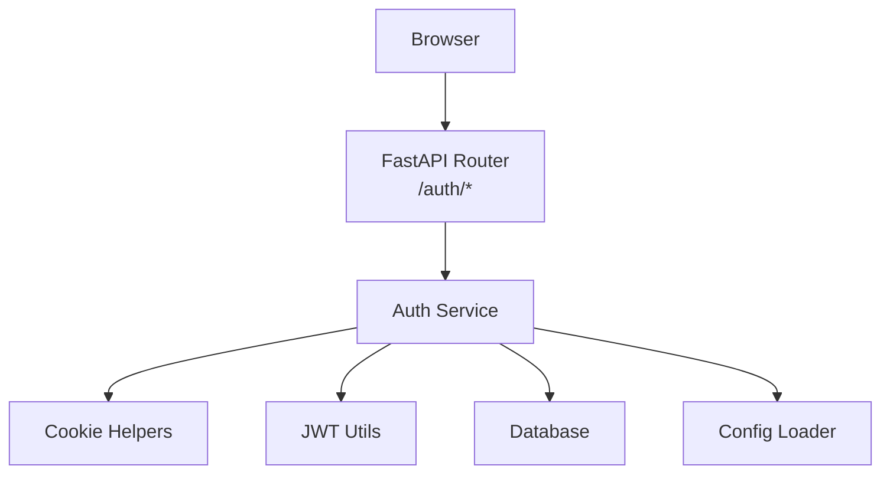
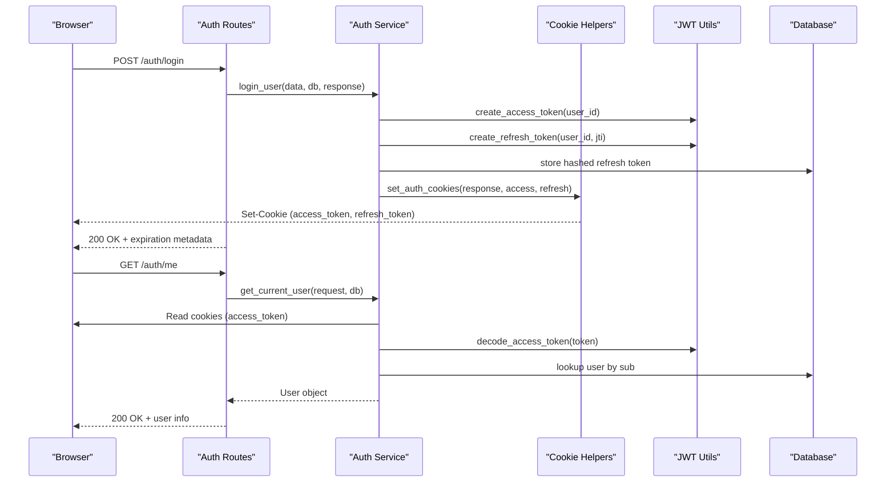
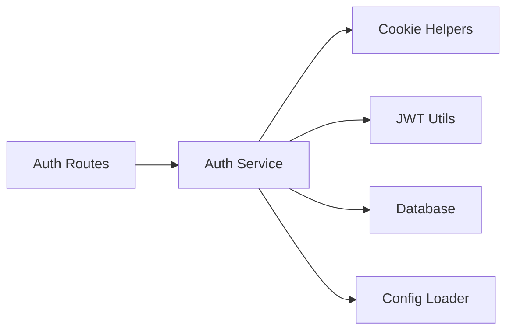

# Secure Cookie Handling

<cite>
**Referenced Files in This Document**
- [cookie_helpers.py](file://app/utils/cookie_helpers.py)
- [jwt_utils.py](file://app/utils/jwt_utils.py)
- [auth_service.py](file://app/services/auth_service.py)
- [auth_routes.py](file://app/api/routes/auth_routes.py)
- [config_loader.py](file://app/utils/config_loader.py)
- [db_config.py](file://app/config/db_config.py)
- [main.py](file://app/main.py)
- [auth_dtos.py](file://app/api/dtos/auth_dtos.py)
</cite>

## Table of Contents
1. Introduction
2. Project Structure
3. Core Components
4. Architecture Overview
5. Detailed Component Analysis
6. Dependency Analysis
7. Performance Considerations
8. Troubleshooting Guide
9. Conclusion

## Introduction
This document explains how DefectLoupe implements secure cookie-based authentication and session management. It covers cookie configuration (HttpOnly, Secure, SameSite), domain and path settings, CSRF considerations, token lifecycle, encryption and hashing practices, browser compatibility, size limitations, performance implications, and guidance for testing and debugging cookie-related issues.

## Project Structure
The secure cookie implementation spans utilities, services, routes, and configuration:
- Cookie helpers define secure cookie constants and set/clear cookies with security flags.
- JWT utilities create and decode access and refresh tokens using HS256.
- Auth service orchestrates login, logout, token refresh, and current user extraction from cookies.
- Routes expose endpoints that use the auth service to manage sessions via cookies.
- Configuration loader provides secrets and expiry durations from environment variables.
- Database config manages database connections used by the auth service.
- Main application wires routers into FastAPI.

**Diagram sources**
- [auth_routes.py:22-65](file://app/api/routes/auth_routes.py#L22-L65)
- [auth_service.py:59-221](file://app/services/auth_service.py#L59-L221)
- [cookie_helpers.py:12-41](file://app/utils/cookie_helpers.py#L12-L41)
- [jwt_utils.py:14-50](file://app/utils/jwt_utils.py#L14-L50)
- [config_loader.py:24-43](file://app/utils/config_loader.py#L24-L43)
- [db_config.py:16-26](file://app/config/db_config.py#L16-L26)

**Section sources**
- [main.py:18-21](file://app/main.py#L18-L21)
- [auth_routes.py:22-65](file://app/api/routes/auth_routes.py#L22-L65)

## Core Components
- Cookie helpers: Define cookie names and provide functions to set and clear secure cookies with HttpOnly, Secure, SameSite=Lax, and root path.
- JWT utilities: Create and decode signed JWTs for short-lived access tokens and longer-lived refresh tokens.
- Auth service: Implements login, logout, token refresh with rotation, and dependency injection to extract the current user from cookies.
- Routes: Expose /auth/register, /auth/login, /auth/logout, /auth/refresh, /auth/me endpoints that coordinate cookie-based sessions.
- Configuration: Provides secrets and expiry durations via environment variables; enforces required values at runtime.

Key behaviors:
- Access and refresh tokens are stored as HTTP-only, Secure cookies with SameSite=Lax and path="/".
- Refresh tokens are hashed before storage in the database to prevent exposure if the database is compromised.
- Token refresh rotates refresh tokens and invalidates previous ones on reuse detection.
- Current user resolution reads the access token from cookies and validates it per request.

**Section sources**
- [cookie_helpers.py:8-41](file://app/utils/cookie_helpers.py#L8-L41)
- [jwt_utils.py:14-50](file://app/utils/jwt_utils.py#L14-L50)
- [auth_service.py:59-221](file://app/services/auth_service.py#L59-L221)
- [auth_routes.py:25-65](file://app/api/routes/auth_routes.py#L25-L65)
- [config_loader.py:24-43](file://app/utils/config_loader.py#L24-L43)

## Architecture Overview
The authentication flow uses secure cookies to carry tokens between client and server:
- Login sets both access and refresh tokens as secure cookies.
- Protected endpoints read the access token from cookies to identify the user.
- Token refresh validates the refresh token, rotates it, and updates cookies.
- Logout clears cookies and revokes the refresh token in the database.

**Diagram sources**
- [auth_routes.py:31-65](file://app/api/routes/auth_routes.py#L31-L65)
- [auth_service.py:59-221](file://app/services/auth_service.py#L59-L221)
- [cookie_helpers.py:12-41](file://app/utils/cookie_helpers.py#L12-L41)
- [jwt_utils.py:14-50](file://app/utils/jwt_utils.py#L14-L50)

## Detailed Component Analysis

### Cookie Configuration and Security Flags
- HttpOnly: Prevents JavaScript access to cookies, mitigating XSS theft.
- Secure: Ensures cookies are only sent over HTTPS, protecting against interception.
- SameSite=Lax: Limits cross-site sending to top-level navigations, reducing CSRF risk.
- Path="/": Makes cookies available across all paths under the origin.
- Domain: Not explicitly set; defaults to the host that set the cookie. For multi-domain setups, configure accordingly.
- Expiration: Controlled via max_age derived from environment-configured expiry durations.

Implementation details:
- Constants define cookie keys for access and refresh tokens.
- set_auth_cookies applies HttpOnly, Secure, SameSite=Lax, and path="/" for both tokens.
- clear_auth_cookies deletes both cookies with matching flags to ensure proper removal.

**Section sources**
- [cookie_helpers.py:8-41](file://app/utils/cookie_helpers.py#L8-L41)
- [config_loader.py:38-43](file://app/utils/config_loader.py#L38-L43)

### Cookie-Based Session Management
- Login: Authenticates credentials, generates JWT pairs, stores a hashed refresh token in the database, and sets secure cookies.
- Current user resolution: Reads the access token from cookies, decodes it, and resolves the user from the database.
- Logout: Revokes the refresh token in the database and clears cookies.
- Token refresh: Validates the refresh token (from cookie or body fallback), rotates it, invalidates the old one on reuse, and sets new cookies.

Error handling:
- Invalid or expired tokens result in clearing cookies and returning appropriate HTTP status codes.
- Reuse of refresh tokens triggers full session revocation and cookie cleanup.

**Section sources**
- [auth_service.py:59-112](file://app/services/auth_service.py#L59-L112)
- [auth_service.py:116-185](file://app/services/auth_service.py#L116-L185)
- [auth_service.py:190-221](file://app/services/auth_service.py#L190-L221)

### CSRF Protection
- SameSite=Lax reduces CSRF risk by allowing cookies only on same-site top-level navigations.
- No explicit CSRF token mechanism is implemented in the analyzed code.
- Recommendation: If state-changing operations are exposed via GET or non-standard methods, consider adding CSRF tokens or enforcing strict method usage (e.g., POST/PUT/DELETE) and validating Referer/Origin headers where appropriate.

**Section sources**
- [cookie_helpers.py:18-35](file://app/utils/cookie_helpers.py#L18-L35)

### Token Encryption, Serialization, and Deserialization
- Tokens are JSON Web Tokens (JWT) signed with HS256 using separate secrets for access and refresh tokens.
- Payloads include subject (user ID), expiration time, and type; refresh tokens also include a unique jti for rotation tracking.
- Refresh tokens are hashed before storage in the database to protect them even if the database is compromised.
- Decoding validates signatures and expiration using configured secrets.

**Section sources**
- [jwt_utils.py:14-50](file://app/utils/jwt_utils.py#L14-L50)
- [auth_service.py:86-93](file://app/services/auth_service.py#L86-L93)
- [auth_service.py:154-161](file://app/services/auth_service.py#L154-L161)

### Examples of Setting Secure Cookies for Authentication
- After successful login, the server sets both access and refresh cookies with secure flags and path restrictions.
- On logout, the server clears both cookies with matching flags to ensure deletion.
- During token refresh, the server rotates tokens and sets updated cookies.

**Section sources**
- [auth_routes.py:31-58](file://app/api/routes/auth_routes.py#L31-L58)
- [auth_service.py:86-99](file://app/services/auth_service.py#L86-L99)
- [auth_service.py:103-112](file://app/services/auth_service.py#L103-L112)
- [auth_service.py:170-185](file://app/services/auth_service.py#L170-L185)

### Managing Cookie Lifecycle
- Creation: On login or token refresh, cookies are set with appropriate max_age based on configured expirations.
- Validation: Each protected request reads the access token from cookies and validates it.
- Rotation: Refresh endpoint issues new tokens and replaces cookies, invalidating the prior refresh token.
- Deletion: Logout clears cookies and revokes the refresh token.

**Section sources**
- [config_loader.py:38-43](file://app/utils/config_loader.py#L38-L43)
- [auth_service.py:116-185](file://app/services/auth_service.py#L116-L185)
- [auth_service.py:190-221](file://app/services/auth_service.py#L190-L221)

### Browser Compatibility and Cookie Size Limitations
- Compatibility:
  - HttpOnly, Secure, and SameSite are widely supported in modern browsers.
  - SameSite=Lax is supported across major browsers; older clients may ignore SameSite and rely on other protections.
- Size limitations:
  - Cookies have typical size limits around 4KB per cookie and per domain. JWTs can approach this limit depending on payload size.
  - Keep payloads minimal (e.g., user ID and expiration) to avoid exceeding limits.
- Recommendations:
  - Monitor token sizes and adjust payload if needed.
  - Ensure HTTPS is enforced to leverage Secure flag effectively.

[No sources needed since this section provides general guidance]

### Performance Considerations
- Cookie overhead: Each request includes cookies; keep cookie count and size low.
- Token validation: JWT decoding is lightweight; however, frequent database lookups for user resolution add latency. Cache user data judiciously if appropriate.
- Refresh rotation: Database writes occur on refresh; ensure efficient indexing on user identifiers and refresh token fields.
- Concurrency: Avoid blocking operations during cookie setting/validation; FastAPI’s async model helps mitigate contention.

[No sources needed since this section provides general guidance]

## Dependency Analysis
The following diagram shows key dependencies among components involved in secure cookie handling:

**Diagram sources**
- [auth_routes.py:22-65](file://app/api/routes/auth_routes.py#L22-L65)
- [auth_service.py:59-221](file://app/services/auth_service.py#L59-L221)
- [cookie_helpers.py:12-41](file://app/utils/cookie_helpers.py#L12-L41)
- [jwt_utils.py:14-50](file://app/utils/jwt_utils.py#L14-L50)
- [config_loader.py:24-43](file://app/utils/config_loader.py#L24-L43)
- [db_config.py:16-26](file://app/config/db_config.py#L16-L26)

**Section sources**
- [main.py:18-21](file://app/main.py#L18-L21)
- [auth_routes.py:22-65](file://app/api/routes/auth_routes.py#L22-L65)

## Performance Considerations
- Minimize cookie size by keeping JWT payloads small.
- Use short-lived access tokens to reduce exposure window and enable frequent rotation via refresh.
- Index database tables used for user lookups and refresh token storage to speed up queries.
- Consider caching frequently accessed user attributes to reduce database load.

[No sources needed since this section provides general guidance]

## Troubleshooting Guide
Common issues and resolutions:
- Missing cookies:
  - Verify that responses include Set-Cookie headers after login or refresh.
  - Ensure Secure flag is set when using HTTPS; local development without HTTPS may require adjusting flags or using localhost with appropriate browser settings.
- SameSite restrictions:
  - Cross-site requests may not send cookies with SameSite=Lax; adjust SameSite policy if integrating with different origins, or implement CORS and CSRF measures accordingly.
- Invalid or expired tokens:
  - Check JWT signing secrets and expiry configurations.
  - Confirm that refresh tokens are rotated and not reused; reuse triggers session revocation.
- Cookie deletion failures:
  - Ensure delete_cookie calls match the original cookie’s flags (HttpOnly, Secure, SameSite, path).
- Database connectivity:
  - Validate DATABASE_URL and connection parameters; errors will surface during user lookups or refresh token storage.

Debugging steps:
- Inspect network tab for Set-Cookie and Cookie headers.
- Log token creation and decoding events to verify payloads and expiration times.
- Test endpoints with tools like curl or Postman to validate behavior outside the browser.

**Section sources**
- [auth_service.py:136-161](file://app/services/auth_service.py#L136-L161)
- [auth_service.py:190-221](file://app/services/auth_service.py#L190-L221)
- [db_config.py:11-16](file://app/config/db_config.py#L11-L16)

## Conclusion
DefectLoupe implements secure cookie-based authentication using HttpOnly, Secure, and SameSite=Lax flags, with path restrictions and configurable expirations. Tokens are JWTs signed with HS256, and refresh tokens are hashed in storage. The system supports token rotation, session revocation, and robust error handling. For enhanced security in cross-origin scenarios, consider additional CSRF protections and careful SameSite configuration. Monitoring cookie sizes and optimizing database queries will help maintain performance as usage scales.