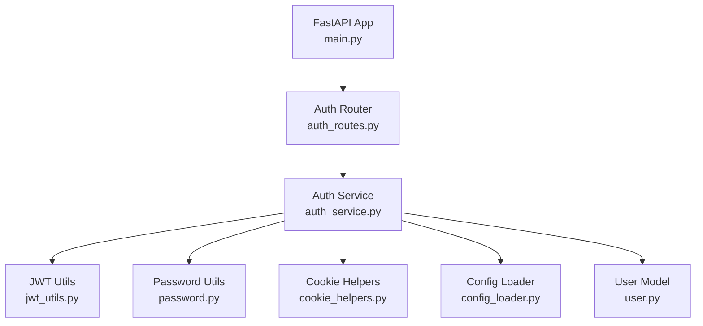
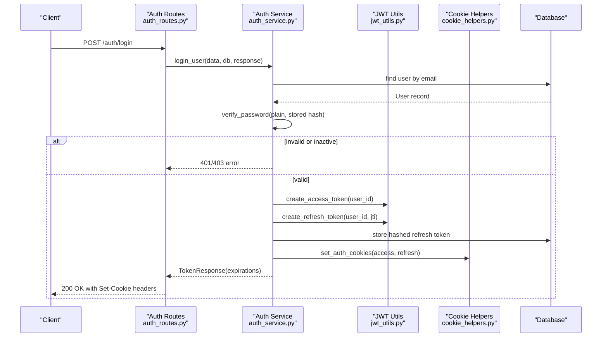
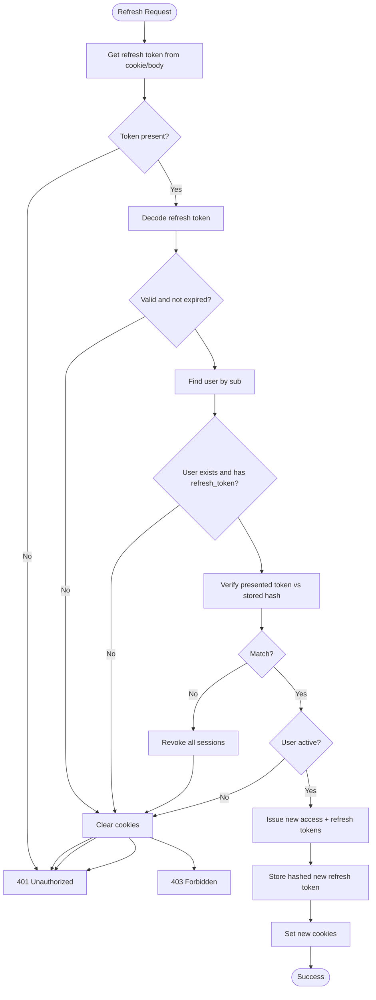
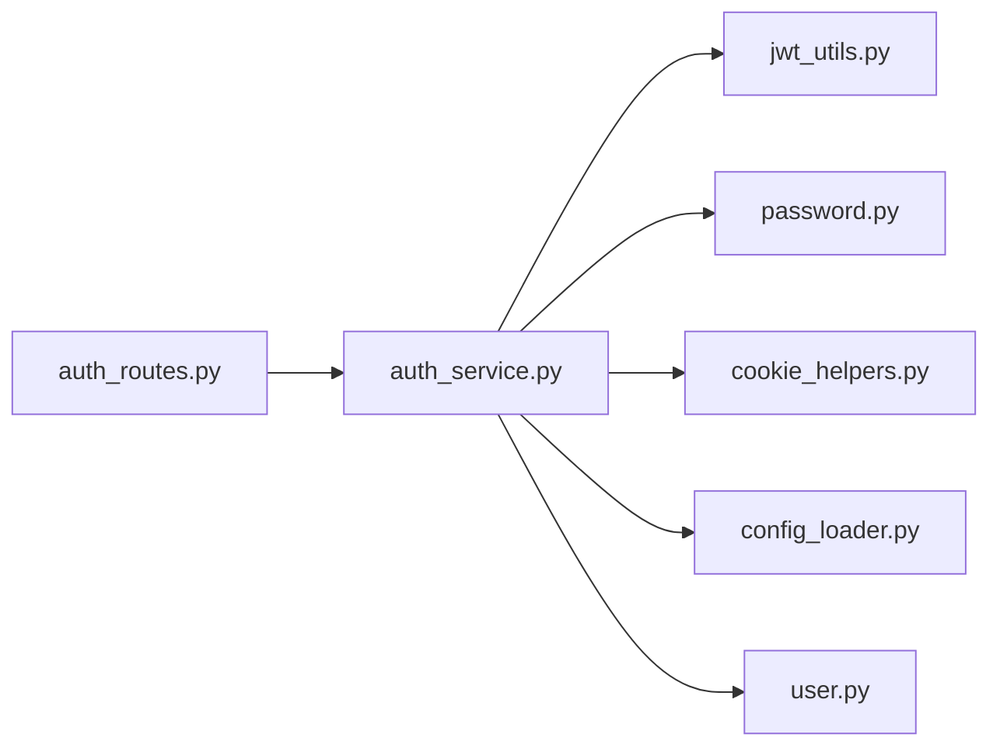

# Security Implementation

<cite>
**Referenced Files in This Document**
- [password.py](file://app/utils/password.py)
- [jwt_utils.py](file://app/utils/jwt_utils.py)
- [cookie_helpers.py](file://app/utils/cookie_helpers.py)
- [config_loader.py](file://app/utils/config_loader.py)
- [auth_service.py](file://app/services/auth_service.py)
- [auth_routes.py](file://app/api/routes/auth_routes.py)
- [auth_dtos.py](file://app/api/dtos/auth_dtos.py)
- [user.py](file://app/repository/user.py)
- [main.py](file://app/main.py)
</cite>

## Table of Contents
1. Introduction
2. Project Structure
3. Core Components
4. Architecture Overview
5. Detailed Component Analysis
6. Dependency Analysis
7. Performance Considerations
8. Troubleshooting Guide
9. Conclusion
10. Appendices

## Introduction
This document provides a comprehensive security analysis of the DefectLoupe backend, focusing on authentication and authorization mechanisms, token lifecycle management, secure cookie handling, input validation, and protection against common vulnerabilities. It also outlines best practices, threat mitigation strategies, testing approaches, compliance considerations, and audit procedures relevant to the implemented codebase.

## Project Structure
The security-relevant implementation is organized into utilities (password hashing, JWT, cookies, configuration), services (authentication logic), routes (API endpoints), DTOs (input/output models), and repositories (data models). The application entry point wires routers and database initialization.

**Diagram sources**
- [main.py:18-21](file://app/main.py#L18-L21)
- [auth_routes.py:22-65](file://app/api/routes/auth_routes.py#L22-L65)
- [auth_service.py:36-273](file://app/services/auth_service.py#L36-L273)
- [jwt_utils.py:14-50](file://app/utils/jwt_utils.py#L14-L50)
- [password.py:1-12](file://app/utils/password.py#L1-L12)
- [cookie_helpers.py:12-41](file://app/utils/cookie_helpers.py#L12-L41)
- [config_loader.py:24-43](file://app/utils/config_loader.py#L24-L43)
- [user.py:10-54](file://app/repository/user.py#L10-L54)

**Section sources**
- [main.py:18-21](file://app/main.py#L18-L21)
- [auth_routes.py:22-65](file://app/api/routes/auth_routes.py#L22-L65)

## Core Components
- Password hashing and verification using Argon2 via pwdlib for secure storage and comparison.
- JWT access and refresh tokens with HS256 signing, configurable expiry, and unique JTI for rotation tracking.
- Secure HTTP-only cookies with SameSite=Lax and Secure flags for token transport.
- Input validation via Pydantic models with email format checks and password length constraints.
- Authorization dependencies that enforce active user status and role-based access patterns.

**Section sources**
- [password.py:1-12](file://app/utils/password.py#L1-L12)
- [jwt_utils.py:14-50](file://app/utils/jwt_utils.py#L14-L50)
- [cookie_helpers.py:12-41](file://app/utils/cookie_helpers.py#L12-L41)
- [auth_dtos.py:7-19](file://app/api/dtos/auth_dtos.py#L7-L19)
- [auth_service.py:198-273](file://app/services/auth_service.py#L198-L273)

## Architecture Overview
The authentication flow uses FastAPI routes to accept requests, delegates to service functions for business logic, and relies on utilities for cryptographic operations and cookie management. Tokens are stored in secure cookies; refresh tokens are hashed and persisted to support rotation and revocation.

**Diagram sources**
- [auth_routes.py:31-34](file://app/api/routes/auth_routes.py#L31-L34)
- [auth_service.py:60-102](file://app/services/auth_service.py#L60-L102)
- [jwt_utils.py:14-40](file://app/utils/jwt_utils.py#L14-L40)
- [cookie_helpers.py:12-35](file://app/utils/cookie_helpers.py#L12-L35)
- [user.py:19-38](file://app/repository/user.py#L19-L38)

## Detailed Component Analysis

### Password Hashing and Verification
- Uses pwdlib’s recommended hasher (Argon2) to generate strong hashes and verify passwords securely.
- Functions encapsulate hashing and verification to centralize algorithm choice and parameters.

Security implications:
- Argon2 provides resistance against brute-force and GPU attacks when configured with appropriate memory/time costs.
- Centralized hashing ensures consistent usage across registration and login flows.

**Section sources**
- [password.py:1-12](file://app/utils/password.py#L1-L12)
- [auth_service.py:48-55](file://app/services/auth_service.py#L48-L55)
- [auth_service.py:73-79](file://app/services/auth_service.py#L73-L79)

### JWT Token Security
- Access tokens: short-lived, signed with HS256 using a secret from environment variables; include subject (user ID), expiration, and type.
- Refresh tokens: longer-lived, signed with HS256 using a separate secret; include subject, expiration, type, and unique JTI for rotation tracking.
- Decoding validates signature and expiration using corresponding secrets and algorithms.

Security implications:
- Separate secrets for access and refresh tokens reduce risk if one secret is compromised.
- Expiration times are configurable via environment variables, enabling policy enforcement.
- JTI enables per-token revocation and supports rotation semantics.

**Section sources**
- [jwt_utils.py:14-50](file://app/utils/jwt_utils.py#L14-L50)
- [config_loader.py:24-43](file://app/utils/config_loader.py#L24-L43)

### Secure Cookie Handling
- Both access and refresh tokens are set as HTTP-only, Secure cookies with SameSite=Lax and path="/".
- Cookies use max_age aligned with token expirations.
- Logout clears both cookies consistently.

Security implications:
- HTTP-only prevents client-side script access, mitigating XSS token theft.
- Secure flag enforces HTTPS transmission.
- SameSite=Lax reduces CSRF risk while allowing top-level navigations.

**Section sources**
- [cookie_helpers.py:12-41](file://app/utils/cookie_helpers.py#L12-L41)
- [auth_service.py:96-102](file://app/services/auth_service.py#L96-L102)
- [auth_service.py:112-116](file://app/services/auth_service.py#L112-L116)

### Input Validation and Sanitization
- Pydantic models validate request payloads:
  - Email fields validated via EmailStr.
  - Password fields constrained by min/max length.
  - Optional refresh token field supported for body fallback.

Security implications:
- Strong input validation prevents malformed data and reduces injection surface.
- Length constraints mitigate buffer-related risks and enforce policy.

**Section sources**
- [auth_dtos.py:7-19](file://app/api/dtos/auth_dtos.py#L7-L19)
- [auth_routes.py:25-58](file://app/api/routes/auth_routes.py#L25-L58)

### Authentication Flow and Authorization Dependencies
- Login authenticates user, issues tokens, persists hashed refresh token, and sets cookies.
- Logout revokes refresh token and clears cookies.
- get_current_user dependency extracts access token from cookies, decodes it, retrieves user, and enforces active status.
- get_current_inspector and require_company_owner provide role-based access control for inspector and company owner contexts.

Security implications:
- Centralized dependency ensures consistent authentication checks across protected endpoints.
- Active account checks prevent unauthorized access for deactivated users.
- Role checks enforce least privilege for sensitive operations.

**Section sources**
- [auth_service.py:60-116](file://app/services/auth_service.py#L60-L116)
- [auth_service.py:198-273](file://app/services/auth_service.py#L198-L273)
- [auth_routes.py:37-65](file://app/api/routes/auth_routes.py#L37-L65)

### Refresh Token Rotation and Revocation
- On refresh:
  - Accepts refresh token from cookie or optional body fallback.
  - Decodes and verifies token; checks existence and validity in DB.
  - Verifies presented token matches stored hash; mismatch triggers full session revocation.
  - Issues new token pair, stores hashed new refresh token, and updates cookies.
- Logout clears server-side token reference and client cookies.

Security implications:
- Rotation limits exposure window and invalidates previous tokens.
- Reuse detection protects against token theft by revoking all sessions.
- Storing only hashed refresh tokens reduces risk of plaintext token leakage in DB.

**Diagram sources**
- [auth_service.py:121-193](file://app/services/auth_service.py#L121-L193)
- [jwt_utils.py:28-50](file://app/utils/jwt_utils.py#L28-L50)
- [cookie_helpers.py:12-41](file://app/utils/cookie_helpers.py#L12-L41)

**Section sources**
- [auth_service.py:121-193](file://app/services/auth_service.py#L121-L193)

### API Security Patterns
- Protected endpoints rely on FastAPI dependencies to ensure authenticated and authorized access.
- Error responses use standard HTTP status codes and generic messages to avoid information leakage.
- Token lifetimes and secrets are externalized via environment configuration.

**Section sources**
- [auth_routes.py:22-65](file://app/api/routes/auth_routes.py#L22-L65)
- [auth_service.py:198-273](file://app/services/auth_service.py#L198-L273)
- [config_loader.py:24-43](file://app/utils/config_loader.py#L24-L43)

## Dependency Analysis
The authentication subsystem depends on utilities for cryptography and configuration, and on repository models for persistence. Routes depend on services, which depend on utilities and repositories.

**Diagram sources**
- [auth_routes.py:1-21](file://app/api/routes/auth_routes.py#L1-L21)
- [auth_service.py:1-33](file://app/services/auth_service.py#L1-L33)
- [jwt_utils.py:1-11](file://app/utils/jwt_utils.py#L1-L11)
- [password.py:1-3](file://app/utils/password.py#L1-L3)
- [cookie_helpers.py:1-6](file://app/utils/cookie_helpers.py#L1-L6)
- [config_loader.py:1-6](file://app/utils/config_loader.py#L1-L6)
- [user.py:1-8](file://app/repository/user.py#L1-L8)

**Section sources**
- [auth_routes.py:1-21](file://app/api/routes/auth_routes.py#L1-L21)
- [auth_service.py:1-33](file://app/services/auth_service.py#L1-L33)

## Performance Considerations
- Password hashing with Argon2 is intentionally CPU/memory intensive; ensure appropriate tuning for your deployment to balance security and latency.
- JWT decoding is lightweight; however, frequent decode operations should be cached where appropriate at higher layers if needed.
- Database queries for user lookup and refresh token checks should be indexed on user identifiers and email to minimize latency.

[No sources needed since this section provides general guidance]

## Troubleshooting Guide
Common issues and resolutions:
- Invalid or expired refresh token: Ensure the token is present in cookies or body, correctly signed, and not expired. If decoding fails, cookies are cleared and a 401 is returned.
- Refresh token reuse detected: Indicates possible token theft; all sessions are revoked and cookies cleared. Users must re-authenticate.
- Account deactivated: Requests return 403; reactivate the account or deny access accordingly.
- Missing secrets or misconfiguration: Environment variables for token secrets and expiry must be set; otherwise, runtime errors occur during token creation/decoding.

Operational tips:
- Validate environment configuration before deployment.
- Monitor logs around authentication failures to detect abuse or misconfiguration.
- Use test accounts to exercise registration, login, refresh, and logout flows regularly.

**Section sources**
- [auth_service.py:141-169](file://app/services/auth_service.py#L141-L169)
- [auth_service.py:171-176](file://app/services/auth_service.py#L171-L176)
- [config_loader.py:24-43](file://app/utils/config_loader.py#L24-L43)

## Conclusion
DefectLoupe’s backend implements robust authentication and authorization mechanisms:
- Secure password hashing with Argon2 via pwdlib.
- JWT access and refresh tokens with HS256 signing, configurable expirations, and rotation via JTI.
- Secure cookie handling with HTTP-only, Secure, and SameSite attributes.
- Strong input validation through Pydantic models.
- Centralized authorization dependencies enforcing active status and role-based access.

These measures collectively mitigate common threats such as credential theft, token replay, and unauthorized access. Ongoing security hygiene includes environment hardening, periodic audits, and continuous testing.

[No sources needed since this section summarizes without analyzing specific files]

## Appendices

### Security Best Practices
- Rotate secrets regularly and manage them via secure secret stores.
- Enforce HTTPS in production to leverage Secure cookies.
- Keep token expirations short for access tokens and reasonable for refresh tokens.
- Implement rate limiting on authentication endpoints to mitigate brute-force attempts.
- Add CORS policies explicitly to restrict allowed origins, methods, and headers.
- Integrate security headers (e.g., Content-Security-Policy, X-Frame-Options) at the gateway or middleware layer.

[No sources needed since this section provides general guidance]

### Threat Mitigation Strategies
- XSS: Rely on HTTP-only cookies to prevent script access to tokens; consider CSP headers for additional protection.
- CSRF: SameSite=Lax helps mitigate; combine with origin validation and anti-CSRF tokens if cross-site requests are required.
- Brute Force: Rate limit login/register endpoints and monitor failed attempts.
- Token Theft: Rotation and reuse detection revoke compromised sessions promptly.
- SQL Injection: Use parameterized queries via SQLAlchemy ORM; avoid raw SQL.

[No sources needed since this section provides general guidance]

### Security Testing Approaches
- Unit tests for password hashing and verification paths.
- Integration tests for login, refresh, and logout flows covering success and failure cases.
- Fuzzing of input models to validate Pydantic constraints.
- Penetration testing focused on authentication endpoints and token handling.
- Secret management validation to ensure environment variables are enforced.

[No sources needed since this section provides general guidance]

### Compliance Considerations and Audit Procedures
- Data Protection: Ensure passwords are never logged; only hashed values are stored.
- Audit Logging: Log authentication events (success/failure) with minimal sensitive data.
- Access Controls: Regularly review role-based permissions and ownership checks.
- Configuration Audits: Verify environment variables for secrets and expiry settings.
- Incident Response: Maintain procedures for token revocation and account deactivation.

[No sources needed since this section provides general guidance]