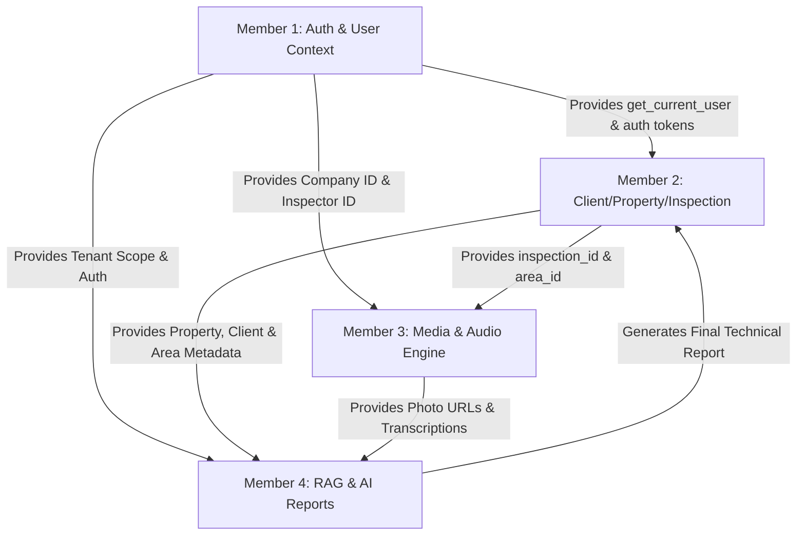

# DefectLoupe — Team Task Division & Architecture Blueprint (4-Member Plan)

## 1. Executive Summary & Objective

**DefectLoupe** is an AI-powered property inspection and defect tracking platform. The system enables inspectors to conduct structured property walkthroughs, capture photos with linked voice/text observations, transcribe speech notes, and synthesize technical reports using Vision AI and RAG (Retrieval-Augmented Generation) based on company specifications and past report samples.

To achieve maximum productivity and minimize merge conflicts and cross-team dependencies, the engineering workload is divided across **4 specialized roles** with clearly defined interface contracts, folder boundaries, and a shared schema strategy.

---

## 2. Complete User Journey Mapping

```
[ Signup / Login ] (Member 1)
        │
        ▼
[ Create / Select Client & Property ] (Member 2)
        │
        ▼
[ Start Inspection & Add Inspection Areas (e.g., Roof, Kitchen) ] (Member 2)
        │
        ▼
[ Capture Photos & Attach Voice / Text Notes ] (Member 3)
        │
        ▼
[ Automated Audio Transcription Pipeline ] (Member 3)
        │
        ▼
[ Vision AI Defect Detection + RAG Context Retrieval ] (Member 4)
        │
        ▼
[ AI Synthesis & PDF/Document Report Generation ] (Member 4)
```

---

## 3. Team Division Overview & Independence Matrix

| Member | Primary Domain | Core Responsibilities | Key Folder Ownership | Primary Dependencies |
| :--- | :--- | :--- | :--- | :--- |
| **Member 1** | **Auth, Access Control & Tenant Management** | JWT Auth, RBAC/ABAC, Password Hashing, User/Company/Inspector APIs, Auth Middleware | `app/api/routes/auth.py`<br>`app/services/auth_service.py`<br>`app/utils/security.py` | None (Foundation layer) |
| **Member 2** | **Inspection Core, Client & Property Catalog** | Clients, Properties, Inspection Workflow State Machine, Inspection Areas hierarchy | `app/api/routes/clients.py`<br>`app/api/routes/properties.py`<br>`app/api/routes/inspections.py`<br>`app/services/inspection_service.py` | Member 1 (`get_current_user` auth dependency) |
| **Member 3** | **Media Capture & Audio Transcription Pipeline** | Photo upload/storage, Voice note handling, Speech-to-Text (STT/Whisper) processing | `app/api/routes/media.py`<br>`app/services/media_service.py`<br>`app/services/transcription_service.py`<br>`app/utils/storage.py` | Member 2 (Receives `area_id` & `inspection_id`) |
| **Member 4** | **RAG Knowledge Base, Vision AI & Report Synthesis** | Document ingestion into pgvector, Vision defect analysis, RAG pipeline, AI Report Generation | `app/api/routes/reports.py`<br>`app/api/routes/rag.py`<br>`app/services/rag_service.py`<br>`app/services/vision_service.py`<br>`app/services/report_service.py` | Member 2 (Inspection metadata) & Member 3 (Photos + Transcriptions) |

---

## 4. Detailed Task Breakdown per Member

### 👤 Member 1: Authentication, Authorization & Tenant Management
> **Goal:** Secure the platform, manage multi-tenant accounts (Solo Inspectors & Agencies), and provide reusable FastAPI security dependencies for all other members.

#### Scope of Work:
1. **User Authentication & Token Management**:
   - User registration (Signup) & Login endpoints with JWT (Access & Refresh tokens).
   - Password hashing using `pwdlib[argon2]` or `bcrypt`.
   - Token revocation / logout handling and password reset flow.
2. **Role-Based Access Control (RBAC)**:
   - Roles: `ADMIN`, `INSPECTOR`, `CLIENT`.
   - Role verification dependencies: `@require_role(["INSPECTOR", "ADMIN"])`.
   - Multi-tenant tenant boundary checks (ensure inspectors only access their own company/client records).
3. **Inspector & Company Profiles**:
   - Company onboarding and management (for inspection agencies).
   - Inspector profile creation (Solo vs. Agency Member) linked to `User`.
   - Update user profile, signature upload, and company branding settings (logo, contact info).
4. **Security Middleware & Dependency Injection**:
   - `get_current_user`, `get_current_active_inspector`, and `get_current_company` dependency providers.

#### Deliverables & File Ownership:
- `app/api/routes/auth.py`
- `app/api/routes/users.py`
- `app/api/routes/companies.py`
- `app/api/dtos/auth_dto.py`
- `app/api/dtos/user_dto.py`
- `app/api/dtos/company_dto.py`
- `app/services/auth_service.py`
- `app/services/user_service.py`
- `app/utils/security.py` (JWT decoding, hashing, token verification)
- Unit tests: `tests/test_auth.py`, `tests/test_roles.py`

---

### 👤 Member 2: Client, Property & Inspection Management Engine
> **Goal:** Build the business entity catalog and inspection lifecycle engine (creating/searching clients, managing properties, configuring inspection areas, and orchestrating status flows).

#### Scope of Work:
1. **Client Management Module**:
   - Create new client / search existing clients by email, phone, or name.
   - Associate clients with inspectors/companies.
2. **Property Catalog Module**:
   - Add new property (address, property type, square footage, year built, foundation type).
   - Search & link existing properties to inspections.
   - Maintain property history across multiple inspections.
3. **Inspection Workflow Engine**:
   - Create inspection record (link inspector, client, property, inspection date, type).
   - State machine lifecycle: `DRAFT` -> `SCHEDULED` -> `IN_PROGRESS` -> `COMPLETED` -> `REPORT_GENERATED` -> `ARCHIVED`.
   - List and filter inspections (by status, date, client, inspector).
4. **Inspection Area Hierarchy**:
   - Add/Remove inspection areas (e.g., Roof, Exterior, Kitchen, Attic, Electrical, Plumbing).
   - Reorder areas for structured walkthroughs.
   - Summary statistics per area (photos count, defects count).

#### Deliverables & File Ownership:
- `app/api/routes/clients.py`
- `app/api/routes/properties.py`
- `app/api/routes/inspections.py`
- `app/api/routes/inspection_areas.py`
- `app/api/dtos/client_dto.py`
- `app/api/dtos/property_dto.py`
- `app/api/dtos/inspection_dto.py`
- `app/api/dtos/inspection_area_dto.py`
- `app/services/client_service.py`
- `app/services/property_service.py`
- `app/services/inspection_service.py`
- `app/services/area_service.py`
- Unit tests: `tests/test_inspections.py`, `tests/test_properties.py`

---

### 👤 Member 3: Media Storage & Audio Transcription Engine
> **Goal:** Enable inspectors to capture high-res defect photos, record voice/text observations attached to photos/areas, and automatically transcribe speech to text.

#### Scope of Work:
1. **Photo Upload & Media Storage Service**:
   - Multi-part photo upload endpoint for inspection areas (`/api/v1/areas/{area_id}/photos`).
   - Pluggable storage backend: Local file storage (development) and AWS S3/MinIO/Cloud Storage (production).
   - Image optimization: Thumbnail generation, EXIF metadata extraction (timestamp, GPS if present).
2. **Voice Note & Observation Management**:
   - Record and upload voice audio files (`.wav`, `.mp3`, `.m4a`, `.webm`, `.ogg`).
   - Associate text notes or voice recordings directly with an `AreaPhoto` or `InspectionArea`.
   - Support standalone text notes or voice note attachments per defect photo.
3. **Speech-to-Text (STT) Transcription Pipeline**:
   - Integration with Speech-to-Text engine (OpenAI Whisper API, local `faster-whisper`, or cloud STT).
   - Asynchronous background task execution for transcribing audio without blocking the HTTP request.
   - Store transcription result, confidence score, duration, and processing status in `transcription` table.
4. **Media & Observation Queries**:
   - Retrieve all media, notes, and transcriptions grouped by area or photo.
   - Update / edit transcribed text if inspector wants to make manual corrections.

#### Deliverables & File Ownership:
- `app/api/routes/photos.py`
- `app/api/routes/observations.py`
- `app/api/routes/transcriptions.py`
- `app/api/dtos/photo_dto.py`
- `app/api/dtos/observation_dto.py`
- `app/api/dtos/transcription_dto.py`
- `app/services/media_service.py`
- `app/services/transcription_service.py`
- `app/utils/storage.py` (file saving, S3/local abstraction)
- `app/utils/audio.py` (audio format validation & processing)
- Unit tests: `tests/test_media.py`, `tests/test_transcription.py`

---

### 👤 Member 4: Vision AI, RAG Engine & Technical Report Generation
> **Goal:** Leverage Vision AI models to analyze defect photos, build a RAG knowledge base from company standards/past reports, and generate structured technical inspection reports.

#### Scope of Work:
1. **RAG Knowledge Base & Vector Store (`pgvector`)**:
   - Ingestion pipeline for company technical specifications, standard defect phrasing, building guidelines, and past sample reports (PDF / TXT / Markdown).
   - Text chunking, metadata tagging (trade, defect category, severity rules), and vector embedding generation (using OpenAI `text-embedding-3-small` or HuggingFace / FastEmbed).
   - Vector similarity search in PostgreSQL using `pgvector` to retrieve relevant technical clauses and style guidelines.
2. **Vision Model Analysis for Defect Photos**:
   - Multi-modal vision analysis (e.g., Gemini 1.5 Pro / Flash or GPT-4o Vision).
   - Prompt design to detect defects in photos (e.g., water damage, structural cracks, exposed wiring, roof shingle wear), classify severity (`Low`, `Medium`, `High`, `Critical`), and suggest immediate remediation.
3. **Report Context Aggregator & AI Synthesizer**:
   - Context Aggregator: Merges (Inspection metadata + Property specs + Area photos + Transcribed voice notes + Vision findings + RAG standard specifications).
   - LLM Report Generation: Generates executive summary, area-by-area breakdown, severity matrix, and actionable repair recommendations formatted according to company style.
4. **Report Export & Delivery**:
   - PDF and HTML generation engine (using `WeasyPrint`, `ReportLab`, or `Jinja2` HTML-to-PDF templates).
   - Final report download endpoints (`/api/v1/inspections/{id}/report/pdf`, `/api/v1/inspections/{id}/report/json`).

#### Deliverables & File Ownership:
- `app/api/routes/rag.py`
- `app/api/routes/reports.py`
- `app/api/dtos/rag_dto.py`
- `app/api/dtos/report_dto.py`
- `app/services/rag_service.py`
- `app/services/embeddings_service.py`
- `app/services/vision_service.py`
- `app/services/report_service.py`
- `app/templates/report_template.html` (Jinja2 report template)
- `app/utils/pdf_generator.py`
- Unit tests: `tests/test_rag.py`, `tests/test_report_generation.py`

---

## 5. Interface Contracts & Collaboration Boundaries

To eliminate blocking dependencies during development, members interact through pre-agreed contracts and mock interfaces:



### Shared DTO / Schema Contracts:
1. **Auth Contract (Member 1 -> All)**:
   ```python
   # Depends on: get_current_user() -> UserContext(user_id, email, role, company_id, inspector_id)
   ```
2. **Inspection & Area Contract (Member 2 -> Member 3 & 4)**:
   ```python
   # Inspection Area Reference:
   # GET /api/v1/inspections/{inspection_id}/full-context
   # Returns: Inspection with Client, Property, and List of Areas
   ```
3. **Media & Transcription Contract (Member 3 -> Member 4)**:
   ```python
   # Media & Observation Payload:
   # AreaPhoto: { id, file_path, thumbnail_path, uploaded_at }
   # AreaObservation: { id, photo_id, note_text, audio_url, transcription: { text, status, confidence } }
   ```
4. **RAG & Report Contract (Member 4 -> Frontend/User)**:
   ```python
   # POST /api/v1/inspections/{inspection_id}/generate-report
   # Returns: ReportJob { report_id, status: "PROCESSING" | "READY", pdf_url, summary }
   ```

---

## 6. Git Workflow & Conflict Prevention Strategy

To prevent merge conflicts in code and database schemas:

1. **Strict Folder Isolation**:
   - Every member works exclusively in their assigned `routes/`, `services/`, `dtos/`, and `tests/` files.
   - `app/main.py` simply mounts routers from each member's module.
2. **Database Migration Protocol (Alembic)**:
   - Core relational models already exist in `app/repository/`.
   - Any new table or column additions must be coordinated through sequentially named Alembic migrations:
     - `001_auth_schema.py` (Member 1)
     - `002_inspection_schema.py` (Member 2)
     - `003_media_schema.py` (Member 3)
     - `004_rag_embeddings_schema.py` (Member 4)
3. **Branching Strategy**:
   - `main`: Production-ready branch.
   - `develop`: Shared integration branch.
   - Feature branches:
     - `feature/m1-auth-rbac`
     - `feature/m2-client-property-inspections`
     - `feature/m3-media-transcription`
     - `feature/m4-rag-vision-reports`
4. **Mocking Dependencies**:
   - During Phase 1, Member 4 can use dummy photo URLs and text notes to test RAG and report rendering.
   - Member 3 can use hardcoded `area_id`s before Member 2 completes the inspection API.
   - Member 2 can use a mock user token before Member 1 finishes the auth flow.

---

## 7. 3-Sprint Execution Timeline

| Sprint | Timeline | Member 1 (Auth) | Member 2 (Inspections) | Member 3 (Media/Audio) | Member 4 (AI/RAG/Reports) |
| :--- | :--- | :--- | :--- | :--- | :--- |
| **Sprint 1** | Week 1 | User Signup, Login, JWT tokens, Password hashing, Auth middleware | Client CRUD, Property Catalog, Property-Client relationships | Photo upload API, Local/S3 storage helper, File validation | RAG schema in `pgvector`, Document chunking & embedding ingestion pipeline |
| **Sprint 2** | Week 2 | RBAC, Inspector & Company Profile management, Account settings | Inspection state machine, Area ordering, Inspection summary APIs | Voice note upload, Audio format conversions, Whisper STT integration | Vision AI prompt pipeline for defect photos, Vector search retrieval |
| **Sprint 3** | Week 3 | Security hardening, Token refresh/revocation, Tenant isolation tests | Finalize walkthrough APIs, Batch operations, Export filters | Async background processing for STT, Transcription retry/edit APIs | Context synthesis, Jinja2/PDF report generation, End-to-end report generation endpoint |
| **Integration** | Week 4 | End-to-End Testing & Integration | End-to-End Testing & Integration | End-to-End Testing & Integration | End-to-End Testing & Integration |

---

## 8. Summary of API Endpoints by Member

```
MEMBER 1 (Auth & Users):
  POST   /api/v1/auth/signup
  POST   /api/v1/auth/login
  POST   /api/v1/auth/refresh
  GET    /api/v1/users/me
  POST   /api/v1/companies
  GET    /api/v1/inspectors/me

MEMBER 2 (Clients, Properties & Inspections):
  GET/POST   /api/v1/clients
  GET/POST   /api/v1/properties
  GET/POST   /api/v1/inspections
  GET/PATCH  /api/v1/inspections/{id}
  POST       /api/v1/inspections/{id}/areas
  PUT        /api/v1/inspections/{id}/areas/reorder

MEMBER 3 (Photos, Voice & Transcription):
  POST   /api/v1/areas/{area_id}/photos
  POST   /api/v1/photos/{photo_id}/observations  (voice audio or text note)
  POST   /api/v1/observations/{obs_id}/transcribe
  GET    /api/v1/transcriptions/{id}
  PATCH  /api/v1/transcriptions/{id}             (manual correction)

MEMBER 4 (RAG, Vision AI & Reports):
  POST   /api/v1/rag/documents/upload            (company specs/sample reports)
  POST   /api/v1/rag/search                      (vector search query)
  POST   /api/v1/photos/{photo_id}/analyze       (vision defect detection)
  POST   /api/v1/inspections/{id}/generate-report
  GET    /api/v1/inspections/{id}/report/pdf
  GET    /api/v1/inspections/{id}/report/status
```
